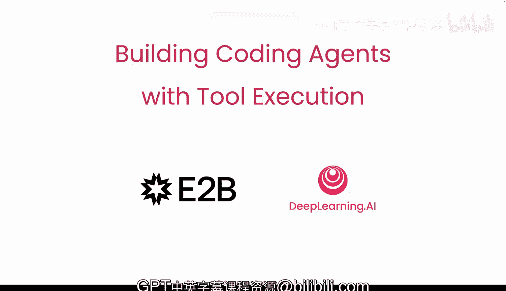
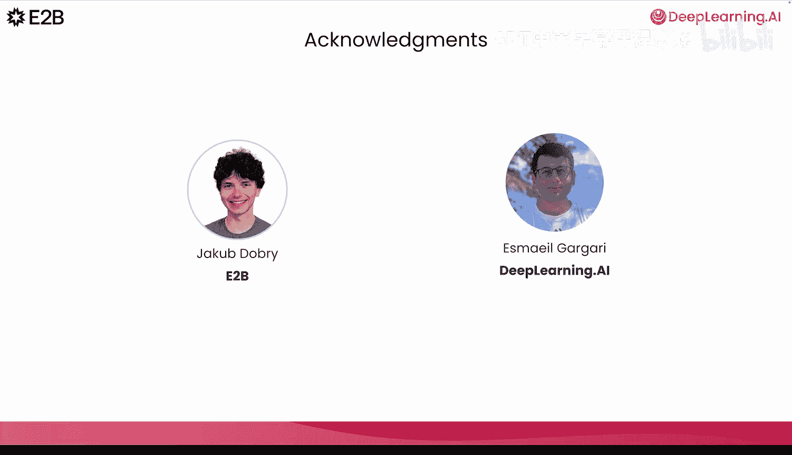

# 001：课程介绍 🎯

在本课程中，我们将学习如何构建能够生成并执行代码的智能体，以此作为其完成任务的方式。课程由Teresa Tshkover和Francesco Zubucchini讲授，并与EDB合作开发。

## 课程核心概念

许多智能体被预先定义了一组函数供其调用。然而，与其仅使用一个预定义的小型函数集，不如让大语言模型或你的智能体编写并执行任意的Python代码。

这样一来，智能体就能访问所有内置的Python函数，甚至可以安装常见的Python包并调用其中的函数。这极大地扩展了智能体能够处理的任务范围。

此外，不同于常见的、一次一个的顺序函数调用方式（这在处理稍复杂的任务时很常见），你的智能体现在可以编写大段代码，并高效地执行一长串操作序列，这也使其能力更强。

## 安全考量与解决方案

但在本地机器上运行由大语言模型生成的代码可能不安全。代码可能会执行一些预期之外的操作。例如，一个高度自主的编码工具曾删除过我团队成员的重要项目文件；另一个则执行了有缺陷的数据库迁移，删除了生产数据（幸好我们有备份）。

为了安全地运行生成的代码，一个良好的实践是在沙箱环境中运行它，从而使代码执行与主系统隔离。

## 课程内容概览

在本课程中，我们将首先剖析AI编码智能体的本质，以及它与其他AI智能体的区别。你将学习大语言模型如何逐步推理、决定调用哪个工具、执行代码，并利用结果来规划下一步。

接着，你将构建自己的智能体，使其能够运行Python代码、读写文件，并迭代任务直至达成最终目标。我们还将讨论如何管理智能体交互过程中的上下文窗口。

理解了智能体的思考和行为方式后，你将探索不同的执行环境，例如本地执行、容器和安全的沙箱化微虚拟机，并学习如何根据你的使用场景选择合适的方案。

你将学习如何创建托管沙箱、远程运行不同语言的代码，并与沙箱的文件系统交互，使你的智能体能够使用上传的数据、保存输出，甚至创建和托管小型Web应用程序。

你将构建一个数据分析师智能体，它能够使用pandas处理CSV文件并生成清晰的可视化图表。在最后一课中，我们将创建一个全栈智能体，它能添加多个文件，并在沙箱内构建一个可运行的Next.js Web应用。

为了确保你的智能体即使在大型多文件项目中也能保持专注，我们还将讨论通过运行时符号化来管理长上下文的技术。

## 总结

本节课我们一起了解了本课程的核心目标：构建能够安全、高效执行代码的智能体。我们探讨了其优势、安全风险以及沙箱环境的重要性，并对后续章节的学习内容有了整体认识。

下一节视频将深入介绍编码智能体的内部工作原理及其构建过程中的一些挑战。让我们开始学习吧。