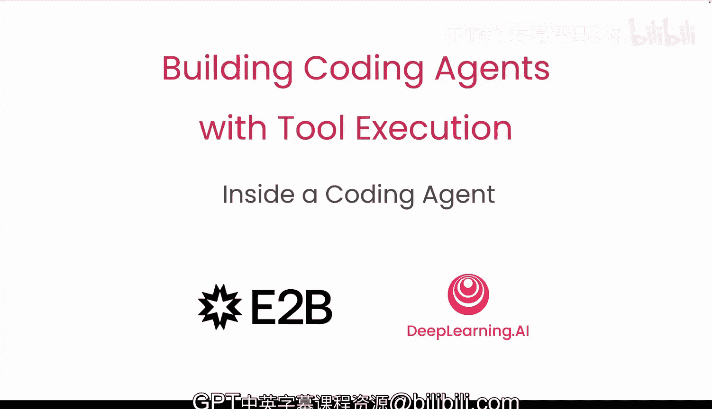
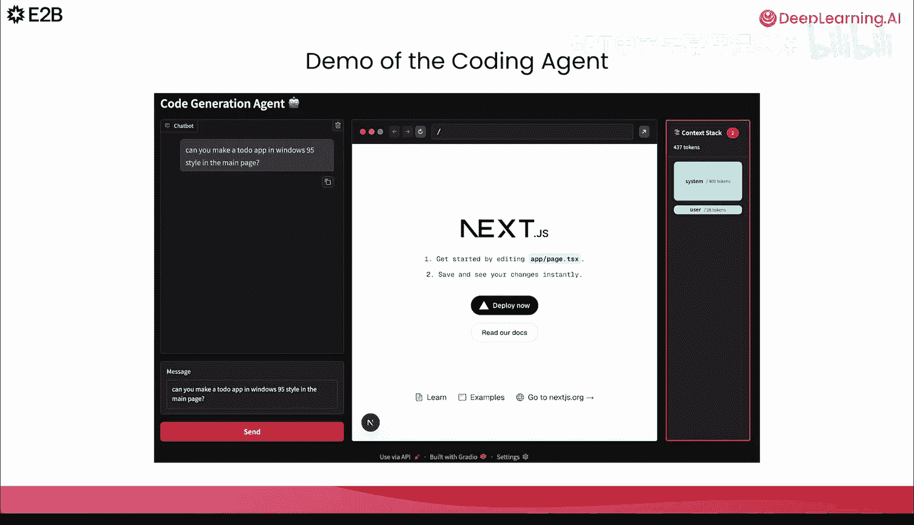
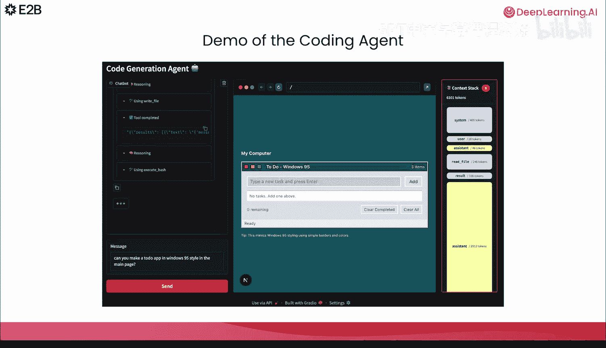
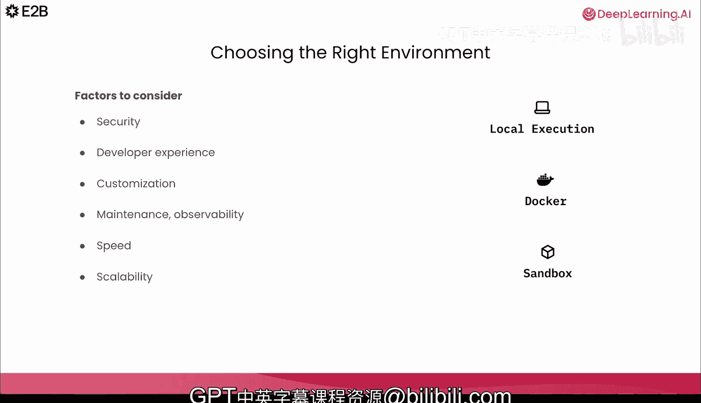

# 002：代码智能体内部机制解析 🧠

在本节课中，我们将学习什么是代码智能体，了解它如何通过推理来处理任务，以及它如何使用代码执行和文件系统等工具来完成任务。

## 概述

代码智能体是一种能够将用户请求转化为实际应用程序的AI系统。它通过编写代码文件、执行代码并即时部署Web应用来实现这一目标。本质上，AI智能体可以被定义为一个大语言模型在一个循环中调用工具，并根据上下文不断迭代。

## 什么是AI智能体？

AI智能体可以被简单地定义为一个在循环中调用工具的大语言模型。上下文是提供给LLM的任何输入，例如系统指令、工具定义、用户消息等。基于上下文，LLM决定是否以及调用哪个工具。智能体调用并运行该工具，将结果附加到上下文中，然后重复此循环，直到任务完成。

## 代码智能体的独特需求

上一节我们介绍了通用AI智能体的概念，本节中我们来看看专门用于编码任务的智能体有何特殊之处。

与处理航班预订或研究总结的通用智能体不同，代码智能体（如Gemini、Claude Code或Cursor）专注于编写和运行代码。它们需要执行以下任务：
*   生成长脚本
*   调试代码
*   在项目中编辑数十个文件

为了实现这些功能，代码智能体需要满足几个核心需求：

1.  **受控环境中的代码执行**：需要一个安全、隔离的环境来反复迭代和运行代码。
2.  **文件系统访问**：能够读取、编辑和写入项目文件。
3.  **长时间运行会话**：由于编码任务复杂，通常需要长时间会话来安装依赖、编译、运行测试、修复错误和重试。
4.  **更强的安全性**：必须妥善处理不受信任的代码，防止实验破坏你的机器或恶意行为者访问你的系统。

## 如何选择核心大语言模型？

像所有智能体一样，你的代码智能体将有一个LLM作为核心。问题在于，如何选择合适的大语言模型？以下是几个关键考量因素：

以下是选择大语言模型时需要考虑的三个主要方面：

*   **函数调用支持**：模型必须支持函数调用（或工具调用）。这意味着LLM能够接收一组工具定义，并可以自主决定何时以及如何使用它们。
*   **上下文长度**：研究表明，大约**32K**个令牌的上下文长度是智能体能够可靠处理真实大型任务的第一个基准点。这大约相当于40到50页文本，类似于一个中等规模的GitHub仓库。处理像Django或PyTorch这样的大型项目时，模型需要轻松读取和编辑许多文件，这可能会消耗数万个令牌。
*   **评估与基准测试**：为了做出正确决策，我们可以用编码特定的基准来评估LLM。最广泛使用的基准之一是**SWE-bench**。它测试模型能否处理真实的GitHub问题、生成补丁并通过仓库的单元测试。你可以根据你的具体用例来评估模型。

## 上下文工程的艺术

上下文是LLM看到的一切。对于代码智能体，上下文可能包括：
*   系统提示词
*   外部输入（如PR或数据库搜索结果）
*   用户提示
*   工具定义和工具执行结果
*   其他信息（如当前分支、提交、文件摘要、之前的对话、依赖版本或早期运行的短期记忆）

上下文工程是一门艺术，旨在保持上下文简洁的同时，为模型提供完成当前任务最相关的信息。我们需要管理上下文长度，因为对于代码智能体来说，它会迅速膨胀。每一次编辑、运行、调试的循环都会向对话中添加更多文本。工具输出可能非常庞大（例如大型JSON或日志），再加上重复的错误堆栈，结果会导致“上下文稀释”——随着令牌数量增长，模型对重要信息的注意力下降，输出质量也随之降低。

## 管理上下文膨胀的策略

我们刚刚看到了代码智能体中上下文是如何爆炸式增长的。一个常见的令牌来源是原始输出。以下是几种缓解策略：

以下是几种有效管理上下文长度、防止信息过载的策略：

*   **精简工具输出**：保持工具输出小巧、一致且结构化。例如，可以解析API响应，只返回LLM实际需要的数据，而不是整个`response.data`。
*   **裁剪日志**：日志可能变得非常庞大。我们可以将其裁剪到最后几行，并丢弃重复的消息，以保持上下文简洁。
*   **分页与过滤文件列表**：代码智能体需要频繁扫描文件系统（例如，基于某种模式列出文件）。在大型项目中，一个目录可能包含数百个文件，全部返回会淹没上下文。常见的策略是对结果进行分页，并赋予模型在需要时请求下一页的能力。我们也可以先进行过滤，例如只列出Python文件或特定目录，让模型只看到相关的内容。

## 代码智能体的核心工具

你的代码智能体需要特定的工具来完成编码任务，至少包括运行代码和访问文件系统。

**关于运行代码，应遵循以下规则：**
*   任何由LLM生成的代码都应被视为**不受信任**。
*   应尽量避免直接在主机上运行代码操作。
*   应选择与系统其余部分**隔离**的更安全环境（如沙箱、容器）。
*   应强制执行严格的CPU、内存和执行时间限制，防止失控进程导致系统崩溃。
*   除非任务明确需要，否则应记录并限制网络和文件系统访问。
*   通过将模型指向我们选择的文本编辑器来保持其专注，否则它可能会开始臆想库名或使用你不希望的工具。

**关于文件系统访问：**
编码任务需要读取、编辑和写入文件，因此智能体需要访问文件系统。一个良好的实践是设置严格的权限，只允许智能体在特定的工作目录内操作。

为了搜索文件，我们可以为智能体配备基于正则表达式的文件搜索功能。为了在特定文件内搜索，我们可以使用模糊匹配。这样，即使搜索查询没有完全匹配，智能体也能找到相关的内容或模式。

## 智能体循环与错误处理

AI智能体可以被定义为一个使用工具在循环中执行操作以完成给定任务的LLM。这个循环就是两次用户消息之间发生的所有事情。大多数任务需要多轮推理，因此模型会反复调用工具，有时甚至会重复调用同一个工具。

但我们需要知道何时停止。必须有一个退出条件。智能体并不完美，它们可能会失败，或者在尝试从错误中恢复时失控。它们可能需要人类或另一个LLM来评估结果。你分配给智能体的任务越长、越复杂，它就越容易出错。

系统地跟踪错误至关重要，因为你的智能体可能会永远卡在尝试修复一个错误上。为了防止这种情况，我们可以：
*   跟踪错误，例如设置一个最大重试计数器。
*   请求用户提供输入以帮助解决错误。
*   通过将错误聚类、移除旧的错误信息同时保持上下文清晰来帮助模型。

## 选择运行环境

你需要为代码智能体选择最佳的运行环境。Cursor使用本地执行，一些智能体使用Docker，而像GitHub Copilot、Perplexity等则使用沙箱。

在决定正确的环境时，我们应该考虑：
*   **安全性**：例如攻击面，以及我们是否暴露了操作系统。
*   **开发者体验**：我们希望避免代码变通方法，让用户满意。
*   **定制化**：我们希望智能体拥有定制的环境，能够使用多种语言、工具链和特定版本的软件包。
*   **可维护性**：需要良好的维护工具来减少智能体运行基础设施的停机时间，为最终用户提供可靠性和良好的支持。
*   **性能与扩展性**：我们希望环境能够快速启动，并且需要能够大规模地完成所有这些工作，准备好为甚至数百万的最终用户提供服务。

## 总结

在本节课中，我们一起学习了代码智能体的核心机制。我们了解到，代码智能体是一个在循环中调用工具（特别是代码执行和文件访问）的LLM。我们探讨了如何为其选择合适的LLM模型、管理可能爆炸性增长的上下文、为其配备必要的工具并制定安全规则，以及如何处理循环中的错误和选择适当的运行环境。这些是构建一个实用、可靠代码智能体的基础。

在下一节课中，你将应用所有这些概念来构建你的第一个简单的代码智能体。我们课堂上见。