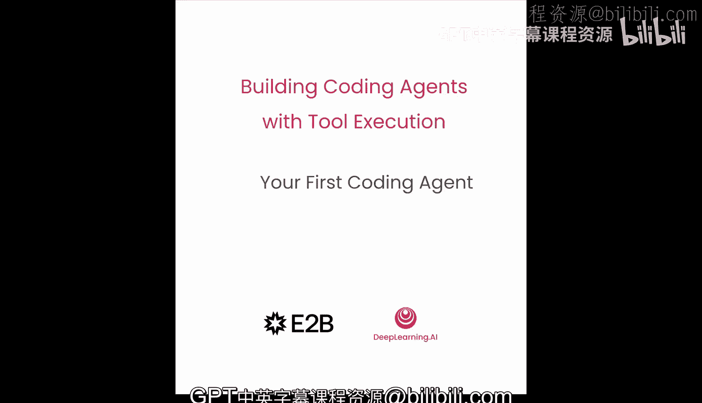
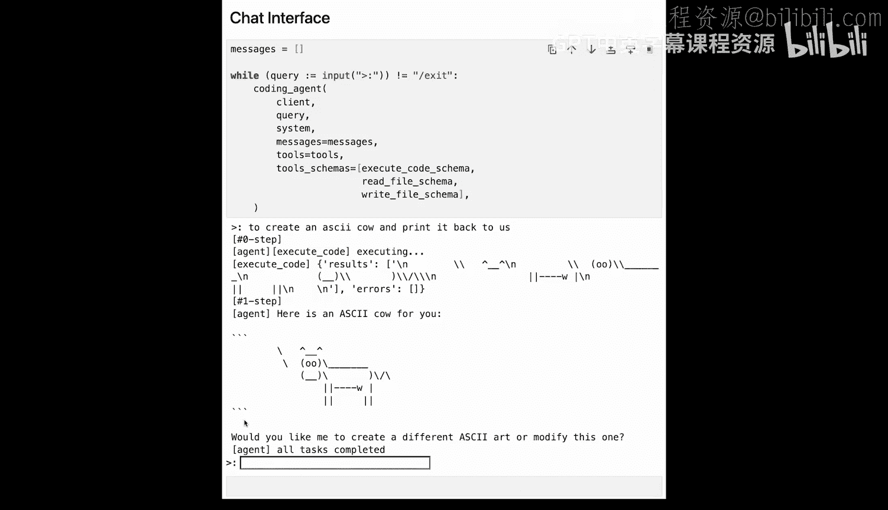

# 003：你的第一个代码智能体




在本节课中，我们将从零开始构建你的第一个代码智能体。你将赋予它真实的工具来执行代码、读写文件，并执行多步推理循环。现在，让我们开始编码。


## 概述

在本节课中，我们将学习如何构建一个基础的代码智能体。这个智能体能够理解用户指令，调用工具（如执行代码、读写文件）来完成任务，并通过循环进行多步推理。我们将从设置环境开始，逐步实现核心功能，最终创建一个可以交互的智能体。

## 环境设置与代码执行

首先，我们通过以下代码忽略警告。所有密钥已在深度学习AI环境中为你设置好，你无需担心。

```python
import warnings
warnings.filterwarnings('ignore')
```

在构建我们的第一个智能体之前，让我们先预览一下基于本节课知识，你将在后续课程中构建的一个更复杂的数据分析智能体。这个智能体能够运行和执行代码。我们用一个简单的提示来演示它将能做什么。

```python
# 示例提示：请求智能体创建一个绘图函数
prompt = "Can you create me a function that draws a smiley face and run it?"
```

在右侧，我们看到上下文在增长。我们使用了与幻灯片中相同的核心架构，高度与令牌大小成比例。智能体运行生成的代码并执行。它正在生成一些使用Matplotlib函数的Python代码。虽然它画的不是完美的笑脸，但结果很有趣。你可以自由地尝试更多提示并与数据世界互动。

## 构建第一个智能体：语言模型与工具

现在回到我们的第一个智能体。首先，我们需要一个语言模型。在本课程的所有课程中，我们将使用OpenAI的GPT模型。我们通过一个方便的`run`函数来调用模型。

```python
import openai

def run(client, messages):
    """
    调用语言模型并返回回复。
    :param client: OpenAI客户端实例
    :param messages: 消息列表
    :return: 模型的回复
    """
    response = client.chat.completions.create(
        model="gpt-4",
        messages=messages
    )
    return response.choices[0].message.content
```

接下来，我们需要给智能体提供工具，即它可以调用的实际函数。这里我们定义一个类型字典来存储结果和可能的错误。

```python
from typing import Dict, Any

def execute_code(code: str) -> Dict[str, Any]:
    """
    执行传入的Python代码字符串。
    :param code: 要执行的Python代码
    :return: 包含结果和错误的字典
    """
    import sys
    from io import StringIO

    old_stdout = sys.stdout
    redirected_output = sys.stdout = StringIO()
    result_dict = {'result': None, 'error': None}

    try:
        # 使用exec执行代码
        exec(code, globals())
        result_dict['result'] = redirected_output.getvalue()
    except Exception as e:
        result_dict['error'] = str(e)
    finally:
        sys.stdout = old_stdout

    return result_dict
```

我们使用Python内置的`exec`函数来执行代码，并重定向标准输出以便捕获并返回。让我们通过打印“Hello World”来测试它。

```python
test_result = execute_code("print('Hello World')")
print(test_result)  # 输出: {'result': 'Hello World\n', 'error': None}
```

我们可以看到结果字典的`result`键中包含了“Hello World”。

## 定义工具模式

为了让智能体能够运行这个函数，我们需要将其描述为一个JSON模式。

```python
execute_code_schema = {
    "name": "execute_code",
    "description": "Executes the provided Python code string.",
    "parameters": {
        "type": "object",
        "properties": {
            "code": {
                "type": "string",
                "description": "The Python code to execute."
            }
        },
        "required": ["code"]
    }
}
```

注意名称是`execute_code`，参数是一个属性`code`，类型为字符串。我们可以通过将其添加到工具字典中来注册这个工具。之后创建的每个工具也将放在这里。

```python
tools_registry = {
    "execute_code": {
        "schema": execute_code_schema,
        "function": execute_code
    }
}
```

## 工具执行函数

接下来，我们定义一个名为`execute_tool`的函数。它接收工具名称，在字典中查找工具，传递参数，并返回结果。我们还添加了一些错误处理，以防智能体在解析参数或调用不存在的工具时出错。

```python
def execute_tool(tool_name: str, arguments: Dict) -> Dict[str, Any]:
    """
    执行指定的工具。
    :param tool_name: 工具名称
    :param arguments: 工具参数
    :return: 执行结果字典
    """
    if tool_name not in tools_registry:
        return {"error": f"Tool '{tool_name}' not found."}

    tool_info = tools_registry[tool_name]
    tool_function = tool_info['function']

    try:
        result = tool_function(**arguments)
        return result
    except Exception as e:
        return {"error": f"Error executing tool '{tool_name}': {str(e)}"}
```

## 创建智能体函数

现在我们可以创建我们的智能体函数，这是智能体运行的核心。

```python
def coding_agent(client, user_query, system_prompt, tools, max_steps=5):
    """
    代码智能体主函数。
    :param client: OpenAI客户端
    :param user_query: 用户查询
    :param system_prompt: 系统提示
    :param tools: 工具注册表
    :param max_steps: 最大执行步数
    :return: 最终消息列表
    """
    messages = [
        {"role": "system", "content": system_prompt},
        {"role": "user", "content": user_query}
    ]
    steps = 0

    while steps < max_steps:
        # 调用语言模型
        response = run(client, messages)
        # 此处假设模型回复包含结构化内容（如函数调用）。
        # 实际实现中，你需要解析模型的响应。
        # 这是一个简化的示例逻辑。
        if "function_call" in response:
            # 解析函数调用并执行
            tool_name = ... # 解析得到工具名
            arguments = ... # 解析得到参数
            tool_result = execute_tool(tool_name, arguments)
            # 将工具执行结果作为消息追加
            messages.append({"role": "tool", "content": str(tool_result)})
        else:
            # 模型直接回复文本，任务可能完成
            print("Agent says:", response)
            break
        steps += 1
    return messages
```

我们传递OpenAI客户端、用户查询、系统提示、工具注册表和工具链。我们创建消息数组，使用所有参数调用LM函数，并遍历响应。如果类型是消息，意味着模型想对我们说话，我们就打印内容。如果是函数调用类型，我们就获取函数名，进行一些打印，并使用我们的`execute_tool`函数来获取工具的结果。

## 测试基础智能体

我们可以通过让智能体运行Python代码来测试它。这里我们有一个特定于任务的助手提示，告诉智能体它是一个Python程序员，并解释了如何使用工具。我们告诉它必须始终使用`execute_code`工具来运行代码。最后，我们告诉它如何收集用户输入，只需重用Python的`input`函数。

我们的任务很简单：我们想制作一个程序，询问我们今天喝了多少杯咖啡，然后将其转换为毫克咖啡因。

```python
system_prompt = """
You are a helpful Python programming assistant.
You must always use the `execute_code` tool to run Python code.
To get user input, use the standard `input()` function within your code.
"""

user_query = """
Create a program that asks: 'How many cups of coffee did you have today?'.
Then, convert the number of cups to milligrams of caffeine (assuming 95mg per cup) and print the result.
"""

# 假设 client 已初始化
# messages = coding_agent(client, user_query, system_prompt, tools_registry)
```

运行后，智能体会生成并执行代码。假设我们输入5杯，它会计算出475毫克咖啡因并打印出来。这是一个完整的循环：智能体接收用户查询，进行推理，决定调用哪个工具，执行工具，并返回结果。

## 扩展功能：文件读写工具

真正的智能体通常需要使用文件系统来读取、写入和编辑文件。让我们实现两个工具来读写文件。

首先，我们需要`read_file`的模式。

```python
read_file_schema = {
    "name": "read_file",
    "description": "Reads content from a file.",
    "parameters": {
        "type": "object",
        "properties": {
            "file_path": {
                "type": "string",
                "description": "Path to the file to read."
            },
            "limit": {
                "type": "integer",
                "description": "Maximum number of characters to read. Optional.",
                "default": 1000
            },
            "offset": {
                "type": "integer",
                "description": "Character position to start reading from. Optional.",
                "default": 0
            }
        },
        "required": ["file_path"]
    }
}
```

名称是`read_file`，它接收文件路径作为字符串，当然还有限制和偏移量参数，用于控制从文件中读取多少字符以及从哪里开始。这非常重要，因为我们可能处理非常大的文件，让模型能够选择读取多少字符可以保持上下文清洁。

`write_file`模式非常相似，我们传递一个内容字符串和一个文件路径。

```python
write_file_schema = {
    "name": "write_file",
    "description": "Writes content to a file.",
    "parameters": {
        "type": "object",
        "properties": {
            "file_path": {
                "type": "string",
                "description": "Path to the file to write."
            },
            "content": {
                "type": "string",
                "description": "Content to write to the file."
            }
        },
        "required": ["file_path", "content"]
    }
}
```

## 实现文件工具函数

接下来，我们需要实现当智能体想要调用这些工具时实际运行的函数。让我们来实现`read_file`函数。注意我们创建了一个自定义异常。这很有帮助，因为我们可以避免传递长的错误堆栈跟踪，而只是向模型返回特定的错误反馈。例如，如果文件不存在，我们将引发一个新的工具错误，明确告诉模型文件不存在。

```python
class ToolError(Exception):
    pass

def read_file(file_path: str, limit: int = 1000, offset: int = 0) -> Dict[str, Any]:
    """
    读取文件内容。
    """
    try:
        with open(file_path, 'r') as f:
            f.seek(offset)
            content = f.read(limit)
        return {"result": content, "error": None}
    except FileNotFoundError:
        raise ToolError(f"File '{file_path}' does not exist.")
    except Exception as e:
        raise ToolError(f"Error reading file: {str(e)}")

def write_file(file_path: str, content: str) -> Dict[str, Any]:
    """
    将内容写入文件。
    """
    try:
        with open(file_path, 'w') as f:
            bytes_written = f.write(content)
        return {"result": f"Successfully wrote {bytes_written} bytes to {file_path}", "error": None}
    except Exception as e:
        raise ToolError(f"Error writing file: {str(e)}")
```

最后，我们可以通过添加这两个新工具来更新我们的工具注册表。

```python
tools_registry.update({
    "read_file": {
        "schema": read_file_schema,
        "function": read_file
    },
    "write_file": {
        "schema": write_file_schema,
        "function": write_file
    }
})
```

## 测试文件工具

让我们通过创建一个工作目录并给出新的用户查询来测试它。在查询中，我们要求智能体在工作目录中创建一个空的`test.txt`文件。

```python
user_query = """
Create an empty text file named 'test.txt' in the current working directory.
"""
# 注意，我们将新的工具模式传递给智能体函数。
# messages = coding_agent(client, user_query, system_prompt, tools_registry)
```

我们可以看到智能体使用了`write_file`工具，并向该文件写入了0字节。现在让我们测试错误处理。我们可以要求智能体读取一个不存在的文件，看看会发生什么。

```python
user_query = """
Read the content of a file named 'non_existent.txt'.
"""
# messages = coding_agent(client, user_query, system_prompt, tools_registry)
```

我们可以看到它再次使用了`read_file`工具，但这次我们得到了一个错误字典。这个结构化的错误信息将帮助智能体恢复并重试。

让我们尝试用稍微复杂一点的任务来测试智能体。这里我们希望智能体创建一个内容为“file1”的文件，然后将其读回给我们。

```python
user_query = """
Create a file named 'file_one.txt' with the content 'file1' inside it.
Then, read the file back and tell me its content.
"""
# messages = coding_agent(client, user_query, system_prompt, tools_registry)
```

正如我们所料，智能体调用了`write_file`工具，向`file_one.txt`写入了5字节，然后调用了`read_file`工具。接着我们可以看到内容确实是“file1”。

## 实现多步推理循环

到目前为止，我们的智能体只能执行一步操作。但一个真正的智能体应该能够迭代地执行任务，并在完成时停止。我们需要创建一个循环和退出条件。决定何时停止的最简单方法是当智能体不再调用新函数或达到最大步数限制时。让我们看看实现：我们在`coding_agent`函数中处理一个新的循环，直到满足条件。参数`max_steps`默认为5。如果智能体不想进行新的函数调用，意味着它认为我们不需要使用可用工具，那么我们将任务标记为完成。我们还保留一个消息列表，并附加初始用户消息、每个消息部分以及工具的结果。

让我们来测试一下。这里我们希望模型创建一个凯撒密码函数，然后向我询问消息和移位值，接着运行它，打印加密后的消息，并将其保存到一个`secret.txt`文件中。步骤相当多，智能体将引导你完成。

```python
user_query = """
1. Create a Python function that performs a Caesar cipher encryption.
   It should take a message (string) and a shift (integer) as input.
2. Ask the user for a message and a shift value using `input()`.
3. Use the function to encrypt the message.
4. Print the encrypted message.
5. Save the encrypted message to a file named 'secret.txt'.
"""
# messages = coding_agent(client, user_query, system_prompt, tools_registry, max_steps=10)
```

假设我输入我的名字“Francesco”作为消息，移位值设为3。模型告诉我它已将加密消息写入`secret.txt`文件。我没有看到任何`write_file`工具调用，所以它可能使用Python代码来写入文件。让我们检查这个文件，看看它是否真的在那里。

```python
# 假设智能体已执行完毕，我们可以读取文件
# with open('secret.txt', 'r') as f:
#     print(f.read())
```

我们可以看到，智能体确实写入了正确的加密消息到当前文件夹。

## 创建交互界面

让我们创建一个简单的界面来与我们的代码智能体交互。

```python
def interactive_agent(client, system_prompt, tools_registry):
    """
    与代码智能体交互的简单界面。
    """
    print("Welcome to the Coding Agent. Type 'exit' to quit.")
    while True:
        user_input = input("\nYou: ")
        if user_input.lower() == 'exit':
            break
        messages = coding_agent(client, user_input, system_prompt, tools_registry, max_steps=5)
        # 打印智能体的最后一条文本回复
        for msg in reversed(messages):
            if msg['role'] == 'assistant' and 'content' in msg and msg['content']:
                print(f"Agent: {msg['content']}")
                break
```

我们可以通过要求智能体创建一个ASCII艺术奶牛并将其返回给我们来测试它。

```python
# 启动交互界面
# interactive_agent(client, system_prompt, tools_registry)
# 用户输入: "Create an ASCII art cow and print it back to me."
```

它成功了，我们可以看到我们的ASCII奶牛。你可以自由地继续与你的智能体对话。我们刚刚构建的这个智能体实验室在笔记本上本地运行。在下一课中，你将了解更多关于代码执行环境的知识，以及哪种环境最适合特定的使用场景。



## 总结


在本节课中，我们一起学习了如何构建一个具备工具执行能力的代码智能体。我们从设置环境开始，引入了语言模型作为核心。然后，我们定义了第一个工具——`execute_code`，并为其创建了JSON模式以便智能体调用。接着，我们实现了工具执行函数和智能体的主循环逻辑。为了扩展功能，我们增加了`read_file`和`write_file`两个文件操作工具，并加入了健壮的错误处理。最后，我们实现了多步推理循环，使智能体能迭代完成复杂任务，并创建了一个简单的交互界面。你现在已经拥有了一个可以执行代码、读写文件并进行多步推理的基础代码智能体。在接下来的课程中，我们将探索更高级的功能和不同的代码执行环境。