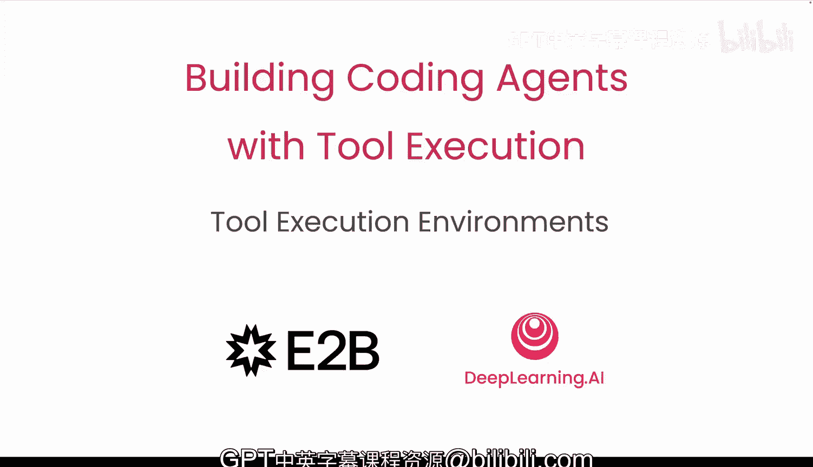
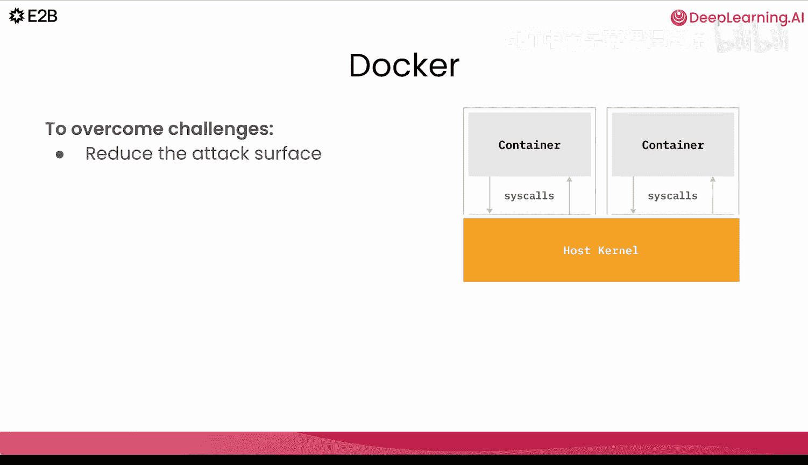
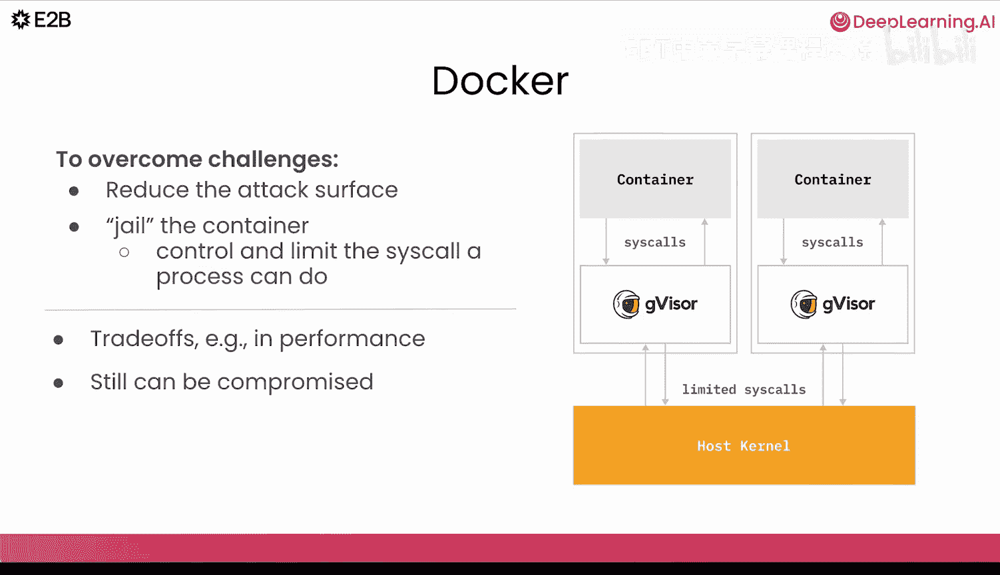
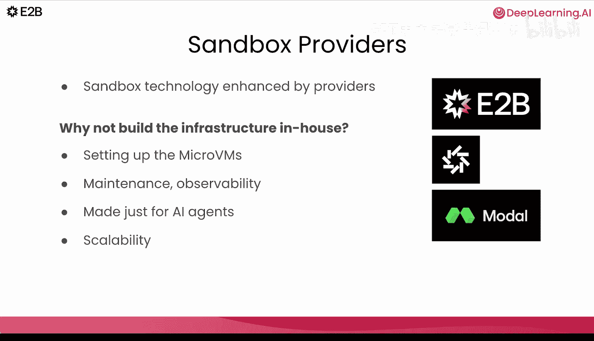
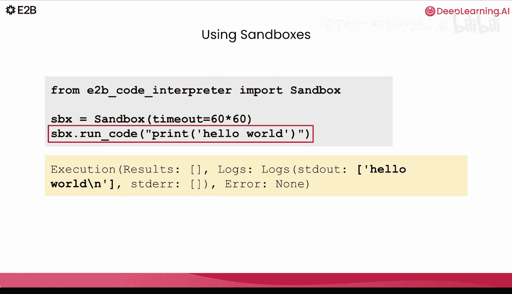

# 004：工具执行环境 🛠️

在本节课中，我们将学习用于运行代码的不同环境，包括本地执行、容器和沙箱（如微虚拟机）。你将了解如何根据具体用例选择合适的环境。

## 概述

执行由大型语言模型生成的代码可以在多种环境中进行。你可以选择在本地运行代码，也可以使用Docker容器。另一种选择是使用沙箱环境。你可能会问，选择不同方法的标准是什么？这取决于你需要为你的智能体考虑的诸多因素。

## 安全挑战

其中一个核心挑战是**安全**。如果我们直接运行模型生成的操作，可能会出现什么问题？一个智能体可能会读取系统中的敏感数据，甚至注入恶意代码。模型可能意外暴露你的API密钥，恶意代码可能导致整个应用程序崩溃。此外，还存在扩展性问题以及无数其他安全漏洞。

## 本地执行

如果你使用云代码编辑器或Cursor，你可能熟悉在本地运行模型生成代码的方法。在使用编码助手时，你期望智能体在你的机器上运行代码和编辑文件。但是，本地执行存在重要的局限性，它无法提供强大的安全性。

主要问题在于**缺乏完全隔离**。如果模型生成了不期望的代码，它可能会运行并读取或修改你机器上的任何内容。除了安全问题，本地执行还存在其他限制：你的笔记本电脑资源会很快耗尽；如果安装的软件包存在冲突，环境可能会变得混乱；你无法轻松地让其他用户大规模使用你的智能体。

如果你想构建用于生产环境的应用程序，本地执行很快就会遇到瓶颈。像Lavable York或许多其他流行的智能体，从深度研究到编码代理，都利用沙箱解决方案来扩展到成千上万的用户。

## 容器环境

智能体环境的一个选择是Docker或广义上的容器。Docker通过使用命名空间在单独的进程中运行代码，提供了操作系统级别的隔离，这使其比本地代码执行更加隔离。

然而，所有容器仍然共享同一个主机内核。这意味着，即使其中一个容器被攻破，攻击者也有可能找到路径进行权限提升并访问主机。当同时运行多个不受信任的代码实例和多个容器时，这种风险变得更加相关。默认情况下，容器的系统调用会直接到达主机内核，这意味着攻击面更大。

为了使Docker更安全，一个选择是减少攻击面。为此，我们可以使用例如gVisor。来自Google的gVisor是一个用户空间内核，它将容器“监禁”起来，意味着我们对其可以访问的内容增加了限制。它自己实现了大部分Linux系统调用接口，实际上拦截了系统调用。它是一个中间人：容器首先与gVisor通信，而不是直接与主机内核通信。

gVisor也存在权衡：一些性能开销、操作系统兼容性差距、不同的调试或跟踪工具。即使gVisor也并非100%安全。它仍然可能被攻破，因为gVisor仍然依赖于主机内核。其复杂的实现中，漏洞仍然可能被利用。

## 沙箱环境

因此，我们有一个明确的目标：模型生成的代码绝不应该能够危及主机系统。一个很好的解决方案是**沙箱**。沙箱是一个用于运行代码的受限、隔离的环境。沙箱最大限度地减少了对主机机器的影响。

与容器相比，沙箱提供了真正的进程隔离，使其成为安全运行不受信任或模型生成工作负载的常见基础。沙箱的实现包括操作系统级隔离、WebAssembly或轻量级微虚拟机，如Firecracker、Gumo或Cloud Hypervisor。

一种非常适合编码智能体的沙箱解决方案实现是**微虚拟机**。这些是基于内核的轻量级虚拟机，剥离了不必要的硬件模拟，旨在快速启动和高效运行。每个微虚拟机运行自己的客户内核，这提供了更强的隔离性，同时保持了接近原生的性能。AWS Firecracker是微虚拟机实现的一个广泛使用的例子，它为AWS Lambda或Fargate等服务提供支持。

## 微虚拟机的权衡

那么，如果微虚拟机提供了更强的隔离性，为什么我们不随处使用它们呢？答案是存在重要的权衡。

首先，微虚拟机更难设置。与Docker不同，你不能只运行一条命令。它们需要更多的工程知识和手动配置。社区和生态系统也较小，你无法获得像Docker Hub那样的工具支持或公共镜像注册表。

可扩展性是另一个挑战。你需要自己管理基础设施，包括更新、编排以及解决技术栈中的安全漏洞。微虚拟机可以是一个很好的解决方案，但直接运行它们会产生一些操作开销，这使得大多数团队采用起来更加困难。

## 沙箱即服务提供商

因此，是的，沙箱作为一种技术有其优势。但随着AI智能体的兴起，我们也可以利用沙箱即服务提供商的优势。像E2B、Daytona或Model Context Protocol这样的公司提供沙箱环境，并在沙箱技术之上提供额外的好处。

与其自己设置微虚拟机或维护自己的可观测性和基础设施，沙箱提供商为你提供专门为AI智能体构建的生产就绪沙箱。它们可以提供诸如针对不同用例的预构建沙箱、长时间运行的会话、密钥和API管理等功能。当你需要服务数千甚至数百万用户时，沙箱提供商可以提供你所需的可扩展性。它们已经管理了底层编排，因此你可以专注于智能体，而不是基础设施。

使用沙箱来运行你的代码将变得非常简单，就像创建沙箱实例并将你的代码传递给它运行一样。

## 总结

在本节课中，我们一起学习了执行模型生成代码的不同环境。我们探讨了本地执行的局限性、容器（如Docker）提供的隔离性及其安全考量，以及沙箱（特别是微虚拟机）如何为实现更强的安全隔离提供了解决方案。我们还讨论了微虚拟机的权衡，并介绍了沙箱即服务提供商如何简化这一过程，让开发者能够专注于构建智能体本身。

在下一节课中，你将与France Francisco一起，实际使用E2B沙箱来运行你的智能体生成的代码。