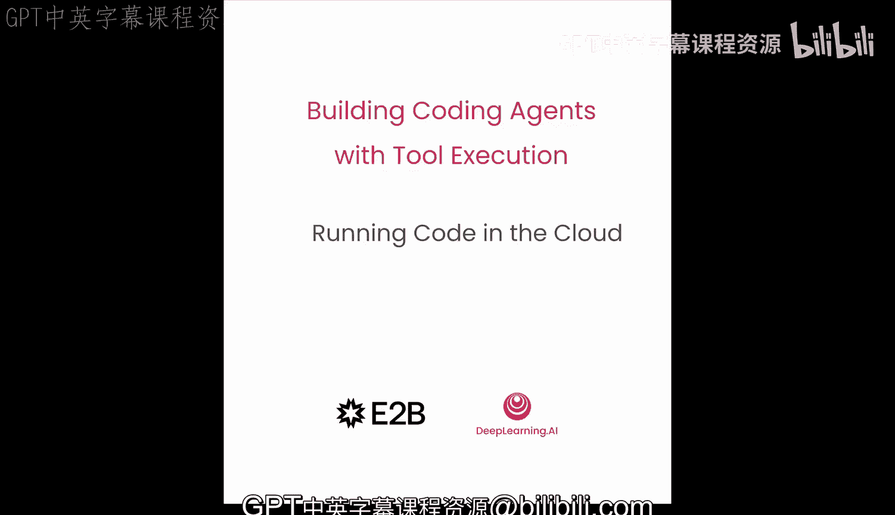
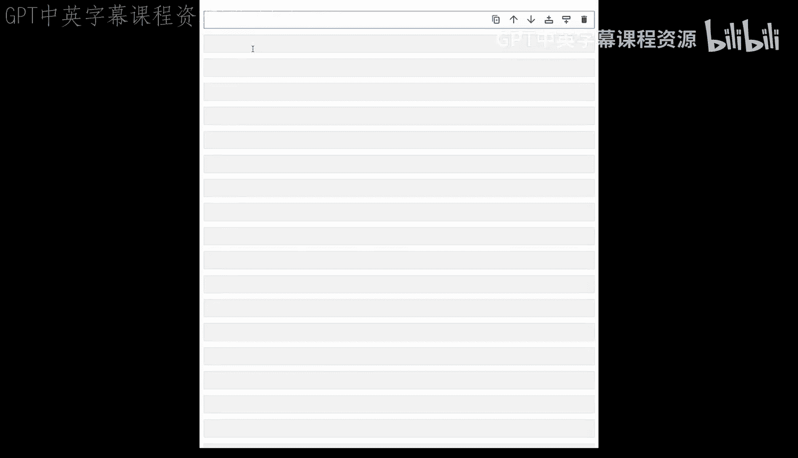
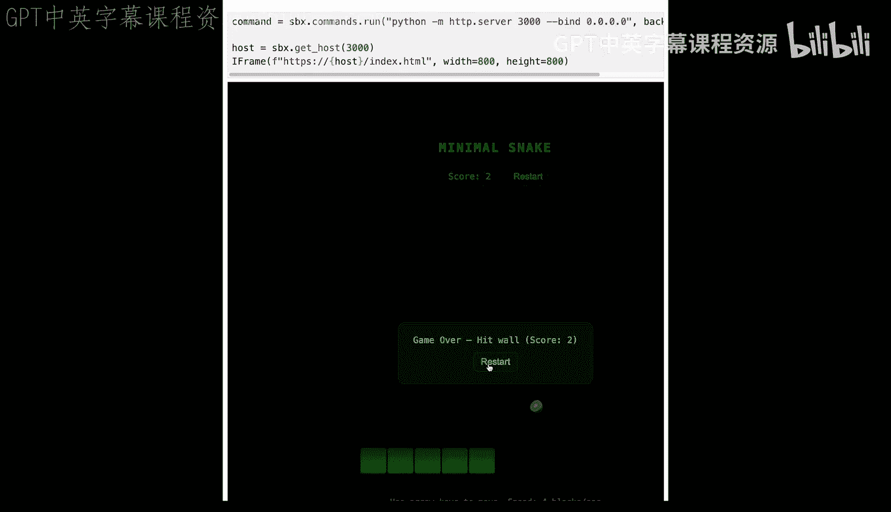
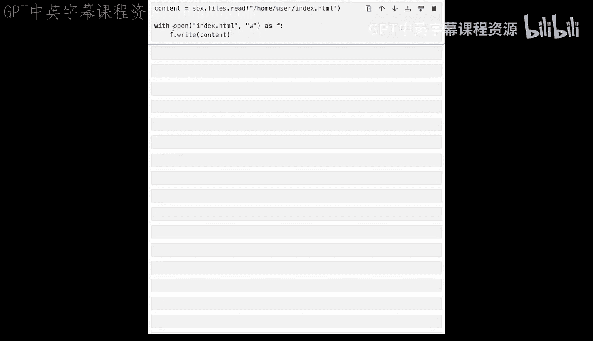
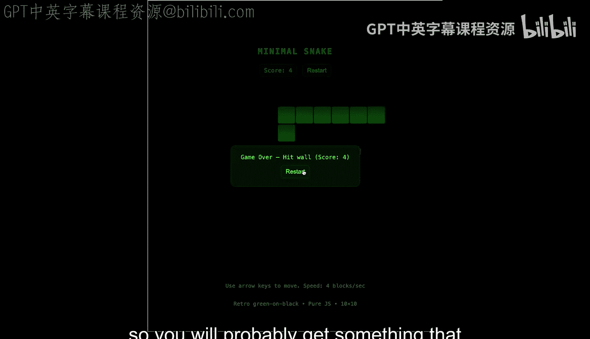
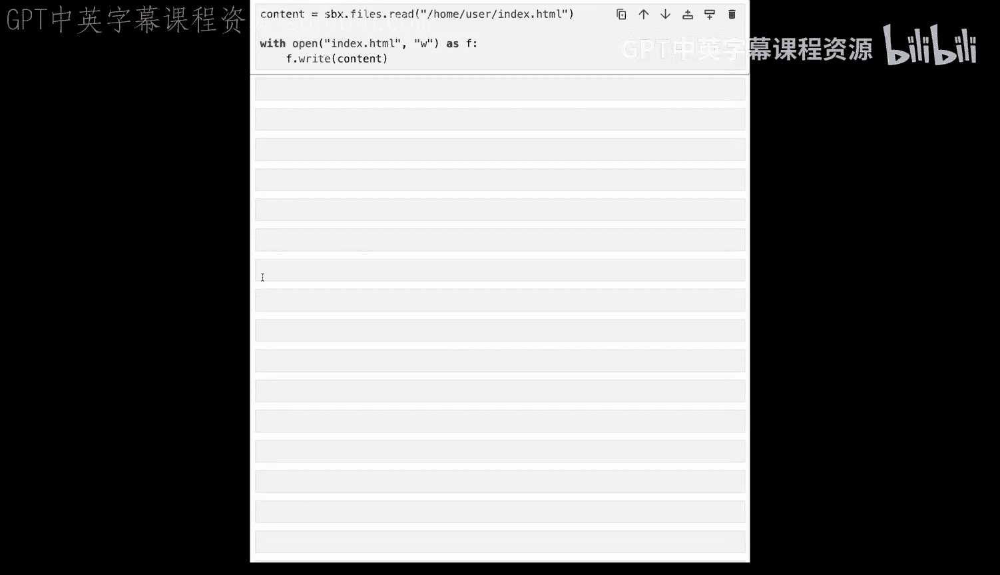

# 005：在云端安全运行代码 🚀

在本节课中，我们将学习如何使用 HubB Sandbox 环境，在云端安全地运行智能体生成的代码。你将学会创建、管理并与一个远程沙盒环境进行交互，该环境能够安全地执行代码。



## 概述

上一节我们介绍了如何为智能体构建工具。本节中，我们来看看如何让智能体在云端沙盒中安全地执行代码。我们将使用 HubB 提供的沙盒环境，它通过简单的 API 管理，能有效隔离代码执行，确保安全性。

## 使用 HubB API 管理沙盒


HubB 提供了非常简单的 API 来管理沙盒。以下是核心操作步骤。

首先，从 HB Python 包中导入 `Sandbox` 类来创建沙盒。你可以设置超时时间（以秒为单位），例如，以下代码将创建一个存活一小时的沙盒。

```python
from hb import Sandbox

sandbox = Sandbox(timeout=3600)  # 1小时超时
```

运行代码时，将代码字符串传递给沙盒的 `run_code` 方法。该方法会返回一个 `Execution` 对象，你可以将其视为一个笔记本单元格的输出。

```python
execution = sandbox.run_code("print('Hello World')")
```

在这个例子中，代码只是打印“Hello World”，你可以在返回的 `execution` 对象的 `logs` 属性中看到输出。

```python
print(execution.logs)  # 输出: Hello World
```

如果要返回一个变量，结果将位于 `execution` 对象的 `results` 数组中。

## 支持多种编程语言

HubB 默认支持 Python，但你也可以随时更改为其他语言，例如 JavaScript。

```python
sandbox.language = "javascript"
execution_js = sandbox.run_code("console.log('Hello from JS')")
print(execution_js.logs)
```

我们还可以运行使用 Matplotlib 创建图表的 Python 代码。

```python
code = """
import matplotlib.pyplot as plt
import numpy as np
x = np.linspace(0, 10, 100)
y = np.sin(x)
plt.plot(x, y)
plt.title('A Simple Plot')
"""
execution_plot = sandbox.run_code(code)
```

为了在单元格中显示图表，我们可以导入 `display` 函数。

```python
from IPython.display import display
display(execution_plot.results[0])  # 假设图表在 results 中
```

## 列出与查询沙盒

有时，列出你正在使用的所有沙盒很有用。为此，你可以在 `Sandbox` 类上调用 `list` 方法。

```python
sandboxes_page = Sandbox.list()
for sb in sandboxes_page:
    print(f"ID: {sb.id}, Status: {sb.status}")
```

你还可以打印沙盒的一些有用字段，例如元数据、创建时间和来源。

```python
print(sandbox.meta)
print(sandbox.created_at)
print(sandbox.origin)
```

你可以在创建时附加一些元数据来查询沙盒。例如，我们设置 `name` 为 `"fine"`。

```python
sandbox = Sandbox(meta={"name": "fine"})
```

当列出沙盒时，我们可以传递一个查询对象来过滤。

```python
from hb import SandboxQuery
query = SandboxQuery(meta={"name": "fine"}, status="running")
found_sandboxes = Sandbox.list(query=query)
```

## 管理沙盒文件系统

HubB 沙盒拥有一个文件系统。我们可以在其中创建目录。

```python
sandbox.files.mkdir("/home/user/data")
```

我们可以将一些内容写入文件。

```python
sandbox.files.write("/home/user/data/hello.txt", "Hello from the sandbox")
```

我们可以使用 `read` 方法读回内容。

```python
content = sandbox.files.read("/home/user/data/hello.txt")
print(content)  # 输出: Hello from the sandbox
```

最后，我们可以删除这个文件。

```python
sandbox.files.remove("/home/user/data/hello.txt")
```

## 在沙盒中运行 Web 服务器

沙盒可以运行更复杂的应用，例如网站。这很简单，我们只需要创建一个 `index.html` 文件，并启动一个服务器来提供该文件。

首先，我们写入一个简单的 HTML 文件到沙盒中。

```python
html_content = "<html><body><h1>Hello from Sandbox Web Server!</h1></body></html>"
sandbox.files.write("/home/user/index.html", html_content)
```

然后，我们可以使用 Python 的 `http.server` 模块在端口 3000 上启动一个服务器。

```python
server_code = """
import http.server
import socketserver
import os
os.chdir('/home/user')
with socketserver.TCPServer(("", 3000), http.server.SimpleHTTPRequestHandler) as httpd:
    httpd.serve_forever()
"""
# 注意：`serve_forever` 会阻塞，在实际中可能需要以子进程方式运行。
```

为了可视化网站，我们可以在 Jupyter Notebook 中使用 `IFrame` 类。

```python
from IPython.display import IFrame
display(IFrame(src=f"http://{sandbox.host}:3000", width=600, height=400))
```

## 为智能体集成代码执行能力

现在我们已经知道如何使用 HubB 沙盒，是时候为我们的智能体赋予在云端运行代码的能力了。

我们修改在之前实验中创建的 `execute_code` 函数。这次，我们将语言模型生成的代码传递给沙盒的 `run_code` 方法。

```python
def execute_code_in_sandbox(code_str: str, sandbox: Sandbox):
    """在沙盒中安全执行代码"""
    try:
        execution = sandbox.run_code(code_str)
        # 处理执行结果，例如提取 logs 或 results
        output = execution.logs if execution.logs else str(execution.results)
        return output
    except Exception as e:
        return f"代码执行出错: {e}"
```

然后，我们重建工具注册表，将新的执行函数作为工具添加进去。

```python
# 假设已有工具注册表构建逻辑
tool_registry.add_tool(
    name="execute_python",
    description="在安全沙盒中执行Python代码并返回结果",
    function=execute_code_in_sandbox,
    args_schema=... # 定义参数模式
)
```

为了在 Notebook 中友好地显示输出，我们可以使用 `display` 和 `Markdown` 函数。

```python
from IPython.display import display, Markdown

def log_output(message):
    """以友好格式记录输出"""
    display(Markdown(f"**输出:** {message}"))
```

让我们尝试运行智能体，观察它连接沙盒、执行代码并回复的过程。

```python
# 初始化智能体客户端和沙盒
client = OpenAIClient(api_key="your_key")
sandbox = Sandbox()

# 向智能体提问
task = "编写一个模拟掷六面骰子的函数，并运行它。"
response = coding_agent(task, client, sandbox)
log_output(response)
```

智能体回复说：“我创建了一个名为 `roll_die` 的函数。” 我们实际上可以看到它在沙盒上创建和运行的代码，以及模拟掷骰子的结果。

## 测试文件系统操作能力

让我们给智能体分派一个与文件系统协作的任务。请注意，我们尚未为这个智能体专门添加文件系统工具，但通过执行 Python 代码，它实际上可以创建文件。

任务：创建一个包含“Hello World”的文本文件，读取它，并将其内容返回。

```python
task2 = """
在沙盒中创建一个名为 `greeting.txt` 的文件，内容为 'Hello World'。
然后读取该文件并将其内容返回给我。
"""
response2 = coding_agent(task2, client, sandbox)
log_output(response2)
```

我们可以看到智能体运行代码、创建文件，然后将内容打印给我们。代码如下：

```python
# 智能体可能生成的代码示例
with open('/home/user/greeting.txt', 'w') as f:
    f.write('Hello World')
with open('/home/user/greeting.txt', 'r') as f:
    content = f.read()
print(content)
```



仅仅凭借在沙盒中执行 Python 代码的能力，智能体已经相当强大。它可以创建、添加和删除文件。

## 创建网页游戏：综合能力测试

让我们通过要求智能体创建一个简单的贪吃蛇游戏网页来测试它的能力。我们给出一个更具体的查询。

```python
game_task = """
创建一个简单的贪吃蛇游戏网页。
要求：
1. 只使用 HTML、CSS 和原生 JavaScript，不要用任何外部库。
2. 游戏区域是一个 20x20 的网格。
3. 使用箭头键控制蛇的移动。
4. 蛇吃到食物后会变长。
5. 蛇撞到墙壁或自身身体时游戏结束。
6. 游戏结束后可以按空格键重新开始。
请将代码写入沙盒文件系统，并启动一个Web服务器以便我试玩。
"""
response3 = coding_agent(game_task, client, sandbox)
log_output(response3)
```

智能体创建了文件。我们现在可以使用 `IFrame` 重新打开它，通过运行 Python HTTP 服务器来查看。



```python
# 假设智能体已将游戏写入 /home/user/snake_game/index.html
display(IFrame(src=f"http://{sandbox.host}:3000/snake_game", width=800, height=600))
```



你可以用箭头键移动蛇，吃水果，蛇会随之生长。如果撞到墙或自己，游戏结束，按空格键可以重新开始。

由于我们使用 GPT 生成这个游戏，每次生成的游戏可能略有不同，但你得到的功能和玩法应该是相似的。

智能体创建的是 HTML 文件，我们可以读取它、存储它，然后在本地浏览器中打开。

```python
# 从沙盒读取游戏文件
game_html = sandbox.files.read("/home/user/snake_game/index.html")
# 保存到本地
with open("local_snake_game.html", "w") as f:
    f.write(game_html)
# 现在你可以在本地浏览器中打开 `local_snake_game.html` 文件
```



## 总结



本节课中，我们一起学习了如何利用 HubB Sandbox 环境，让代码智能体获得在云端安全执行代码的能力。我们涵盖了从创建和管理沙盒、执行不同语言代码、操作文件系统，到运行 Web 服务器的全过程。最重要的是，我们将此能力集成到了智能体中，使其能够根据用户需求生成并安全地运行代码，甚至创建出交互式的网页应用。在下一实验中，我们将创建一个数据分析智能体，用于分析上传的 CSV 文件。