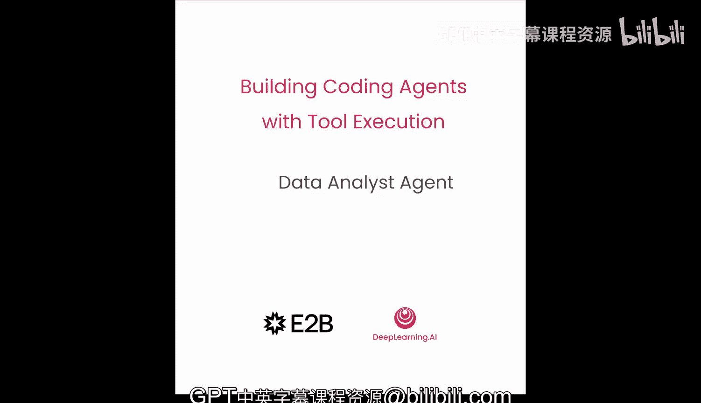

# 006：数据分析智能体 🧮

在本节课中，我们将学习如何将一个基础的代码智能体转变为数据分析师。这个智能体能够在沙盒环境中探索数据、回答问题并创建可视化图表。

## 概述

上一节我们介绍了智能体的基本框架，本节中我们来看看如何赋予它数据分析的能力。我们将引导智能体加载数据集、执行查询、进行数据聚合并生成图表，所有操作都在一个安全的沙盒环境中完成。




## 环境设置与数据加载

首先，我们需要设置环境并加载数据。以下是初始步骤：

1.  导入必要的库并设置环境。
2.  加载位于笔记本文件夹中的 `Pokemon.csv` 数据集。
3.  将数据写入沙盒环境以供分析。

```python
# 示例：导入库和加载数据
import pandas as pd
# 假设数据加载到沙盒的代码
```

## 配置智能体进行数据分析

配置完成后，我们可以使用智能体来探索数据。我们导入了所需的所有函数，并稍微修改了系统提示词。我们告诉智能体用户已更新了文件，并且它应该帮助我们理解数据并创建有趣的图表。

让我们从询问一个基本问题开始：“这些数据是关于什么的？” 智能体将创建一些 `pandas` 代码，在 Python 中运行它，并可能查看数据的前几行或为我们生成摘要。

## 深入数据探索

智能体初步分析后，我们可以进行更深入的探索。例如，我们可以要求智能体运行一个聚合操作，按类型查看宝可梦的数量。我们保留了消息数组，以便将先前的对话历史也传递给智能体。

以下是智能体可能执行的分析步骤：

*   **数据概览**：查看数据集的列和基本统计信息。
*   **聚合分析**：例如，按“类型”分组并计数。
*   **生成摘要**：以 Markdown 表格等形式呈现结果。

通过这种方式，我们可以看到数据集中有“虫”、“暗”、“龙”、“电”等多种类型的宝可梦。

## 交互式用户界面

为了更自然地与智能体交互，我们引入了一个简单的无线电用户界面。我们可以通过导入 `ui` 模块并运行它来启动界面，同时传递通常传递给代码函数的参数。

在界面中：
*   **左侧**是聊天历史记录和向模型输入的区域。
*   **右侧**是内容堆栈，可以可视化当前的上下文。每条消息的高度与其令牌数成正比，颜色方案与我们之前使用的保持一致（蓝色代表系统提示，绿色代表用户，紫色代表工具调用和结果，黄色代表系统消息）。

## 执行具体查询与可视化

现在，让我们继续我们的分析。我们可以问智能体：“哪个宝可梦最重？” 在界面右侧，我们会看到一个新的用户消息，智能体调用了 `exec_code` 工具并给出了回复。结果显示，最重的宝可梦是 `Cosmos` 和 `Gastrodon`，它们的重量接近一吨。

我们还可以要求智能体生成图表。例如，智能体可能会建议：“如果您想将教学信息可视化为图表，我可以帮忙。” 那么，我们就可以要求它创建一个显示前10名宝可梦的条形图。

智能体会运行一些 `pandas` 和 `matplotlib` 代码，并生成一个显示前10名宝可梦的条形图。

```python
# 示例：生成条形图的代码框架
import matplotlib.pyplot as plt
# ... 数据处理 ...
plt.bar(x, height)
plt.show()
```

## 探索未知数据集

在本节文件夹中，实际上还有另一个名为 `unknown.csv` 的 CSV 文件。我们对其一无所知。我们可以将其加载到沙盒中，并使用交互界面让智能体去探索和发现更多信息。

您可以自由地探索这个数据集，使用聊天界面向智能体提问，以获取关于它的信息。

## 总结


本节课中，我们一起学习了如何将一个代码智能体转变为数据分析师。我们涵盖了从环境设置、数据加载、基础查询到执行数据聚合和生成可视化图表的全过程。我们还引入了交互式界面，使与智能体的对话更加自然流畅。在下一课中，我们将构建一个功能更全面的智能体，能够生成复杂的网络应用程序。