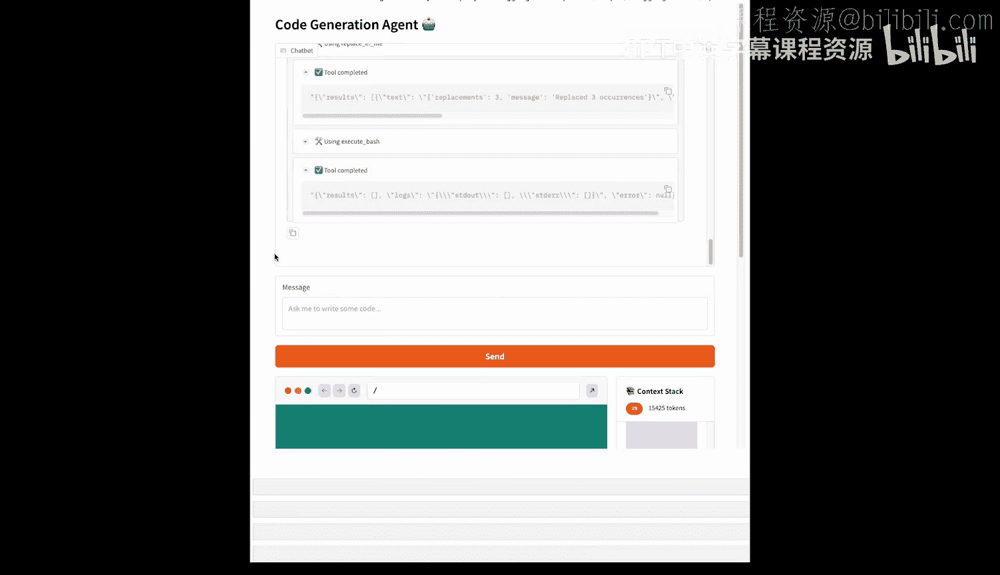

# 007：构建全栈协调器 🏗️

在本节课中，我们将学习如何构建一个能够编辑多个文件并生成完整Web应用的全栈协调器。我们还将探讨如何通过运行时摘要技术来高效管理长上下文。

## 概述

上一节我们介绍了智能体如何执行单个任务。本节中，我们将构建一个更复杂的智能体，它能够协调多个文件操作，完成创建Web应用这样的复合任务。这类任务通常涉及大量代码生成和文件编辑，智能体可能需要执行数十次循环才能完成。

这不可避免地会迅速填满我们的上下文窗口。因此，我们需要一种策略，在用户与智能体交互时动态压缩上下文。

## 管理长上下文：运行时摘要

为了压缩上下文，我们采用多种策略中的一种：运行时摘要。首先，我们需要定义在任何时候希望上下文窗口保留的固定令牌数量，例如40000个令牌。然后，我们将压缩一定百分比的令牌。在本例中，我们遵循GeeseI案例的方法，压缩从最旧消息开始的70%，同时保持最近的交互不变。

接着，我们将需要压缩的令牌发送给语言模型进行摘要，然后将摘要注入回上下文，替换旧消息。具体流程如下：如果智能体的上下文已满，我们取出从最旧消息开始的70%进行压缩。压缩完成后，我们用摘要替换旧消息，并继续处理后续消息。

我们将使用一个具有特定系统提示的智能体来创建对话快照。然后，我们构建一个包含快照的合成用户消息和一个用于确认的助手消息。这两条消息被插入到上下文中，替代最初被压缩的那些消息。

## 构建全栈智能体

现在，让我们进入实验环节，将所有这些概念整合起来，构建一个全栈智能体。

首先，我们忽略一些警告，并设置环境，这与我们在先前课程中所做的类似。由于我们希望创建一个全栈智能体，并且调用Web应用是一项复杂任务，我们需要为智能体添加更多工具。

具体来说，我们需要添加用于处理文件系统的工具。对于这个智能体，我们配备了以下工具。它们都位于`live`文件夹内，我们将看到如何使用它们。

我们赋予智能体列出目录、读取文件、写入文件、搜索文件内容、替换文件以及进行更通用搜索的能力。所有工具都在我们的`Lib`文件夹内的`xb_tools.py`文件中。这些工具将被复制到沙箱中，并在沙箱环境中直接运行。

让我们尝试使用`search_file_content`工具。我们需要传入一个模式。在这个例子中，我们只是查找包含单词`Sx`的文件，这个单词我们在代码中使用。前四个结果将给我们分页的JSON。我们可以看到总共有65个匹配项，并且可以查看具体内容。例如，在文件单元格中，我们找到了它。这只是智能体为了生成Web应用将使用的众多工具之一。我们不会深入探讨每个工具的实现细节，但它们都位于`Lib`文件中，鼓励你前往查看。

## 配置智能体与系统提示

我们离目标很近了。我们只需要给智能体一个系统提示来定义复杂任务。系统提示位于`live`文件夹的`prompts`文件中，名为`system_prompt_web_app`。我们可以打印它，你会发现它复杂得多。这里我们告诉智能体如何思考、项目是如何创建的、使用的技术栈，以及它应该如何调用工具等。这个系统提示很大程度上受到了Geminize系统提示的启发。

现在，让我们启动我们的新智能体。我们需要导入所有智能体函数和新的工具模式，并创建一个沙箱。这次我们传递一个模板ID，因为我们希望使用一个预装了Next.js运行时的沙箱。我们将使用Gradio UI来开发Web应用。`create_sandbox`函数还会在其中安装一些包，并将我们本地的工具复制到沙箱中，以便智能体使用。

现在我们的Gradio界面正在运行。我们添加了一个新元素——浏览器元素。我们可以在沙箱中看到网站是活的，并且能够实时看到模型对Web应用所做的更改。由于录屏宽度有限，你无法并排看到元素，但如果你在更大的屏幕上运行笔记本，就可以看到。

## 运行与测试智能体

沙箱中运行的应用是一个Xs模板，只包含一个页面。我们可以要求智能体将其更改为更有趣的东西。让我们创建一个待办事项列表，但要采用Windows 95的风格，放在主页面。

智能体将列出文件夹文件，读取当前文件，并生成代码。这需要几分钟，因为它可能需要生成几千个令牌来创建这个应用。在智能体生成代码时，你总能看到上下文在增长。我们可以看到智能体使用了`read_file`工具来读取当前的`Yes`文件。现在它正在执行一些代码以确保一切正确。我们可以看到它使用了相当多的令牌，但这是合理的。我们的应用在这里，让我们快速测试一下，一切似乎都正常。

我不太喜欢这些图标。颜色方案使得它们很难看清。让我们看看。智能体给了我们一个总结，然后我们问它：“你能让待办事项列表顶部的图标更显眼吗？它们目前是白色的，很难看清。”智能体可能会重新读取文件并更改图标的颜色。

智能体完成了任务。你可以看到它使用了`replace_file`工具。现在图标的颜色更好了，更容易看清。

## 工具使用分析

让我们具体看看模型为这个特定任务使用的所有工具。它使用了`replace_file`工具，该工具接受文件路径，然后用一个字符串替换另一个字符串。它还使用了`execute_bar`工具、`read_file`工具等等。为了节省时间，我们没有逐一实现所有工具，但它们都可以在`Lib`模块下的`SBX_tools.py`文件中找到。

这是工具文件，你可以看到这里也使用了我们在第一个实验中做的Q错误处理部分。我们有一个函数来处理结果。模型能够运行的所有函数都在这里记录：`root_file`、`write_file`等等。请随时查看这些工具，并添加新的工具以使智能体更强大。你可以在这里实现一个工具并将其添加到注册表中，智能体将能够使用它。

## 总结

本节课中，我们一起学习了如何构建一个全栈协调器智能体。我们探讨了通过运行时摘要管理长上下文的方法，为智能体配备了文件系统操作工具，并通过一个复杂的系统提示引导其完成创建和修改Web应用的复合任务。最后，我们测试了智能体的功能，并分析了它在任务执行过程中使用的工具。鼓励你尝试用自己的提示来使用这个智能体，看看能构建出什么。