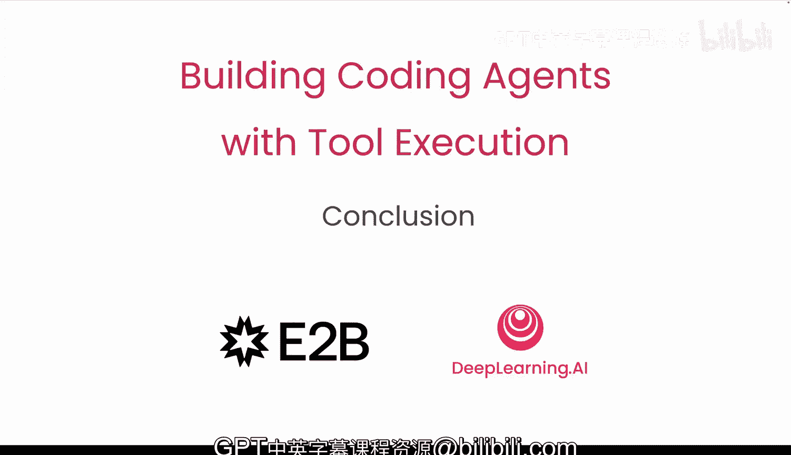

# 008：总结 🎯

在本课程中，我们学习了如何让代码智能体进行思考、行动，并在沙箱环境中安全地执行代码，其应用范围从简单的代码片段到完整的网络应用程序。

## 课程回顾

上一节我们探讨了智能体在复杂应用场景中的实践。现在，让我们对整个课程的核心内容进行总结。

以下是本课程涵盖的主要学习要点：

*   **思考与规划**：智能体首先需要理解任务，并规划出实现目标的步骤序列。
*   **行动与工具调用**：智能体根据规划，选择并调用合适的工具（如代码解释器、API）来执行具体操作。
*   **安全执行**：所有代码的执行都在受控的沙箱环境中进行，以确保系统安全。核心安全机制可以概括为：`执行环境.isolated == True`。
*   **从片段到应用**：我们构建智能体的能力是递进的，从处理 `print("Hello, World")` 这样的单行代码，逐步扩展到能够构建交互式网络应用。

我们迫不及待想看到你接下来会构建出什么。🚀

---

在本节课中，我们一起学习了构建代码智能体的完整流程，掌握了其“思考-行动-安全执行”的核心工作模式。希望你能够运用这些知识，创造出强大而安全的AI驱动应用。