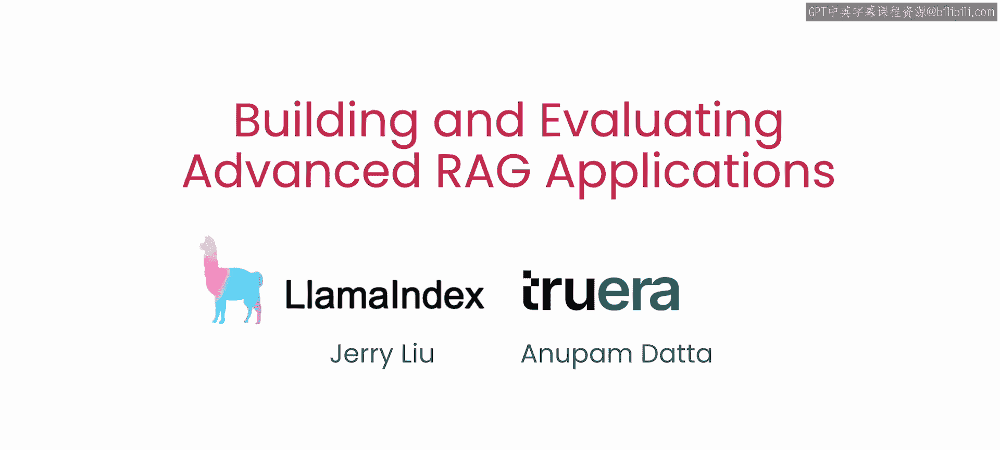

# 001：课程介绍 🚀

在本节课中，我们将要学习构建高质量检索增强生成（RAG）系统的核心知识。课程将重点介绍两种高级检索方法以及一套用于系统评估和迭代的框架。

检索增强生成（RAG）已成为让大型语言模型基于用户自有数据回答问题的关键方法。然而，要实际构建并投入生产一个高质量的RAG系统，拥有高效的检索技术来为生成器提供高度相关的上下文，以及一个有效的评估框架来帮助你在系统初始开发和部署后维护期间高效迭代和改进，都至关重要。

本课程涵盖了两种高级检索方法：句子窗口检索和自动合并检索。它们比简单方法能为语言模型提供显著更优的上下文。课程还将介绍如何使用三个评估指标来评估你的语言模型问答系统：上下文相关性、事实依据性和答案相关性。

---

## 高级检索方法介绍 🔍

上一节我们介绍了课程的整体目标，本节中我们来看看两种核心的高级检索技术。

### 句子窗口检索

句子窗口检索通过不仅检索最相关的句子，还检索该句子在文档中出现位置前后的句子窗口，从而为语言模型提供更好的上下文。

### 自动合并检索

自动合并检索将文档组织成树状结构，其中父节点的文本被划分到其子节点中。当子节点被识别为与用户问题相关时，父节点的全部文本将作为上下文提供给语言模型。

我知道这听起来步骤很多，但别担心，我们稍后会在代码中详细讲解。主要要点是，这提供了一种比简单方法更动态地检索更连贯文本块的方式。

---

## RAG系统评估框架 📊

为了评估基于RAG的LLM应用，RAG三元组——针对RAG执行三个主要步骤的三元组指标——非常有效。

以下是RAG三元组的三个核心评估指标：

*   **上下文相关性**：衡量检索到的文本块与用户问题的相关程度。这有助于你识别和调试系统在为问答系统中的LLM检索上下文时可能存在的问题。
*   **事实依据性**：但上下文相关性只是整个问答系统评估的一部分。
*   **答案相关性**：我们还将涵盖事实依据性和答案相关性等额外评估指标，让你能够系统地分析系统的哪些部分运行良好或尚不完善。

通过这种方式，你可以有针对性地去改进最需要工作的部分。如果你熟悉机器学习中的误差分析概念，这有相似之处。我发现采取这种系统性的方法能帮助你更高效地构建可靠的问答系统。

---

## 课程实践与目标 🎯

本课程的目标是帮助你构建可用于生产环境的RAG问答应用。实现生产就绪的一个重要部分是以系统化的方式对系统进行迭代。

在课程的后半部分，你将获得实践机会，使用这些检索方法和评估方法进行迭代。你还将看到如何使用系统化的实验跟踪来建立基线并快速改进。我们还将根据协助合作伙伴构建RAG应用的经验，分享一些调整这两种检索方法的建议。

---

## 总结

本节课中我们一起学习了构建高级RAG系统的概览。我们了解到，要构建高质量的RAG应用，需要掌握如句子窗口检索和自动合并检索这样的高级检索技术，以提供更优质的上下文。同时，采用包含上下文相关性、事实依据性和答案相关性的RAG三元组评估框架，能系统性地诊断和提升系统性能。接下来的课程将提供实践机会，帮助你迭代并优化系统。