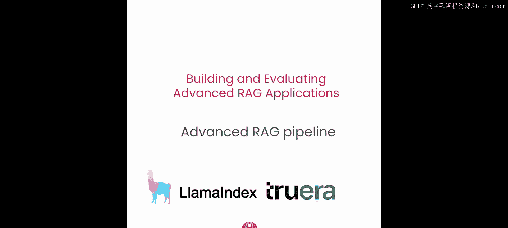
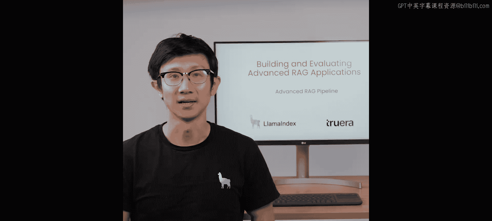
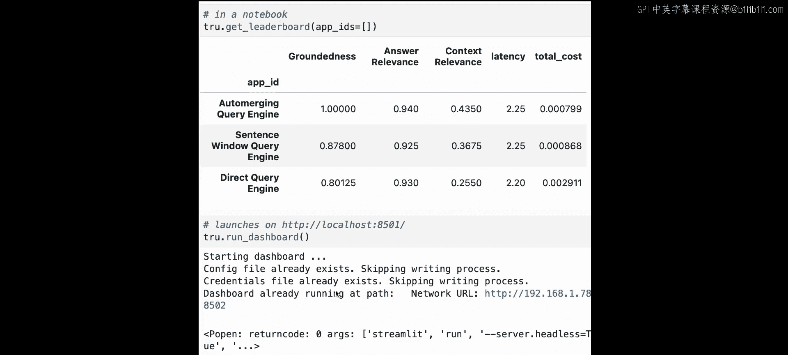

# 002：高级RAG流程概述 🚀

在本节课中，我们将学习如何使用LlamaIndex构建一个基础的和一个高级的检索增强生成（RAG）流程。我们还将加载一个评估基准，并使用TruLens定义一组评估指标，以便将高级RAG技术与基础流程进行性能对比。






在接下来的几节课中，我们将更深入地探讨每个部分。首先，让我们了解一下基础的RAG流程是如何工作的。

## 基础RAG流程 🔄

一个基础的RAG流程包含三个不同的组件：**数据摄取**、**检索**和**合成**。

在数据摄取阶段，我们首先加载一组文档。对于每个文档，我们使用文本分割器将其分割成多个文本块。然后，对于每个文本块，我们使用嵌入模型为其生成一个向量表示。最后，我们将每个带有向量表示的文本块存储到一个索引中，这个索引通常是向量数据库（如Pinecone）的一个视图。

一旦数据存储在索引中，我们就可以针对该索引执行检索。首先，我们向索引发送一个用户查询，并获取与查询最相似的K个文本块。之后，在合成阶段，我们将这些相关的文本块与用户查询结合，放入大语言模型的提示窗口中，从而生成最终的回答。

## 设置基础RAG流程 ⚙️

本教程将引导你使用LlamaIndex快速设置基础和高级RAG流程。我们还将使用TruLens来建立评估基准，以便衡量相对于基线的改进。

对于这个快速入门，你需要一个OpenAI API密钥。请注意，本节课我们将使用一组辅助函数来快速启动和运行，未来课程中我们会深入探讨其中的一些部分。

接下来，我们将使用LlamaIndex创建一个简单的大语言模型应用，它内部使用了OpenAI的LLM。

在数据源方面，我们将使用Andrew Ng撰写的《如何在AI领域建立职业生涯》PDF文件。你也可以上传自己的PDF文件，我们鼓励你这样做。

首先，我们对文档内容和长度进行一些基本的检查。

```python
# 示例：加载并检查文档
documents = load_documents("path/to/your/document.pdf")
print(f"文档数量: {len(documents)}")
print(f"第一个文档片段: {documents[0].text[:200]}")
```

我们看到有一个文档列表，包含41个元素，列表中的每一项都是一个文档对象。我们还会显示给定文档的文本片段。

接下来，我们将这些文档合并成一个单一的文档，因为在使用更高级的检索方法（如句子窗口检索和自动合并检索）时，这有助于提高整体文本规划的准确性。

下一步是索引这些文档，我们可以使用LlamaIndex中的`VectorStoreIndex`来完成。

```python
from llama_index import VectorStoreIndex, ServiceContext
from llama_index.llms import OpenAI
from llama_index.embeddings import HuggingFaceEmbedding

# 定义LLM和嵌入模型
llm = OpenAI(model="gpt-3.5-turbo")
embed_model = HuggingFaceEmbedding(model_name="BAAI/bge-small-en")

# 创建服务上下文
service_context = ServiceContext.from_defaults(llm=llm, embed_model=embed_model)

# 从文档创建索引
index = VectorStoreIndex.from_documents(documents, service_context=service_context)
```

以上几步展示了处理过程：我们加载了文档，然后通过一行代码`VectorStoreIndex.from_documents`，使用你指定的嵌入模型，在后台完成了分块、向量化和索引。

接下来，我们从这个索引获取一个查询引擎，它允许我们发送用户查询，并对这些数据执行检索和合成。

```python
# 创建查询引擎
query_engine = index.as_query_engine()
```

让我们尝试第一个请求。查询是：“在寻找项目来积累经验时，应该采取哪些步骤？”

```python
response = query_engine.query("what are steps to take when finding projects to build your experience?")
print(response)
```

回答是：“从小的项目开始，逐渐增加项目的范围和复杂性。”很好，它运行正常。

现在你已经建立了基础的RAG流程，下一步是针对这个流程设置一些评估，以了解它的表现如何。这也将为我们定义高级检索方法（句子窗口检索器和自动合并检索器）提供基础。

## 使用TruLens进行评估 📊

在本节中，我们使用TruLens来初始化反馈函数。我们初始化了一个辅助函数`get_feedbacks`，以返回一个用于评估我们应用的反馈函数列表。

这里我们创建了一个RAG评估三元组，它包含查询、回答和上下文之间的成对比较。这实际上创建了三个不同的评估模型：**回答相关性**、**上下文相关性**和**事实依据性**。

*   **回答相关性**：回答是否与查询相关？
*   **上下文相关性**：检索到的上下文是否与查询相关？
*   **事实依据性**：回答是否得到上下文的支持？

我们将在接下来的几个notebook中详细介绍如何自己设置。

我们需要做的第一件事是创建一组用于测试我们应用的问题。这里我们预先编写了前10个问题，并鼓励你添加更多。

```python
eval_questions = [
    "What are the keys to building a career in AI?",
    "How can teamwork contribute to success in AI?",
    # ... 其他问题
]
```

现在我们可以初始化TruLens模块来开始我们的评估过程。

```python
from trulens_eval import Tru, TruChain

tru = Tru()
tru.run_dashboard() # 可选：启动仪表板

# 初始化一个预构建的TruLens记录器，包含RAG三元组评估
tru_recorder = TruChain(
    query_engine,
    app_id='Basic RAG Pipeline',
    feedbacks=[answer_relevance, context_relevance, groundedness]
)
```

现在，我们可以在TruLens的上下文中再次运行查询引擎。

```python
# 在TruLens监控下运行评估问题
for question in eval_questions:
    with tru_recorder as recording:
        response = query_engine.query(question)
```

这里发生的是，我们将每个查询发送到查询引擎，同时在后台，TruLens记录器正根据这三个指标评估每个查询。

你可以在仪表板中看到查询列表及其相关的回答。可以看到输入、输出、记录ID、标签等。你还可以在此仪表板中看到每一行的回答相关性、上下文相关性和事实依据性评分，以及平均延迟、总成本等指标。

这里我们看到回答相关性和事实依据性得分相当高，但上下文相关性相当低。现在，让我们看看是否可以通过更高级的检索技术（如句子窗口检索和自动合并检索）来提高这些指标。

## 高级检索技术一：句子窗口检索 🪟

我们要讨论的第一个高级技术是句子窗口检索。它的工作原理是嵌入和检索单个句子，即更细粒度的文本块。但在检索之后，检索到的句子会被替换为围绕原始检索句子的一个更大的句子窗口。

其直观想法是，这能让大语言模型对检索到的信息有更多的上下文，从而更好地回答查询，同时仍然检索更细粒度的信息片段，从而理想地提高检索和合成性能。

现在让我们看看如何设置它。首先，我们将使用GPT-3.5 Turbo。接下来，我们将在合并后的文档上构建句子窗口索引。

```python
# 使用辅助函数构建句子窗口索引
sentence_index = create_sentence_window_index(
    document,
    llm=llm,
    embed_model=embed_model
)
sentence_window_engine = sentence_index.as_query_engine(similarity_top_k=3)
```

与之前类似，我们从句子窗口索引获取一个查询引擎。现在我们已经设置好了，可以尝试运行一个示例查询。问题是：“我如何开始一个AI个人项目？”

我们得到的回答是：“要开始一个AI个人项目，首先重要的是确定项目的范围。”很好。

与之前类似，让我们尝试获取TruLens评估上下文并尝试对结果进行基准测试。

```python
# 为句子窗口检索器使用预构建的TruLens记录器
tru_recorder_sentence = TruChain(
    sentence_window_engine,
    app_id='Sentence Window Retriever',
    feedbacks=[answer_relevance, context_relevance, groundedness]
)
# 在评估问题上运行评估
for question in eval_questions:
    with tru_recorder_sentence as recording:
        response = sentence_window_engine.query(question)
```

现在我们已经对两种技术（基础RAG流程和句子窗口检索流程）运行了评估，让我们看一下结果的排行榜，看看情况如何。

我们看到，通常事实依据性比基线RAG高出约8个百分点。回答相关性大致相同。上下文相关性对于句子窗口查询引擎也更好。延迟大致相同，总成本更低。

由于事实依据性和上下文相关性更高，但总成本更低，我们可以推断句子窗口检索器实际上为我们提供了更相关的上下文，并且效率更高。

当我们回到UI时，可以看到直接查询引擎（基线）和句子窗口检索器之间的比较，并且可以看到我们在notebook中看到的指标也显示在UI中。

## 高级检索技术二：自动合并检索 🔗

我们要讨论的下一个高级检索技术是自动合并检索器。这里我们构建一个层次结构，其中较大的父节点包含引用父节点的较小的子节点。

例如，我们可能有一个块大小为512个标记的父节点。其下，有四个块大小为128个标记的子节点链接到这个父节点。

自动合并检索器的工作原理是将检索到的节点合并到更大的父节点中。这意味着在检索过程中，如果一个父节点的大部分子节点被检索到，那么我们将用父节点替换这些子节点。这允许我们分层合并检索到的节点，所有子节点的组合文本与父节点相同。

与句子窗口检索器类似，在接下来的课程中，我们将更深入地探讨它的工作原理。这里将展示如何使用我们的辅助函数进行设置。

```python
# 使用辅助函数构建自动合并索引
automerge_index = create_automerge_index(
    document,
    llm=llm,
    embed_model=embed_model
)
automerge_engine = automerge_index.as_query_engine(similarity_top_k=6)
```

我们得到了自动合并检索器的查询引擎。让我们尝试运行一个示例查询：“我如何在日志中构建AI项目组合？”在这里的日志中，你实际上可以看到合并过程：将一个或多个节点合并到父节点中，从而检索父节点而不是子节点。

回答是：“要构建AI项目组合，重要的是从简单的项目开始，逐渐进行更复杂的项目。”很好，我们看到它运行正常。

现在让我们用TruLens对结果进行基准测试。

```python
# 为自动合并检索器使用预构建的TruLens记录器
tru_recorder_auto = TruChain(
    automerge_engine,
    app_id='Auto Merging Retriever',
    feedbacks=[answer_relevance, context_relevance, groundedness]
)
# 在评估问题上运行评估
for question in eval_questions:
    with tru_recorder_auto as recording:
        response = automerge_engine.query(question)
```

对于每个问题，你实际上可以看到合并过程正在进行，例如将三个节点合并到父节点中。

## 结果对比与总结 🏆

现在我们已经运行了所有三种检索技术（基础RAG流程以及两种高级检索方法），我们可以查看一个综合排行榜，看看这三种技术如何相互比较。

我们在自动合并查询引擎上得到了非常好的结果。在评估问题上，事实依据性达到100%，回答相关性达到94%，上下文相关性达到43%，这高于句子窗口检索器和基础RAG流程。并且我们得到的总成本与句子窗口查询引擎大致相当，这意味着此处的检索效率更高，延迟相同。最后，你也可以在仪表板中查看这些结果。

本节课全面概述了如何设置基础和高级RAG流程，以及如何设置评估模块来衡量性能。在下一课中，我们将深入探讨这些评估模块，特别是RAG三元组（事实依据性、回答相关性和上下文相关性），你将了解更多关于如何使用这些模块以及每个模块需要什么。



