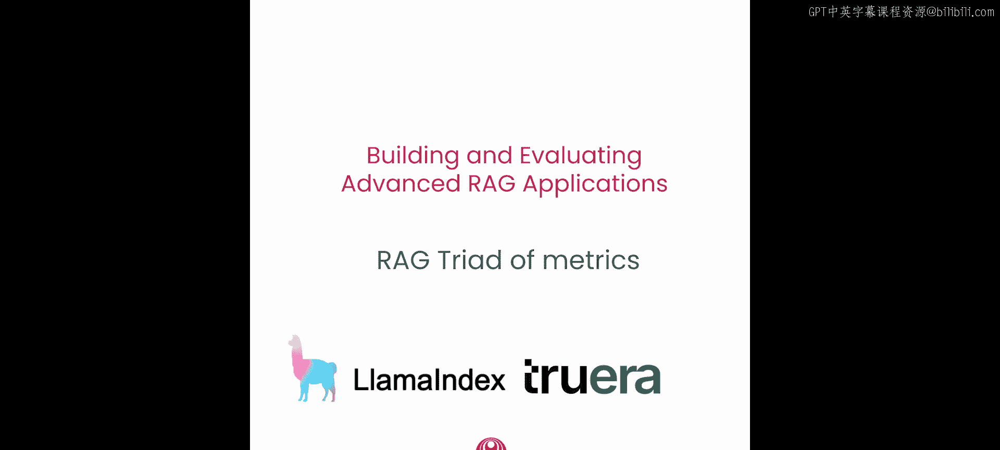
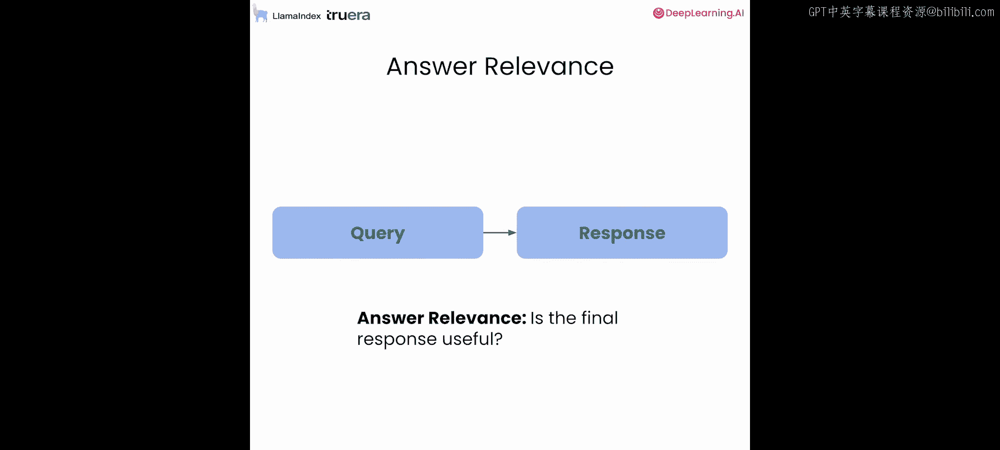
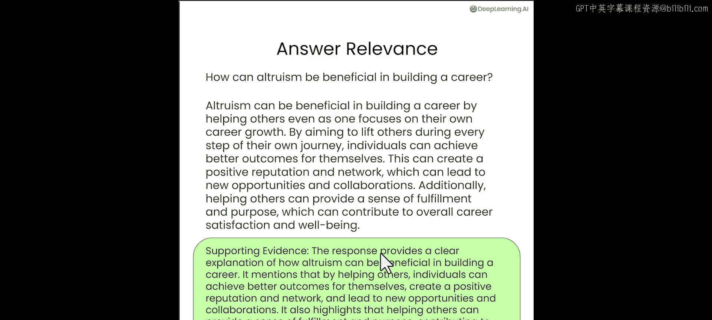
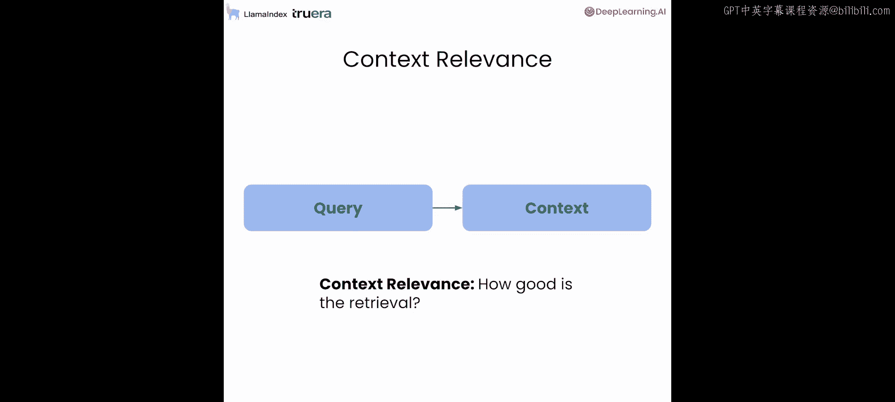
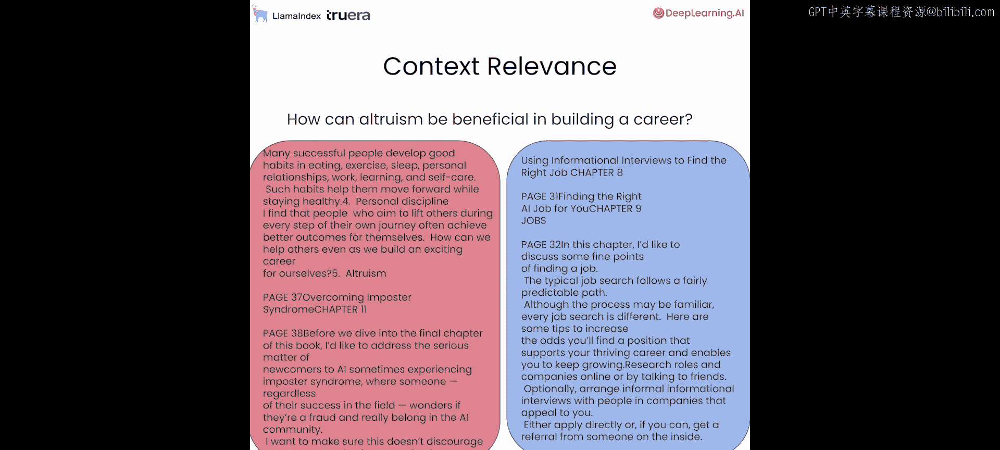
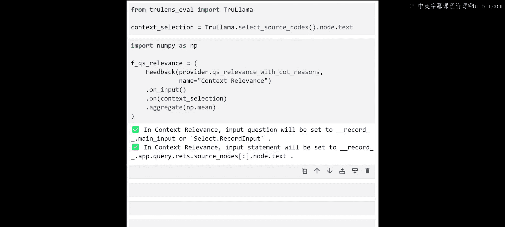
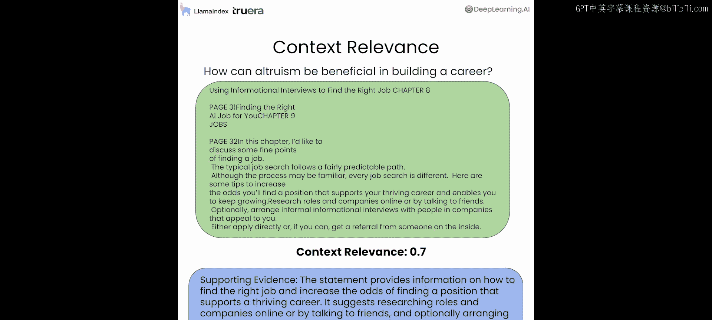
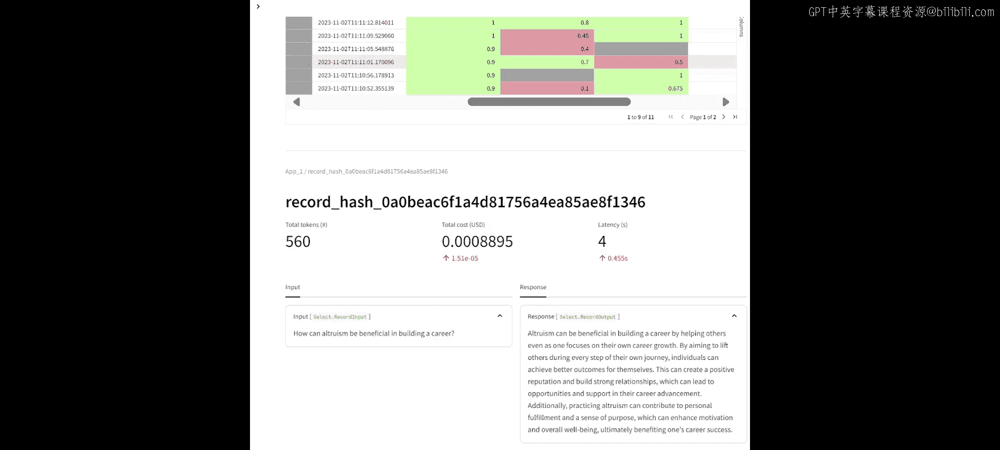

# 003：Lesson 2 RAG评估指标三元组 🎯



在本节课中，我们将深入学习如何评估RAG系统。我们将介绍RAG评估指标三元组，这是一个用于评估RAG执行三个主要步骤的可扩展框架，包括上下文相关性、答案相关性和事实依据性。我们还将展示如何根据任何非结构化语料库，合成生成一个评估数据集。


## 设置环境与回顾

上一节我们介绍了RAG的基本概念，本节中我们来看看如何进行程序化评估。首先，我们需要完成一些基础设置。

以下是设置OpenAI API密钥的代码片段，该密钥将用于RAG的生成步骤以及通过TruLens进行评估。

```python
import os
os.environ["OPENAI_API_KEY"] = "your-api-key-here"
```

接下来，我们将快速回顾使用LlamaIndex构建查询引擎的过程。第一步是设置一个TruLens的Tru对象。

```python
from trulens_eval import Tru
tru = Tru()
tru.reset_database()
```

这个对象将用于记录LlamaIndex应用的提示、响应、中间结果以及我们通过TruLens设置的各种评估结果。

现在，让我们设置LlamaIndex阅读器来加载文档数据。

```python
from llama_index import SimpleDirectoryReader
documents = SimpleDirectoryReader(input_dir="./data").load_data()
```

然后，我们将所有内容合并为一个大文档，并设置句子索引。

```python
from llama_index import ServiceContext, GPTVectorStoreIndex
from llama_index.llms import OpenAI

service_context = ServiceContext.from_defaults(
    llm=OpenAI(model="gpt-3.5-turbo", temperature=0.1),
    embed_model="local:BAAI/bge-small-en-v1.5"
)
index = GPTVectorStoreIndex.from_documents(documents, service_context=service_context)
```



接着，我们设置句子窗口引擎，这将作为我们高级RAG应用的查询引擎。

```python
from llama_index.indices.postprocessor import SentenceWindowNodePostprocessor
query_engine = index.as_query_engine(
    node_postprocessors=[
        SentenceWindowNodePostprocessor.from_defaults(window_size=3)
    ]
)
```



现在，让我们通过提出一个问题来查看它的实际效果。

```python
response = query_engine.query("如何创建你的AI作品集？")
print(response)
```

表面上看，这个回答相当不错。接下来，我们将学习如何使用RAG三元组等反馈函数来深入评估此类响应，识别失败模式，并建立改进LLM应用的信心。

## 深入RAG三元组评估

现在我们已经设置了基于句子窗口的RAG应用，让我们看看如何使用RAG三元组来评估它。首先进行一些准备工作。

以下代码片段允许我们从笔记本内部启动一个Streamlit仪表板，稍后我们将使用该仪表板查看评估结果并进行实验。

```python
tru.run_dashboard()
```

接下来，我们初始化OpenAI GPT-3.5 Turbo作为我们评估的默认提供者。

```python
from trulens_eval import OpenAI as TruOpenAI
provider = TruOpenAI(model_engine="gpt-3.5-turbo")
```



现在，让我们深入了解RAG三元组的每一项评估。

### 答案相关性评估

首先，我们将讨论答案相关性。答案相关性检查最终响应是否与用户提出的查询相关。



为了给你一个具体的例子，用户提出的问题是：“利他主义如何有益于职业发展？” RAG应用给出了一个回答。答案相关性评估产生两部分输出：一个0到1的分数（例如0.9），以及支持该分数的理由或思维链推理。

我想借此机会介绍反馈函数的抽象概念。答案相关性就是反馈函数的一个具体例子。更一般地说，反馈函数在审查LLM应用的输入、输出和中间结果后，提供一个0到1的分数。

让我们以答案相关性反馈函数为例，看看反馈函数的结构。

第一个组件是提供者，这里我们使用OpenAI的LLM来实现这些反馈函数。请注意，反馈函数不一定必须使用LLM实现，我们也可以使用BERT模型等其他机制，这将在课程后面详细讨论。

第二个组件是利用该提供者实现一个反馈函数，在本例中是相关性反馈函数。我们给它一个易于理解的名称，稍后会在评估仪表板中显示。对于这个特定的反馈函数，它接收用户输入（查询）和应用的最终输出（响应）作为输入。

现在，让我们切换回笔记本，更详细地查看代码。

以下是如何在代码中定义问答相关性反馈函数。



```python
from trulens_eval import Feedback



# 定义答案相关性反馈函数
f_answer_relevance = Feedback(
    provider.relevance_with_cot_reasoning,
    name="Answer Relevance"
).on_input_output()
```

我们给这个反馈函数一个易于理解的名称“Answer Relevance”。我们还让反馈函数能够访问输入（提示）和输出（RAG应用的最终响应）。

### 上下文相关性评估

接下来，我们将深入研究的反馈函数是上下文相关性。上下文相关性检查检索过程的质量，即给定一个查询，我们查看从向量数据库检索到的每一段上下文，并评估该段上下文与所提问题的相关程度。

让我们看一个简单的例子。用户的问题是：“利他主义如何有益于职业发展？” 检索到两段上下文。经过上下文相关性评估后，每段检索到的上下文都获得一个0到1的分数。然后，平均上下文相关性分数是这些检索上下文片段相关分数的平均值。

现在，让我们看看上下文相关性反馈函数的结构。这个结构的各个部分与几分钟前我们回顾的答案相关性结构相似。不同之处在于这个特定反馈函数的输入：除了用户输入或提示外，我们还与这个反馈函数共享一个指向检索上下文的指针，即RAG应用执行中的中间结果。

现在我们有了上下文选择设置，可以定义代码中的上下文相关性反馈函数了。

```python
# 定义上下文相关性反馈函数
f_context_relevance = Feedback(
    provider.qs_relevance_with_cot_reasoning,
    name="Context Relevance"
).on_input().on(
    TruLlamaindex.select_source_nodes().node.text
)
```

我们仍然使用OpenAI作为提供者，GPT-3.5作为评估LLM。我们调用问题陈述或上下文相关性反馈函数。它获取输入提示和检索到的上下文片段集合，对每个检索到的上下文片段单独运行评估函数，为每个片段获取一个分数，然后进行平均以报告最终的聚合分数。

一个额外的变体是，除了报告每段检索上下文的上下文相关性分数外，你还可以通过思维链推理来增强它，这样评估LLM不仅提供分数，还提供其评估分数的理由或解释。

### 事实依据性评估

现在，让我向你展示设置事实依据性反馈函数的代码片段。我们以与之前反馈函数类似的方式开始，利用LLM提供者进行评估。

事实依据性衡量标准附带思维链推理，用于证明分数的合理性。我们给它起了一个易于理解的名称“Groundedness”。它可以访问RAG应用中的检索上下文集合以及RAG的最终输出或响应。然后，最终响应中的每个句子都会获得一个事实依据性分数，这些分数被聚合、平均，以产生整个响应的最终事实依据性分数。

这里的上下文选择与设置上下文相关性反馈函数时使用的上下文选择相同。

```python
# 定义事实依据性反馈函数
f_groundedness = Feedback(
    provider.groundedness_measure_with_cot_reasoning,
    name="Groundedness"
).on(
    TruLlamaindex.select_source_nodes().node.text
).on_output()
```

## 执行评估与迭代改进

至此，我们已经准备好开始执行RAG应用的评估。我们已经设置了所有三个反馈函数，现在只需要一个评估集，我们可以在其上运行应用和评估，看看它们表现如何，以及是否有机会进一步迭代和改进。

现在让我们看看评估和迭代改进LLM应用的工作流程。

我们将从上一课介绍的基本LlamaIndex RAG开始，并且我们已经用TruLens RAG三元组对其进行了评估。我们将稍微关注与上下文大小相关的失败模式。然后，我们将使用一种高级RAG技术（LlamaIndex句子窗口RAG）迭代改进那个基本的RAG。接下来，我们将用TruLens RAG三元组重新评估这个新的高级RAG。

我们将重点关注这些问题：我们是否看到了改进，特别是在上下文相关性方面？其他指标呢？我们关注上下文相关性的原因通常是失败模式的出现是因为上下文太小。一旦你将上下文增加到一定程度，你可能会看到上下文相关性的改进。此外，当上下文相关性提高时，我们通常也会发现事实依据性的改进，因为完成步骤中的LLM有足够的相关上下文来生成摘要。当它没有足够的相关上下文时，它倾向于利用其预训练数据集中的内部知识来填补这些空白，这会导致事实依据性的丧失。

最后，我们将尝试不同的窗口大小，以找出哪种窗口大小能产生最佳的评估指标。回想一下，如果窗口大小太小，可能没有足够的相关上下文来获得良好的上下文相关性和事实依据性分数。另一方面，如果窗口大小变得太大，不相关的上下文可能会渗入最终响应，导致事实依据性或答案相关性的分数不佳。

我们在笔记本中走过了三个评估或反馈函数的例子：上下文相关性、答案相关性和事实依据性。所有三个都是通过LLM评估实现的。

我想指出，反馈函数可以通过不同的方式实现。我们经常看到从业者从收集真实标签开始，这可能成本高昂，但仍然是一个好的起点。我们也看到人们利用人类进行评估，这也有帮助且有意义，但在实践中难以扩展。

一个非常有趣的研究文献结果是，如果你让一组人类重新评估一个问题，大约有80%的一致性。有趣的是，当你使用LLM评估时，LLM评估和人类评估之间的一致性也大约在80%到85%之间。这表明，对于已应用的基准数据集，LLM评估与人类评估相当可比。

因此，反馈函数为我们提供了一种以编程方式扩展评估的方法。除了你看到的LLM评估外，反馈函数还可以实现传统的NLP指标，如ROUGE分数和BLEU分数。它们在特定场景中可能有帮助，但它们的一个弱点是它们非常句法化。它们寻找两段文本之间单词的重叠。

在课程中，我们给了你三个反馈函数和评估的例子：答案相关性、上下文相关性和事实依据性。TruLens提供了更广泛的评估集，以确保你构建的应用是诚实、无害和有益的。这些都可在开源库中获得，我们鼓励你在学习课程和构建LLM应用时尝试它们。

现在我们已经设置了所有的反馈函数，我们可以设置一个对象来开始记录，该对象将用于记录应用在各种记录上的执行情况。

```python
from trulens_eval import TruLlama

# 创建TruLlama记录器
tru_recorder = TruLlama(
    query_engine,
    app_id='Sentence Window Engine',
    feedbacks=[f_answer_relevance, f_context_relevance, f_groundedness]
)
```

这个`tru_recorder`对象将用于运行LlamaIndex应用以及这些反馈函数的评估，并将所有内容记录在本地数据库中。

现在让我们加载一些评估问题。评估问题已经设置在这个文本文件中，然后我们执行这段代码来加载它们。

```python
# 加载评估问题
with open("eval_questions.txt", "r") as f:
    eval_questions = [line.strip() for line in f.readlines()]
```

现在，我们一切就绪，可以进入笔记本中最激动人心的步骤了。通过这段代码，我们可以在评估问题列表中的每个问题上执行句子窗口引擎。然后，使用`tru_recorder`，我们将针对RAG三元组运行每个记录，并将提示、响应、中间结果和评估结果记录在Tru数据库中。

现在我们已经完成了记录，我们可以通过执行代码来查看笔记本中的日志。这里的主要观点是，你可以看到应用中检测的深度。通过`tru_recorder`记录了大量信息。这些关于提示、响应、评估结果等信息对于识别应用中的失败模式以及为应用的迭代和改进提供信息非常有价值。所有这些信息都以灵活的JSON格式提供，因此可以导出并由下游流程使用。

接下来，让我们看看提示、响应和反馈函数评估的更人性化格式。通过这段代码，对于每个输入提示或问题，我们看到输出及其各自的上下文相关性、事实依据性和答案相关性分数。这是在评估问题列表中的每个条目上运行的。

我刚刚向你展示了评估、提示、响应的记录级视图。现在让我们在排行榜中获得一个聚合视图，该视图汇总了所有这些单个记录，并生成数据库中10条记录的平均分数。

在排行榜中，你可以看到所有10条记录的聚合视图。我们设置了应用ID，平均上下文相关性是0.56。同样地，所有10条记录的平均事实依据性、答案相关性和延迟分数，以及总成本（以美元计）。获得这个聚合视图对于查看你的应用表现如何以及处于什么延迟和成本水平非常有用。

除了笔记本界面，TruLens还提供了一个本地的Streamlit应用仪表板，你可以用它来检查你正在构建的应用，查看评估结果，深入到记录级视图，以获取应用性能的聚合和详细评估视图。

我们可以使用`tru.run_dashboard()`方法启动仪表板，这会在某个URL设置一个本地数据库。让我们花几分钟时间浏览一下这个仪表板。

你可以在这里看到应用性能的聚合视图，应用处理并评估了11条记录。平均延迟是3.55秒。我们有总成本、LLM处理的总令牌数，以及RAG三元组的分数：上下文相关性0.56，事实依据性0.86，答案相关性0.92。

我们可以在这里选择应用，以获得更详细的记录级评估视图。对于每条记录，你可以看到用户输入、提示、响应、元数据、时间戳，以及记录的答案相关性、上下文相关性和事实依据性分数，还有延迟、总令牌数和总成本。

让我选一行，其中LLM评估表明RAG应用表现良好。一旦我们点击它，我们可以向下滚动，获得该表中该行不同组件的更详细视图。例如，这里的问题是：“成为AI高手的首要步骤是什么？” RAG的最终回答是：“学习基础技术技能。” 在下面，你可以看到答案相关性被认为是1（在0到1的范围内）。这是一个与所提问题非常相关的答案。

在上面，你可以看到上下文相关性，两个检索到的上下文片段的平均上下文相关性分数是0.8。我们可以看到LLM评估给这个特定RAG响应打0.8分的思维链推理原因。然后在下面，你可以看到事实依据性评估。这是最终答案中的一个子句，它得到了1分。在这里是得分的理由。

现在，让我们看一个RAG表现不佳的例子。当我浏览评估时，我看到这一行的事实依据性分数较低，为0.5。问题是：“利他主义如何有益于职业发展？” 响应是：“此外，实践利他主义可以促进个人成就感和目标感，从而增强动力和整体幸福感，最终有益于职业成功。” 虽然这很可能是事实，但在检索到的上下文片段中没有找到支持该陈述的证据。这就是我们的评估给它低分的原因。

你可以使用仪表板进行探索，查看其他一些RAG最终输出表现不佳的例子，以了解在使用RAG应用时常见的失败模式。其中一些将在我们进入关于更高级RAG技术的课程中得到解决。

## 总结



本节课中，我们一起学习了RAG评估的核心框架——RAG三元组，包括**答案相关性**、**上下文相关性**和**事实依据性**。我们通过代码示例展示了如何使用TruLens和LlamaIndex设置这些评估，并利用合成数据集进行程序化评估。我们还探讨了如何通过迭代（如调整上下文窗口大小）来改进RAG应用，并使用Streamlit仪表板直观地分析评估结果，识别失败模式。掌握这些评估方法，是构建可靠、高效高级RAG应用的关键一步。