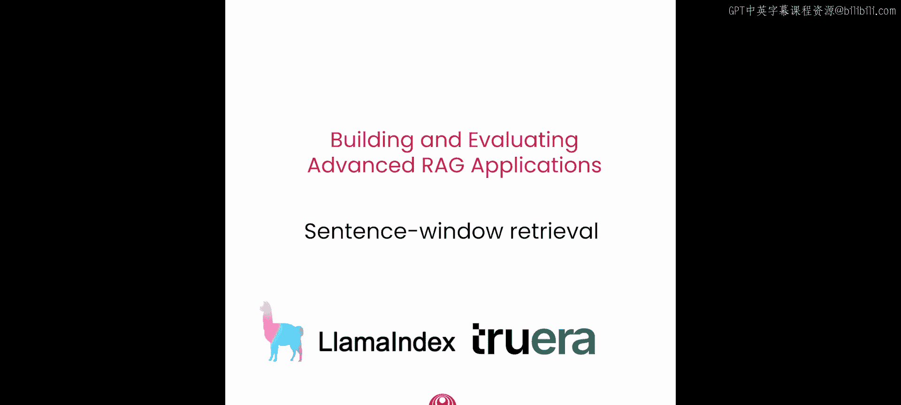
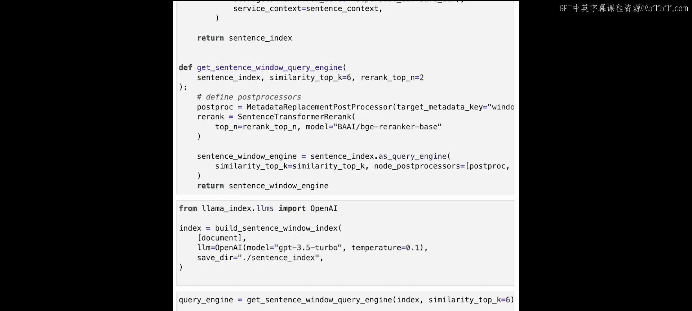
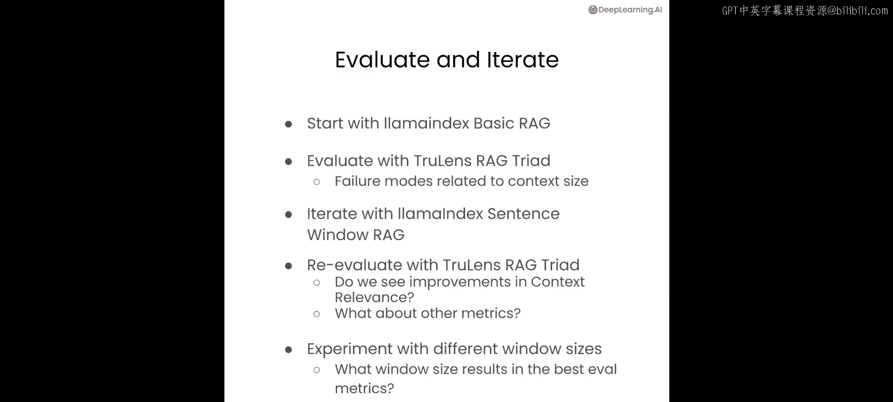

# 004：句子窗口检索 🪟




在本节课中，我们将深入学习一种高级的RAG技术——句子窗口检索方法。这种方法基于更小的句子进行检索，以更好地匹配相关上下文，然后围绕该句子扩展的上下文窗口进行信息合成。我们将探讨其原理、实现步骤，并通过实验评估不同参数对模型性能的影响。

## 概述

标准的RAG流水线在嵌入和合成阶段使用相同的文本块。这带来一个问题：基于嵌入的检索通常在较小的文本块上效果更好，而大语言模型需要更多的上下文和更大的文本块来合成一个好的答案。句子窗口检索将这两个过程在一定程度上解耦。它首先嵌入较小的块或句子并将其存储在向量数据库中，同时为每个块添加上下文（即该句子前后出现的句子）。在检索时，我们通过相似性搜索找到与问题最相关的句子，然后用完整的周围上下文替换该句子。这允许我们扩展实际输入给LLM的上下文，以便回答问题。

## 设置环境与数据

上一节我们介绍了句子窗口检索的基本概念，本节中我们来看看如何具体实现。首先，我们需要设置环境并准备数据。

这个设置与之前课程中使用的相同，因此请确保安装相关包，如 LlamaIndex 和 TruLens。对于这个快速入门，您需要一个与之前课程类似的 OpenAI API 密钥，该密钥将用于嵌入、LLM 调用以及评估。

现在，我们已经设置好并检查了用于迭代和实验的文档。与第一课类似，我们鼓励您上传自己的 PDF 文件。我们将加载《如何构建AI职业生涯》电子书，这与之前的文档相同。

```python
# 示例：加载文档
from llama_index import SimpleDirectoryReader
documents = SimpleDirectoryReader(input_dir="./data").load_data()
print(f"已加载 {len(documents)} 个文档。")
```

## 构建句子窗口索引

接下来，让我们设置句子窗口检索方法，并深入了解其配置。我们将从窗口大小为3、top K值为6开始。

首先，我们将导入一个名为 `SentenceWindowNodeParser` 的对象。这个解析器会将文档分割成单个句子，然后为每个句子块添加上下文窗口。

以下是该节点解析器如何工作的一个小示例：

```python
from llama_index.node_parser import SentenceWindowNodeParser

# 创建解析器，窗口大小为3（前1句+当前句+后1句）
node_parser = SentenceWindowNodeParser.from_defaults(
    window_size=3,
    window_metadata_key="window",
    original_text_metadata_key="original_sentence",
)

# 示例文本
sample_text = "这是一个测试。它包含多个句子。我们看看解析效果。"
sample_nodes = node_parser.get_nodes_from_documents([Document(text=sample_text)])

for i, node in enumerate(sample_nodes):
    print(f"节点 {i} 文本: {node.text}")
    print(f"节点 {i} 元数据（窗口上下文）: {node.metadata['window']}")
    print("-" * 20)
```

我们可以看到，我们的文本（包含三个句子）被分割成三个节点。每个节点包含一个单独的句子，其元数据中包含该句子周围更大的窗口。例如，第二个节点的元数据包含原始句子，以及它之前和之后出现的句子。

下一步是实际构建索引。首先，我们需要设置LLM。在本例中，我们将使用OpenAI的GPT-3.5 Turbo，温度设置为0.1。接着，设置一个ServiceContext对象。这是一个包装器对象，包含索引所需的所有上下文，包括LLM、嵌入模型和节点解析器。

请注意，我们指定的嵌入模型是BGE small模型，它从Hugging Face下载并在本地运行。这是一个紧凑、快速且在其尺寸下准确的嵌入模型。我们也可以使用其他嵌入模型，例如BGE large模型（下面的代码中已注释掉）。

然后，我们使用源文档设置索引。因为我们已经将节点解析器定义为ServiceContext的一部分，所以这将把源文档转换成一连串的句子（并添加上下文），进行嵌入，然后加载到向量存储中。

我们可以将索引保存到磁盘，以便以后无需重建即可加载。如果您已经构建了索引并保存了它，并且不想重建，这里有一个方便的代码块，允许您从现有文件加载索引（如果存在），否则它将构建索引。

```python
import os
from llama_index import VectorStoreIndex, ServiceContext
from llama_index.llms import OpenAI
from llama_index.embeddings import HuggingFaceEmbedding

# 1. 设置LLM
llm = OpenAI(model="gpt-3.5-turbo", temperature=0.1)

# 2. 设置嵌入模型和节点解析器
embed_model = HuggingFaceEmbedding(model_name="BAAI/bge-small-en")
# embed_model = HuggingFaceEmbedding(model_name="BAAI/bge-large-en") # 替代选择

node_parser = SentenceWindowNodeParser.from_defaults(window_size=3)

service_context = ServiceContext.from_defaults(
    llm=llm,
    embed_model=embed_model,
    node_parser=node_parser,
)

# 3. 构建或加载索引
index_path = "./sentence_window_index"
if os.path.exists(index_path):
    # 从磁盘加载
    index = VectorStoreIndex.load_from_disk(index_path, service_context=service_context)
else:
    # 构建新索引
    index = VectorStoreIndex.from_documents(
        documents, service_context=service_context
    )
    index.save_to_disk(index_path)
```

## 配置查询引擎

索引构建完成后，下一步是设置和运行查询引擎。




首先，我们将定义一个名为 `MetadataReplacementPostProcessor` 的后处理器。它获取存储在元数据中的值，并用该值替换节点文本。这是在检索到节点之后、将节点发送给LLM之前完成的。

我们将首先演示其工作原理。使用我们通过句子窗口节点解析器创建的节点，我们可以测试这个后处理器。请注意，我们已经备份了原始节点。

让我们再次查看第二个节点。现在，让我们对这些节点应用后处理器。如果我们现在查看第二个节点的文本，会发现它已被完整的上下文所替换，包括当前节点之前和之后出现的句子。

下一步是添加句子转换器重排序模型。它接收查询和检索到的节点，并使用专门的任务模型根据相关性对节点重新排序。通常，您会使初始相似性搜索的top K值更大，然后重排序器会重新评分节点并返回一个更小的top N结果集，即过滤出一个更小的集合。BGE重排序器基础版就是一个例子，它是基于BGE嵌入的重排序器。

让我们看看这个重排序器是如何工作的。我们将输入一些示例数据，然后看看重排序器如何将初始节点集重新排序为一个新的节点集。假设原始查询是“I want a dog”。初始节点得分集是：“this is a cat”得分为0.6，“this is a dog”得分为0.4。直观上，您会期望第二个节点得分更高，因为它更匹配查询。这就是重排序器的作用所在。我们看到重排序器正确地突出了关于狗的节点，并给出了较高的相关性得分。

现在，让我们将其应用到实际的查询引擎中。如前所述，我们希望初始相似性搜索的top K值比重排序器选择的top N值更大，以便给重排序器一个公平的机会来筛选出正确的信息。我们设置 top_k = 6 和 top_n = 2。这意味着我们首先使用句子窗口检索获取6个最相似的块，然后使用句子重排序器过滤出2个最相关的块。

现在我们已经完成了完整的查询引擎设置，让我们运行一个基本示例。让我们问一个关于这个数据集的问题：“在AI领域构建职业生涯的关键是什么？”我们得到了回复。我们看到最终的回答是：在AI领域构建职业生涯的关键是学习基础技术技能、进行项目实践以及寻找工作机会。

```python
from llama_index.postprocessor import MetadataReplacementPostProcessor
from llama_index.postprocessor import SentenceTransformerRerank
from llama_index import QueryEngine

# 1. 定义后处理器 - 用于扩展上下文
postproc = MetadataReplacementPostProcessor(
    target_metadata_key="window"
)

# 2. 定义重排序器
rerank = SentenceTransformerRerank(
    top_n=2, model="BAAI/bge-reranker-base"
)

# 3. 从索引创建检索器（使用较大的top_k）
retriever = index.as_retriever(similarity_top_k=6)

# 4. 组装查询引擎
query_engine = QueryEngine.from_args(
    retriever=retriever,
    node_postprocessors=[postproc, rerank],
    llm=llm
)

# 5. 进行查询
response = query_engine.query("在AI领域构建职业生涯的关键是什么？")
print(response)
```

## 整合与实验

现在我们已经有了句子窗口查询引擎，让我们把所有代码整合起来。我们将很多代码放入这个笔记本单元格中，但请注意，这本质上与实用函数文件中的功能相同。

我们拥有用于构建句子窗口索引的函数，如本笔记本前面所示。它包括使用句子窗口节点解析器从文档中提取句子并用周围上下文进行增强。它包含使用ServiceContext对象设置服务上下文。它还包括使用源文档以及包含LLM、嵌入模型和节点解析器的服务上下文来设置向量存储索引。

第二部分是实际获取句子窗口查询引擎。我们展示了它包括获取句子窗口检索器、使用元数据替换后处理器来用周围上下文替换节点，最后使用重排序模块来过滤出top N结果。我们使用查询引擎模块将所有内容组合起来。

首先调用 `build_sentence_window_index` 函数，参数为源文档、LLM以及保存目录。然后调用第二个函数 `get_sentence_window_query_engine` 来获取查询引擎。

现在，您已经准备好试验句子窗口检索了。在下一节中，我们将向您展示如何使用句子窗口检索器实际运行评估，以便您可以评估结果并实际调整参数，观察它们如何影响引擎的性能。

在运行完这些示例之后，我们鼓励您添加自己的问题，甚至定义自己的评估基准，以便进行试验并了解一切是如何运作的。

## 使用TruLens评估句子窗口检索器

现在您已经设置了句子窗口检索器，让我们看看如何使用RAG三元组评估它，并通过实验跟踪将其性能与基础RAG进行比较。现在让我们看看如何评估和迭代句子窗口大小参数，以便在应用程序的质量和运行应用程序及评估的成本之间做出正确的权衡。

我们将逐步增加句子窗口大小，从1开始，使用TruLens和RAG三元组评估这些连续的RAG版本，并跟踪实验以选择最佳的句子窗口大小。在进行这个练习时，我们希望注意到随着窗口大小的增加，令牌使用量或成本之间的权衡。令牌使用量和成本将会上升，在许多情况下，上下文相关性也会上升。同时，在开始时增加窗口大小，我们预计会提高上下文相关性，因此也会间接提高真实性。原因之一是，当检索步骤没有产生足够相关的上下文时，完成步骤中的LLM倾向于利用其预训练阶段已有的知识来填补这些空白，而不是明确依赖检索到的上下文片段，这种选择可能导致真实性降低，因为真实性意味着最终响应的组成部分应可追溯到检索到的上下文片段。

因此，我们预期的是，随着句子窗口大小的不断增加，上下文相关性将增加到某一点，真实性也会随之增加，然后超过那一点，我们将看到上下文相关性要么趋于平缓，要么下降，真实性也可能遵循类似的模式。此外，在实践中，您还可以看到上下文相关性和真实性之间有一个非常有趣的关系：当上下文相关性低时，真实性往往也低。这是因为LLM通常会尝试利用其预训练阶段的知识来填补检索到的上下文片段中的空白，这导致真实性降低，即使答案实际上可能相当相关。随着上下文相关性的增加，真实性也倾向于增加到某一点，但如果上下文变得太大，即使上下文相关性很高，真实性也可能会下降，因为LLM可能会被过大的上下文淹没，并退回到其训练阶段的已有知识库。

现在让我们试验句子窗口大小。我将引导您完成一个笔记本，加载一些用于评估的问题，然后逐步增加句子窗口大小，并观察其对RAG三元组评估指标的影响。

首先，我们加载一组预生成的评估问题。您可以从这个列表中看到一些问题。接下来，我们运行评估。对于重新加载的评估问题集中的每个问题，然后，使用TruRecorder对象，我们记录应用程序的提示、响应、中间结果以及评估结果到TruLens数据库中。

现在让我们调整句子窗口大小参数，并观察其对不同RAG三元组评估指标的影响。我们首先重置TruLens数据库。通过这段代码片段，我们将句子窗口大小设置为1。您会注意到，在这个设置中，其他所有内容都与之前相同。然后，我们设置句子窗口引擎，使用与此索引关联的 `get_sentence_window_query_engine`。接下来，我们准备好设置TruRecorder，并将句子窗口大小设置为1。这设置了所有反馈函数的定义（包括答案相关性、上下文相关性和真实性）。现在，我们已经设置好一切，可以运行句子窗口大小为1的评估了。所有相关的提示、响应、中间结果以及这些反馈函数的评估结果都将被记录到TruLens数据库中。

运行完成后，让我们在仪表板中查看。您会看到这个指令启动了本地托管的Streamlit应用程序，您可以点击链接进入。应用程序排行榜向我们展示了所有21条记录的聚合指标，这些记录我们已通过TruLens运行并评估。平均延迟为4.57秒，总成本约为2美分，处理的令牌总数约为9000。您可以看到评估指标：该应用程序在答案相关性和真实性方面表现相当好，但在上下文相关性方面相当差。

现在让我们深入查看由应用程序处理并评估的单个记录。如果我向右滚动，可以看到一些示例，其中应用程序在这些指标上表现不佳。让我选择这一行，然后我们可以更深入地检查它的表现。这里的问题是：“在项目选择和执行的背景下，解释‘准备-瞄准-开火’和‘准备-开火-瞄准’方法之间的区别。提供每种方法可能更有益的示例。”您可以在此处详细查看来自RAG的总体响应。然后，如果向下滚动，我们可以看到真实性、上下文相关性和答案相关性的总体得分。在这个例子中检索到了两个上下文片段。对于其中一个检索到的上下文片段，上下文相关性相当低。让我们深入这个例子并仔细看看。您将在这个例子中看到，这个上下文片段非常小。请记住，我们使用的是大小为1的句子窗口，这意味着我们只在开头额外添加了一个句子，在结尾额外添加了一个句子，围绕检索到的上下文片段。这产生了一个相当小的上下文片段，遗漏了使其与所提问题相关的重要信息。

类似地，如果您查看真实性，我们会看到这两个片段都检索到了最终摘要中的句子，真实性得分相当低。让我们选择真实性得分较高的那个，它有更多的理由支持。如果我们看这个例子，我们会看到开头有几句话，在检索到的上下文片段中有很好的支持证据，所以这里的得分很高，是10分（满分10分）。但对于下面的这些句子，没有支持证据，因此真实性得分为0。让我们举一个具体的例子。也许这句话：“它通常用于执行成本相对较低、快速迭代和适应的能力比前期规划更重要的情境中。”这感觉像是一个合理的文本片段，可能对回答问题有用。然而，它并不在检索到的上下文片段中，没有得到检索到的上下文中任何支持证据的支持。这可能是模型在其训练阶段学习到的部分内容，可能来自Andrew关于AI职业建议的同一文档，或其他谈论相同主题的来源。模型可能学到了类似的信息，但它并非基于此。在这个特定实例中，该句子不受检索到的上下文片段的支持。

因此，当句子窗口太小时，这是一个普遍问题：上下文相关性往往较低，因此真实性也变得较低，因为LLM开始利用其训练阶段的已有知识来回答问题，而不是仅仅依赖提供的上下文。

现在我已经向您展示了句子窗口设置为1时的失败模式，我想再演示几个步骤，看看随着我们改变句子窗口大小，指标如何改善。为了快速浏览笔记本，我将重新加载评估问题。但在这次实例中，只将其设置为模型有问题的一个问题，即这个特定问题，我们刚刚在句子窗口大小设置为1时详细讨论过。然后，我想在句子窗口大小设置为3的情况下运行它。这段代码片段将设置句子窗口大小为3的RAG，并为其设置TruRecorder。我们现在已经设置了反馈函数的定义，此外还有句子窗口设置为3的RAG。接下来，我们将针对我们详细查看过的那个特定评估问题运行评估，在句子窗口设置为1时我们观察到了失败模式。现在，让我们在TruLens仪表板中查看句子窗口引擎设置为3时的结果。

您可以在此处看到结果。我在一个记录上运行了它，这个记录是我们在查看句子窗口大小为1时的问题记录。您可以看到上下文相关性大幅提升，从0.57上升到0.9。现在，如果我选择该应用程序并更详细地查看这个例子，让我们看看在句子窗口设置为3时，我们之前查看的同一个问题。这是完整的最终响应。现在，如果您查看检索到的上下文片段，您会注意到这个特定的检索上下文片段类似于我们之前在句子窗口大小为1时查看的那个，但现在它因为更大的句子窗口大小而有了扩展。如果您查看这一部分的得分，我们会看到这个上下文的上下文相关性得分为0.9，高于之前较小上下文获得的0.8分。这个例子表明，随着句子窗口大小的扩展，即使是相当好的检索上下文片段也可以变得更好。一旦完成步骤处理了这些显著更好的上下文片段，真实性得分就会大幅提升。您会看到，通过在这两个高度相关的上下文片段中找到支持证据，真实性得分实际上一直上升到1。

因此，将句子窗口大小从1增加到3，导致了RAG三元组评估指标的显著改善，真实性和上下文相关性都显著上升，答案相关性也是如此。现在我们可以看看句子窗口设置为5的情况。如果您查看这里的指标，有几件事需要注意。一是总令牌数增加了，如果我们要增加记录数量，这可能会影响成本。这就是我之前提到的权衡之一。随着句子窗口大小的增加，成本会更高，因为在评估过程中，LLM会处理更多的令牌。另一件需要注意的事情是，虽然上下文相关性和答案相关性保持平稳，但真实性实际上随着句子窗口大小的增加而下降了。这在一定程度后可能发生，因为随着上下文大小的增加，LLM在完成步骤中可能会被过多的信息淹没，并且在总结过程中，它可能开始引入自己的已有知识，而不是仅仅使用检索到的上下文片段中的信息。

因此，总结一下，事实证明，随着我们逐渐将句子窗口大小从1增加到3再到5，对于这个特定的评估，大小为3对我们来说是最佳选择。我们看到，当从1到3时，上下文相关性、答案相关性和真实性都有所增加，然后随着进一步增加到5，真实性出现了下降或退化。当您使用笔记本进行实验时，我们鼓励您在这两个步骤中使用更多记录重新运行它，检查导致上下文相关性或真实性等特定指标出现问题的单个记录，并围绕为什么会出现故障模式以及如何解决它们建立一些直觉。

在下一节中，我们将研究另一种高级RAG技术：自动合并检索，以解决其中一些故障模式。不相关的上下文可能会渗入最终响应，导致真实性或答案相关性得分不佳。

## 总结



本节课中，我们一起学习了高级RAG技术中的句子窗口检索方法。我们从其核心原理出发，了解了它如何通过解耦检索与合成的文本块大小来优化性能。我们逐步实现了句子窗口索引的构建、查询引擎的配置（包括元数据替换后处理器和重排序器），并