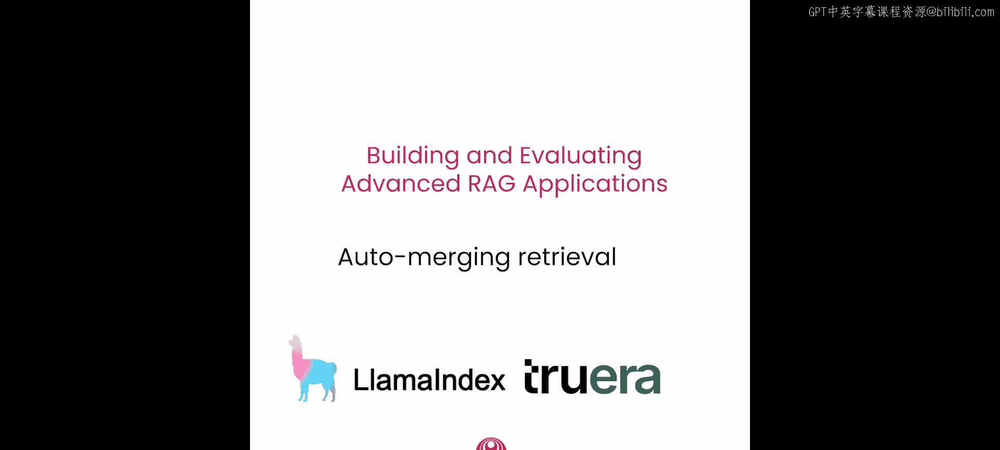
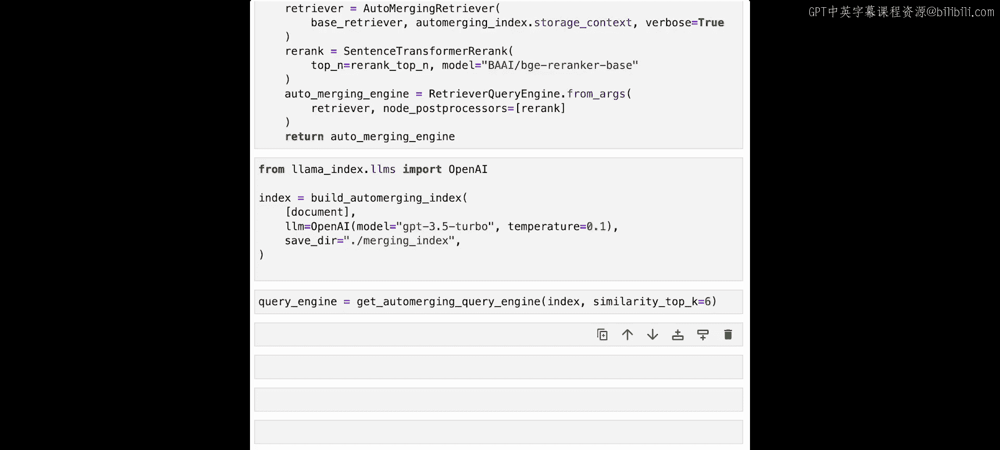
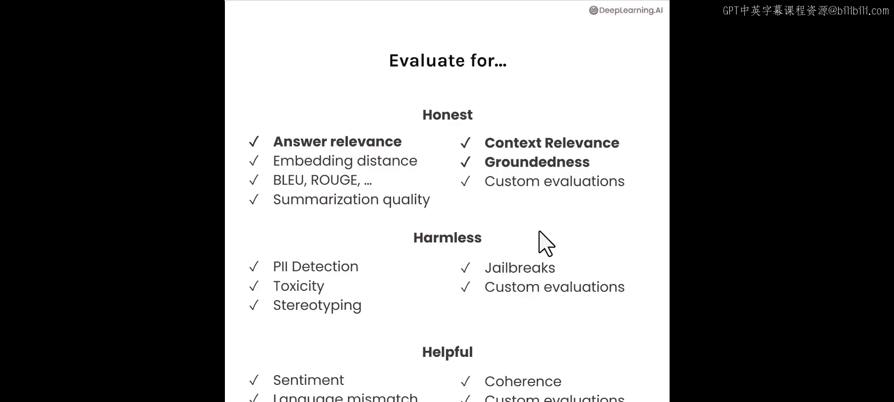

# 005：第四课 自动合并检索 🔄

在本节课中，我们将深入探讨另一种高级RAG技术：自动合并检索。我们将学习其工作原理、如何设置，以及如何使用评估工具来优化其性能。

## 概述 📋

标准的RAG流水线存在一个问题：它会检索一堆零散的上下文块放入LLM的上下文窗口。块尺寸越小，这种碎片化问题就越严重。自动合并检索通过一种启发式方法，将较小的块合并成较大的父块，从而帮助确保上下文的连贯性。

## 自动合并检索的原理

上一节我们介绍了标准RAG的局限性，本节中我们来看看自动合并检索如何解决这个问题。

标准RAG流水线的问题是，你检索到的是一堆零散的上下文块，并将它们放入LLM的上下文窗口。你的块尺寸越小，碎片化就越严重。例如，你可能会得到两个或多个来自大致相同部分的检索上下文块，但这些块的顺序实际上无法保证。这可能会妨碍LLM在其上下文窗口内对检索到的上下文进行综合处理的能力。

自动合并检索的工作原理如下：
1.  首先，定义一个从较小块链接到较大父块的层次结构，其中每个父块可以拥有一定数量的子块。
2.  其次，在检索过程中，如果链接到某个父块的较小块的集合超过了某个百分比阈值，那么我们将较小的块合并到较大的父块中。这样，我们检索的是较大的父块，以帮助确保更连贯的上下文。

## 设置自动合并检索器

现在让我们看看如何设置它。这个笔记本将介绍使用LlamaIndex构建自动合并检索器所需的各种组件。我们将详细介绍各个组件。与上一节类似，最后我们将展示如何使用TruEra进行参数实验和评估。

与之前一样，我们将加载OpenAI API密钥，并使用工具文件中的一个便捷辅助函数来完成。与之前的课程一样，我们也将使用“如何在AI领域建立职业生涯”这份PDF文件。同样，我们也鼓励你尝试使用自己的PDF文件。

我们加载了41个文档对象，并将它们合并成一个大文档，这使其更适合与我们的高级检索方法进行文本混合。

现在我们已经准备好设置自动合并检索器。这将由几个不同的组件组成，第一步是定义所谓的分层节点解析器。

### 1. 定义分层节点解析器

为了使用自动合并检索器，我们需要以分层方式解析节点。这意味着节点按尺寸递减的方式解析，并在其父节点中包含关系。

以下是一个演示节点解析器工作原理的小例子。

我们创建一个具有小块尺寸的示例解析器进行演示。

请注意，我们使用的块尺寸是2048、512和128。你可以将块尺寸更改为任何你想要的递减顺序，这里我们使用4的倍数。

现在让我们从文档中获取节点。这样做实际上会返回所有节点：叶子节点、中间节点以及父节点。因此，叶子节点、中间节点和父节点之间的信息和内容会有相当多的重叠。

如果我们只想检索叶子节点，可以调用LlamaIndex中的一个函数 `get_leaf_nodes`，并查看其内容。

在这个例子中，我们在原始节点集上调用 `get_leaf_nodes`，并查看第31个节点的文本。

我们看到文本块实际上相当小，这是一个叶子节点的例子，因为叶子节点是128个标记的最小块尺寸。

现在我们已经展示了叶子节点的样子，我们也可以探索节点间的关系。

我们可以打印上述节点的父节点，并观察到它是一个包含叶子节点文本的更大块，而且内容更多。更具体地说，父节点包含512个标记，同时拥有四个包含128个标记的叶子节点。有四个叶子节点是因为块尺寸除以了4的倍数。

这是第31个叶子节点的父节点示例。

### 2. 构建索引

现在我们已经向你展示了节点层次结构的样子，我们可以构建索引了。

我们将使用OpenAI LLM，特别是GPT-3.5 Turbo。我们还将定义一个包含LLM、嵌入模型和分层节点解析器的服务上下文对象。

与之前的笔记本一样，我们将使用BGE-small-en嵌入模型。

下一步是构建我们的索引。索引的工作方式是，我们专门在叶子节点上构建向量索引。所有其他中间节点和父节点都存储在文档存储中，并在检索期间动态检索。但在初始的top-K嵌入查找中，我们实际获取的是叶子节点，并且我们嵌入的也是叶子节点。

在这段代码中，我们看到定义了一个存储上下文对象，默认情况下使用内存中的文档存储进行初始化，我们调用 `storage_context.docstore.add_documents` 将所有节点添加到这个内存中的文档存储。然而，当我们创建向量存储索引（此处称为 `automerging_index`）时，我们只传入叶子节点进行向量索引。

这意味着叶子节点专门使用嵌入模型进行嵌入和索引，但我们也传入了存储上下文和服务上下文。因此，向量索引确实知道包含所有节点的底层文档存储。最后，我们持久化这个索引。如果你已经构建了这个索引并想从存储中加载，你可以直接复制并粘贴这段代码块，如果索引不存在，它将重建索引，否则从存储中加载。

### 3. 设置检索器和运行查询引擎

定义好自动合并索引后，最后一步是设置检索器并运行查询引擎。

自动合并检索器控制合并逻辑。如果给定父节点的大部分子节点被检索到，它们将被替换为父节点。为了使这种合并工作良好，我们为叶子节点设置了一个较大的top-K值。请记住，叶子节点的块尺寸较小，为128个标记。为了减少标记使用量，我们在合并发生后应用了一个重排序器。例如，我们可能检索前12个，合并后得到前10个，然后重排序为前6个。重排序器的最终top-N值可能看起来较大，但请记住，基础块尺寸只有128个标记，而上一级父节点是512个标记。

我们导入一个名为 `AutoMergingRetriever` 的类。然后我们定义一个句子转换器重排序模块。我们将自动合并检索器和重排序模块组合到我们的检索器查询引擎中，该引擎处理检索和综合。

现在我们已经完成了整个设置，让我们实际测试一下。以“网络在AI中的重要性是什么？”为例，我们得到了回答。它说网络在AI中很重要，因为它允许个人发展强大的专业网络等等。

### 4. 整合所有步骤

下一步是将所有步骤整合在一起。我们将创建两个高级函数：`build_automerging_index` 和 `get_automerging_query_engine`。这基本上囊括了我们刚才展示的所有步骤。

第一个函数 `build_automerging_index` 将使用分层节点解析器解析出子节点到父节点的层次结构。它将定义服务上下文。它将从叶子节点创建向量存储索引，同时也链接到所有节点的文档存储。

第二个函数 `get_automerging_query_engine` 利用我们的自动合并检索器，该检索器能够动态地将叶子节点合并到父节点中，并且使用我们的重排序模块，然后将其与整体的检索器查询引擎结合。

因此，我们使用原始源文档、LLM设置为GPT-3.5 Turbo以及索引保存目录，通过 `build_automerging_index` 函数构建索引。

然后对于查询引擎，我们基于索引调用 `get_automerging_query_engine`，同时我们将相似度top-K设置为等于6。

作为下一步，我们将展示如何使用TruEra评估自动合并检索器，并迭代参数。我们鼓励你也尝试自己的问题，并迭代自动检索的参数，例如，当你更改块尺寸、top-K值或重排序器的最终top-N值时会发生什么。尝试一下并告诉我们结果如何。

## 评估与参数迭代 🧪

太棒了，Jerry。现在你已经设置了自动合并检索器，让我们看看如何用RAG三元组评估它，并通过实验跟踪将其性能与基础RAG进行比较。

让我们设置这个自动合并索引。你会注意到它是两层结构。最底层的块（叶子节点）的块尺寸为512。层次结构中的上一层块尺寸为2048，这意味着每个父节点将拥有四个叶子节点，每个叶子节点512个标记。设置的其他部分与Jerry之前向你展示的完全相同。

你可能想尝试两层自动合并结构的一个原因是它更简单。创建索引所需的工作更少。同样，在检索步骤中，所需的工作也更少，因为所有第三层块都消失了。如果它的性能相当好，那么理想情况下，我们希望使用更简单的结构。

现在我们已经用这个两层自动合并结构创建了索引，让我们为这个设置设置自动合并引擎。我将保持top-K值与之前相同，即12。重排序步骤也将保持相同的n=6。这将使我们能够在这个应用设置与Jerry之前设置的三层自动合并层次结构应用之间进行更直接的正面比较。

现在让我们用这个自动合并引擎设置Tru记录器。我们将给它一个应用ID：app_0。现在让我们加载一些用于评估的问题，从我们之前设置的生成问题文本文件中加载。

现在我们可以定义这些评估问题的运行。对于about_questions中的每个问题，我们将进行设置，以便在调用Tru记录器对象与RAG链时，记录提示、响应和评估结果，利用查询引擎。

现在我们的评估已经完成，让我们看一下排行榜。我们可以看到App_0在这里，上下文相关性似乎较低。另外两个指标更好。这是我们的两层层次结构，叶子节点块尺寸为512，父节点为2048个标记，所以叶子节点是512个标记。

现在我们可以运行Tru仪表板，并在更详细的记录级别查看评估结果。让我们检查应用排行榜。

你可以看到，在处理了24条记录后，上下文相关性在聚合层面上相当低，尽管该应用在答案相关性和事实基础性方面表现更好。我可以选择该应用。

现在让我们查看App_0的各个记录，看看各项评估分数如何。你可以向右滚动，查看答案相关性、上下文相关性和事实基础性的分数。让我们选一个上下文相关性低的记录。

这里有一个。如果你点击它，你会在下面看到更详细的视图。问题是“讨论为资源预算对AI项目成功执行的重要性”。右边是回答。如果你进一步向下滚动，可以看到上下文相关性的更详细视图。有六条检索到的上下文，每一条的评估分数都特别低，在0到0.2之间。如果你选择其中任何一条并点击它，可以看到回答与所提问题不太相关。你也可以向上滚动，探索其他一些记录。你可以选择分数好的记录，例如这个，并探索应用在不同问题上的表现，它的优势在哪里，失败模式是什么，从而对什么有效、什么无效建立一些直觉。

现在让我们将之前的应用与Jerry之前介绍的自动合并设置进行比较。现在我们的层次结构中将有三层，叶子节点级别从128个标记开始，上一层是512，最高层是2048。所以在每一层，每个父节点有4个子节点。

现在，让我们为这个应用设置设置查询引擎、Tru记录器，所有步骤都与前一个应用相同。最后，我们准备好运行评估。

现在我们设置了App_1，可以在这里快速查看排行榜，你可以看到相对于App_0，相同记录数下App_1处理的标记数大约是一半，总成本也大约是一半。这是因为回想一下，这个层次结构有三层，块尺寸是128个标记，而不是App_0中最小的叶子节点标记尺寸512。这导致了成本降低。还要注意，上下文相关性增加了约20%。部分原因是，在这种新的应用设置下，合并可能发生得更好。

我们也可以深入查看App_1的更多细节，像之前一样。我们可以查看各个记录。让我们选择之前查看过的同一个记录，即App_0中关于预算重要性的问题。现在你可以看到上下文相关性表现更好，事实基础性也显著提高。如果你选择一个示例回答，你会看到它实际上非常具体地讨论了为资源预算。所以在这个特定实例中以及聚合层面上都有改进。

## 总结与关键要点 🎯

现在让我总结一下第四课的一些关键要点。

我们引导你了解了一种评估和迭代自动合并检索这一高级RAG技术的方法。特别是，我们向你展示了如何迭代不同的层次结构、层数、子节点数量和块尺寸。对于这些不同的应用版本，你可以用RAG三元组评估它们，并通过跟踪实验来为你的用例选择最佳结构。

需要注意的一点是，你不仅获得了作为评估一部分的RAG三元组相关指标，而且深入到记录级别可以帮助你获得关于哪些超参数最适合某些文档类型的直觉。例如，根据文档的性质（如雇佣合同与发票），你可能会发现不同的块尺寸和层次结构效果最好。

最后，另一件需要注意的事情是，自动合并与句子窗口检索是互补的。一种思考方式是，假设你有一个父节点的四个子节点，通过自动合并，你可能会发现子节点1和子节点4与所提查询非常相关，然后它们在自动合并范式下被合并。相比之下，句子窗口可能不会导致这种合并，因为它们不在文本的连续部分中。

这就结束了第四课。我们观察到，通过高级RAG技术（如句子窗口和自动合并检索），并结合评估、实验跟踪和迭代的力量，你可以显著改进你的RAG应用。此外，虽然本课程重点介绍了这两种技术以及相关的RAG三元组评估，但还有许多其他评估方法可供尝试，以确保你的LLM应用是诚实、无害和有益的。这张幻灯片列出了TruLens中现成可用的一些评估方法，我们鼓励你去尝试TruLens，探索笔记本，并将你的学习提升到新的水平。