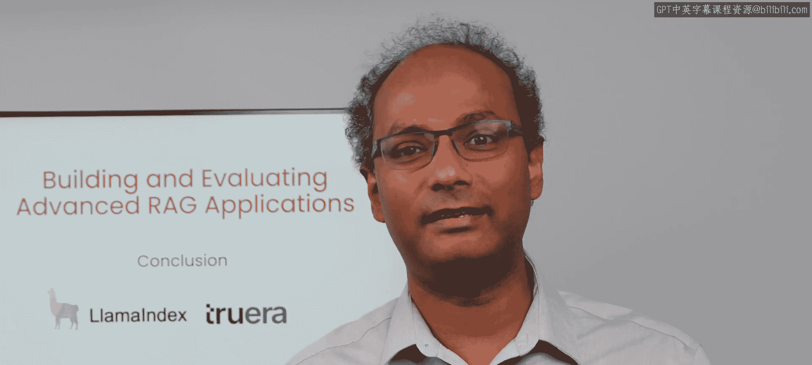
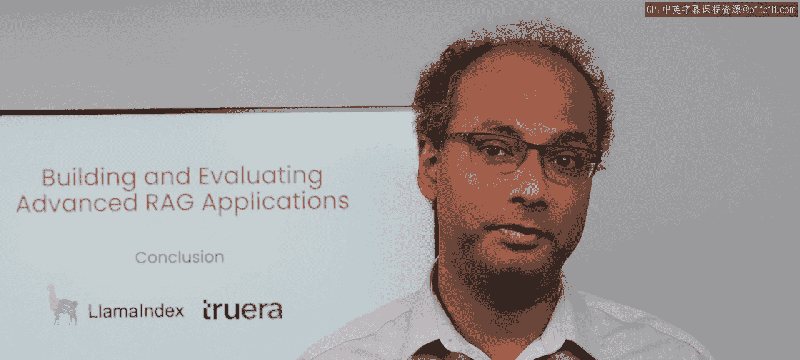
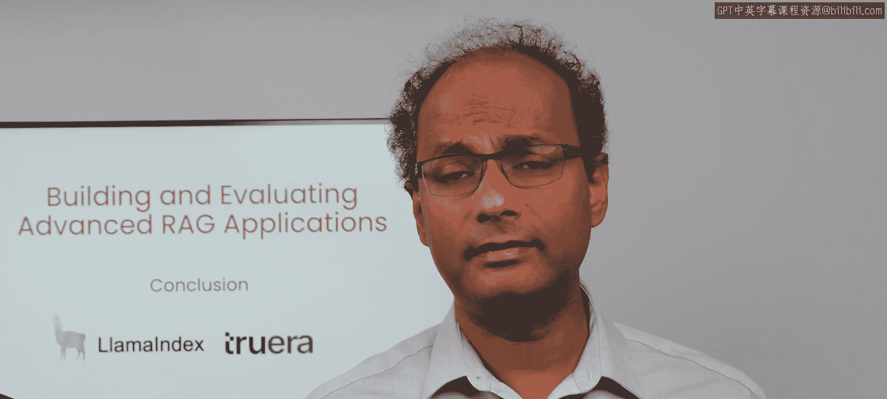
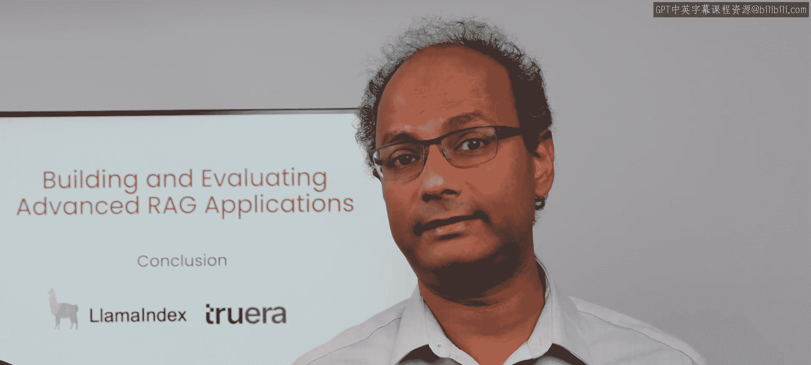
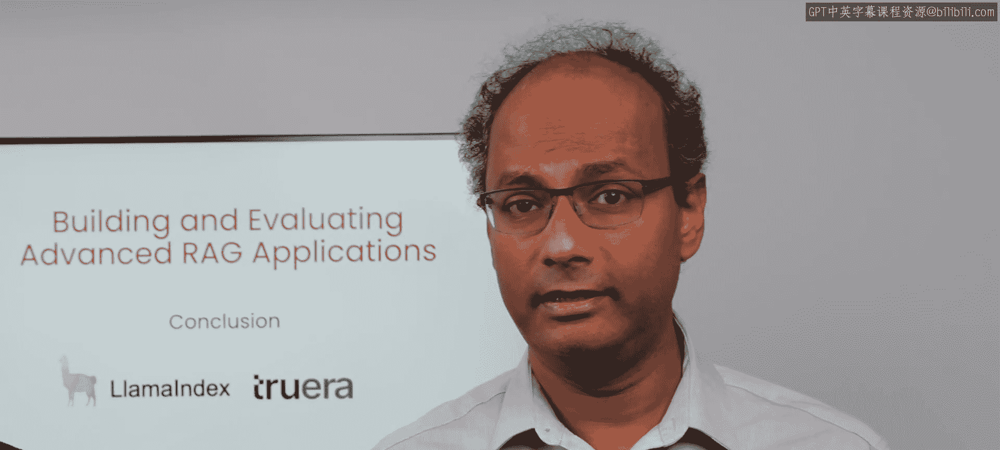
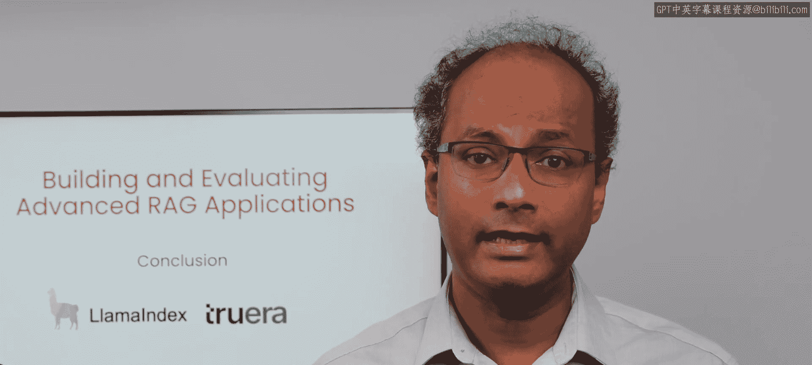
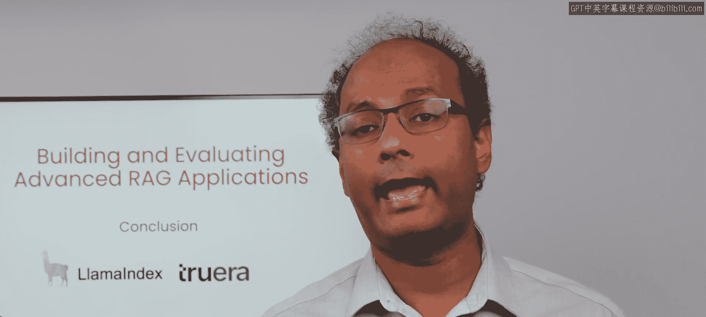

# 006：课程总结与展望 🎯

在本节课中，我们将对构建和评估高级RAG应用的全过程进行总结，并展望未来的学习方向与实践建议。

恭喜你完成本课程。希望你已经掌握了如何构建、评估并迭代你的RAG应用，使其更接近生产就绪状态。

无论你来自数据科学、机器学习背景，还是传统的软件开发背景，都需要学习这些核心的开发原则，以便成为一名能够构建稳健大语言模型软件系统的优秀AI工程师。

随着领域的发展，减少大语言模型的幻觉将是每位开发者的首要任务。我们很高兴看到基础模型在不断进步，大规模评估也变得更加廉价和易于获取，使得每个人都能着手进行。

## 提升RAG性能的后续步骤 🔍

上一节我们总结了课程的核心目标，本节中我们来看看如何进一步深化学习与实践。作为下一步，我建议你更深入地理解你的数据管道、检索策略和大语言模型提示，以帮助提升RAG的性能。

我们展示的两种技术仅仅是冰山一角。你应该探索从文本块大小到混合搜索等检索技术，再到基于大语言模型的推理（如思维链）等各个方面。

以下是你可以深入探索的关键方向列表：
*   **数据管道优化**：例如调整 `chunk_size` 参数。
*   **高级检索技术**：例如实现 `hybrid_search`（结合关键词与向量搜索）。
*   **大语言模型推理**：例如应用 `Chain-of-Thought` 提示技术。

## 评估框架与未来主题 📊

RA三元组是评估基于检索的大语言模型应用的一个绝佳起点。我鼓励你在大语言模型及其驱动的应用评估领域进行更深入的挖掘。

这包括评估模型置信度、校准、不确定性、可解释性、隐私性、公平性以及在正常与对抗性环境下的毒性等主题。

我们期待看到你接下来的构建成果。

---

**本节课总结**：本节课中我们一起学习了课程的核心收获，明确了减少大模型幻觉是开发重点。我们回顾了提升RAG性能的关键方向，包括数据管道、检索策略和提示工程，并介绍了RA三元组这一重要的评估起点。最后，我们展望了未来需要深入研究的评估主题，为你的持续学习指明了方向。