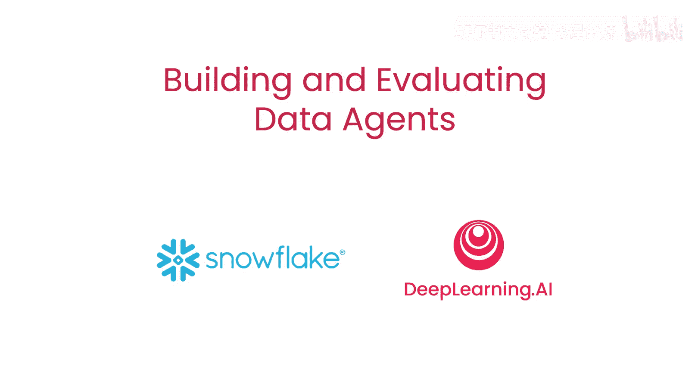
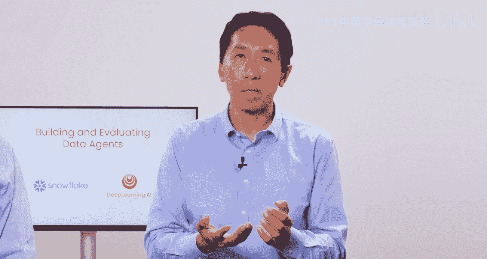
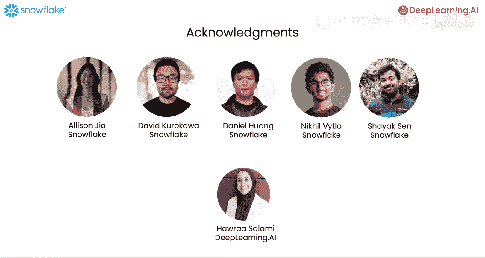

# 001：课程概述与目标 🎯

在本课程中，我们将学习如何构建一个能够执行网络搜索、连接数据源、收集与分析数据、可视化结果并提供洞察的**数据代理**。更重要的是，我们将学习如何应用**离线评估**来迭代改进代理的设计，以及如何实施**实时评估**，让代理在运行过程中也能动态调整策略。

我们很高兴能与来自Snowflake的AI研究负责人Anupam Datta，以及开发者倡导者Josh Reini共同讲授本课程。Anupam曾是卡内基梅隆大学的教授，也是被Snowflake收购的AI可观测性初创公司TruEra的创始人。Josh此前也在TruEra工作，并持续构建和维护着用于AI追踪与评估的开源库TruLens。

## 课程核心：评估的重要性 📊

构建评估是开发现代AI代理工作负载的一项关键技能。本课程将展示一些重要的最佳实践。具体而言，我们将从评估代理的答案质量开始。

我们将使用一个评估框架来度量代理的端到端性能，评估其最终答案是否与用户查询相关，以及为分析所检索的数据是否与查询相关。最后，我们还会评估最终答案是否**基于**所有检索到的数据。

您可以使用这些离线评估指标来改进代理的逻辑、更新其提示词，或者尝试不同的LLM模型。此外，我们还将使用**思维链评估**来评估代理得出最终答案的**过程**。

有趣的是，这项技术不仅可用于离线评估，还能在**运行时**为代理提供反馈，帮助其动态调整数据检索与分析策略。

## 代理架构：多代理工作流 🤖

您将使用一个**多代理工作流**来实现您的数据代理。该工作流包含以下组件：
*   **规划器**：接收用户查询并生成执行计划。
*   **计划执行器**：指导计划的执行，并根据计划决定应由哪个专业代理进行下一步。
*   **专业代理**：包括网络研究员、数据研究员、数据可视化器和响应合成器等。

每个代理都会将其执行步骤的输出共享给计划执行器。在每次数据检索步骤之后，计划执行器会**反思**当前计划，并决定是否需要更新它。

## 评估维度：目标、计划与行动 🎯

我们将从多个维度评估代理的性能：
1.  **检索质量**：检索到的数据是否相关、准确？
2.  **计划质量**：生成的计划是否与用户请求一致？代理的行动是否与计划对齐，并且执行得高效、合乎逻辑？

在改进代理时，我们将调整其提示词，并实施**内联评估**。内联评估将在任何检索步骤之后，立即为计划执行器提供关于**上下文相关性**的实时评分。这将告知计划执行器当前的检索步骤是否缺乏相关性；如果是，计划执行器将要求规划器调整计划。

在完成这些设计改进后，我们将比较改进前后的离线评估指标。无论是离线还是实时评估，都依赖于对代理运行过程的**追踪**，这也是本课程中将学习的重要内容。

## 总结与预告 📝

本节课我们一起了解了构建与评估数据代理的课程目标、核心的评估理念以及将要实现的多代理系统架构。我们认识到，评估是迭代改进代理性能的关键，而实时反馈机制能让代理变得更智能、更可靠。

在下一节视频中，我们将深入探讨评估代理的三个核心维度：**目标、计划与行动**。让我们继续学习。