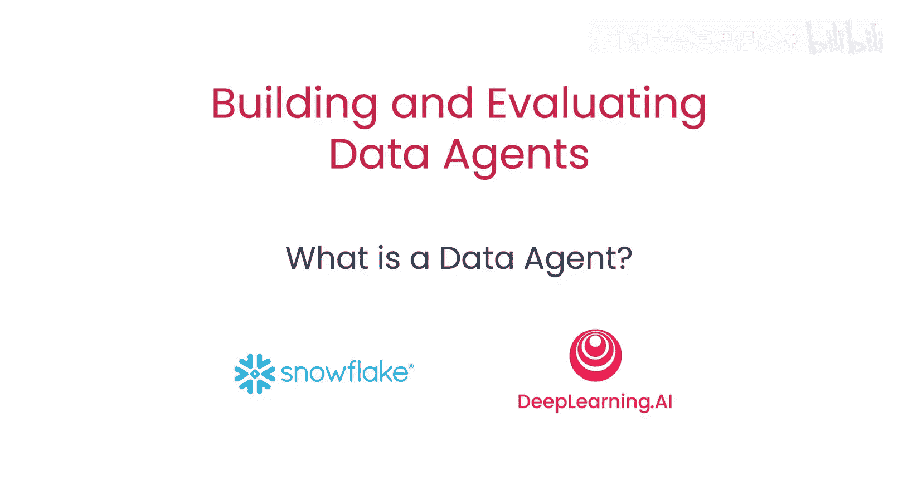
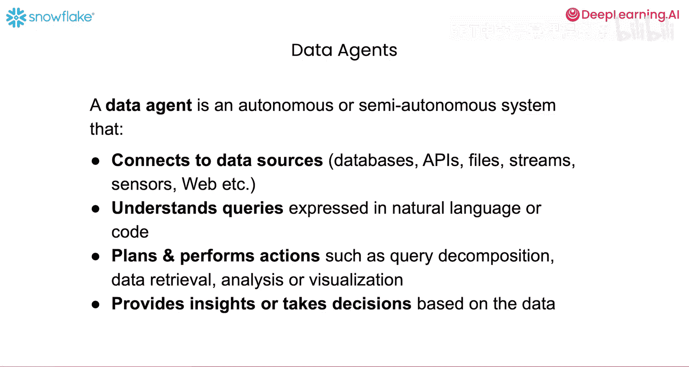
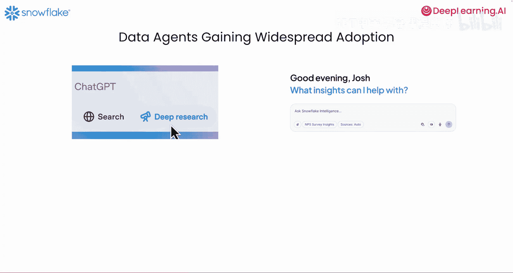
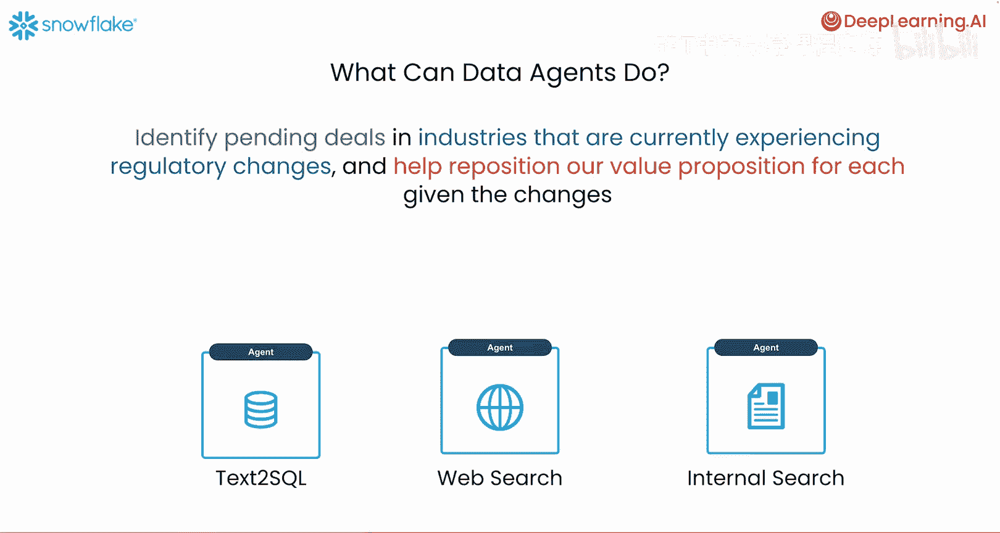
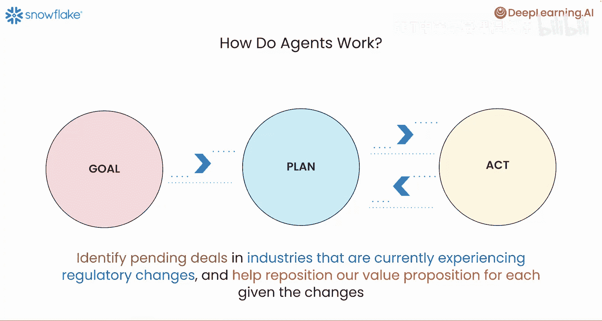
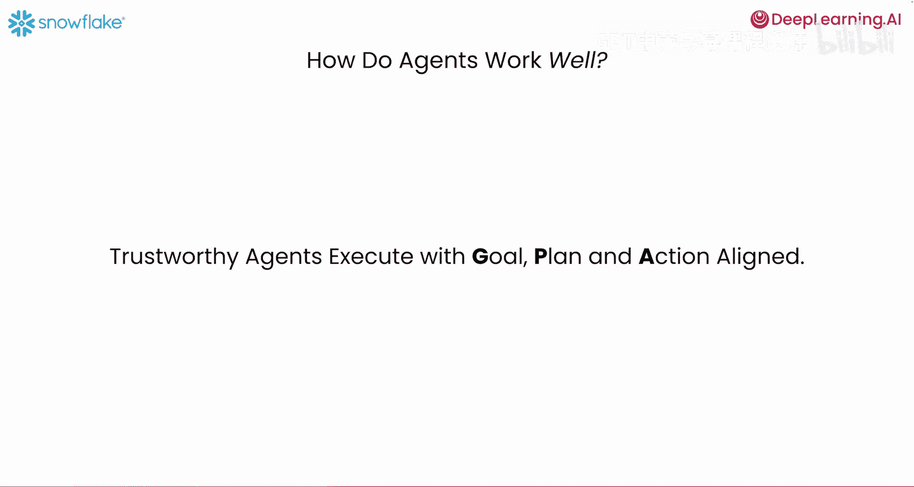
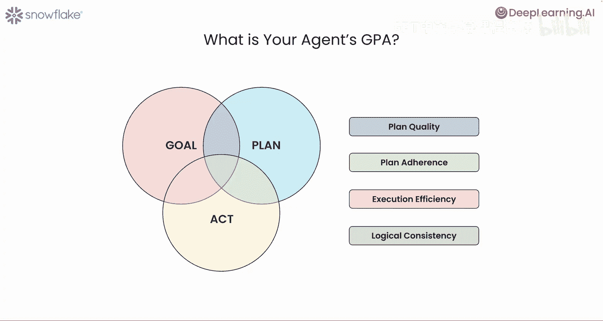
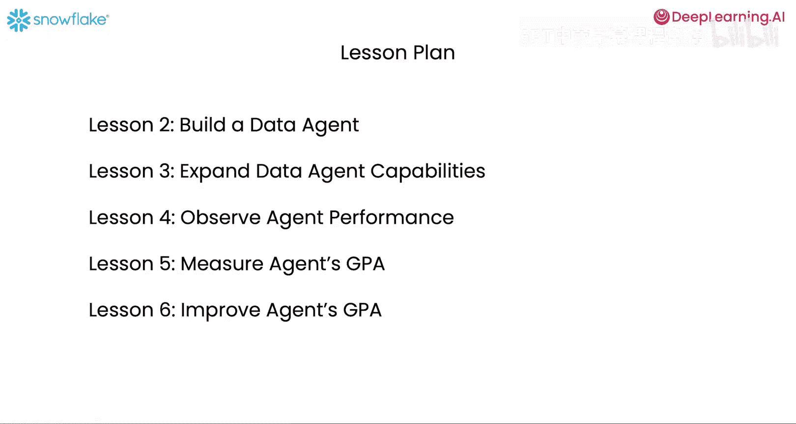

# 002：什么是数据代理？🤖

在本节课中，我们将学习什么是数据代理、它们如何工作，以及如何判断一个数据代理是否值得信赖。

## 概述

数据代理是一种由大型语言模型驱动的自主或半自主系统。它能连接多种数据源，理解自然语言或代码形式的查询，执行数据检索、分析等操作，并最终提供洞察或做出决策。理解其工作原理和评估标准，是构建可靠数据代理应用的基础。

## 什么是数据代理？📖

上一节我们概述了数据代理，本节中我们来详细看看它的定义。

一个数据代理是由大型语言模型驱动的自主或半自主系统，它能连接到数据源。这些数据源可以是数据库、API、文件、流、传感器、Web API等。它能理解以自然语言或代码表达的查询，并执行诸如查询分解、数据检索、分析或可视化等操作。最终，它基于这些数据提供洞察或做出决策。例如，它可以发送一封包含其工作结果摘要报告的电子邮件。

## 数据代理的应用场景 🌐

理解了定义后，我们来看看数据代理在现实世界中的应用。

数据代理正开始获得广泛采用。例如，许多人可能非常熟悉ChatGPT的Deep Research系统。根据我们对数据代理的抽象定义，Deep Research可以被视为一个数据代理，它仅利用网络上可用的数据及其内部参数化知识来回答各种主题的开放式问题。

在许多企业环境中，仅依赖网络数据是不够的，还需要利用内部可用的数据。这些数据可以是数据库表中的结构化数据，也可以是文档和其他多媒体格式的非结构化数据。Snowflake Intelligence就是一个覆盖这类更广泛数据源的数据代理示例。

## 一个具体的工作示例 🔍

现在，我们通过一个具体例子来理解数据代理的工作范围。

以下是一个非常简单的例子，要求数据代理识别金融服务行业的监管变化。在这种情况下，代理可以通过检查网络上可用的数据来发现监管变化的一般趋势。这样的代理可以是一个执行此任务的网络搜索代理。

现在，让我们让查询更详细一些。我们要求数据代理识别当前正经历监管变化的行业中的待处理交易。请注意，这个问题有两个部分。

*   **第一部分（识别待处理交易）**：需要访问内部专有数据，这些数据可能位于企业内部的表格中。一个子代理可以通过使用一个能将自然语言文本转换为SQL的代理来检查或回答这部分问题，在数据库上运行它并检索信息。
*   **第二部分（识别经历监管变化的行业）**：与我们上一张幻灯片上的第一个查询非常相似，它要求获取关于当前正经历监管变化的行业的信息。

在这个上下文中，顶级代理一旦通过使用文本转SQL子代理收集了这些待处理交易，就可以利用网络搜索子代理来找出哪些交易处于当前正经历监管变化的行业中，然后综合调用这两个子代理的结果来生成响应。

现在你可以看到，数据代理开始响应更复杂的查询，这些查询需要使用多个数据源。

最后，让我们进一步扩展这个查询。第一部分直到这里与上一张幻灯片上的查询相同，但现在我们还要求数据代理根据监管变化，帮助为每笔交易重新定位我们的价值主张。

查询的最后一部分，一旦我们从代理那里获得了解决前两个部分的响应，顶级代理就可以使用另一个在企业内部可用文档上进行内部搜索的子代理，来读取与这些交易相关的会议记录，然后为每笔待处理交易综合出一个考虑到相应行业监管变化的价值主张。

至此，数据代理使用了三个不同的子代理来回答一个相当复杂的查询，该查询解决了此任务的所有要素。

## 数据代理如何工作？⚙️

上一节我们看了一个复杂查询的例子，本节中我们来看看数据代理为实现目标（如回答上一类查询）而工作的顶层概述。

代理将有关联的目标需要完成。对于数据代理，目标可能是响应像上一张幻灯片那样的查询。然后，它会创建一个实现目标的计划，并执行一系列由计划规定的操作，以实现通往最终目标路径上的各种子目标。这里，计划和行动之间可能存在迭代，根据行动的结果，代理可能会更新其计划，然后执行更多操作，并继续这个迭代过程，直到它满意地认为目标已经达成。

如果我们回到正在运行的例子（这也是我们将在后续课程中详细查看的例子），目标是回答这个问题。计划步骤涉及将这个复杂查询分解为三个查询：一个关于识别待处理交易（涉及调用文本转SQL子代理），一个关于理解这些待处理交易处于哪些行业以及这些行业正在经历何种监管变化（使用网络搜索代理），最后使用内部搜索代理来帮助根据变化重新定位每笔交易的价值主张。这就是计划的形式。

计划的第一步涉及查询分解。然后，执行或行动步骤涉及按顺序调用文本转SQL代理、搜索代理和内部搜索代理，最终到达一个点，所有信息都可供代理综合成一个良好的响应以实现其目标。

## 如何评估数据代理？📊

了解了代理如何工作的结构（包括设定目标、计划和行动以实现这些目标的组合）后，我们现在来看看代理良好工作意味着什么。

值得信赖的代理在执行时，其目标、计划和行动是一致的。换句话说，我们希望代理具有高的GPA，即目标、计划和行动一致性。

让我对此稍作详细说明。我们如何衡量代理的GPA？

第一步是为代理设定目标。在我们的数据代理设置中，这些目标通常涉及最终响应的质量，例如：它是否相关？它是否基于检索结果？以及代理在实现最终查询答案过程中可能被期望实现的子目标，例如检索相关结果。

一旦我们指定了目标，接下来的步骤涉及确保目标与计划、计划与行动以及行动与目标之间有良好的一致性。我们有一套利用LLM评判员来检查代理GPA的评估方法。

以下是四种关键的评估方法：

*   **计划质量**：位于目标与计划的接口处。它检查代理的计划是否是实现其目标的良好计划。计划不必是静态的，随着代理获得新信息，它可能会随时间演变，但重新计划的步骤也需要根据代理可访问的信息和观察结果进行充分论证。
*   **计划遵循度**：位于计划与行动的接口处。它检查代理的行动是否符合或遵循其计划。换句话说，代理是否真的按照它计划的方式行动？偏离计划可能表明存在故障模式，这对开发者在构建数据代理时意识到并解决问题是有帮助的。
*   **执行效率**：位于目标与行动的接口处（即维恩图的这一部分）。它检查代理所采取的执行路径（它执行的操作序列）是否是实现目标的最有效路径。它可以帮助识别代理规划过程中的冗余，这是我们在开发数据代理的迭代过程中需要改进的地方。
*   **逻辑一致性**：位于我们所有三个GPA支柱的交集处。它检查计划与目标之间的不一致性（例如，计划是否包含或建议了与实现目标或子目标不一致的步骤），以及计划与重新计划步骤之间或计划与行动步骤之间的不一致性。所有这些都可能是不正确的来源，也是改进数据代理的机会。

## 课程路线图 🗺️

有了这个简要介绍，让我为课程的其余部分制定课程计划。

*   **第二课**：我们将构建一个使用网络搜索子代理作为构建计划的数据代理。
*   **第三课**：我们将扩展该数据代理，增加文本转SQL以及内部非结构化数据搜索的能力。因此，第二课和第三课的结合将帮助你在笔记本中构建一个完整的代理，该代理能够回答我们在本课早些时候看到的那类示例查询。你将了解到从头开始构建这样一个代理所涉及的不同步骤。我们将使用Laro开源框架来构建这些代理，但通用概念也适用于其他构建代理的框架。
*   **第四课**：我们将为数据代理添加追踪、检测和追踪支持，并为与该代理相关的目标设置评估。为此，我们将使用TruLens，这是一个用于追踪和评估代理及LLM应用的开源库。你将具体看到我们如何利用与OpenTelemetry兼容的追踪，以及在TruLens内可以为数据代理指定的特定类型目标。
*   **第五课**：我们将扩展评估以衡量代理的GPA。在这里，我们将为计划质量、计划遵循度、逻辑一致性和执行效率添加评估，这些评估将建立在第四课先前创建的评估指标之上。在第五课中，我们还将展示代理可能如何失败，这些评估能捕捉到哪些类型的故障模式，这将为开发者引入改进措施提供基础。
*   **第六课**：我们将研究由第五课的评估所启发的特定机制，以提高代理的GPA。
*   **最后**：我们将总结课程，并提供一些关键要点。

## 总结

本节课中，我们一起学习了数据代理的基本概念。我们了解到数据代理是一个能连接多种数据源、处理复杂查询的智能系统。其核心工作流程包括**设定目标**、**制定计划**和**执行行动**。为了确保其可靠性和效率，我们引入了**GPA（目标-计划-行动）一致性**框架，并通过**计划质量**、**计划遵循度**、**执行效率**和**逻辑一致性**四个维度来评估代理的表现。从下一课开始，我们将动手实践，逐步构建并完善我们自己的数据代理。