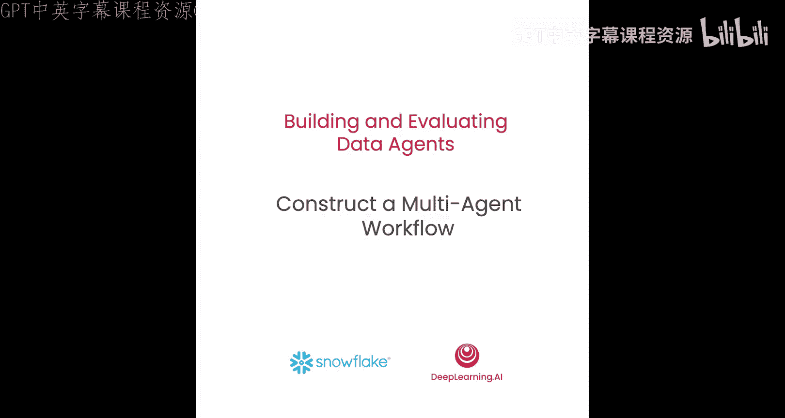
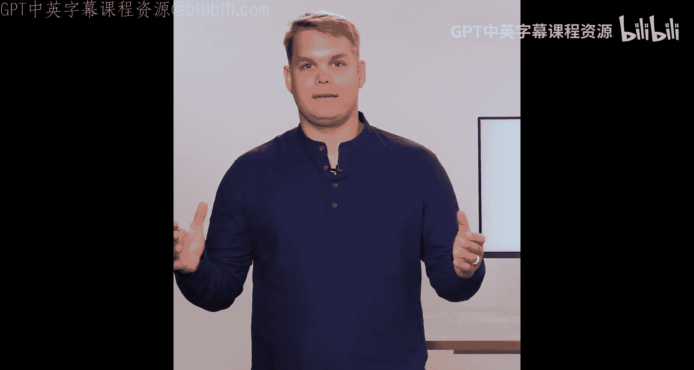
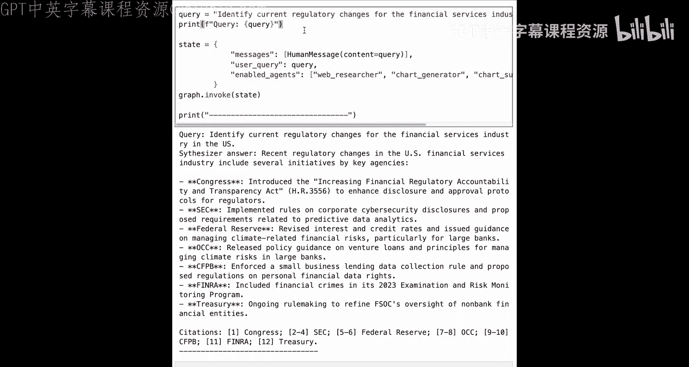

# 003：构建多智能体工作流 🏗️



在本节课中，我们将使用 LangGraph 将数据代理实现为一个多智能体工作流。这个数据代理将能够进行网络研究以回答用户查询，然后可视化研究结果或综合生成结果摘要。

## 概述 📋



我们将构建一个分层结构的数据代理。首先，一个规划器会接收用户查询并将其分解为子目标。然后，执行器将使用子智能体来执行计划中的每一步。本示例中的子智能体将包括网络研究员、图表生成器、图表摘要器和综合器。

## 构建智能体状态 🧠

首先，我们需要加载环境变量并初始化智能体状态。智能体状态为智能体提供记忆功能。

```python
# 初始化自定义状态类，继承自 LangGraph 的 MessageState
class CustomState(MessageState):
    user_query: str
    enabled_agents: List[str]
    current_step: int
    agent_query: str
    last_reason: str
    replan_attempts: int
```

通过继承 `MessageState`，我们自动获得一个 `messages` 键，用于跟踪不同智能体之间的对话历史。此外，状态还包括用户查询、可用智能体列表、当前步骤、子智能体查询、上次选择子智能体的原因以及重新规划次数的跟踪信息。

## 创建规划器 📝

上一节我们介绍了智能体状态，本节中我们来看看如何创建规划器。规划器负责将用户查询分解为可执行的步骤。

首先，我们查看规划器的提示词。提示词指示规划器将用户请求分解为编号步骤，并将查询分解为子查询。每个子查询应尽可能小，以便由单个数据源处理。

以下是规划器提示词的核心部分：

```
你是一个多智能体系统中的规划器。请将用户请求分解为编号步骤，并将查询分解为子查询。子查询应尽可能小，每个子查询对应一个数据源。
可用智能体列表：[{enabled_agents}]
请以以下JSON格式输出计划：{"steps": [{"agent": "agent_name", "action": "action_description"}, ...]}
```

接下来，我们在笔记本中构建规划器节点。该节点接收状态，调用推理大语言模型（如 GPT-3.5-turbo）并生成计划，然后路由到执行器。

```python
def planner_node(state: CustomState):
    # 构建提示词，填充用户查询等信息
    prompt = build_plan_prompt(state.user_query, state.enabled_agents)
    # 调用大语言模型
    lm_reply = reasoning_llm.invoke(prompt)
    # 解析并验证返回的JSON计划
    plan = validate_and_extract_plan(lm_reply.content)
    # 更新状态
    new_state = {
        "plan": plan,
        "replan_flag": False,
        # ... 其他状态更新
    }
    # 返回命令，指示下一步前往执行器
    return Command(update=new_state, goto="executor")
```

## 创建执行器 ⚙️

规划器制定了计划，本节中我们来看看执行器如何根据计划选择并调用具体的子智能体。

执行器的提示词指导它决定当前计划是否需要修订、下一步运行哪个智能体、为什么选择该智能体，以及为所选智能体编写确切的查询问题。

以下是执行器决策的关键逻辑：

1.  **判断是否需要重新规划**：根据当前进展和从子智能体（如网络研究员）获得的新信息。
2.  **选择下一个智能体**：如果进展合理，则移动到计划中的下一个步骤对应的智能体；否则，执行当前步骤指定的智能体。
3.  **构建查询**：为选定的智能体编写清晰、独立、可由该智能体回答的英文指令。

执行器节点代码如下：

```python
def executor_node(state: CustomState):
    # 构建执行器提示词
    prompt = build_executor_prompt(state.plan, state.current_step, state.messages, state.enabled_agents)
    # 调用大语言模型
    lm_reply = reasoning_llm.invoke(prompt)
    # 解析决策结果
    decision = parse_executor_decision(lm_reply.content) # 包含 replan, goto, reason, query

    if decision.replan and state.replan_attempts < MAX_REPLANS:
        # 触发重新规划，前往规划器
        new_state = { "replan_flag": True, "replan_attempts": state.replan_attempts + 1 }
        return Command(update=new_state, goto="planner")
    else:
        # 执行计划，前往下一个子智能体
        next_agent = get_agent_from_plan(state.plan, state.current_step)
        new_state = { "current_step": state.current_step + 1, "agent_query": decision.query }
        return Command(update=new_state, goto=next_agent)
```

## 创建子智能体 🤖

执行器负责调度，本节中我们来看看具体完成任务的各个子智能体是如何构建的。我们将创建四个子智能体：网络研究员、图表生成器、图表摘要器和综合器。

### 网络研究员 🔍

网络研究员是一个 ReAct 风格智能体，它绑定了一个网络搜索工具（如 Tavily Search），用于从互联网获取信息。

```python
from langchain_community.tools import TavilySearchResults
from langgraph.prebuilt import create_react_agent

# 创建搜索工具
search_tool = TavilySearchResults(max_results=5)
# 创建 ReAct 智能体
web_researcher = create_react_agent(
    llm=ChatOpenAI(model="gpt-4"),
    tools=[search_tool],
    prompt="你是一名研究员，只能使用提供的搜索工具进行研究。找到所有需要的信息后，请结束输出。"
)

def web_researcher_node(state: CustomState):
    # 从状态中获取子查询
    query = state.agent_query
    # 调用网络研究员智能体
    response = web_researcher.invoke({"messages": [HumanMessage(content=query)]})
    # 更新对话历史
    new_messages = state.messages + [response.messages[-1]]
    new_state = {"messages": new_messages}
    # 返回执行器，决定下一步
    return Command(update=new_state, goto="executor")
```

### 图表生成器 📊

图表生成器也是一个 ReAct 智能体，但它绑定的是一个 Python REPL 工具，允许大语言模型执行 Python 代码来生成图表（例如使用 matplotlib）。

```python
from langchain_community.utilities import PythonREPL

repl_tool = PythonREPL()
chart_generator = create_react_agent(
    llm=ChatOpenAI(model="gpt-4"),
    tools=[repl_tool],
    prompt="你负责生成图表。请先打印图表，将其保存到当前工作目录，然后告知图表摘要器文件路径和主要见解摘要。"
)

def chart_generator_node(state: CustomState):
    # 调用图表生成器，使用之前网络研究员收集的数据
    response = chart_generator.invoke({"messages": state.messages})
    # 更新状态并路由到图表摘要器
    new_state = {"messages": state.messages + [response.messages[-1]]}
    return Command(update=new_state, goto="chart_summarizer")
```

### 图表摘要器 🖼️

图表摘要器接收生成的图表图像，并提供一个简洁的文本描述。

```python
chart_summarizer = create_react_agent(
    llm=ChatOpenAI(model="gpt-4"),
    tools=[], # 无需工具，直接描述图像
    prompt="你负责为保存在本地路径的图表生成独立、简洁的摘要说明。"
)

def chart_summarizer_node(state: CustomState):
    response = chart_summarizer.invoke({"messages": state.messages})
    new_state = {"messages": state.messages + [response.messages[-1]]}
    # 摘要完成后，前往综合器或直接结束
    return Command(update=new_state, goto="synthesizer")
```

### 综合器 ✨

当代理任务不需要生成图表，只需文本响应时，由综合器负责。它汇总所有子智能体收集的信息，生成最终答案。

```python
def synthesizer_node(state: CustomState):
    # 1. 从对话历史中提取关键信息（来自研究员、图表生成器、图表摘要器的消息）
    relevant_messages = extract_messages_from_agents(state.messages, ['web_researcher', 'chart_generator', 'chart_summarizer'])
    # 2. 获取原始用户问题
    user_question = state.user_query
    # 3. 构建综合提示词
    synthesis_instructions = """
    请基于以下内容回答问题。可以进行轻量级的比较或推理，但不要捏造任何内容中没有支持的事实。
    请提供简洁的回应，完整回答问题。以直接答案开头，如果需要请包含引用，保持输出清晰。
    """
    prompt = f"用户问题：{user_question}\n\n{synthesis_instructions}\n\n相关内容：{relevant_messages}"
    # 4. 调用大语言模型生成最终答案
    lm_reply = chat_llm.invoke(prompt)
    final_answer = lm_reply.content
    # 5. 更新状态并结束流程
    new_state = {
        "messages": state.messages + [HumanMessage(content=final_answer)],
        "final_answer": final_answer
    }
    return Command(update=new_state, goto="__end__")
```

## 组装工作流图 🧩

所有节点构建完成后，现在我们可以将它们组装成一个完整的工作流图。

```python
from langgraph.graph import StateGraph, END

# 使用自定义状态初始化图
workflow = StateGraph(CustomState)

# 添加所有节点
workflow.add_node("planner", planner_node)
workflow.add_node("executor", executor_node)
workflow.add_node("web_researcher", web_researcher_node)
workflow.add_node("chart_generator", chart_generator_node)
workflow.add_node("chart_summarizer", chart_summarizer_node)
workflow.add_node("synthesizer", synthesizer_node)

# 设置边的连接关系（根据每个节点的`goto`返回值动态路由，这里设置起始点）
workflow.set_entry_point("planner")
# 编译图
graph = workflow.compile()
```

## 运行智能体 🚀

现在，我们的多智能体工作流已经构建完成，让我们通过两个示例查询来测试它。

**示例查询 1：绘制美国前五大银行当前市值图表**

我们期望代理执行以下流程：网络研究员搜索数据 -> 图表生成器创建图表 -> 图表摘要器提供文本描述。

```python
initial_state = {
    "user_query": "Chart the current market capitalization of the top five banks in the US.",
    "messages": [HumanMessage(content="Chart the current market capitalization of the top five banks in the US.")],
    "enabled_agents": ["web_researcher", "chart_generator", "chart_summarizer", "synthesizer"],
    "current_step": 0,
    "replan_attempts": 0
}
result = graph.invoke(initial_state)
print(result["final_answer"])
```
代理将生成一个图表，并附上摘要文本（例如：“图表显示了美国市值前五的银行，其中摩根大通领先...”）。

**示例查询 2：识别美国金融服务业的最新监管变化**

这个查询不需要图表，因此流程将是：网络研究员搜索信息 -> 综合器生成文本答案。

```python
initial_state = {
    "user_query": "Identify recent regulatory changes for the financial services industry in the US.",
    "messages": [HumanMessage(content="Identify recent regulatory changes for the financial services industry in the US.")],
    "enabled_agents": ["web_researcher", "synthesizer"], # 不需要图表相关智能体
    "current_step": 0,
    "replan_attempts": 0
}
result = graph.invoke(initial_state)
print(result["final_answer"])
```
代理将提供一份详细的文本回答，总结关键监管变化，并可能引用信息来源。

## 总结 🎯

本节课中，我们一起学习了如何使用 LangGraph 构建一个分层多智能体工作流。我们创建了：

1.  **规划器**：将复杂用户查询分解为逐步计划。
2.  **执行器**：动态选择并调用子智能体执行计划，并能处理重新规划。
3.  **子智能体**：
    *   **网络研究员**：利用搜索工具获取外部数据。
    *   **图表生成器**：利用代码执行工具创建数据可视化。
    *   **图表摘要器**：描述生成的图表。
    *   **综合器**：汇总所有信息，生成最终文本答案。



通过将任务分解并由专门智能体处理，我们构建了一个能够进行网络研究、数据可视化和信息综合的强大数据代理。在下一节课中，我们将扩展此代理的能力，使其能够利用 Text-to-SQL 和文档搜索等技术对内部数据进行推理。