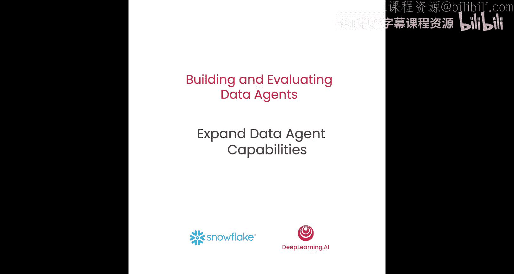
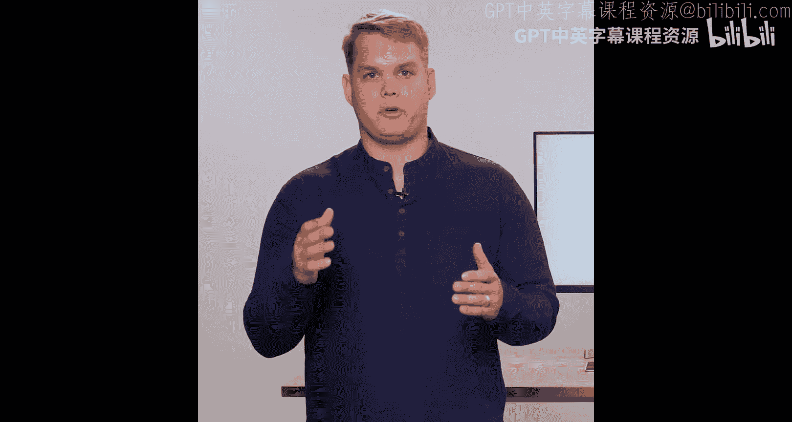
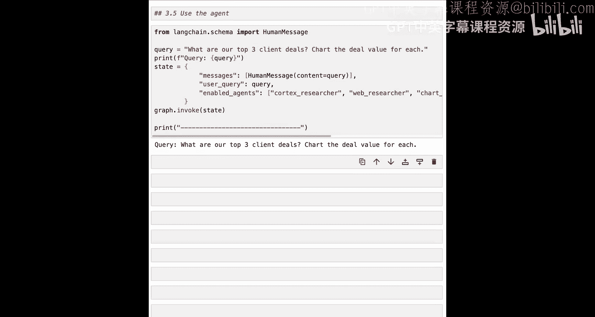
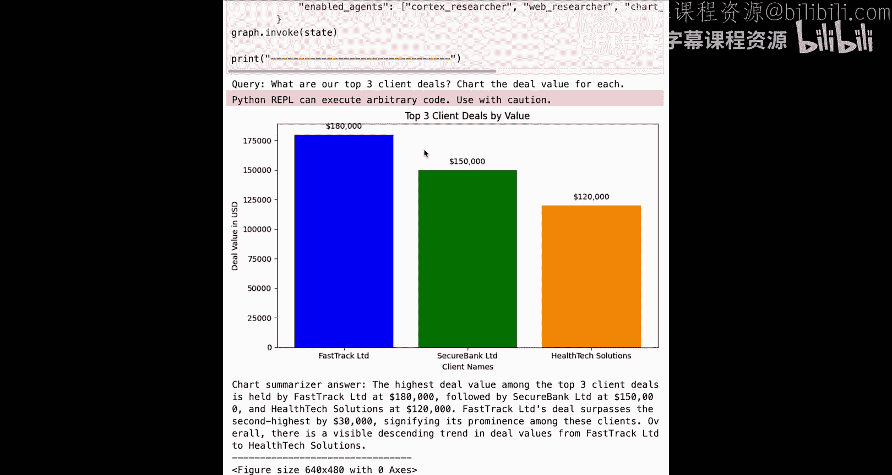
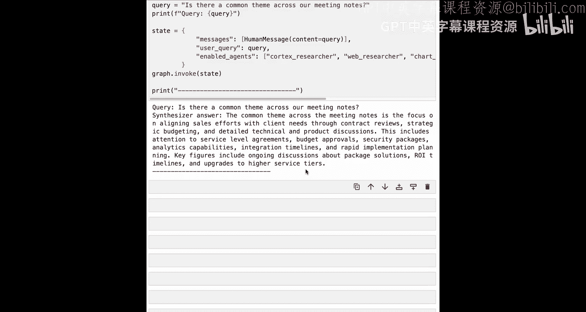

# 004：扩展数据代理能力

## 概述
在本节课中，我们将扩展数据代理的能力，使其能够从企业结构化和非结构化数据中检索上下文信息，以回答用户的查询。我们将通过添加一个新的子代理——Cortex Researcher Agent来实现这一目标，该代理将访问存储在Snowflake中的数据。

---

## 回顾上节课的架构
在上一节课中，我们构建了一个包含规划器（Planner）和执行器（Executor）的数据代理架构。网络研究员（Web Researcher）负责收集数据，然后我们通过图表生成器、图表总结器和综合器来响应用户。

## 引入新的数据检索代理
在本节中，我们将扩展数据代理的能力，使其能够检索数据。我们将通过添加Cortex Researcher Agent来实现这一点。

Cortex Researcher Agent将访问Snowflake，使用文档搜索工具检索非结构化数据，并使用“文本转SQL”工具检索结构化数据。该代理将配备两个与我们之前创建的任何代理都不同的工具。通过将此代理添加到我们的架构中，我们现在可以跨所有数据进行推理，提出需要结合内部和外部数据源信息的深度复杂问题。

现在，让我们开始构建。

## 设置环境与连接数据
我们首先在notebook中加载环境。环境变量包含访问LLM和进行网络搜索的权限，同时我们也可以连接Snowflake以从中检索数据。

在Snowflake中，我们已为您预加载了数据库中的数据，以便您理解结构化数据的外观以及如何检索此类数据，同时还加载了文档，以便您理解如何检索非结构化数据。此外，我们还创建了一个位于非结构化数据之上的搜索服务。

现在，让我们更仔细地查看这些数据。

### 连接Snowflake并查看结构化数据
我们将导入`snowpark`会话，这是我们使用刚刚提到的凭据连接到Snowflake的方式。导入后，我们可以直接用它执行SQL。

我们将首先使用一个已为您创建好的指定仓库，名为`sales_intelligence_warehouse`。您可以将其视为Snowflake用于执行查询的计算资源。

接着，我们将执行第二个查询，从`sales_metrics`表中选择前五行数据。重要的是，我们会添加`.collect()`来实际执行SQL。

执行SQL后，我们实际上看到了可以从该表获取的所有信息的详细信息。我们看到诸如交易ID、客户名称、交易价值、日期、是否赢得交易，甚至与交易相关的销售代表和产品线等信息。这就是我们的数据代理将访问的结构化数据。

### 查看非结构化数据
我们拥有的非结构化数据是会议记录。这些会议记录也存储在一个表中，因此我们可以再次使用`snowpark`会话进行查询。它们存储在`sales_con`表中，与`sales_metrics`表位于相同的模式中。

现在，我们可以查看一组会议记录的示例。在这个例子中，我们可以看到与Techcorp的会议是一次发现电话，围绕集成、时间线和复杂性进行了详细讨论。他们提出了许多技术问题，并提到了第二季度的预算分配。总结是，这是一次积极的接触，有明确的后续步骤。这是我们的数据代理将用来帮助回答问题的会议记录示例。

## 创建Cortex Researcher Agent
现在我们已经查看了数据，可以开始创建我们的Cortex代理了。

### 导入必要的库
我们将从导入一些需要的库开始：
*   从`snowflake`导入`Session`和`Route`，用于连接Snowflake中已为我们预建的工具。
*   从`langchain`和`langgraph`导入一些相同的组件。
*   从`Snowflake Cortex`导入`AgentRunRequest`，这是我们用来运行代理、访问工具并从Snowflake检索非结构化和结构化数据的方式。

### 了解代理可用的工具
Cortex代理可以访问的第一个工具是`cortex_analyst`。这是一个“文本转SQL”工具，它接收用户的查询，然后编写SQL来回答该问题。该服务依赖于一个语义模型，即数据实际含义的描述，包括列和表的含义、值的含义，以及查询此数据的人员常用的任何注释。所有这些信息都包含在语义模型文件中。我们已经为您创建了这个文件并加载到了Snowflake中，我们将在此处指定该文件的确切位置。

第二个工具是`search_service`。这是一个预建的检索器，位于Snowflake中那些我们刚刚查看过的非结构化会议记录之上。这是一个混合检索器，结合了语义搜索和关键词搜索以及重新排序，以从这些文档中返回相关的片段。就像语义模型文件一样，我们已经在Snowflake中为您创建了这个服务，并在此处简单地指向它。它位于`sales_intelligence`数据库的`data`模式中，服务名称为`sales_conversation_search`。

### 初始化并创建Cortex代理
现在我们已经定义了使用工具所需的关键资源，可以开始初始化和创建我们的Cortex代理了。

我们的Cortex代理将接受一个单一参数，即我们将在基于Pydantic的模型中定义的查询。

然后，我们创建Cortex代理的工具类。我们将提供工具的名称和描述（它应使用销售对话和指标来回答问题），并给出参数的模式，即我们刚刚创建的空间模型。

我们将使用`snowpark`会话初始化我们的Cortex代理工具，在该会话之上创建一个路由，然后访问位于该路由内的Cortex代理服务。

### 构建代理请求并定义执行方法
为我们的Cortex代理工具提供了必要的Snowflake连接后，我们可以开始构建请求。在`AgentRunRequest`中，包含了调用Cortex代理所需的所有信息。Cortex代理是一个无状态服务，可以访问数据工具，例如我们刚刚为搜索和“文本转SQL”创建的工具。

我们首先提供我们希望此代理使用的模型，告诉它使用`claude-3-5-sonnet`。然后，我们提供一个工具列表：`analyst`和`search`。接着，我们为每个工具提供执行和操作所需的工具资源。`analyst`将获取我们的语义模型文件，这是“文本转SQL”实际理解数据含义的方式。然后，`search`工具将获取Cortex搜索服务的名称，并提供一个我们希望返回的最大结果数量。最后，我们向代理提供一组消息，这里只是一条包含用户查询的单一消息。

构建请求后，我们定义一个辅助函数来消费流。然后，我们创建`run`方法。`run`方法将接收查询并开始执行，从我们的代理返回结果。`run`方法的第一步是构建请求（调用我们刚刚创建的函数），然后使用代理服务并实际运行我们刚刚构建的请求。

代理服务将返回一个事件流，如果我们需要访问结构化数据，此流将包含待执行的SQL；如果访问非结构化数据，它将返回一个响应以及一些引用。

为了消费这个流，我们需要提取所有这些数据。让我们编写一个快速的辅助函数来实现这一点，并将其放在`run`方法上方。`consume_stream`将接受流，然后返回文本、SQL和引用。对于非结构化数据，它将只返回文本（即响应）和引用；对于结构化数据，我们将获得文本（即重写的查询）以及待执行的SQL。

定义了该辅助函数后，一旦运行了代理服务，我们就可以实际执行SQL。我们将使用刚刚创建的方法消费流。然后，如果确实获得了SQL（在需要访问结构化数据的情况下），我们希望执行该SQL。为此，我们将首先使用仓库`sales_intelligence_warehouse`（就像我们在探索数据时那样），然后使用会话执行从代理服务生成的SQL。

### 包装代理并测试
为了初始化这个工具，我们将使用我们的`snowpark`会话实例化它。

我们将围绕这个工具创建一个ReAct代理，就像我们在上一课中所做的那样。这里的ReAct代理将再次使用`GPT-4`，并将其绑定到我们的工具`CortexAgentTool.do_run`。然后，我们给它一个最终提示，告诉它是研究员，将使用我们的Cortex研究员工具进行研究。一旦找到必要的信息，它将结束其输出，不再尝试采取进一步行动。

现在让我们测试这个代理。

首先，我们尝试一个访问结构化数据的问题：“我们的前三大客户交易是什么？”在后台，这个代理将把查询重写为真正可回答且可翻译成SQL的内容，然后执行该SQL以返回结果。现在，我们可以看到基于结构化数据的前三大客户交易。

接下来，尝试一个非结构化的例子。我们再次调用Cortex代理，但询问“健康科技销售流程的下一步是什么？”这需要来自那些非结构化会议记录的信息。在这里，我们得到了一个详细的答案，告诉我们销售流程中的三个后续步骤：进行广泛的技术深度探讨、提供文档并安排后续会议。这很棒。

## 将新代理集成到图中
现在我们已经创建了子代理，只需要用一个LangGraph节点包装它，这样它就准备好添加到我们的图中了。

为此，我们将从状态中提取代理查询，然后使用该代理查询调用我们的Cortex代理。我们将其添加到消息历史记录中，然后使用`command`转到执行器。这与我们在网络搜索中所做的类似，即返回执行器。

现在我们已经创建了额外的Cortex代理研究节点，我们准备将其添加到图中。我们在辅助方法中定义了所有其他节点，因此可以重用它们，并且它们的定义与之前相同。然后，我们将像之前一样实例化我们的状态图，并添加所有相同的节点，包括这个额外的节点——Cortex研究员。这是我们对该单元所做的唯一更改。

再次确认我们构建了预期的架构，我们可以绘制Mermaid图，并看到Cortex研究员现在已包含在我们的图架构中。

## 测试集成后的图
现在我们已经创建了图，让我们来测试一下。

第一个问题，我们期望使用结构化数据。我们将询问“前三大客户交易是什么？”，并要求它为每个交易绘制图表。我们期望这能使用Cortex代理中的结构化数据检索工具，同时也使用图表生成和图表总结功能。看起来我们已经收到了代理的响应。代理生成了图表，清晰地显示了前三大客户交易，Fast Track领先，其次是SecureBank和Health Tech Solutions。它还提供了一个文本响应，准确描述了数据和图表中的情况。

现在，让我们尝试一些更难的问题。第二个问题有点棘手。我们首先要求识别我们待处理的交易，研究它们是否可能经历任何监管变化，然后使用每个客户的会议记录，询问并提供考虑到这些监管变化的价值主张。这很像课程开始时Andrew展示的例子。

在这个例子中，我们提出了一个棘手的问题，需要访问关于交易的结构化数据、关于这些公司所在行业可能发生的监管变化的网络数据，以及会议记录访问权限以了解我们在每笔交易中的价值主张。在这里，我们收到了代理对此问题的响应。代理在推理这个复杂请求时未能成功，它提供了一些关于如何完成任务的信息，但无法提供我们所需的关键细节。在下一课中，我们将能够了解更多这里实际出错的地方。

第三个例子，我们询问了不同会议记录中的一个共同主题。这需要访问非结构化数据，综合器能够为我们提供一个主题：会议记录侧重于使销售工作与客户需求保持一致。

## 总结
在本节课中，我们一起学习了如何扩展数据代理的能力，通过添加Cortex Researcher Agent使其能够从Snowflake检索结构化和非结构化数据。我们查看了可用的数据，创建并配置了新的代理及其工具，将其集成为LangGraph中的一个节点，并测试了集成后的多代理工作流。在下一课中，您将使用追踪来真正理解代理执行时底层发生的情况，并开始使用您的首次评估，通过答案相关性、上下文相关性和忠实度来衡量代理的目标完成情况。