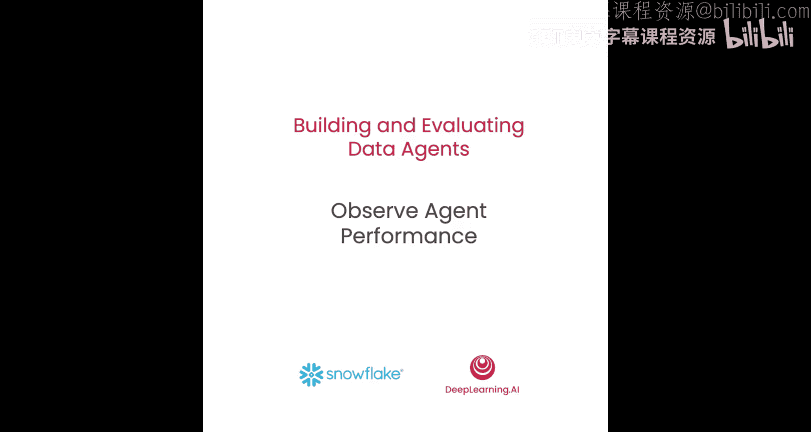
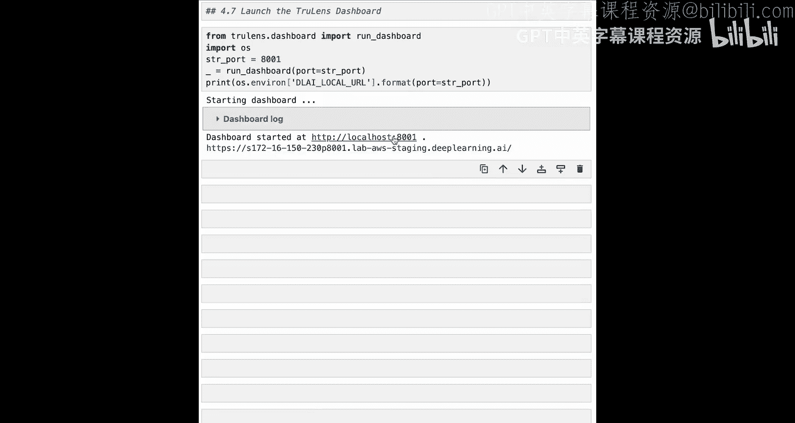
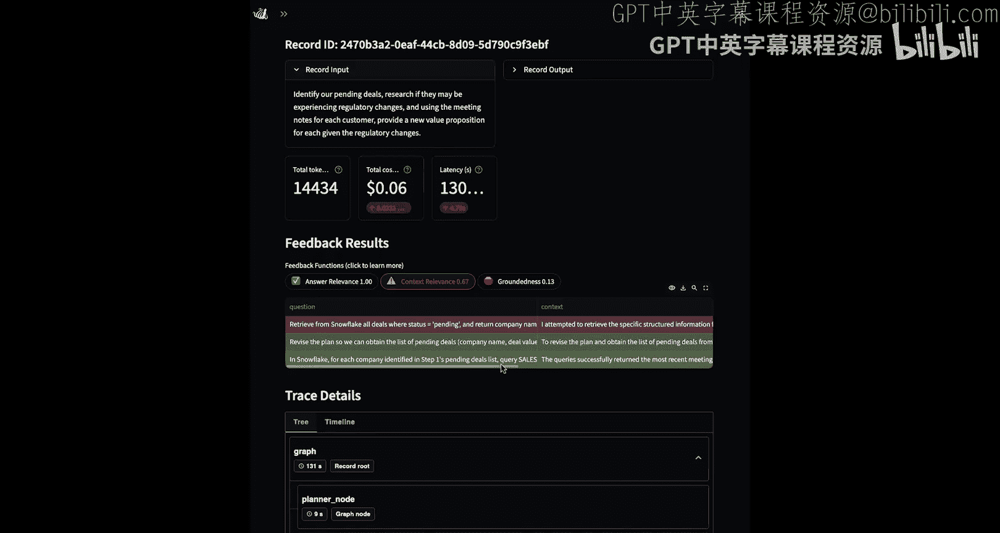
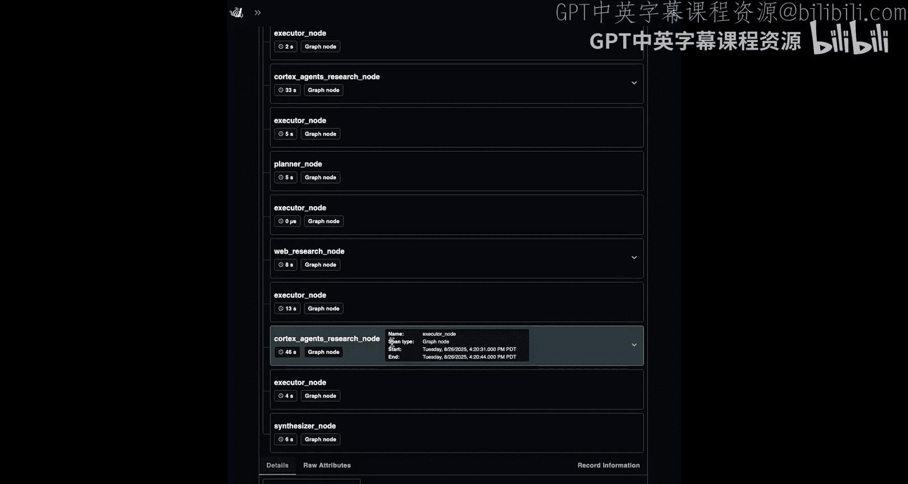
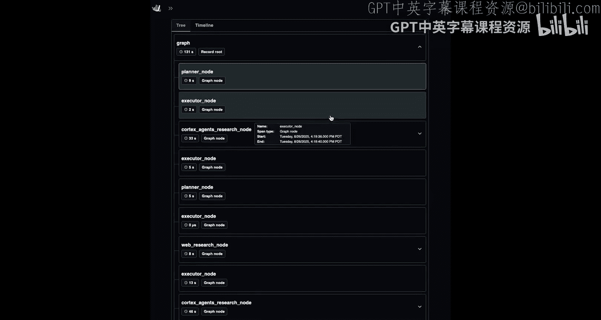
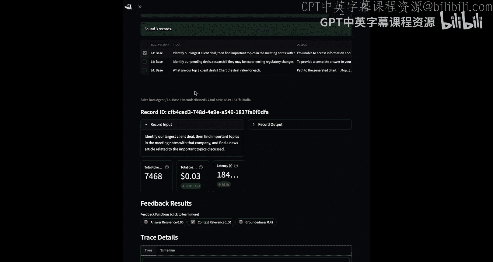

# 005：观察代理性能 📊

在本节课中，我们将学习如何追踪数据代理的执行步骤，并使用三个核心指标来评估其响应是否准确。我们将介绍RAG三元组的概念，并将其应用于数据代理的评估中。

## 概述

你已经准备好了一个可以运行的数据代理。接下来，我们需要追踪它为实现目标所采取的步骤，并评估其响应是否准确地回答了用户的查询。为此，我们将使用三个指标：上下文相关性、答案相关性和事实依据性，以此来评估目标完成情况。

现在，让我们开始编写代码。

## RAG三元组概念介绍

上一节我们介绍了评估的必要性，本节中我们来看看一个核心的评估框架：RAG三元组。

虽然RAG三元组最初是为RAG系统引入的，但它同样非常适用于数据代理。因为数据代理仍然包含相同的检索（或研究）步骤以及综合步骤，以实现其核心目标。

RAG三元组的工作原理如下：
1.  首先评估任何检索到的上下文的相关性。
2.  然后评估响应是否由该上下文支持。
3.  最后，检查响应是否与用户的查询相关。

现在，让我们看看如何将这些概念应用于数据代理。

## 将RAG三元组应用于数据代理架构

当我们查看数据代理的架构时，可以清晰地看到在黄色方框中，上下文来自何处。我们有从Cortex研究器和网络研究器检索到的上下文。这些就是我们需要用来评判响应的上下文。

我们需要确保语言模型的响应或综合步骤完全基于研究步骤中检索到的这些上下文（事实依据性指标）。在答案相关性指标中，我们仍在检查响应是否与查询相关。这是将输入到数据代理的用户查询与最终完成并返回给用户的响应进行比较。最后是上下文相关性。在这里，我们测量每个代理的子查询（发送给各个子代理的查询）以及从每个子代理检索到的上下文。我们将单独测量每个代理研究的上下文相关性，然后对所有不同研究器的结果进行聚合。

## 收集追踪信息

为了计算这些评估，我们需要从追踪中收集关键信息。追踪是我们跟踪代理为实现用户查询和目标所采取的每一步的方式。

以下是一个追踪的示例。在这个例子中，追踪从一个研究节点开始，进行了一些图表绘制和一些额外的研究。特别是对于数据代理，我们需要仔细关注检索步骤。这些步骤包含了我们将用于评估RAG三元组的关键数据，包括事实依据性和上下文相关性等指标。

在这里，我们将使用基于OpenTelemetry构建的追踪。OpenTelemetry是一个与语言无关的分布式追踪系统，它允许我们捕获代理为实现目标所采取的每一步。这些步骤也称为跨度，是代理正在执行的工作单元。这些跨度包括规划、路由、检索、工具使用和生成等步骤。我们将特别关注这些检索类型的跨度，因为它们包含了我们需要运行评估（如上下文相关性和事实依据性）的关键数据，这也是本节课的重点。

## 定义评估指标

现在，让我们进入笔记本，开始定义这些指标。

我们在笔记本中要做的第一件事是导入环境。和之前一样，这包含了连接Snowflake的关键凭证，以及调用语言模型和进行网络搜索的密钥。在这个笔记本中新增的是，我们将通过这里的环境变量启用TruLens的追踪。

现在，我们可以开始定义我们的指标了。这里使用的指标依赖于“语言模型作为评判者”。我们将使用GPT-4作为这个评判任务的语言模型。为了调用这个语言模型评判者，我们将使用TruLens。具体来说，我们将使用TruLens中的OpenAI提供程序。

现在我们可以定义事实依据性指标。

为了开始定义我们的第一个反馈函数，我们首先导入`Feedback`类。`Feedback`类是我们用来构建反馈函数或评估器的工具。然后我们导入`Select`。`Select`是我们用来从追踪中关注特定跨度的方法，这包括检索到的上下文和查询文本等。

事实依据性函数接受两个关键输入：代理的最终答案（输出）以及从任何研究步骤中检索到的上下文。检索到的上下文将通过`Select.RecordCalls`语句来识别。然后，最终答案将通过`Select.RecordOutput`来识别。`Select.RecordCalls`和`Select.RecordOutput`是我们将跨度中的关键数据传递到反馈函数中的方式。

稍后在笔记本中，我们将探讨如何实际为你的代理添加追踪。这就是我们将指标与追踪连接起来的方法。现在，我们先从定义反馈函数开始。

## 定义答案相关性

既然我们已经定义了事实依据性，接下来可以继续定义答案相关性。答案相关性衡量数据代理产生的最终答案与原始用户查询的相关性。

我们将再次使用相同的语言模型评判者，并通过思维链推理来指定反馈函数。这意味着语言模型评判者将在给出分数之前进行推理。

答案相关性的两个输入是查询和最终答案（输出）。这些同样使用`Select.RecordInput`和`Select.RecordOutput`来指定。

## 定义上下文相关性

我们将定义的最后一个指标是上下文相关性。上下文相关性将接受两个输入来计算每个上下文块的相关性。第一个是查询文本，这里指的是发送给每个独立代理的各个子问题。第二个输入是检索到的上下文，即每个子代理产生的研究结果。

构建这个反馈函数后，我们还会选择对其进行聚合。这意味着我们将对不同研究步骤计算出的每个上下文相关性指标取平均值。

## 创建TruLens会话

定义好指标后，我们可以创建TruLens会话，以便开始记录追踪和评估。我们将导入`Tru`会话，它将保存我们与日志数据库的连接。我们还将导入`DefaultDBConnector`，这是我们用来指定连接到特定数据库的方式。这里我们连接到一个位于模块中的SQLite文件。该数据库将在我们运行代理时存储追踪和评估。

我们要做的最后一件事是通过实例化`Tru`会话并重置数据库来创建日志会话，以清除之前运行中的任何旧追踪或评估。

## 为代理添加追踪

现在，我们可以开始使用TruLens为我们的代理添加追踪。我们将自动跟踪和记录整个代理的信息，从规划到执行器再到工具调用。我们还将添加额外的自定义检测，以便专门标注我们关心的检索步骤中的信息，并将输入插入到我们的评估器中。

为此，我们将从之前的课程中导入许多熟悉的方法，包括Cortex代理、状态以及来自LangGraph和类型标注的各种类型。这里新增的是从TruLens导入`instrument`装饰器。这就是我们添加自定义检测的方式。

完成这一步后，我们将复制之前已经创建的相同Cortex代理研究节点，并准备为其添加检测。

添加检测只需在这个方法上方添加一个`@instrument`装饰器。我们将在上面创建一个新行，然后添加我们的检测。

我们要做的第一件事是将跨度类型设置为`retrieval`。这表明Cortex代理的研究节点正在执行检索任务，添加该跨度类型会为该跨度标注“检索”类型。然后，我们将指定我们关心的确切属性。

提醒一下，我们需要从研究节点获取的关键信息是查询文本（发送给该子代理的确切子问题）和检索到的上下文（代理产生的研究结果）。我们可以使用函数的返回值和任何参数或关键字参数来访问这些信息。`Ret`代表函数的返回值，`Args`代表函数的输入参数，在这里是`state`。

我们先讨论查询文本。我们将通过查看函数的第一个参数（索引0）来获取查询文本，在这里是`state`。然后，我们获取`agent_query`，它是`state`中的一个键。因此，综合起来，我们将查询文本设置为在研究节点被使用时，`state`中的`agent_query`。

然后我们可以讨论检索到的上下文。检索到的上下文从函数的返回值中提取。这里我们想关注消息，特别是该研究节点被调用时产生的最后一条消息，并从中提取内容。因此，综合起来，我们将检索到的上下文跨度属性分配给研究节点产生的最后一条消息，并通过这种方式获取其内容。

通过这种检测，我们将拥有开始评估代理所需的所有数据。

对于网络搜索节点，我们希望应用相同的过程。我们将采用现有的节点，并通过在其上方添加`instrument`装饰器来添加检测。我们将设置与之前相同的跨度类型`retrieval`，并设置完全相同的跨度属性`query_text`和`retrieved_context`。

## 重建图并注册代理

现在我们已经为研究节点添加了额外的检测，我们可以用这个新增的检测来重建图。

我们将再次从LangGraph导入`StateGraph`和`START`。我们将从辅助函数中导入在之前课程中创建的每个节点。此外，我们还将添加我们刚刚用新检测重新创建的新的网络研究节点和Cortex代理研究节点。

重建图之后，我们可以将代理注册到TruLens。为此，我们将使用TruLens中一个特定于LangGraph的包装器，称为`TruGraph`。`TruGraph`为LangGraph的节点和任务API提供了自动检测，因此我们可以捕获图中每个节点的输入和输出，以及每个节点的名称。通过这种方式，即使没有我们之前添加的额外检测，我们也能理解代理的整个追踪。而额外检测带给我们的好处是，现在我们有了明确的标签来标识哪些步骤是检索步骤，并且我们还处理了进出这些节点的数据，以专门提取传入的代理查询和传出的检索文本。如果没有这种额外的处理，这些信息将被埋藏在复杂的数据结构中，评估起来会困难得多。

现在，让我们注册我们的代理。除了添加检测，注册代理还允许我们跟踪关键元数据，如应用程序名称和应用程序版本。这使我们能够区分不同的版本或应用程序，以便在做出更改时比较性能。我们还将指定我们希望与此代理关联的评估列表，这里我们将使用之前在笔记本中定义的RAG三元组。

## 运行代理并查看结果

现在，我们可以再次开始使用我们的代理，但这一次，我们将记录它的每一个动作。在这里，我们将输入三个连续的查询，开始询问代理并使用其新技能。同时，我们也将通过追踪和评估来测量其性能。

在第一个问题中，我们再次询问：“我们的前三大客户交易是什么？”并要求它绘制结果图表。在第二个问题中，我们试图识别我们的待处理交易，研究监管变化，并为每个交易考虑一个新的价值主张。在最后一个查询中，我们将要求它识别我们最大的客户交易，从会议记录中查找相关的重要主题，然后为每个主题查找新闻文章。

我们将所有三个查询提交给我们的代理，并等待它响应。

第一个代理已经响应。它给了我们一个漂亮的图表，以图表形式显示了按价值排名的前三大客户交易。然而，图表摘要再次未能给出一个漂亮的文本答案。

现在，我们的第二个代理已经响应。它成功地识别了一些公司，并研究了它们的价值主张以及会议记录的重点内容。但据我所知，它未能将其过滤到仅包含待处理交易。

当我们探索TruLens仪表板时，将能够更具体地了解该查询到底出了什么问题。

现在，代理已经响应了第三个查询。代理无法访问关于最大客户交易的信息，因为它在访问Snowflake时遇到了问题。

## 查看仪表板进行诊断

现在，让我们进入仪表板，以便准确诊断这些不同查询出了什么问题。

为了启动仪表板，我们将从TruLens导入`run_dashboard`。我们还将指定一个特定的端口来运行它，并运行`run_dashboard`来启动仪表板。

仪表板将读取我们在本笔记本运行期间写入数据库的追踪和评估数据。我们将能够探索追踪，查看它们如何与评估相关联，并真正深入地理解到底出了什么问题，识别代理的不同故障模式。

运行`run_dashboard`后，我们会看到两个链接。请点击第二个，因为它是在深度学习环境中运行的。如果你在本地运行，可以使用这个本地主机链接。

现在我们已经打开了TruLens仪表板，可以开始检查我们的代理性能了。

为了扩大视野，我们可以通过选择左上角的双箭头来最小化左侧窗格。在排行榜中，我们可以看到按应用程序版本汇总的不同评估指标。这里我们开始时只有一个应用程序版本，即我们在笔记本中设置的“L4_base”。我们看到我们的应用程序（或代理）的答案相关性得分和事实依据性得分都很低。

让我们点击版本本身以进行更多探索。为此，我们将选择要检查的版本旁边的复选框，然后选择“检查记录”。

现在我们可以看到提交给该特定版本代理的每个查询。让我们逐一检查每个查询。

当我们询问前三大客户交易是什么并绘制每个交易的价值时，我们看到了图表的输出，但它实际上并没有总结图表。我们可以检查评估指标，看看语言模型评判者是如何以编程方式识别故障模式的。

查看答案相关性，我们看到答案相关性得分为0。响应与用户查询完全不相关，因为它没有提供文本答案。我们也可以在这里的语言模型评判者解释中看到这一点。我们还可以检查其他指标，如上下文相关性，并看到代理所做的研究都没有返回回答查询所需的相关结果。

现在，让我们看一下第二次执行。这里，与其关注冗长的输出，不如先看看评估分数。这次我们看到答案相关性得分很高。虽然响应是相关的，但它实际上并没有基于研究结果。我们看到了事实依据性得分低的问题。语言模型所做的许多陈述实际上并没有得到研究结果的支持，而是语言模型做出的推断。造成这种情况的原因是研究步骤检索到的一些上下文并不相关。

在这里，我们也可以查看追踪的细节，以便真正理解代理采取的不同步骤。当我们向下滚动到追踪时，追踪一开始是完全展开的，因此我们可以通过点击树形结构中的箭头来最小化，以获得更清晰的视图。

完成这一步后，我们可以清楚地看到代理所采取的路径。代理从规划器开始，然后移动到执行器，接着使用了Cortex代理的研究节点。然后在这里进行了重新规划，进行了第二次网络研究、第二次Cortex代理研究，最后移动到综合器。如果我们想进一步探索，实际上可以通过点击节点本身并向下滚动来检查节点的输入和输出。

你也可以检查第三个查询的细节。根据代理的性能，你可能会看到不同的评估指标数值，如果代理在你运行时选择了不同的行动方式。

## 总结

在本节课中，我们一起学习了如何为数据代理添加追踪和评估。我们介绍了RAG三元组（上下文相关性、答案相关性、事实依据性）的概念，并利用TruLens框架实现了对代理每一步执行过程的监控和量化评估。通过分析仪表板中的追踪数据和评估分数，我们能够诊断代理在回答不同查询时出现的具体问题，例如未能提供文本摘要、回答缺乏事实依据或检索到不相关的上下文。这为我们后续优化代理的行为和性能提供了重要的数据支持。