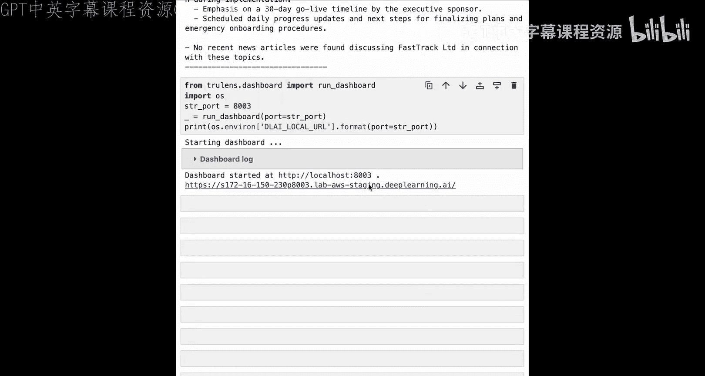
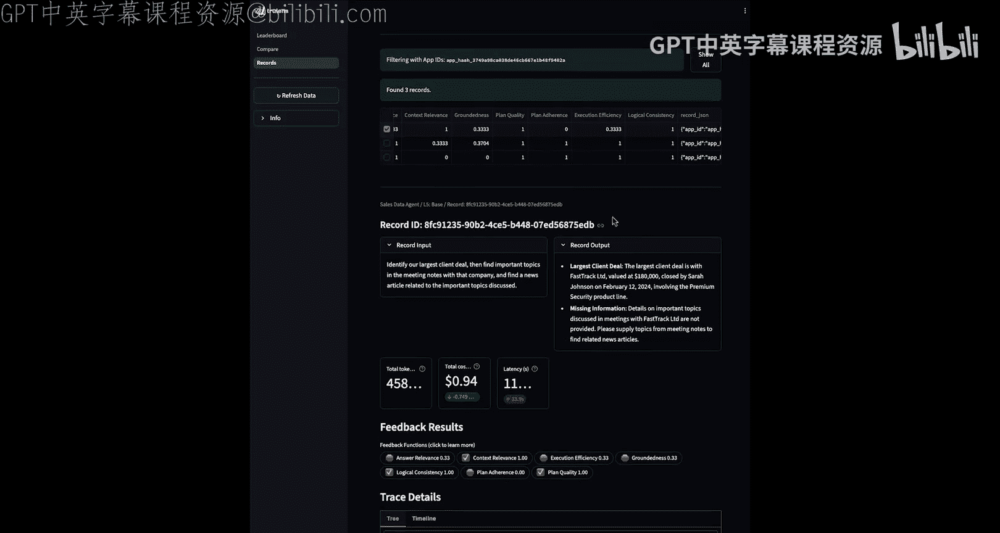
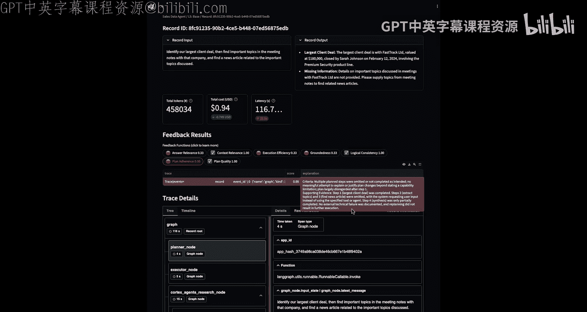
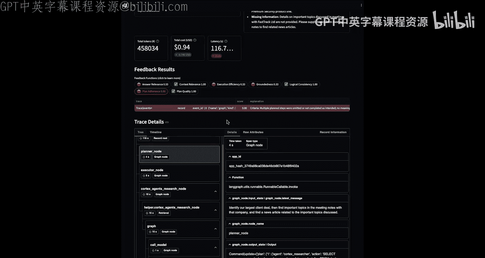
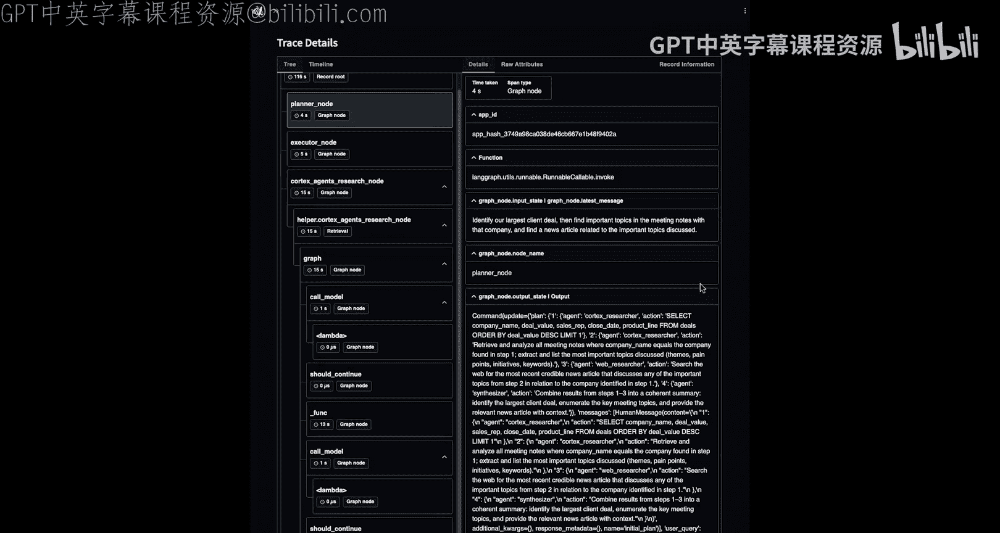
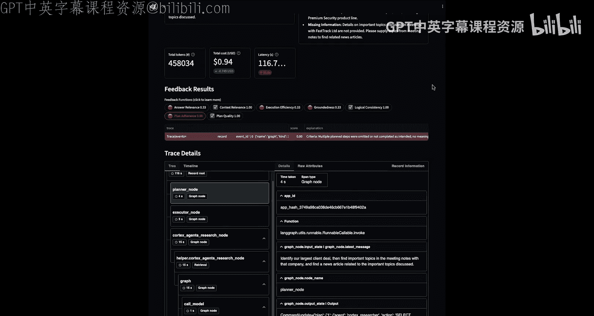

# 006：衡量代理的GPA 🎯

在本节课中，我们将学习如何评估你的数据代理的“目标-计划-行动”是否协调一致。我们将介绍四种具体的评估方法，并通过代码示例展示如何实施这些评估，以帮助你识别代理的强项和改进空间。

## 概述

上一节我们介绍了数据代理的基本概念。本节中，我们将深入探讨如何衡量代理的“目标-计划-行动”协调性。我们将学习四种评估方法：**计划质量**、**计划遵循度**、**执行效率**和**逻辑一致性**。每种评估都将通过一个简单的示例来说明其工作原理和能发现的典型问题。

## 1. 计划质量评估

计划质量评估衡量代理制定的计划是否能有效达成目标。它关注目标与计划之间的交集。

以下是定义和运行计划质量评估函数的步骤：

```python
# 定义计划质量评估函数
plan_quality_feedback = Feedback(
    plan_quality,
    name="Plan Quality"
).on_input_output()

# 设置评估模型
plan_quality_feedback.provider = OpenAI(model="gpt-4-1106-preview")

# 运行评估
plan_quality_result = plan_quality_feedback.run(
    goal=user_query,
    plan=agent_plan,
    trace=full_execution_trace
)
```

**评估结果示例**：
*   **得分**：0.66（满分1.0）
*   **发现的问题**：
    1.  选择标准模糊（例如，“过去12个月的所有销售线索”缺乏紧迫性约束）。
    2.  优先级排序方法薄弱（例如，仅选择“最大的20个”而忽略了线索评分、阶段紧迫性或截止日期）。
    3.  可操作性不足（未指定具体的下一步行动或负责人）。
    4.  输出不具体（单一的表格，缺少与目标关联的必要字段）。

通过改进计划（例如，增加紧迫性过滤条件、多维度排序、指定具体行动项），我们可以将计划质量得分提升至1.0。

## 2. 计划遵循度评估

计划遵循度评估衡量代理实际执行的动作是否遵循了它自己制定的计划。

以下是定义和运行计划遵循度评估函数的步骤：

```python
# 定义计划遵循度评估函数
plan_adherence_feedback = Feedback(
    plan_adherence,
    name="Plan Adherence"
).on_input_output()

# 设置评估模型
plan_adherence_feedback.provider = OpenAI(model="gpt-4-1106-preview")

# 运行评估
adherence_result = plan_adherence_feedback.run(
    plan=agent_plan,
    trace=full_execution_trace
)
```

**评估结果示例**：
*   **得分**：0.0（当动作严重偏离计划时）
*   **发现的问题**：
    1.  多个计划步骤被省略。
    2.  步骤执行顺序错乱或被未计划的动作替代。
    3.  未对计划变更或新动作做出解释或记录。

当代理的动作严格遵循计划时，计划遵循度得分可以达到1.0。

## 3. 执行效率评估

执行效率评估衡量代理的执行轨迹是否高效，即是否为达成目标的最优路径。它会标记冗余或不必要的步骤。

以下是定义和运行执行效率评估函数的步骤：

```python
# 定义执行效率评估函数
exec_efficiency_feedback = Feedback(
    execution_efficiency,
    name="Execution Efficiency"
).on_input_output()

# 设置评估模型
exec_efficiency_feedback.provider = OpenAI(model="gpt-4-1106-preview")

# 运行评估
efficiency_result = exec_efficiency_feedback.run(trace=full_execution_trace)
```

**评估结果示例**：
*   **得分**：0.66
*   **发现的问题**：
    1.  存在冗余的数据检索（多次应用相同的过滤器）。
    2.  不必要的输出格式重复（例如，同时导出为XLSX和CSV格式）。

## 4. 逻辑一致性评估

逻辑一致性评估在目标、计划和行动的交集中寻找矛盾。它检查代理在推理、规划步骤或执行步骤中是否存在逻辑不一致。

以下是定义和运行逻辑一致性评估函数的步骤：

```python
# 定义逻辑一致性评估函数
logical_consistency_feedback = Feedback(
    logical_consistency,
    name="Logical Consistency"
).on_input_output()

# 设置评估模型
logical_consistency_feedback.provider = OpenAI(model="gpt-4-1106-preview")

# 运行评估
consistency_result = logical_consistency_feedback.run(trace=full_execution_trace)
```

**评估结果示例**：
*   **得分**：0.33
*   **发现的问题**：
    1.  步骤间数据矛盾（例如，步骤1报告96条线索，步骤2报告13条，且无解释）。
    2.  使用的排名逻辑（如“最小参与度”）理由不充分。
    3.  决策依据（如“活跃的下一步行动”）未作说明。

## 5. 在完整数据代理上运行评估

现在，我们将这四种GPA评估应用到我们在第4课构建的完整数据代理上，并查看其在真实查询中的表现。

以下是注册代理并添加GPA评估的代码：

```python
# 构建代理图
app = create_data_agent_graph()



# 使用TruLens注册代理，并添加评估项
tru_app = Tru(
    app,
    app_id='Data Agent',
    feedbacks=[
        # RAG三元评估（目标完成度）
        answer_relevance,
        context_relevance,
        groundedness,
        # GPA评估
        plan_quality_feedback,
        plan_adherence_feedback,
        exec_efficiency_feedback,
        logical_consistency_feedback
    ]
)

# 运行代理并记录评估结果
for query in test_queries:
    with tru_app as recording:
        response = app.invoke(query)
```

**评估结果分析**：
通过TruLens仪表板，我们可以查看代理在多个查询上的平均表现：
*   **计划质量**和**逻辑一致性**通常表现良好。
*   **计划遵循度**和**执行效率**有较大的改进空间。
*   **RAG三元评估**（答案相关性、上下文相关性、真实性）的得分也有提升余地。

我们可以深入查看单个查询的记录，分析LLM评估者给出的具体反馈，例如，找出计划在哪个步骤被偏离，或者执行中出现了哪些冗余操作。

## 总结







本节课中，我们一起学习了如何衡量数据代理的“目标-计划-行动”协调性。我们介绍了四种核心评估方法：
1.  **计划质量**：评估计划本身对目标的达成度。
2.  **计划遵循度**：评估执行动作对计划的遵循程度。
3.  **执行效率**：评估执行轨迹是否高效、无冗余。
4.  **逻辑一致性**：评估整个推理和执行过程中是否存在逻辑矛盾。





通过代码示例，我们看到了如何定义这些评估函数，并将其应用于代理的执行轨迹上。最后，我们在一个完整的数据代理上运行了这些评估，并通过仪表板分析了结果，识别了代理的优势和待改进的领域。在下一课中，我们将学习系统性的技术来提升代理的GPA表现，以解决本节中发现的问题。