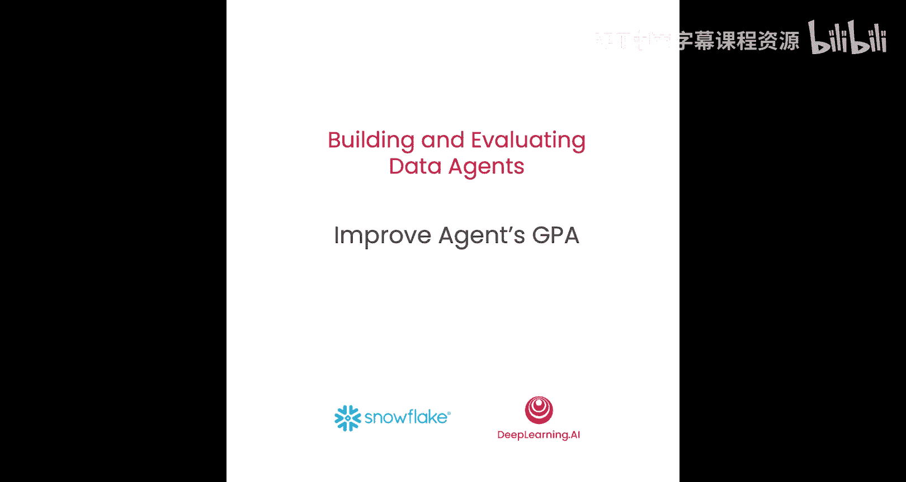
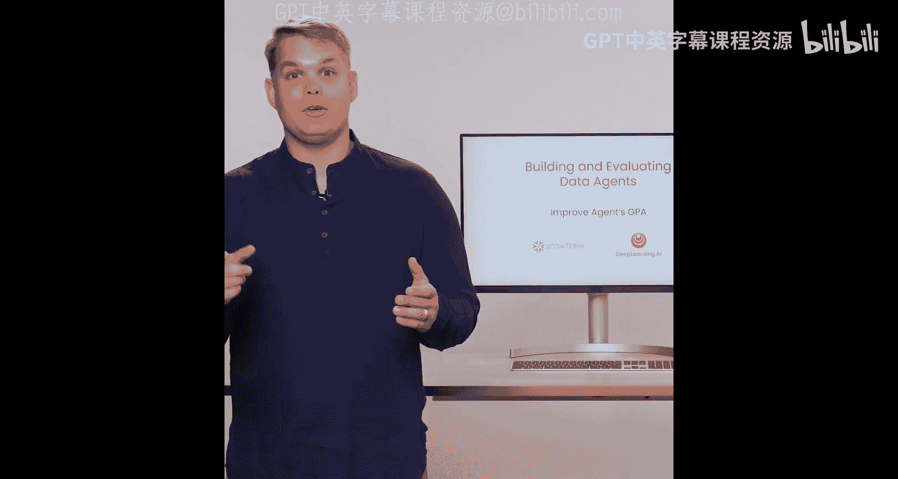
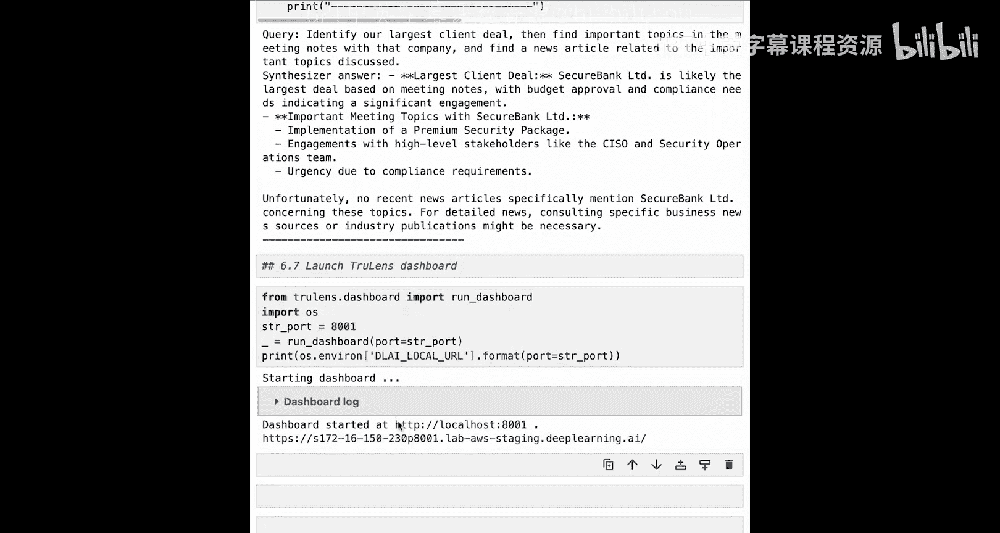
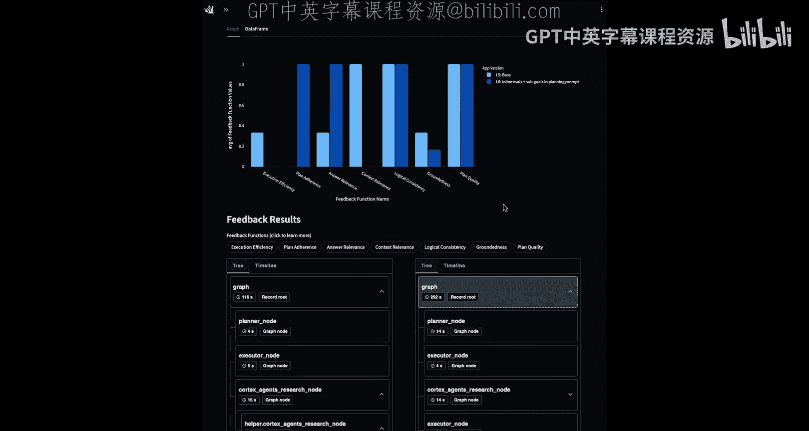
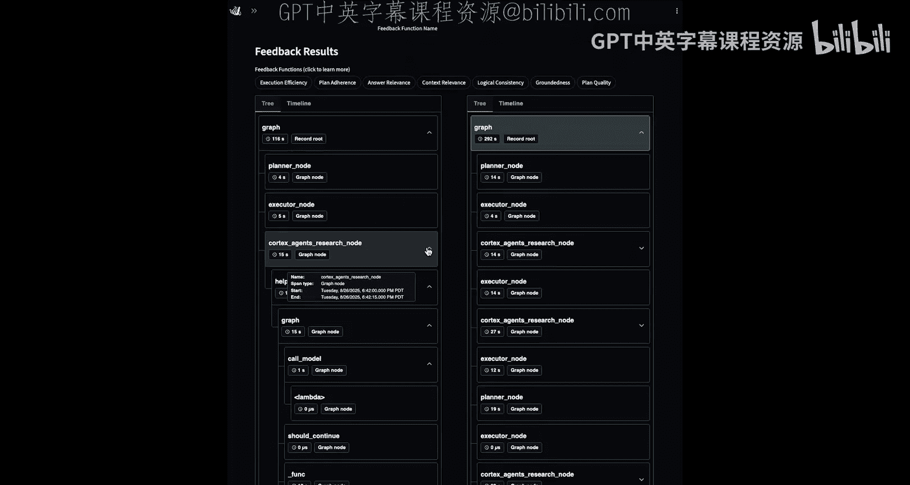
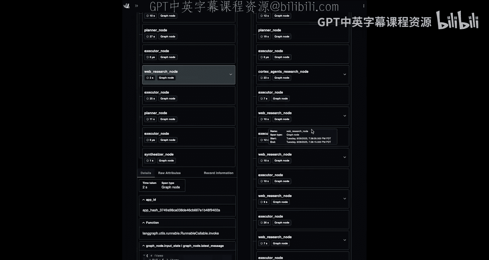
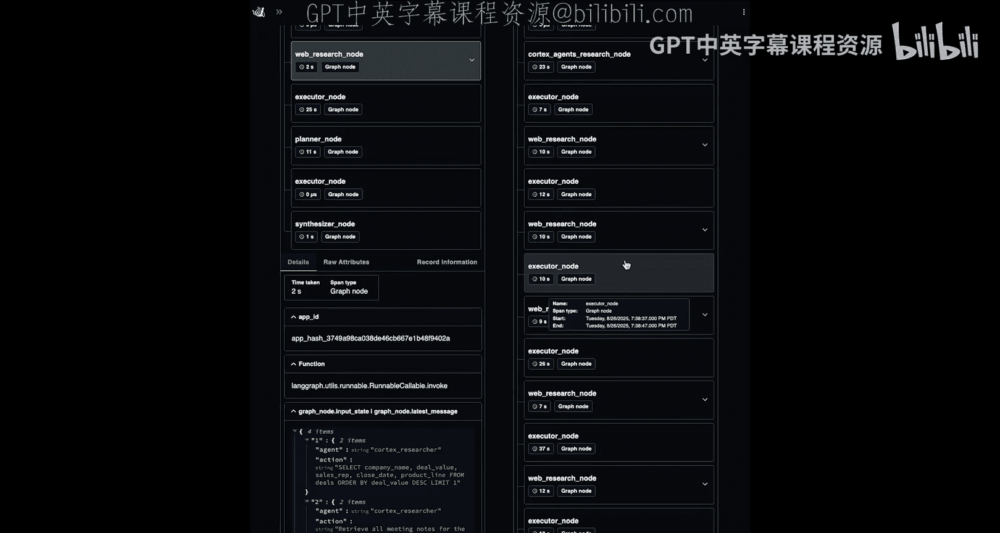
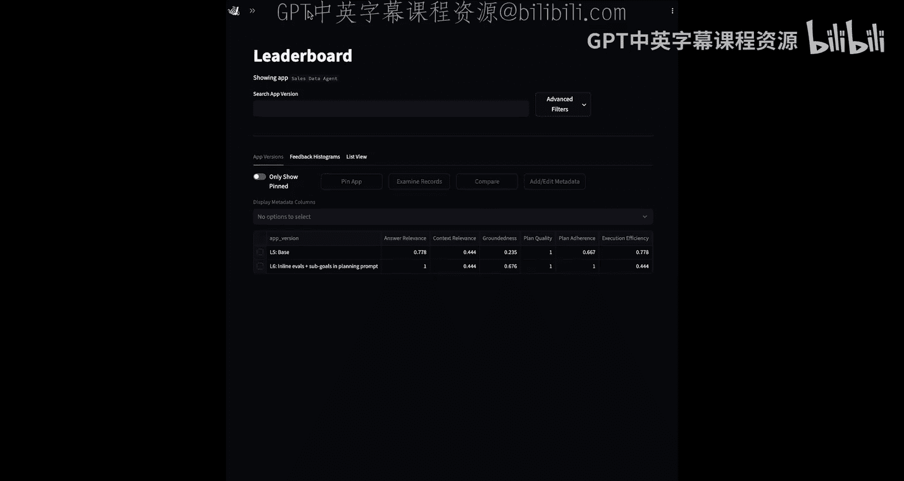

# 007：提升代理的GPA 🚀



在本节课中，我们将学习如何诊断并提升数据代理的性能。具体来说，我们将聚焦于如何通过调整提示词、引入内联评估等方法来改善代理的“目标-计划-行动”一致性，从而提升其GPA。

上一节我们介绍了如何识别代理性能中的明确失败模式。本节中，我们来看看如何通过一些常见方法来提升代理的GPA。

## 提升代理性能的常见方法

以下是几种提升代理性能的常见策略：



*   **调整提示词**：例如，可以修改规划提示词，使其包含明确的子目标、前置条件和后置条件。这样，代理的每一步计划都会非常明确地指出需要完成什么。
    *   **公式/代码示例**：`更新后的规划提示 = 基础提示 + “请为每一步添加：前置条件、后置条件、目标描述”`
*   **引入内联评估**：内联评估提供实时反馈，让代理能够理解其执行效果。例如，在执行研究步骤后，代理执行器可以获得一个评估分数和解释，以判断研究是否遗漏了关键细节，然后利用这些信息来选择下一步行动。
*   **优化检索器或尝试不同模型**：通过调整检索器参数或更换基础模型来提升性能。
*   **通过离线评估验证改进**：任何改进都应在独立的离线评估中进行验证，以确保其有效性。

现在我们已经了解了提升代理GPA的一般流程，接下来让我们回到Notebook中，将这些方法付诸实践。

## 在Notebook中实施针对性改进

在上节课中，我们分析了代理的具体表现，并识别出一个关键失败节点：**计划遵循度不足**。代理的行动没有遵循规划器制定的计划。

在本Notebook中，我们将逐步演示如何进行针对性修改以提升代理的GPA。

### 第一步：设置环境与启用追踪

和之前一样，我们首先导入环境并开启TruLens追踪。

```python
# 导入环境并开启TruLens追踪
import os
from trulens_eval import Tru
tru = Tru()
tru.run_dashboard() # 启用仪表盘
```

### 第二步：实施第一个针对性更改——内联评估

为了添加内联评估，我们需要导入一些必要的组件。

```python
# 导入相关组件
from trulens_eval import Feedback, TruLlama
from trulens_eval.tru_custom_app import instrument
from typing import Dict, List
# 从helper文件中导入我们之前设置好的代理、状态和评估函数
from helper import cortex_agent, State, context_relevance_feedback
```

接下来，我们将导入一个新的关键组件：**内联评估装饰器**。这里我们使用一个LangGraph特定的装饰器，因为它需要与LangGraph的状态进行交互，但这个概念是通用的。

**核心概念**：内联评估是一种在代理执行某个步骤或行动后立即进行评估，并将反馈结果存入代理记忆的方法。这样，代理就能利用这些反馈来改进其后续行动，并在必要时重新规划。

添加内联评估非常简单，只需在已插桩的节点上添加一个装饰器。我们从Cortex代理的研究节点开始。

```python
# 对Cortex代理的研究节点添加内联评估
@instrument
def cortex_research_node(state: State):
    # ... 原有的研究节点逻辑 ...
    return {"research_results": results}

# 添加内联评估装饰器
@TruLlama.inline_eval(feedback=context_relevance_feedback)
@instrument
def cortex_research_node_with_eval(state: State):
    # 这是同一个研究节点，现在被装饰了
    return cortex_research_node(state)
```

这个内联评估装饰器接受一个我们想要对研究节点运行的反馈函数（评估器）。评估将在研究节点执行后立即运行，并针对反馈函数定义中指定的跨度属性进行计算。评估结果（包括分数和解释）将被添加回代理的状态中（通过更新状态中的消息），供代理后续使用。

我们对网络搜索节点也进行同样的操作。

```python
# 对网络搜索节点添加内联评估（过程完全相同）
@TruLlama.inline_eval(feedback=context_relevance_feedback)
@instrument
def web_search_node_with_eval(state: State):
    # 原有的网络搜索节点逻辑
    return web_search_results
```

### 第三步：实施第二个针对性更改——更新规划提示词

我们想要更新规划提示词，具体是指示规划语言模型为代理计划中的每一步添加**明确的前置条件、后置条件和目标描述**。增加这些明确的细节有助于执行器理解每一步的目标，从而改善工具调用和代理决策。

我们通过修补计划提示词来实现这一更改。

```python
# 更新规划提示词模板
updated_plan_prompt_template = """
... 原有的提示词内容 ...
请为计划中的每一步生成以下内容：
- 步骤名称: {step_name}
- 行动: {action}
- **前置条件**: 执行此步骤前必须满足的条件。
- **后置条件**: 此步骤成功执行后预期达到的状态。
- **目标描述**: 此步骤旨在实现的具体目标。
...
"""
# 在运行时，这个模板将被填充并用于规划节点
```

我们所做的是扩展了给规划语言模型的输出模板。除了步骤名称和行动，我们还要求它包含明确的前置条件、后置条件和目标描述。

### 第四步：重建图并注册新版本代理

现在我们已经完成了两项针对性更改，接下来用新增的内联评估和更新后的计划来重建图。

```python
# 使用更新后的节点重建图
graph = create_agent_graph(
    cortex_researcher=cortex_research_node_with_eval,
    web_researcher=web_search_node_with_eval,
    # ... 从helper导入其他节点 ...
)
# 连接到日志数据库（该数据库已包含上一节课的结果）
tru.connect_database("path_to_database.db")
```

连接到数据库后，我们需要**注册新版本的代理**。这允许我们将新版本的结果与旧版本进行直接比较。

```python
# 注册新版本代理
app_version = "v2_inline_eval_updated_plan" # 描述性版本名，说明所做的更改
tru.register_app(
    name="data_agent_app",
    version=app_version,
    app=graph
)
```

### 第五步：重新测试代理并分析结果



使用相同的查询集重新运行代理。

```python
test_queries = ["查询1", "查询2", "查询3"]
for query in test_queries:
    result = graph.run(query)
    print(result)
```



运行完成后，我们可以打开TruLens仪表盘来深入分析代理性能。

## 在仪表盘中比较与分析

在仪表盘的排行榜视图中，我们可以比较不同代理版本的综合指标。我们可以看到：
*   答案相关性有所提升。
*   上下文相关性保持不变。
*   事实依据性有显著改善。
*   计划遵循度得到提升。
*   执行效率和逻辑一致性略有下降（这是为了更高目标完成度所做的权衡）。

最有趣的是直接比较同一记录在不同代理版本下的表现。我们可以并排查看两个版本的追踪轨迹。

**比较追踪轨迹**：在改进后的版本（右侧）中，追踪轨迹更长，包含了更多的网络搜索和Cortex研究调用。这些额外的研究步骤是由内联评估所识别出的信息缺口触发的，并且代理的行动也在与计划中列出的子目标进行比对。



**比较评估指标**：以“计划遵循度”为例。
*   **基础版本（左）**：得分很低（例如0分），因为代理省略了原始计划中的多个步骤。
*   **改进版本（右）**：得分为1（满分）。评估解释显示：“计划中的每一步都被执行并完成，特别是重新计划中的每一步。任何因外部数据访问限制而产生的偏差都得到了明确说明。没有步骤被跳过或忽略，所有偏差都有合理解释。计划被尽可能紧密地遵循。”





通过同时观察代理的追踪轨迹和比较评估指标，我们可以清晰地看到在迭代和修改过程中代理性能的差异。

改进版本中增加的内联评估正在帮助引导代理成功完成目标。我们在这里做了一个权衡：**牺牲了一些执行效率，以换取更高的目标完成度**。我们明确地选择基于评估结果进行额外研究，这甚至可以直接在追踪轨迹中展开研究节点看到评估的发生。

## 总结

本节课中我们一起学习了如何通过系统性的方法来提升数据代理的GPA。我们主要探讨了两个核心的改进策略：
1.  **引入内联评估**：为关键节点（如研究、搜索）添加实时反馈机制，使代理能动态调整其行动。
2.  **优化规划提示词**：通过要求规划器为每一步定义明确的前置条件、后置条件和目标，来增强“目标-计划-行动”的一致性。

我们通过Notebook实践了如何实施这些更改，并使用TruLens仪表盘对新旧版本进行了可视化比较，从而验证了改进措施的有效性。实践表明，本课程所探讨的围绕评估、追踪和谨慎迭代的技术，确实有助于使代理变得更加可靠。



恭喜你完成了本课程的学习！