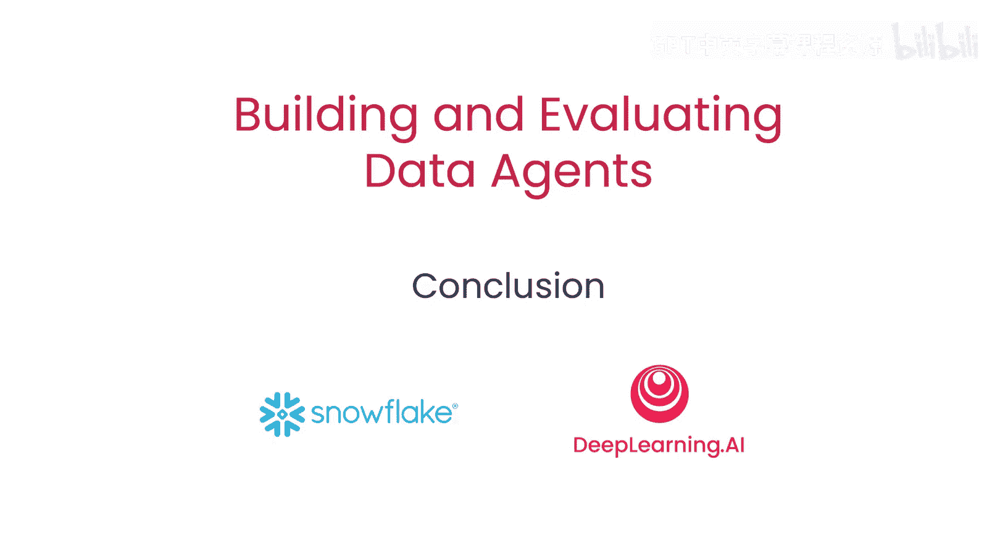

# 008：总结 🎯

在本节课中，我们将对构建与评估数据代理的整个课程内容进行回顾与总结。

---

恭喜你完成了这门课程。你已经设计并评估了一个数据代理，这个代理能够**创建计划**、**执行计划**，并能根据代理自身的状态更新来**调整计划**。

上一节我们介绍了如何衡量代理的行动，本节中我们来看看整个学习过程的最终成果。

你使用**RAG三元组**（RAG Triad）来评估了代理的目标达成情况。最重要的是，你测量并提升了代理的**GPA**（目标-计划-行动一致性，**G**oal, **P**lan and **A**ction alignment）。

以下是本课程的核心成就列表：
*   **设计与构建**：你成功设计并构建了一个功能完整的数据代理。
*   **评估与测量**：你运用RAG三元组框架对代理性能进行了系统评估。
*   **优化与对齐**：你通过测量和改善GPA，确保了代理的目标、计划与行动高度一致。

做得非常出色。我迫不及待想看到你接下来会构建出什么。

---

本节课中我们一起学习了构建与评估数据代理的完整流程，从设计、执行到基于状态的动态调整，并掌握了使用RAG Triad进行评估以及优化GPA（目标-计划-行动一致性）的关键方法。恭喜你掌握了这些核心技能，期待你将它们应用于未来的项目中。