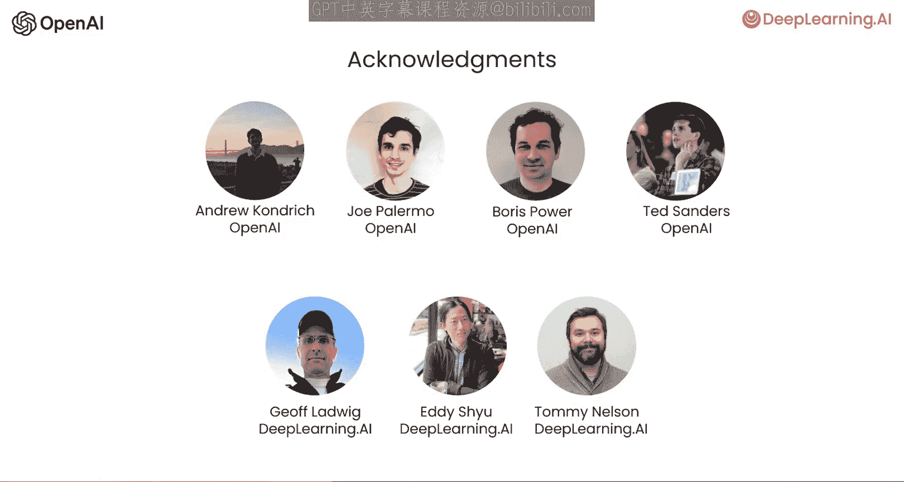
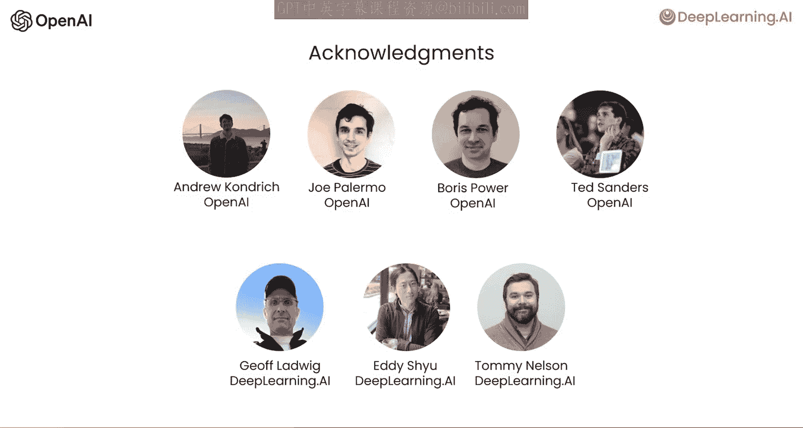

# 001：课程概述

在本节课中，我们将要学习如何利用ChatGPT API构建复杂的应用程序系统。与之前仅关注如何编写单个提示词不同，构建一个完整的系统通常需要串联多个步骤，并可能涉及外部数据检索。

上一节我们介绍了课程的整体目标，本节中我们来看看构建一个端到端客户服务助手的具体流程。我们将通过一个运行示例来展示最佳实践：根据用户查询，系统会进行多步处理，包括内容审核、意图分类、信息检索和最终回复生成。

以下是构建此类系统通常包含的核心步骤：

1.  **输入评估**：首先，系统会评估用户输入，确保其不包含仇恨言论等有问题的内容。
2.  **意图分类**：接着，系统会处理输入，识别查询类型，例如是投诉还是产品信息请求。
3.  **信息检索**：一旦确认为产品查询，系统将从外部源检索相关的产品信息。
4.  **生成回复**：然后，使用语言模型基于检索到的信息撰写有帮助的回复。
5.  **输出检查**：最后，检查输出以确保其准确性和适当性，避免提供不准确或不恰当的答案。

本课程的一个核心主题是：一个应用程序通常包含多个对终端用户不可见的内部步骤。为了生成最终展示给用户的输出，我们经常需要按顺序对用户输入进行多步处理。

随着你长期使用大语言模型构建复杂系统，持续改进系统也至关重要。因此，我们也将分享开发基于大语言模型应用程序的流程，以及评估和持续改进系统的一些最佳实践。

我们感谢为此短片课程做出贡献的许多人。感谢OpenAI团队的Andrew Cndrick、Joe Polermo、Boris Power和Ted Sanders，以及DeepLearning.AI团队的Jeff Ludwig、Eddie Shu和Tommy Nelson。

通过这个短片课程，我们希望你能自信地构建复杂的多步骤应用程序，并为维护和持续改进它做好准备。

本节课中我们一起学习了构建基于ChatGPT API的复杂系统的基本概念和核心步骤。我们了解到，一个完整的应用远不止一次API调用，而是涉及输入评估、意图分类、信息检索、回复生成和输出检查等多个环节的协同工作。