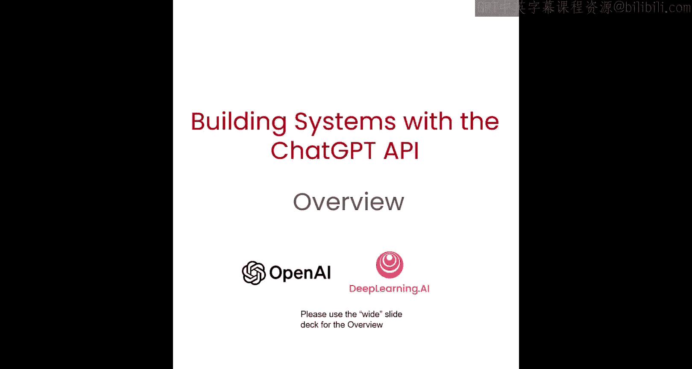
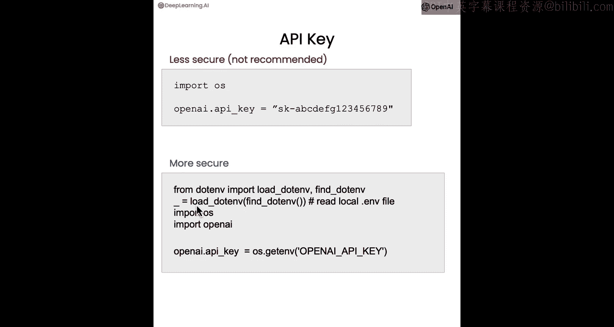
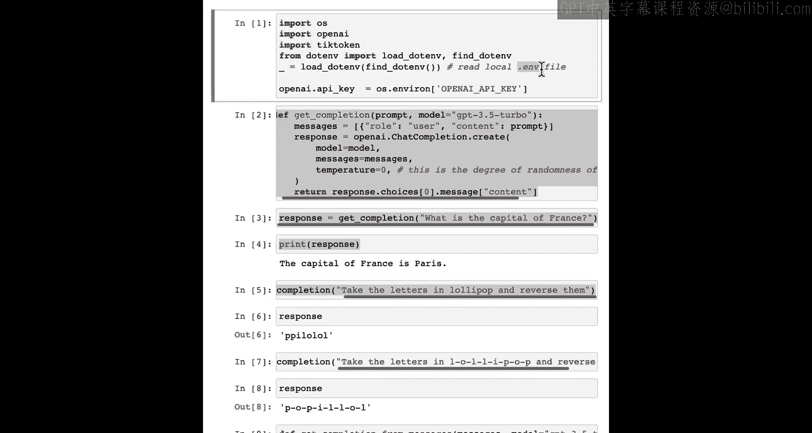
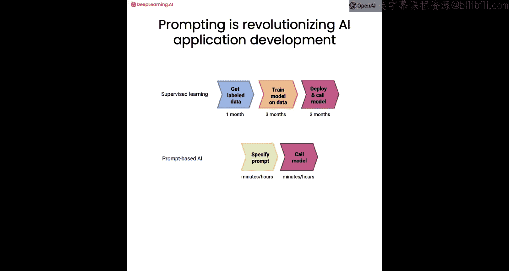

# 002：大语言模型工作原理与API基础




在本节课中，我们将要学习大语言模型（LLM）的基本工作原理，包括其训练过程、核心概念如“分词器”，以及如何使用ChatGPT API的聊天格式来构建系统。我们将通过简单的示例和代码来理解这些概念。


## 大语言模型概述

上一节我们介绍了课程的整体目标，本节中我们来看看大语言模型是如何工作的。你可能熟悉“文本补全”的过程：给模型一个提示，如“我喜欢吃”，模型会预测接下来可能出现的词语，例如“百吉饼配奶油奶酪”或“我妈妈做的菜”。

但模型是如何学会这样做的呢？训练大语言模型的核心技术实际上是**监督学习**。

## 监督学习：模型训练的基础

在监督学习中，计算机使用带有标签的训练数据来学习输入到输出的映射关系（X -> Y）。例如，要训练一个判断餐厅评论情感倾向的模型，你需要收集一个训练集。

以下是构建情感分类器的典型步骤：
1.  收集带标签的数据，例如：
    *   “披萨太棒了” -> 正面
    *   “服务太慢了” -> 负面
2.  使用这些数据训练模型。
3.  部署模型，并对新的评论（如“我吃过的最好的披萨”）进行预测，模型应输出“正面”。

事实证明，监督学习是训练大语言模型的基石。具体来说，大语言模型是通过使用监督学习**反复预测下一个词**来构建的。

## 从基础模型到指令微调模型

假设你的训练数据中有这样一句话：“我最喜欢的食物是百吉饼配奶油奶酪”。

这个句子会被转化为一系列训练样本。模型的任务是，给定一个句子片段（如前缀），预测下一个词。

给定一个包含数千亿甚至更多词汇的大型训练集，你可以创建一个庞大的训练集，让语言模型学习根据文本片段预测下一个词。

目前，大语言模型主要分为两大类：
1.  **基础LLM**：基于文本训练数据，反复预测下一个词。
    *   例如，输入提示：“从前，有一只独角兽”，它可能会通过逐词预测，生成一个关于独角兽在魔法森林里和朋友生活的故事。
    *   缺点是，如果你问它“法国的首都是什么？”，它可能会根据互联网上常见的问答列表，补全为“法国最大的城市是什么？法国的人口是多少？”等一系列问题，而不是直接给出答案。
2.  **指令微调LLM**：这是目前越来越常用的类型。它试图遵循指令，对于“法国的首都是什么？”这个问题，它很可能会回答“巴黎”。

那么，如何从一个基础LLM得到一个指令微调LLM呢？以ChatGPT为例，其训练过程如下：
1.  **预训练基础LLM**：在海量数据（数百亿词）上训练一个基础LLM。这个过程可能需要数月，并使用大型超级计算系统。
2.  **指令微调**：在一个较小的示例集上对基础模型进行**微调**。这些示例展示了“指令”和“对指令的良好回应”。这教会模型在遵循指令时如何预测下一个词。
3.  **基于人类反馈的强化学习**：为了进一步提高输出质量，通常会获取人类对许多不同LLM输出的评级（例如，输出是否**有帮助、诚实、无害**）。然后进一步调整模型，增加其生成更受好评输出的概率。最常用的技术是**RLHF**。

从基础LLM到指令微调LLM的过程，可以在更小的数据集和更适中的计算资源上，用几天时间完成。

## 分词器：模型如何看待文本

到目前为止，我将大语言模型描述为逐词预测。但实际上还有一个重要的技术细节：模型并非预测下一个“词”，而是预测下一个**分词**。

模型接收字符序列（如“learning new things is fun”），并将字符分组为**分词**，这些分词由常见的字符序列组成。在这个例子中，每个词都很常见，所以每个分词对应一个词（或空格、感叹号）。

但是，如果输入中包含一些不太常用的词，比如“prompting a powerful developer to”，分词器可能会将“prompting”分解为三个分词：“prom”、“pt”、“ing”。同样，单词“lollipop”可能被分解为“l”、“oll”、“ipop”。

正因为ChatGPT看到的是这些分词，而不是单个字母，所以当你要求它“将单词‘lollipop’中的字母反转”时，它可能无法正确完成这个看似简单的任务。

这里有一个小技巧可以解决这个问题：在字母之间添加短横线。

```python
# 原始提示（可能失败）
prompt = “Take the letters in ‘lollipop’ and reverse them.”

# 改进的提示（更可能成功）
prompt = “Take the letters in l-o-l-l-i-p-o-p and reverse them.”
```

通过添加短横线，分词器会将每个字母视为独立的分词，使模型更容易“看到”单个字母并按相反顺序输出它们。如果你想用ChatGPT玩文字游戏（如Wordle），这个技巧会很有帮助。

对于英语，一个分词平均对应约4个字符或3/4个单词。不同的大语言模型通常对输入加输出的分词总数有限制（称为**上下文长度**）。例如，最常用的ChatGPT模型（GPT-3.5-turbo）的输入加输出限制约为4000个分词。

## 聊天格式：系统消息与用户消息

接下来，我想分享另一种使用LLM API的强大方式：指定独立的**系统消息**、**用户消息**和**助手消息**。

以下是一个示例函数和调用方式：

```python
def get_completion_from_messages(messages, model=“gpt-3.5-turbo”, temperature=0):
    response = openai.ChatCompletion.create(
        model=model,
        messages=messages,
        temperature=temperature,
    )
    return response.choices[0].message[“content”]

# 构建消息列表
messages = [
    {‘role’: ‘system’, ‘content’: ‘你是一个用苏斯博士风格回应的助手。’},
    {‘role’: ‘user’, ‘content’: ‘给我写一首关于快乐胡萝卜的短诗。’}
]

response = get_completion_from_messages(messages, temperature=1)
print(response)
```

在这个例子中：
*   **系统消息**：设定了大语言模型（助手）的整体行为基调（“用苏斯博士的风格”）。
*   **用户消息**：给出了具体的指令（“写一首诗”）。

模型将输出符合用户指令且与系统消息设定的整体行为一致的响应。

你还可以组合多个要求。例如，系统消息可以是：“你是一个用苏斯博士风格回应的助手。你所有的回答都必须只有一句话。”这样就能得到风格统一且简洁的输出。

如果你想进行多轮对话，也可以在消息列表中传入之前的**助手消息**，让ChatGPT知道它之前说过什么，从而基于上下文继续对话。

## 实用技巧：安全使用API密钥与检查分词用量

使用OpenAI API需要一个与免费或付费账户关联的API密钥。许多开发者会直接将密钥以明文形式写在代码中，**这是一种不安全的方式，不推荐使用**，因为很容易在分享代码或上传到GitHub时泄露密钥。

更安全的方法是使用`python-dotenv`库从环境变量文件中加载密钥：

```python
import openai
from dotenv import load_dotenv, find_dotenv
import os

# 加载本地 .env 文件中的环境变量
_ = load_dotenv(find_dotenv())

# 从环境变量中读取API密钥
openai.api_key = os.getenv(‘OPENAI_API_KEY’)
```

你需要在项目根目录创建一个名为`.env`的文件，内容如下（切勿提交此文件到版本控制）：
```
OPENAI_API_KEY=‘你的-api-密钥-在这里’
```





这样，你的密钥就不会以明文形式出现在代码中。

另外，有时你可能需要检查一次API调用使用了多少分词。以下是一个更复杂的辅助函数，可以返回这些信息：

```python
def get_completion_and_token_count(messages, model=“gpt-3.5-turbo”, temperature=0):
    response = openai.ChatCompletion.create(
        model=model,
        messages=messages,
        temperature=temperature,
    )
    content = response.choices[0].message[“content”]
    token_dict = {
        ‘prompt_tokens’: response[‘usage’][‘prompt_tokens’],
        ‘completion_tokens’: response[‘usage’][‘completion_tokens’],
        ‘total_tokens’: response[‘usage’][‘total_tokens’],
    }
    return content, token_dict

messages = […]
response, token_dict = get_completion_and_token_count(messages)
print(f”回复: {response}”)
print(f”分词用量: {token_dict}”)
```

在实践中，我通常不太担心分词用量。一个需要检查的情况是，当用户输入可能过长，接近模型的上下文长度限制（如4000个分词）时，你可以先检查分词数量，并进行截断以确保不超限。

## 总结：提示工程的变革力量

本节课中我们一起学习了大语言模型的工作原理和API基础。最后，我认为提示工程对AI应用开发的革命性影响仍被低估。

在传统的监督机器学习工作流中（如餐厅评论分类），构建一个可用的模型可能需要一个团队花费数周甚至数月的时间：收集数据、训练模型、调优、评估、部署。

相比之下，在基于提示的机器学习中，对于一个文本应用：
1.  **设计提示**：这可能需要几分钟到几小时（如果需要迭代几次）。
2.  **通过API调用运行**：在几小时，最多几天内，你就可以开始调用模型进行推理。

因此，许多过去需要我花费六个月或一年时间构建的应用，现在使用提示工程可以在几分钟、几小时或极短的天数内完成。这正在彻底改变AI应用的快速构建方式。

一个重要说明是，这种方法目前主要适用于**非结构化数据应用**（特别是文本，以及逐渐成熟的视觉应用）。对于处理大量数值的**结构化数据应用**（如Excel表格），这套方法并不完全适用。但对于适用的领域，AI组件的快速构建能力正在改变整个系统的开发流程。



本节课中，我们介绍了大语言模型的核心概念、分词器的作用、聊天格式的用法以及API使用的安全实践。在下一节中，我们将看到如何利用这些组件来评估客户服务助手的输入，这是构建在线零售商客户服务助手这个大案例的一部分。