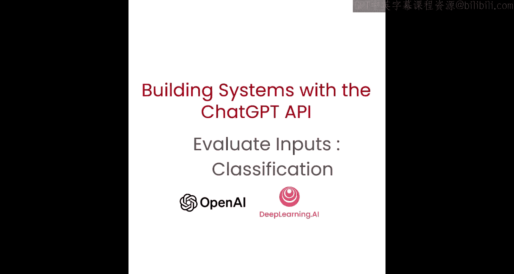
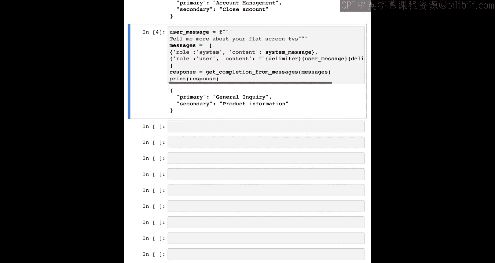

# 003：评估输入任务

在本节中，我们将重点学习如何评估输入。这对于确保系统的质量和安全性非常重要。

当需要大量独立的指令集来处理不同情况的任务时，先对查询类型进行分类，再根据分类结果决定使用哪些指令，会非常有益。这可以通过定义固定的类别，并为处理特定类别任务硬编码相关指令来实现。例如，在构建客户服务助手时，先对查询类型进行分类，再根据分类确定使用哪些指令，可能很重要。因此，如果用户要求关闭账户，与用户询问特定产品信息时，你可能会给出不同的二级指令。在第一种情况下，你可能会添加关于如何关闭账户的额外指令。而在第二种情况下，你可能会添加额外的产品信息。让我们看一个例子，我想这会使其更清晰。

以下是实现此分类过程的具体步骤。

*   **定义系统消息**：首先，我们设置一个系统消息，作为整个系统的指令。我们使用分隔符来帮助模型区分指令或输出的不同部分。在这个例子中，我们使用井号 `#` 作为分隔符，这是一个很好的选择，因为它被表示为一个单一的令牌。
*   **设定分类任务**：系统消息的内容是：`你将被提供客户服务查询。客户服务查询将用这些井号字符分隔。将每个查询分类到一个主要类别和一个次要类别，然后以JSON格式输出，键名为primary和secondary。` 我们定义了主要类别（如：计费、技术支持、账户管理、一般查询）和次要类别（如：取消订阅、升级等）。
*   **处理用户查询**：接着，我们输入用户消息。例如，第一条用户消息是：`我想让你删除我的个人资料和所有用户数据。` 我们将系统消息和用井号分隔的用户消息组合成一个消息列表。
*   **获取并解析分类结果**：模型会返回分类结果。对于上述查询，模型的分类是：主要类别为“账户管理”，次要类别为“关闭账户”。要求模型以JSON格式输出，使得我们可以轻松地将其解析为对象（例如Python中的字典），并用作后续步骤的输入。

现在，我们来看另一个例子。你也可以暂停视频，尝试输入自己的用户问题，看看模型如何对它们进行分类。

另一个用户消息是：`告诉我更多关于你们的平板电视的信息。`

模型返回的分类结果是：主要类别为“一般查询”，次要类别为“产品信息”。这个分类看起来是正确的。

总的来说，基于客户查询的分类，我们现在可以提供一组更具体的指令来处理后续步骤。例如，对于电视查询，我们可能会添加关于电视的额外信息；而对于关闭账户的查询，我们可能希望提供一个关闭账户的链接等。我们将在后面的视频中学习更多处理输入的不同方法。

在下一节中，我们将探讨更多评估输入的方法，特别是确保用户以负责任的方式使用系统的具体途径。

---

本节课中，我们一起学习了如何通过分类用户查询来评估输入。我们了解了定义系统指令、使用分隔符、设定分类类别，并根据模型的JSON格式输出进行后续处理的完整流程。这是构建能够智能处理多样化请求的系统的关键一步。