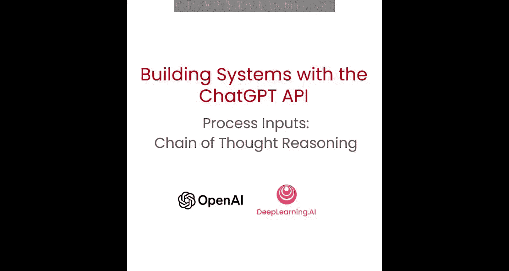
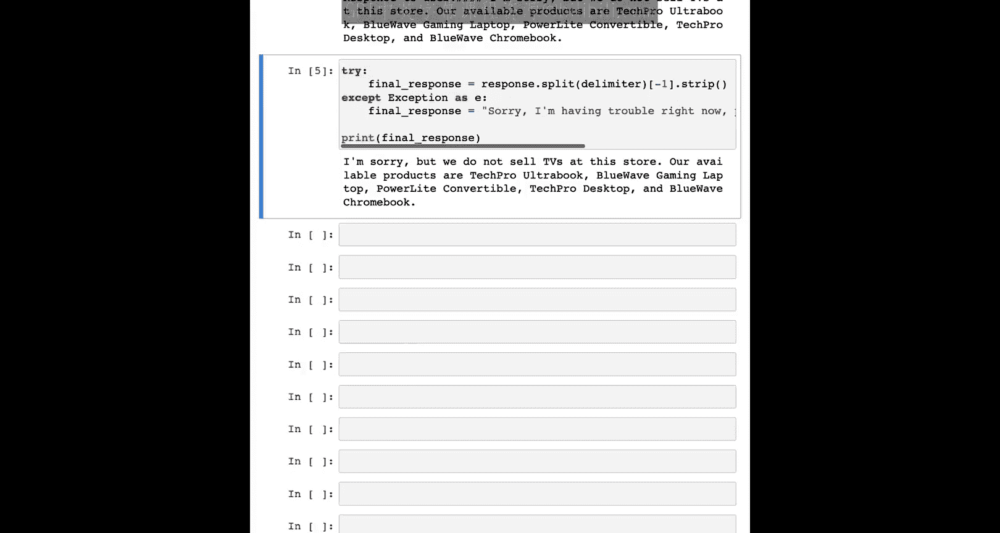

# 005：处理输入任务与思维链推理



在本节课中，我们将学习如何处理用户输入，并利用“思维链”推理策略，引导模型通过一系列步骤来生成更准确、更可靠的输出。我们将重点介绍如何让模型在给出最终答案前进行详细推理，以及如何通过“内心独白”技巧隐藏推理过程，以构建更健壮的应用系统。

## 概述：处理输入与推理策略

上一节我们介绍了系统提示词的基本概念。本节中，我们来看看如何处理复杂的用户查询。有时，模型会急于得出错误结论。为了解决这个问题，我们可以重构查询，要求模型在提供最终答案之前，先进行一系列相关的推理步骤。这种策略被称为“思维链”推理。

在某些应用中，模型得出最终答案的推理过程不适合与用户分享。例如，在辅导应用中，我们希望鼓励学生自己寻找答案，而模型的推理过程可能会直接向学生揭示答案。“内心独白”是一种可以缓解此问题的策略，其核心思想是将模型的推理过程对用户隐藏。


## 实施“内心独白”策略

“内心独白”的策略是指导模型将需要向用户隐藏的输出部分，放入一个易于解析的结构化格式中。然后，在向用户呈现输出之前，先解析这个输出，并只显示其中对用户可见的部分。

还记得之前视频中的分类问题吗？我们要求模型将客户查询分类为主要和次要类别。基于该分类，我们可能会采取不同的后续指令。想象一下，如果客户查询被分类到“产品信息”类别，那么在接下来的指令中，我们希望包含我们现有产品的信息。

让我们从一个具体的例子开始，深入探讨如何实现这一点。


### 设置系统消息与步骤


首先，我们进行常规设置。对于这个“内心独白”示例，我们将使用我们一直使用的分隔符。

以下是系统消息的构建过程。我们在这里要求模型在得出结论之前，先对答案进行推理。

指令是：请按照以下步骤回答客户查询。客户查询将由四个井号（####）分隔。

我们将此过程分解为多个步骤：

以下是具体的推理步骤：
1.  **步骤一**：判断用户是否在询问关于特定产品的问题（产品类别不算）。
2.  **步骤二**：如果用户询问的是特定产品，请识别这些产品是否在以下列表中。
    *   可用产品列表：`蓝浪Chromebook`、`科技Pro台式机`、`游戏本Plus`、`商务精英笔记本`、`家庭学习一体机`
3.  **步骤三**：如果消息中包含上述列表中的产品，请列出用户在消息中做出的任何假设。例如，“假设笔记本X比笔记本Y大”或“假设笔记本Z有两年保修期”。
4.  **步骤四**：如果用户做出了任何假设，请根据你的产品信息判断这些假设是否正确。
5.  **步骤五**：首先，如果适用，请礼貌地纠正客户的不正确假设。**仅提及或引用**上述五个可用产品列表中的产品，因为这是商店仅售的五种产品。然后以友好的语气回答客户。

对于像GPT-4这样的更高级语言模型，这类非常细致的指令可能并非必需。然后，我们要求模型使用以下格式输出：`步骤一：<推理内容> #### 步骤二：<推理内容> #### ...`。使用分隔符意味着我们之后可以更容易地提取仅给客户的回复，并截断之前的所有内容。

### 示例一：处理包含错误假设的查询

现在让我们尝试一个示例用户消息：“蓝浪Chromebook比科技Pro台式机贵多少？”

让我们看看这两个产品：蓝浪Chromebook是249.99美元，而科技Pro台式机实际上是999.99美元。用户的假设（Chromebook更贵）是不正确的。

我们期望模型执行所有这些不同的步骤，意识到用户做出了错误的假设，然后遵循最后一步，礼貌地纠正用户。

在这个单一的提示中，我们实际上维护了系统可能处于的多种复杂状态。例如，在任何给定步骤，前一步的输出可能不同，我们可能希望采取不同的操作。这是一个相当复杂的指令。

让我们看看模型是否正确执行了：
*   **步骤一**：用户正在询问关于特定产品的问题。
*   **步骤二**：用户询问这两个产品之间的价格差异。
*   **步骤三**：用户假设蓝浪Chromebook比科技Pro台式机更贵。
*   **步骤四**：这个假设不正确。
*   **步骤五**：最终回复用户：“蓝浪Chromebook实际上比科技Pro台式机便宜。科技Pro台式机售价999.99美元，而蓝浪Chromebook售价249.99美元。”

模型通过花更长时间思考问题来进行推理，就像人类回答任何给定问题也需要时间推理一样。如果模型有时间思考，它的表现会更好。

### 示例二：处理无关查询

让我们看另一个用户消息示例：“你们卖电视吗？” 请记住，在我们的产品列表中，只列出了不同的电脑。

让我们看看模型会说什么：
*   **步骤一**：用户询问商店是否销售电视，但电视不在可用产品列表中。
*   如你所见，模型随后跳过了中间步骤，直接进入“回复用户”步骤，因为它意识到中间步骤实际上没有必要。

需要指出的是，我们要求了特定的输出格式。从技术上讲，模型并没有完全遵循我们的要求。同样，更高级的模型在这方面会做得更好。

在这种情况下，我们对用户的回复是：“很抱歉，我们商店不销售电视。” 然后它列出了可用的产品。

### 提取最终回复

现在，我们只想要回复的这一部分，而不希望向用户显示前面的推理部分。我们可以做的就是，在最后一个分隔符标记（四个井号）处切割字符串，然后只打印模型输出的最后部分。

让我们编写一些代码来仅获取字符串的最后部分：

```python
try:
    # 假设 `response` 是模型返回的完整字符串
    final_response = response.split("####")[-1].strip()
except Exception as e:
    final_response = "抱歉，我现在遇到了一些问题。请尝试询问另一个问题。"
print(final_response)
```

如你所见，我们只是切割字符串来获得最终输出。如果我们要将此构建到应用程序中，这就是我们将向用户显示的内容。

## 总结与优化建议

本节课中，我们一起学习了如何利用“思维链”推理来处理复杂输入任务，并通过“内心独白”策略隐藏模型的内部推理过程，以构建更专业、更用户友好的系统。

总的来说，对于这个任务，这个提示词可能略显复杂。你可能实际上并不需要所有这些中间步骤。不妨尝试一下，看看是否能找到更简单的方法来完成同样的任务。

通常，在提示词复杂度和效果之间找到最佳平衡点需要进行一些实验。在决定使用某个提示词之前，尝试多种不同的提示词绝对是好的做法。



在下一节视频中，我们将学习另一种处理复杂任务的策略：通过将这些复杂任务分解为一系列更简单的子任务，而不是试图在一个提示中完成整个任务。