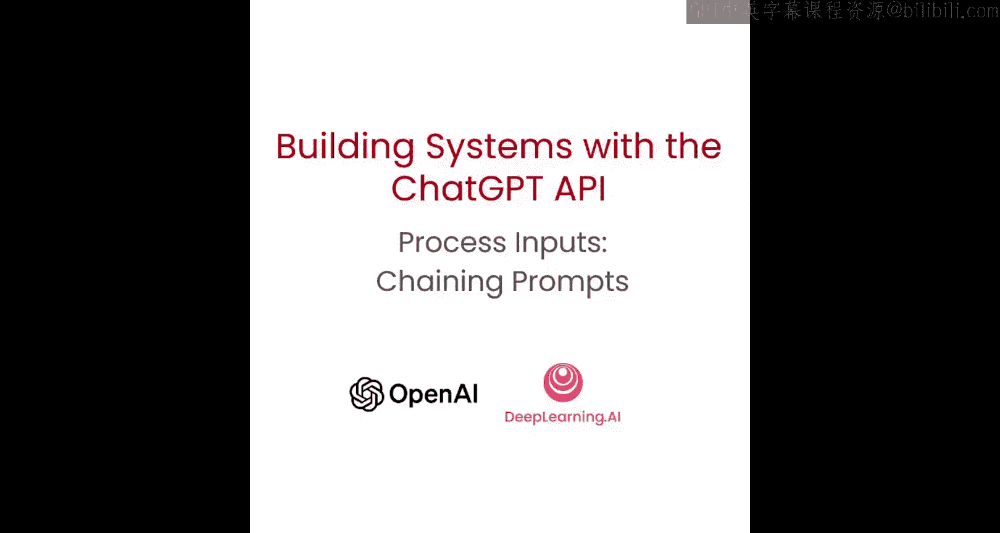
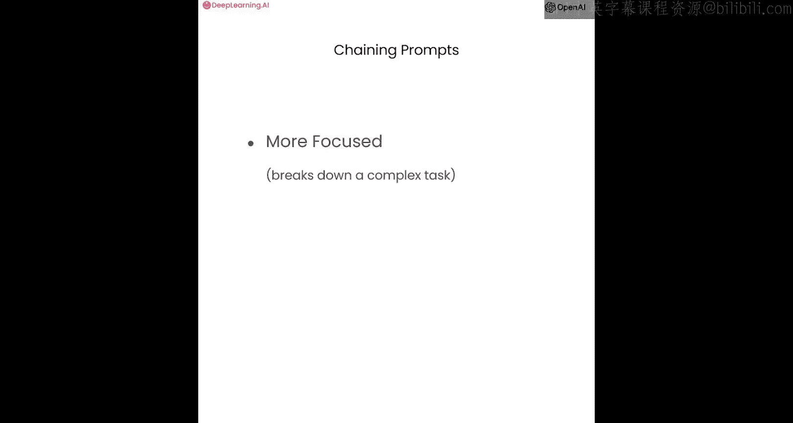
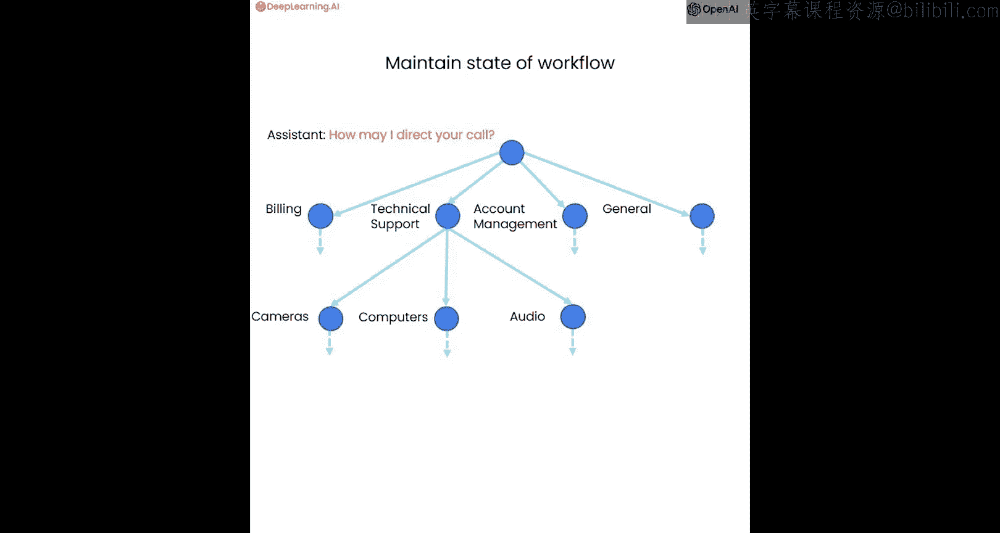
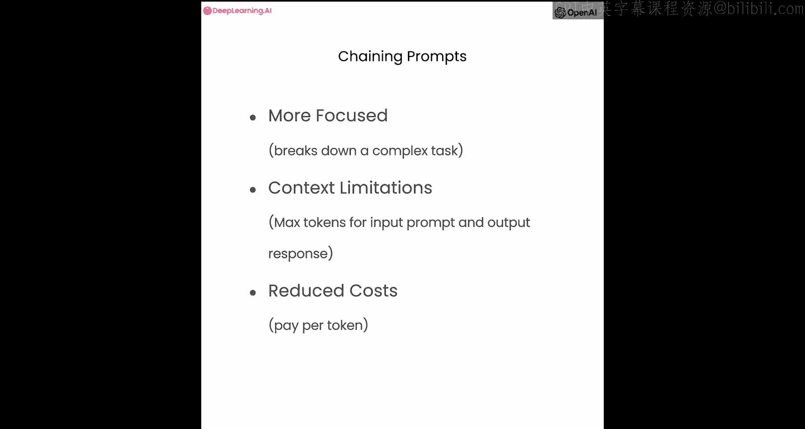

# 006：通过提示链分解复杂任务



在本节课中，我们将学习如何通过将多个提示链接在一起，将复杂任务分解为一系列更简单的子任务。


## 概述

上一节我们介绍了思维链推理，它允许模型通过逐步推理来执行复杂指令。本节中，我们来看看另一种策略：将任务分解为多个独立的提示步骤，并按顺序执行它们。




## 为什么需要分解任务？

你可能会疑惑，既然可以通过一个包含思维链推理的提示完成任务，为什么还要将其分解为多个提示呢？语言模型，尤其是像GPT-4这样的高级模型，非常擅长遵循复杂指令。让我通过两个类比来解释原因。


第一个类比是烹饪复杂菜肴。使用一个冗长、复杂的指令就像试图一次性烹饪一整顿复杂的饭菜，你必须同时管理多种食材、烹饪技巧和时间。这很难掌控，也难以确保每个部分都完美烹饪。




将提示链接起来则像分阶段烹饪。你一次专注于一个部分，确保每个部分都烹饪正确后再进行下一步。这种方法分解了任务的复杂性，使其更易于管理，并减少了出错的可能性。然而，对于一个非常简单的食谱，这种方法可能是不必要且过于复杂的。

第二个类比是代码结构。将所有逻辑放在一个长文件中的“意大利面条式代码”通常难以调试，因为存在模糊性和复杂的逻辑依赖关系。提交给语言模型的复杂单步任务也可能存在同样的问题。

当你的工作流程可以维护系统在任何给定点的状态，并根据当前状态采取不同行动时，提示链是一个强大的策略。例如，在对传入的客户查询进行分类后，状态就是分类结果（例如，是账户问题还是产品问题）。然后，基于这个状态，你可能会采取不同的行动。

## 提示链的优势

以下是采用提示链方法的主要优势：

*   **易于管理**：每个子任务只包含任务单一状态所需的指令，使系统更易于管理。
*   **信息完整**：确保模型拥有执行任务所需的所有信息。
*   **减少错误**：降低了模型在复杂推理中出错的概率。
*   **降低成本**：包含更多标记的更长提示运行成本更高，在某些情况下概述所有步骤可能是不必要的。
*   **便于测试与人工干预**：更容易测试哪些步骤更频繁地失败，或在特定步骤引入人工审核。

总而言之，与其像上一节那样在一个提示中用几十个要点或几段话来描述整个复杂的工作流程，不如在外部跟踪状态，然后根据需要注入相关指令。

那么，什么使一个问题变得复杂？一般来说，如果存在许多不同的指令，并且所有这些指令都可能适用于任何给定情况，那么问题就是复杂的。在这些情况下，模型可能难以推理该做什么。随着你更多地使用和与这些模型交互，你将逐渐获得直觉，知道何时使用此策略而非前一种。

此外，这种方法还允许模型在工作流的特定点（如果需要）使用外部工具。例如，它可能决定在产品目录中查找某些内容、调用API或搜索知识库，这是单个提示无法实现的。

## 实践示例：客户服务查询处理

接下来，让我们通过一个示例来实践。我们将使用与上一节相同的示例：回答客户关于特定产品的问题。但这次，我们将使用更多产品，并将步骤分解为多个不同的提示。

### 第一步：识别查询中的产品和类别

首先，我们定义一个系统消息，让模型从用户查询中提取提及的产品和类别。

```python
system_message = """
你将收到客户服务查询。
客户服务查询将由四个井号字符分隔。
输出一个Python对象列表，其中每个对象具有以下格式：
{
    "category": <类别，必须是以下预定义字段之一>,
    "products": <产品列表，必须是下面允许的产品列表中找到的产品>
}
其中，类别和产品必须在客户服务查询中找到。
如果提到了产品，它必须与下面允许的产品列表中的正确类别相关联。
如果未找到任何产品或类别，则输出一个空列表。
只输出对象列表，不要输出其他内容。
"""
```

我们有一个允许的产品列表，包含类别和每个类别下的产品。然后，我们提供用户消息，例如：“告诉我关于 smartx prophone 和 photosnap 相机， dslr 型号。另外，告诉我关于你们的电视。”

我们将系统消息和用户消息格式化为消息数组，然后从模型获取补全。输出将是一个结构化的对象列表，例如：

```python
[
    {"category": "手机", "products": ["SmartX ProPhone"]},
    {"category": "相机", "products": ["PhotoSnap DSLR Camera"]},
    {"category": "电视", "products": []}
]
```

这种结构化响应的好处是，我们可以将其读入Python列表，便于后续处理。

### 第二步：查找产品信息

现在，我们有了第一步的输出（状态）。如果找到了产品或类别，我们希望将有关这些请求的产品和类别的信息加载到提示中，以便更好地回答客户问题。

我们需要一个产品目录来查找信息。假设我们有一个产品信息字典，其中包含每个产品的名称、类别、品牌、规格等详细信息。

我们需要定义一些辅助函数来按名称查找产品信息，以及按类别获取所有产品。

```python
def get_product_by_name(name):
    return products.get(name, None)

def get_products_by_category(category):
    return [product for product in products.values() if product["category"] == category]
```

### 第三步：整合信息并生成最终回答

我们需要将第一步模型的输出（一个字符串）解析为Python列表，以便使用辅助函数。

```python
import json

def read_string_to_list(input_string):
    if not input_string:
        return None
    try:
        input_string = input_string.replace("'", "\"")  # 替换单引号为双引号
        data = json.loads(input_string)
        return data
    except json.JSONDecodeError as e:
        print(f"解析JSON时出错: {e}")
        return None
```

然后，我们创建一个函数，将查找到的产品信息格式化为一个清晰的字符串，以便添加到下一个提示中。

```python
def generate_output_string(data_list):
    output = ""
    for item in data_list:
        category = item.get("category")
        products = item.get("products")
        if products:
            for product_name in products:
                product = get_product_by_name(product_name)
                if product:
                    output += f"{json.dumps(product, indent=2)}\n"
        elif category:
            category_products = get_products_by_category(category)
            for product in category_products:
                output += f"{json.dumps(product, indent=2)}\n"
    return output
```

现在，我们准备最终的提示。系统消息设定助手的角色和回答风格。

```python
final_system_message = """
你是一家大型电子商店的客户服务助理。
请以友好和乐于助人的语气回答，答案要非常简洁。
确保询问用户相关的后续问题。
"""
```

消息数组将包含：
1.  系统消息（设定角色）。
2.  用户原始查询。
3.  一条来自“助手”的消息，其中包含我们查找并格式化的“相关产品信息”。

然后，我们获取模型的最终响应。模型将利用提供的产品信息，以有帮助的方式回答用户，并可能提出后续问题。

## 为什么选择性地加载信息？

你可能会想，为什么不直接将所有产品描述包含在提示中，让模型自行选择所需信息，从而省去所有中间查找步骤呢？原因如下：

1.  **避免信息过载**：包含所有产品描述可能会使上下文对模型来说更加混乱，就像一个人试图一次性处理大量信息一样。对于像GPT-4这样的高级模型，尤其是当上下文结构良好时，这一点不那么重要，因为模型足够智能，可以忽略明显不相关的信息。
2.  **上下文长度限制**：语言模型有上下文窗口限制，即允许的输入和输出标记数量是固定的。如果你有庞大的产品目录，可能无法将所有描述都放入上下文窗口中。
3.  **成本考虑**：使用语言模型需要为标记付费。通过选择性地加载信息，你可以降低生成响应的成本。

## 总结与扩展

本节课中，我们一起学习了如何通过将复杂任务分解为多个提示步骤来构建更健壮、更高效的系统。我们看到了如何：
*   使用第一个提示识别用户意图并提取关键实体（如产品类别和名称）。
*   根据提取的信息，通过辅助函数从外部数据源（如产品数据库）动态查找相关信息。
*   将查找的信息整合到后续提示中，为模型提供精确的上下文，以生成高质量、信息丰富的回答。

这种方法的核心思想是将语言模型视为一个推理代理，它需要必要的上下文才能得出有用的结论并执行有用的任务。在我们的例子中，我们必须给模型提供产品信息，然后它才能根据这些信息进行推理，为用户创建有用的答案。

此外，模型擅长决定何时使用各种不同的工具，并能通过指令正确使用它们。这就是ChatGPT插件背后的理念：我们告诉模型它可以访问哪些工具以及这些工具的作用，当它需要来自特定来源的信息或想要采取其他适当行动时，它会选择使用它们。

在我们的示例中，我们只能通过精确的产品和类别名称匹配来查找信息。但还有更先进的信息检索技术，其中最有效的方法之一是使用**文本嵌入**。嵌入可用于在大型语料库上实现高效的知识检索，以查找与给定查询相关的信息。使用文本嵌入的一个关键优势是它们支持模糊或语义搜索，允许你无需使用确切的关键词就能找到相关信息。

我们计划不久后创建一门关于如何使用嵌入进行各种应用的全面课程，敬请期待。



接下来，在下一节中，我们将讨论如何评估语言模型的输出。