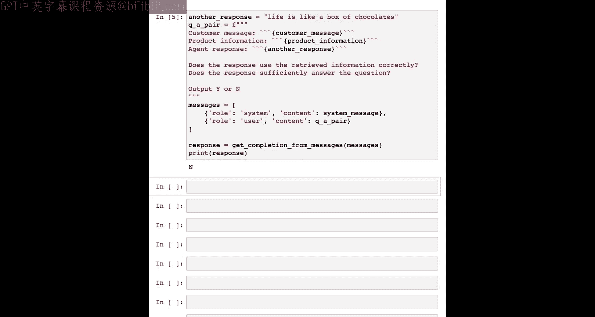

# 007：检查系统输出


在本节课中，我们将学习如何检查由系统生成的输出。在将输出展示给用户之前进行检查，对于确保响应的质量、相关性和安全性至关重要。我们将学习如何使用审核API来检查输出，以及如何通过额外的提示词让模型在展示前评估输出质量。

## 审核API检查输出

上一节我们介绍了使用审核API评估用户输入。本节中，我们来看看如何将其应用于检查系统生成的输出。审核API同样可以用于过滤和审核系统自身产生的输出。


以下是一个示例：


这里有一个系统生成的用户响应。我们将以与之前视频相同的方式使用审核API。

```python
# 示例：使用审核API检查输出
response_to_check = "这里是系统生成的回复文本。"
moderation_result = openai.Moderation.create(input=response_to_check)
print(moderation_result)
```

检查结果显示，该输出未被标记，并且在所有类别中得分都很低，这与该回复的内容相符。

在创建面向敏感受众的聊天机器人等场景时，可以设置更低的标记阈值。通常，如果审核API的输出表明内容被标记，你可以采取适当的措施，例如返回一个备用答案或生成新的响应。

需要注意的是，随着模型的改进，它们返回有害内容的可能性也越来越低。

## 使用模型自身评估输出

另一种检查输出的方法是，要求模型自身评估生成的回复是否令人满意，以及是否符合你定义的某些标准。这可以通过将生成的输出作为模型输入的一部分，并要求其评估输出质量来实现。

以下是实现此功能的一种方式：

```python
# 系统提示词，用于评估客服回复
system_message = """
你是一个评估助手，负责判断客服代理的回复是否充分回答了客户问题，并验证所有引用的产品信息是否正确。
产品信息和用户/客服消息将通过三个反引号提供。
请仅用单个字母 Y 或 N 回答，不加标点。
Y 表示输出充分回答了问题，且正确使用了产品信息。
N 表示否则。
仅输出单个字母。
"""
```

你可以使用思维链推理提示，或者添加更详细的评估准则。例如，你可以提供一个类似考试评分标准的准则，询问回复是否使用了符合品牌指南的友好语气。

让我们看一个具体的评估示例。以下是评估所需的信息：

*   **客户消息**：用于生成回复的初始用户查询。
*   **产品信息**：从知识库中检索到的、与客户消息中提到的产品相关的信息。
*   **客服代理回复**：系统之前生成的、需要被评估的回复。

将这些信息格式化为消息列表并获取模型的评估结果：

```python
# 构建评估消息列表
messages = [
    {"role": "system", "content": system_message},
    {"role": "user", "content": f"""
客户消息：```{customer_message}```
产品信息：```{product_info}```
客服代理回复：```{agent_response}```
请评估。
"""}
]
evaluation_response = openai.ChatCompletion.create(model="gpt-3.5-turbo", messages=messages)
print(evaluation_response.choices[0].message.content)  # 输出可能是 'Y' 或 'N'
```

在这个例子中，模型回复了“Y”，表示产品信息正确，且问题得到了充分回答。

对于这类评估任务，使用更高级的模型（如GPT-4）通常效果更好，因为它们的推理能力更强。

让我们尝试另一个例子。假设客服回复是“生活就像一盒巧克力”，这显然没有使用检索到的产品信息来回答问题。

```python
# 另一个评估示例
agent_response = "Life is like a box of chocolates."
# ... 使用相同的评估流程
```

模型这次会判断为“N”，表示该回复既没有充分回答问题，也没有正确使用检索到的信息。

**“是否正确使用了检索到的信息？”** 这是一个很好的提示词，可以用来确保模型没有产生“幻觉”（即编造不真实的内容）。

你可以暂停视频，尝试使用自己的客户消息、回复和产品信息来测试这个评估流程。

## 总结与应用建议

如你所见，模型可以提供关于生成输出质量的反馈。你可以利用这个反馈来决定是向用户展示该输出，还是生成新的回复。你甚至可以尝试为每个用户查询生成多个模型回复，然后让模型选择最好的一个展示给用户。

总的来说：
*   使用**审核API检查输出**是一个很好的实践。
*   而让**模型评估自身输出**的方法，虽然能在少数情况下为即时反馈、确保响应质量提供帮助，但在大多数情况下可能并非必要，尤其是当你使用像GPT-4这样的高级模型时。这种方法在实践中并不常见，因为它会增加系统的延迟和成本（需要额外的API调用和Token消耗）。除非你的应用对错误率有极端严格的要求（例如0.000001%），否则在实践中通常不推荐这样做。

在下一个视频中，我们将把在“评估输入”、“处理流程”和“检查输出”部分学到的所有知识结合起来，构建一个完整的端到端系统。



