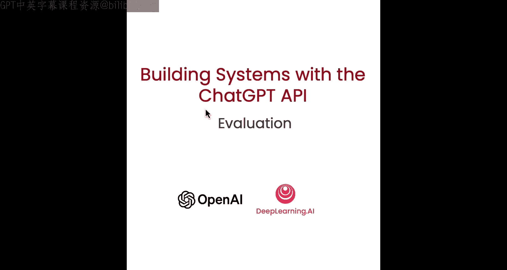
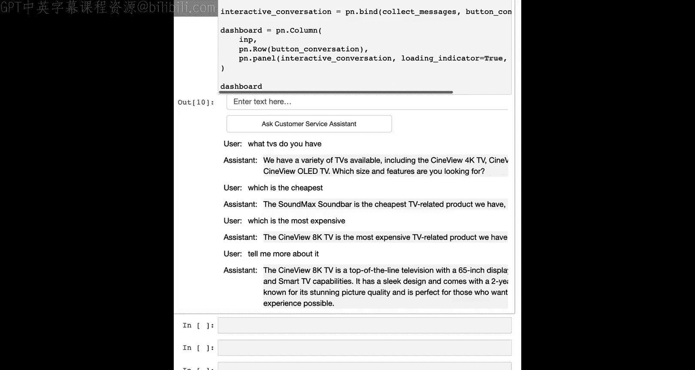

# 008：端到端客户服务助手示例



在本节课中，我们将综合运用之前视频中学到的所有知识，创建一个端到端的客户服务助手示例。我们将通过一个完整的流程，从接收用户输入到返回安全、准确的回答，展示如何构建一个实用的系统。


## 概述

我们将按照以下步骤构建这个系统：
1.  检查用户输入是否触发内容审核API。
2.  如果未触发，则从输入中提取产品列表。
3.  如果找到产品，则在产品数据库中查找相关信息。
4.  结合产品信息和对话历史，使用模型回答用户问题。
5.  将模型的回答再次通过内容审核API检查。
6.  如果回答安全，则将其返回给用户。

现在，让我们开始逐步实现。

## 第一步：检查用户输入

首先，我们需要确保用户输入的内容是安全的。我们使用OpenAI的审核API来检查输入是否包含不当内容。

以下是检查输入的代码示例：
```python
response = openai.Moderation.create(input=user_input)
moderation_output = response["results"][0]
if moderation_output["flagged"]:
    return "抱歉，您的请求包含不当内容，无法处理。"
```
如果输入被标记，我们将直接返回一条安全提示，并停止后续处理。

## 第二步：提取产品列表

如果输入通过了安全审核，下一步就是从用户的自然语言提问中提取出具体的产品名称。这有助于我们进行精确的信息检索。

我们使用一个精心设计的提示词来指导模型完成这项任务：
```python
prompt = f"""
请从以下用户问题中识别并提取产品名称。
用户问题：```{user_input}```
请以逗号分隔的列表形式输出产品名称。
"""
```
模型将根据这个提示，输出类似 `"smartx prophone, fslam camera, tvs"` 的列表。

## 第三步：查找产品信息

成功提取产品名称后，我们需要在产品数据库中查找这些产品的详细信息，以便为回答提供依据。

我们假设有一个产品数据库，可以通过产品名称进行查询：
```python
product_info = ""
for product in extracted_products_list:
    info = get_product_info_from_database(product) # 假设的数据库查询函数
    product_info += info + "\n"
```
如果未找到任何产品信息，`product_info` 将是一个空字符串。

## 第四步：生成回答

现在，我们拥有了用户问题、对话历史（如果有的话）和相关产品信息。我们将这些内容组合成一个新的提示，让模型生成最终的回答。

提示词结构如下：
```python
system_message = """
你是一个乐于助人的客户服务助手。请根据提供的产品信息，准确、友好地回答用户问题。
如果信息不足，请如实告知。
"""

messages = [
    {"role": "system", "content": system_message},
    {"role": "user", "content": f"对话历史：{history}\n用户问题：{user_input}\n产品信息：{product_info}"}
]

response = openai.ChatCompletion.create(
    model="gpt-3.5-turbo",
    messages=messages,
    temperature=0
)
answer = response.choices[0].message["content"]
```
模型将基于所有上下文生成一个连贯、有用的回答。

## 第五步：审核输出内容

在将回答返回给用户之前，我们必须再次确保其安全性。这与第一步类似，但这次是审核模型的输出。

我们使用相同的审核API：
```python
response = openai.Moderation.create(input=answer)
moderation_output = response["results"][0]
if moderation_output["flagged"]:
    return "抱歉，我无法提供该信息。让我为您转接人工客服。"
```
如果回答被标记，我们不会将其展示给用户，而是提供一条安全回复，并可能触发后续处理流程（如转接人工）。

## 整合与对话示例

我们将上述所有步骤整合到一个 `process_user_message` 函数中。同时，为了创建一个交互式体验，我们使用一个简单的UI来累积对话历史。

以下是一个简化的对话流程演示：
*   **用户**：`“你们有哪些电视机？”`
*   **助手**：`“我们提供多种电视机，包括CineView 4K电视、CineView 8K电视等...”`（经过提取产品、查找信息、生成回答、审核输出后返回）
*   **用户**：`“最便宜的是哪款？”`
*   **助手**：`“根据我们的产品线，最便宜的电视相关产品是SoundMax音箱...”`（此时，函数会将之前的对话历史也纳入上下文进行推理）

通过这个链式系统，我们能够处理复杂的多轮对话，并确保每一步的输出都是安全和相关的。

## 系统优化思路

构建这样一个多步骤系统后，我们可以通过监控大量输入输出的质量来持续优化它：
*   **优化提示词**：可能发现某些步骤的提示词可以写得更清晰、更有效。
*   **精简步骤**：通过分析，可能发现某些步骤并非必要，可以简化流程。
*   **改进检索方法**：可以尝试更高级的检索技术来提升产品信息查找的准确性和速度。
我们将在下一个视频中更详细地讨论系统评估与迭代改进。

## 总结



本节课中，我们一起学习并实践了如何构建一个端到端的客户服务助手系统。我们整合了内容审核、信息提取、数据检索和对话生成等多个模块，形成了一个安全、可靠的处理链条。这个示例展示了将大型语言模型API应用于实际系统的基本模式，为你构建更复杂的应用打下了坚实的基础。