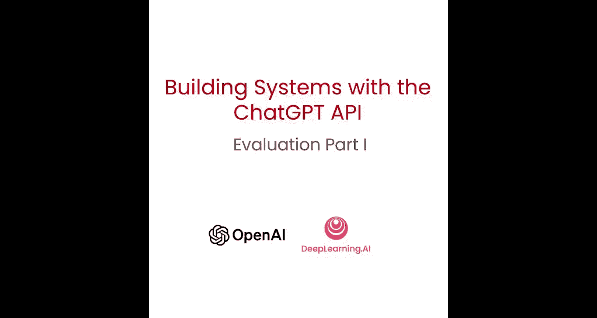
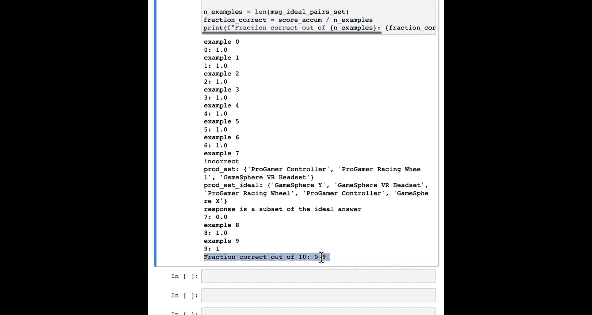

# 009：评估LLM输出与构建测试集的最佳实践 🧪



在本节课中，我们将学习如何评估大型语言模型（LLM）的输出，并了解在构建基于提示的系统时，如何逐步建立和发展测试集。这与传统监督学习的评估方法有显著区别。

在之前的视频中，我们介绍了如何构建一个应用程序，从评估用户输入、处理输入，到最终向用户展示输出前进行检查。构建好这样一个系统后，如何知道它的运行状况？在部署并让用户使用时，如何追踪其表现、发现不足并持续提升系统回答的质量？本节视频将分享一些评估LLM输出的最佳实践，特别是构建此类系统的实际感受。

## 传统监督学习与提示开发的评估差异 🔄


本节中，我们来看看传统机器学习与基于提示的开发在评估流程上的核心区别。

一个关键区别在于，由于你可以非常快速地构建此类应用，其评估方法往往不是从一个大型测试集开始的。相反，你通常会逐步积累一组测试用例。让我解释一下这意味着什么。

你可能还记得第二个视频中的图表，它展示了基于提示的开发如何将模型开发的核心部分从可能数月加速到只需几分钟、几小时或最多几天。

在传统的监督学习方法中，如果你需要收集10,000个带标签的样本，那么多收集1000个测试样本的增量成本并不算高。因此，在传统监督学习环境中，通常会同时收集训练集、开发集（或称为验证集）和测试集，并在整个开发过程中使用它们。

但是，如果你能在几分钟内指定一个提示词，并在几小时内让系统运行起来，那么如果必须暂停很长时间去收集上千个测试样本，就会显得非常痛苦，因为你可以在零训练样本的情况下让系统工作。

## 构建LLM应用的典型迭代流程 📈

以下是构建应用和使用LLM时常见的迭代流程：

1.  **在小样本上调整提示**：首先，你可能只在少数几个（例如1到5个）例子上调整提示词，尝试找到一个在这些例子上有效的提示。
2.  **收集棘手案例**：随着系统进行更多测试，你偶尔会遇到一些棘手的例子，提示词或算法在这些例子上失效。这时，你可以将这些额外的一两个、三五个例子添加到你的测试集中，机会性地积累更多棘手案例。
3.  **建立指标并自动化评估**：最终，你积累到足够多的例子，手动在每次修改提示词后运行所有例子变得不便。于是你开始开发指标（如平均准确率）来衡量在这个小集合上的性能。
4.  **收集随机样本开发集**：如果你手工构建的开发集仍不能给你足够的信心，那么你可能会进入下一步：收集一个随机采样的例子集合来调整模型，这将继续作为开发集或验证集。
5.  **使用独立的测试集**：只有当你需要对系统性能进行更高保真度的估计时，你才可能收集并使用一个独立的测试集，这个测试集在你调整模型时甚至不会去看。

这个过程的一个有趣之处在于，如果你在任何时候认为系统已经足够好，你可以就此停止，不进行下一步。事实上，许多已部署的应用可能停留在第一步或第二步，并且运行得很好。

第四步在你需要精确区分微小性能差异（例如从91%正确率提升到92%或93%）时更为重要，这时你需要更大的样本集来衡量这些差异。而只有当你真正需要一个无偏、公正的系统性能估计时，才需要超越开发集去收集独立的测试集。

**一个重要提醒**：对于许多大型语言模型应用，如果答案不完全正确，可能不会造成有意义的伤害风险。但对于任何高风险应用，如果存在偏见或不恰当输出可能对某人造成伤害的风险，那么在使用前，收集测试集以严格评估系统性能、确保其行为正确的责任就变得至关重要。反之，如果只是为自己阅读而总结文章，伤害风险可能较低，你可以更早地停止这个过程，而无需花费精力去收集更大的数据集进行评估。

## 实践示例：产品检索系统 🛒

上一节我们介绍了评估流程的差异，本节中我们通过一个具体例子来看看如何实践。

让我们从一个辅助函数开始，使用 `get_products_and_category` 函数获取产品和类别的列表。例如，在“电脑和笔记本电脑”类别下，有一个电脑和笔记本电脑的列表；在“智能手机配件”类别下，是智能手机和配件的列表，依此类推。

假设我们的任务是：给定一个用户输入（例如“如果我想买预算内的电视，可以买哪款？”），检索相关的类别和产品，以便我们拥有正确的信息来回答用户的查询。

以下是一个提示词。它指定了一组指令，并实际上给了语言模型一个良好输出的例子。这有时被称为“少样本提示”或技术上称为“单样本提示”，因为我们使用用户消息和系统消息来给出一个良好输出的例子。

```python
system_message = "You are an assistant that helps to retrieve product information."
user_message = "I want the most expensive computer."
assistant_message = "[{'category': 'Computers and Laptops', 'products': ['TechPro Ultrabook', 'BlueWave Gaming Laptop', 'PowerLite Convertible', 'TechPro Desktop', 'BlueWave Chromebook']}]"
```

现在，让我们在客户消息“如果我想买预算内的电视，可以买哪款？”上使用这个提示。我们传入提示词、客户消息以及使用辅助函数检索到的产品和类别信息。

输出列出了与此查询相关的信息，即在“电视和家庭影院系统”类别下的电视和家庭影院系统列表。为了查看提示词的效果，你可以在第二个提示上验证它：“我需要一个智能手机充电器”。看起来它正确地检索了“智能手机配件”类别和相关产品列表。再试一个：“你们有哪些电脑？”，希望它能检索出电脑列表。

如果你第一次开发这个提示词，拥有一两个或三个这样的例子并持续调整提示词直到它对所有例子都给出合适的输出，这是非常合理的。

## 处理失败案例与迭代提示词 🛠️

在系统达到一定水平后，你可能会开始在测试中运行系统，可能会发送给内部测试用户或自己试用一段时间，看看会发生什么。

有时你会遇到一个提示词失效的例子。例如，对于输入“告诉我关于最聪明的智能手机和最好的相机，另外你们有哪些电视？”，当运行这个提示时，它似乎输出了正确的数据，但也输出了一堆额外的文本。这些“垃圾”文本使得将其传递到Python字典列表变得更加困难，我们不希望输出这些额外内容。

当你遇到一个系统失效的例子时，常见的做法是记下这是一个有点棘手的例子，并将其添加到我们将要系统测试的示例集合中。如果你继续运行系统更长时间，也许它在那些我们调整过的三个例子上有效，但可能偶然会遇到另一个产生错误的例子。

例如，这个客户消息4也导致系统在末尾输出一堆我们不想要的垃圾文本。它试图提供所有这些额外的标签，但我们实际上并不需要。此时，你可能已经在数百个测试用户的例子上运行了这个提示，但你只需取出那些它表现不佳的棘手例子，现在就有了这组五个例子（索引从0到4），用于进一步微调提示词。

在这两个例子中，LLM都输出了一堆我们不想要的额外垃圾文本。经过一些试错，你可能会决定如下修改提示词：

这是一个新提示词，称为“提示词V2”。我们所做的是在提示词中添加了“不要输出任何额外的文本，只输出JSON格式”，并强调了“请不要输出这些JSON之外的东西”。同时，我们添加了第二个少样本提示的例子，用户询问“最便宜的电脑是什么？”，在这两个少样本例子中，我们都向系统演示了一个只输出JSON格式的响应。

```python
# 添加到系统消息中的额外指令
additional_instruction = "Do not output any additional text that is not in JSON format. Just output the JSON."
```

然后，我们使用少样本用户消息1、助理消息1、用户消息2、助理消息2来给它两个这样的少样本提示。如果你回过头去，在包括之前产生错误输出的那个例子在内的所有五个用户输入例子上手动重新运行这个新提示词，你会发现它现在给出了正确的输出。

当然，在修改提示词时，进行一些回归测试以确保在修复提示词3和4上的错误输出时，没有破坏提示词0的输出，也是有用的。

## 自动化评估流程 🤖

当你的开发集超过少数几个例子时，手动检查每个输出就变得有些痛苦。这时，开始自动化测试过程就变得有用了。

以下是一组10个例子，我指定了10条客户消息以及每条对应的“理想答案”。你可以将其视为测试集中的正确答案，或者更准确地说，是开发集中的正确答案，因为我们实际上是在根据它进行调整。

例如，最后一个例子是，如果用户说“我想要一台时光机”，我们没有相关产品，所以理想答案是空集 `[]`。

现在，如果你想自动评估提示词在这10个例子上的表现，这里有一个函数可以做到。它比较模型的响应和理想答案，并给出一个分数（例如，1.0表示完全匹配）。

```python
def evaluate_response(response, ideal_answer):
    # 比较response和ideal_answer，返回一个分数
    if response == ideal_answer:
        return 1.0
    else:
        # 可以根据需要实现更复杂的比较逻辑
        return 0.0
```

例如，对于客户消息0“如果我想买预算内的电视，可以买哪款？”，理想答案是所有我们想要提示词检索的电视列表。调用评估函数后，它输出了我们想要的类别和完整的产品列表，因此得分为1.0。

再展示一个例子，我知道它在例子7上出错了。对于客户消息“我需要为我的游戏机找些配件”，理想答案应该输出“游戏机和配件”类别下的一个列表，但实际响应中缺少了一些产品。

为了调整提示词，我会使用一个 `for` 循环遍历开发集中的所有10个例子，反复取出客户消息，获取理想答案，调用模型得到响应并进行评估，然后计算平均分。

运行后，结果显示例子7错了，因此在10个例子中正确率为90%。如果你要调整提示词，可以重新运行这个评估，看看正确率是上升还是下降。

你在本笔记本中看到的正是上述流程中的第1、2、3步。这已经提供了一个相当不错的、包含10个例子的开发集，可以用来调整和验证提示词是否有效。

如果你需要额外的严谨性，那么你现在已经具备了收集一个随机采样的、可能包含100个例子及其理想输出的集合所需的软件，甚至可以进行到使用一个在你调整提示词时完全不看的独立测试集的严谨程度。但对于许多应用来说，停留在第3步已经足够。当然，也有一些应用你可以按照我在笔记本中演示的去做，并相当快速地获得一个性能良好的系统。

我们再次强调那个重要的提醒：如果你正在处理一个安全关键型应用或存在非轻微伤害风险的应用，那么负责任的做法确实是获取一个更大的测试集，以在使用前真正验证其性能。

## 总结 📝

本节课中，我们一起学习了评估LLM输出的工作流程。我们发现，使用提示词构建应用的工作流程与使用监督学习构建应用的工作流程非常不同，迭代速度感觉要快得多。如果你以前没有这样做过，你可能会惊讶于基于少数手工挑选的棘手例子所建立的评估方法的效果。虽然10个例子对于几乎任何事情来说在统计上都不够有效，但当你实际使用这个流程时，你可能会惊讶于将仅仅一小撮棘手例子添加到你的开发集中，对于帮助你和你团队获得一套有效的提示词和一个有效的系统是多么有帮助。



在本视频中，输出可以被定量评估，因为存在一个期望的输出，你可以判断它是否给出了这个期望的输出。在下一个视频中，我们将看看在“正确答案”更加模糊的情况下，如何评估LLM的输出。