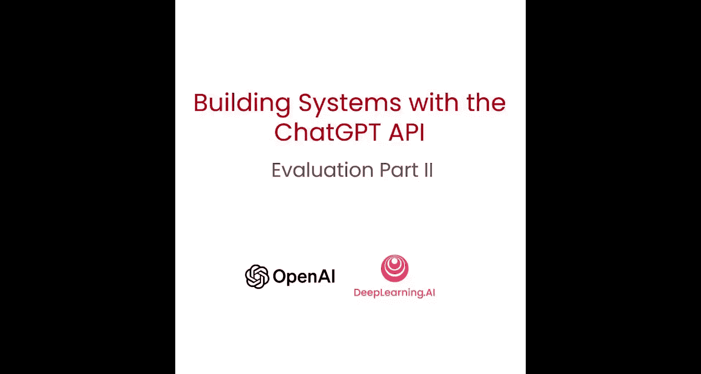
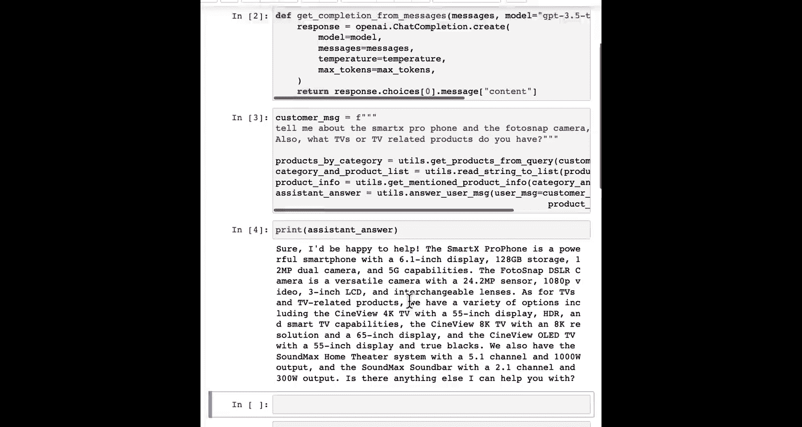
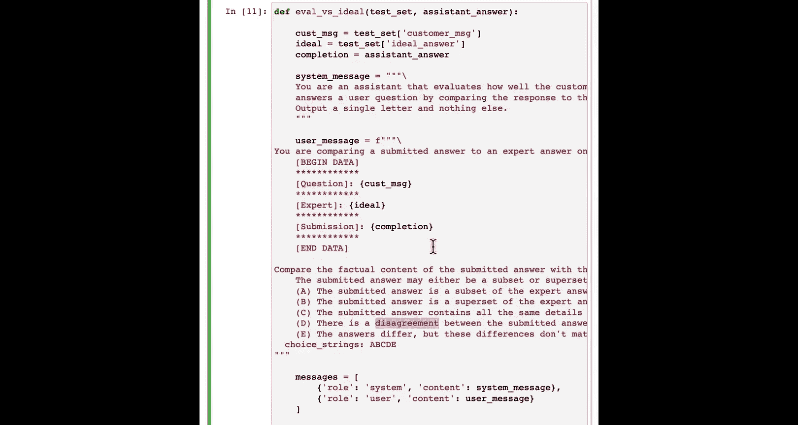

# 010：评估语言模型输出




在本节课中，我们将要学习如何评估语言模型生成的文本输出。与之前检查分类和列表是否正确不同，当模型生成的是自由文本时，评估标准更为复杂。我们将介绍两种核心的设计模式来应对这一挑战。



## 概述

上一节我们介绍了如何评估具有明确正确答案（如分类和产品列表）的语言模型输出。本节中我们来看看当语言模型用于生成自由文本时，应如何进行评估。我们将学习两种方法：一是通过制定评估标准（Rubric），二是通过对比专家提供的理想答案。

## 方法一：使用评估标准（Rubric）

当没有单一的“标准答案”时，我们可以制定一个评估标准，即一系列指导原则，从多个维度来评判回答的质量。

以下是构建评估标准的具体步骤：

1.  **定义系统角色**：首先，我们指示语言模型扮演一个评估者的角色。
    ```python
    system_message = "你是一个评估客户服务代理回答质量的助手，通过查看代理生成回答时所使用的上下文来进行评估。"
    ```

2.  **提供评估数据**：我们需要向评估模型提供原始数据。
    *   **客户消息**：用户的原始问题。
    *   **上下文**：提供给客服代理的产品和类别信息。
    *   **待评估的回答**：语言模型生成的客服回答。

3.  **制定评估维度（Rubric）**：明确列出评估回答好坏的具体标准。
    *   回答是否**仅基于**提供的上下文内容？
    *   回答是否包含了**上下文中未提供**的信息？
    *   回答与上下文之间是否存在**任何矛盾**？

4.  **执行评估**：让另一个语言模型（例如 `gpt-3.5-turbo`）根据上述标准进行评估，并输出“是/否”等判断。

通过这种方式，即使没有标准答案，我们也能系统性地评估回答的可靠性、相关性和准确性。为了获得更稳健的评估结果，可以考虑使用更强大的模型（如 `GPT-4`）来执行评估任务。

## 方法二：对比专家提供的理想答案

如果我们能获得一个由人类专家撰写的、高质量的“理想答案”，那么评估将变得更加直接和有力。

以下是使用理想答案进行评估的步骤：

1.  **准备测试数据**：创建一个测试用例，包含客户消息和对应的专家级理想答案。
    ```python
    customer_message = "告诉我关于Sx手机和相机的情况。"
    ideal_answer = "当然，Sx手机拥有...（专家撰写的详细、准确的回答）"
    ```

2.  **构建对比提示**：指示评估模型比较自动生成的回答与理想答案的匹配程度。这里可以采用来自OpenAI开源Evals框架的评估标准。
    *   要求模型从**事实内容**、**风格语法**等方面进行比较。
    *   输出一个从 **A 到 E** 的评分等级，例如：
        *   **A**：提交的答案是专家答案的子集，且完全一致。
        *   **D**：提交的答案与专家答案存在分歧。

3.  **执行对比评估**：将客户消息、理想答案和待评估的模型回答一起提交给评估模型，让它给出评分。

这种方法能更精确地衡量模型输出与高质量人类回答的接近程度。同样，为了更严谨的评估，建议使用 `GPT-4` 作为评估模型。

## 总结



本节课中我们一起学习了两种评估语言模型文本输出的有效方法。首先，我们了解了如何通过制定**评估标准（Rubric）**，在没有标准答案的情况下，系统性地评判回答质量。其次，我们探讨了如何利用**专家提供的理想答案**作为基准，通过对比来更精确地评估模型输出的优劣。掌握这些工具，可以帮助你在系统开发和上线后持续监控并提升其性能。