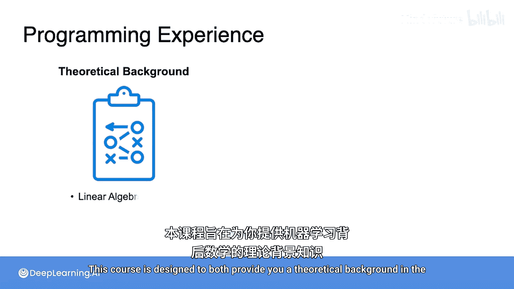
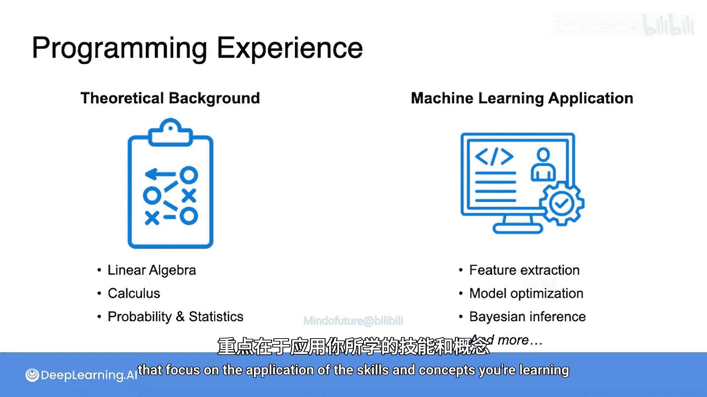
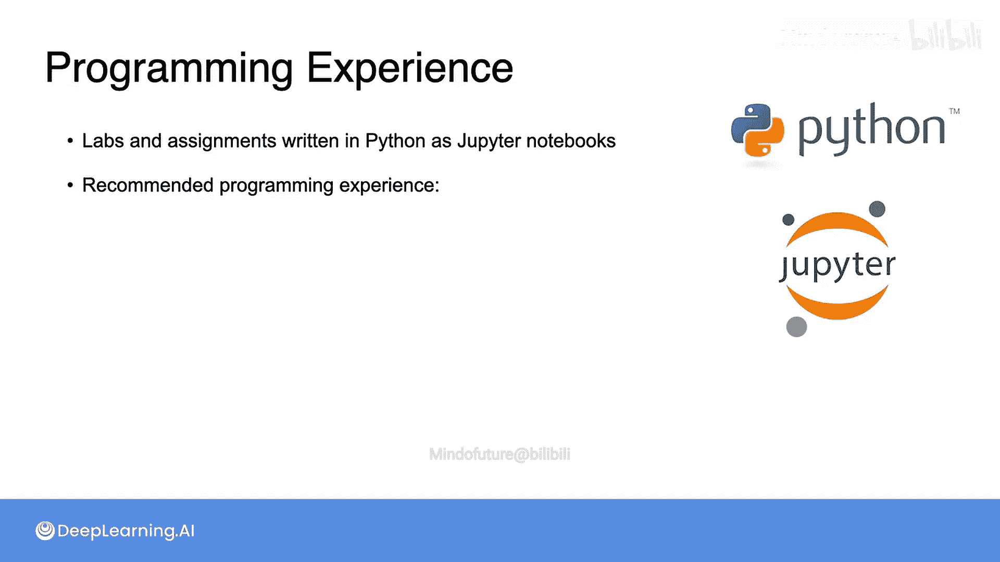
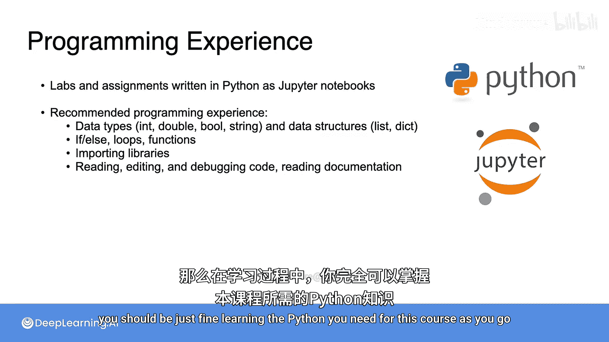
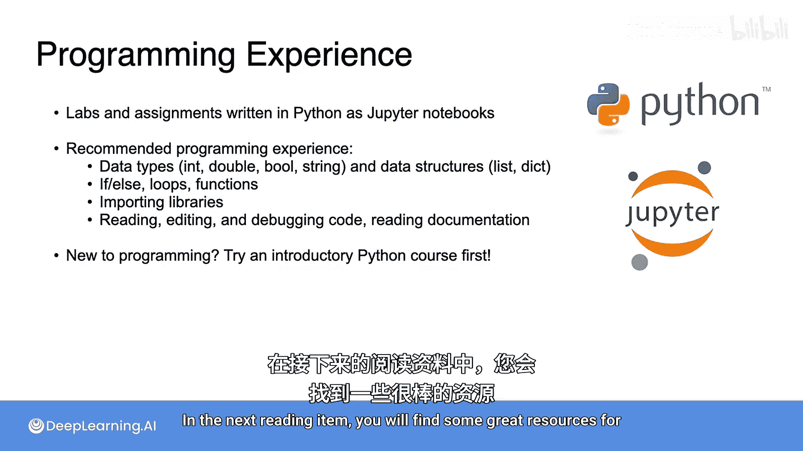

# 002：关于编程经验的说明 🐍

在本节课中，我们将要学习本课程对编程经验的要求，以及如何为课程中的实践环节做好准备。

上一节我们介绍了课程的整体目标，本节中我们来看看完成课程所需的编程技能。

## 课程设计与编程实践

本课程旨在提供机器学习背后的数学理论基础，并展示这些概念如何应用于实践。这意味着你需要进行一些编程。课程包含计分的编程作业和未计分的编程实验，这些练习专注于应用你正在学习的技能和概念。

## 编程环境与工具

这些练习使用 **Python** 编写，并以 **Jupyter Notebook** 的形式呈现。Jupyter Notebook 是一个基于网页的交互式界面，允许你阅读、运行和编辑这些程序。

## 所需的Python技能

你不需要成为Python专家即可成功完成练习，但你应该熟悉通常在Python入门课程中教授的概念。

以下是完成本课程练习所需的核心Python技能列表：

*   **数据类型与数据结构**：理解如整数、浮点数、字符串、列表、字典等基本类型。
*   **控制流**：熟练使用条件语句（`if/elif/else`）、循环（`for`、`while`）和函数定义（`def`）。
*   **库的使用**：能够导入并使用不同的Python库（例如 `import numpy as np`）。
*   **代码读写与调试**：你应该能够阅读和编辑应用了上述概念的Python代码，编写和调试自己的代码，并偶尔查阅新软件包的文档。

## 给不同背景学习者的建议

如果你精通另一种编程语言，你应该可以在学习过程中轻松掌握本课程所需的Python知识。

然而，如果你是编程新手，我建议你在开始本课程之前，先学习一门Python入门课程。在接下来的阅读材料中，你将找到一些开始学习Python的优质资源。

本节课中我们一起学习了本课程对编程能力的具体要求。掌握这些基础的Python技能，将帮助你更好地理解数学概念在代码中的实现，从而顺利完成后续的编程作业和实验。