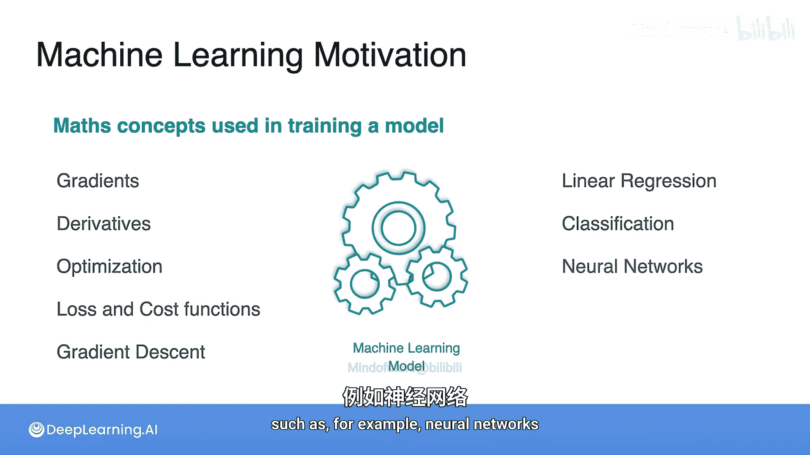

# 003：导数的直观理解与机器学习动机 🧮

在本节课中，我们将要学习导数的直观概念，并探讨为什么导数在机器学习中至关重要。我们将从速度计的例子开始，逐步了解几种基本函数的导数，并学习如何运用求导法则处理更复杂的函数。最后，我们将通过房价预测和情感分析两个具体例子，揭示导数如何驱动机器学习模型的训练与优化过程。

## 导数的直观概念

导数是微积分的核心概念之一。我最喜欢的例子是速度。

### 速度计的例子

你将要学习的第一个例子是速度计的例子。

### 基本函数的导数

接下来，你将看到数学中几种非常重要且基础的函数，例如：
*   常数函数
*   线性函数
*   二次函数
*   多项式函数
*   指数函数
*   对数函数

你将学习这些函数的导数。

## 求导法则

为了求出更复杂函数的导数，我们将使用几个法则：
*   和法则
*   乘积法则
*   链式法则
*   标量乘法法则

## 导数在机器学习中的重要性

现在有一个问题：为什么导数和微积分在机器学习中如此重要？

其中一个原因是，导数被用来优化函数，特别是用于求函数的最大值和最小值。这意味着寻找一个函数的最大值或最小值。

这在机器学习中非常重要。原因是，当你想要找到以最佳方式拟合数据的模型时，你需要通过计算一个损失函数并使其最小化来实现。

我们将看到几个最小化函数的例子。第一个例子将使用温度的例子。

然后我们将看到其他例子，这些例子实际上会向你介绍机器学习中两个最重要的损失函数：平方损失和对数损失。

## 机器学习问题实例

让我们从考虑这个问题开始：你有一些房子，每栋房子有不同数量的卧室。第一栋房子有一间卧室，第二栋房子有两间卧室。现在，第一栋房子的价格是15万美元，第二栋是25万美元。

在这个问题中，你希望能够使用房子的卧室数量来预测其价格。

幸运的是，你拥有更多关于给定卧室数量的房屋价格数据，如下表所示。

在这张表中，你有1、2、3、5、6、7、8和10间卧室的房子及其价格，然后还有这栋9间卧室的房子，其价格仍然缺失。

因此，你决定构建一个机器学习模型来帮助你预测这栋有9间卧室的房子的价格。

为了使问题更简单，让我们绘制数据。在下图中，横轴代表卧室数量，纵轴代表房屋价格。

你可以看到，房子在这里用点表示。

## 模型训练

现在的想法是，机器学习模型接收所有房屋价格的输入数据，并开始一个称为模型训练的过程。

你可以将模型训练阶段视为运行汽车最重要的部分——引擎。模型训练是任何人工智能实验的核心，在这种情况下，它实际上是一个智能引擎，始终在寻找优化的方法，以产生最佳可能的结果。

当我说模型时，在这种情况下，我指的只是一条尽可能接近所有点的直线。

这条线将代表预测价格。因此，当模型训练开始时，它从任意一条随机线开始，其想法是通过调整结果来优化对现有数据点的最佳可能预测。

一旦训练完成，模型就能够为你提供对那栋有9间卧室的房子的良好预测。因此，在这种情况下，预测这栋有9间卧室的房子的价格为95万美元。

这个问题被称为线性回归问题。

## 另一个例子：情感分析

现在，让我们考虑另一个例子。假设你旅行到一个遥远的星球，并且幸运地遇到了一些外星生命。

你能够与它们互动。第一个外星人说：“act a a”。

假设你有足够的信息知道这个外星人心情愉快。

然后，假设第二个外星人说：“beep， beep”。你知道这个外星人很悲伤。

让我们有更多的数据点。一个外星人说：“act be act”，那个外星人是快乐的。

然后它说：“Act B P Bep”，它是悲伤的。

所以，想法是你不一定想学习外星语言，因为它可能太难，但你希望能够判断一个外星人是快乐还是悲伤。

让我们看一下数据集。这是四个句子：“act act act”，“be peep”，“act beep act” 和 “act be peep peep”。

对于每一个句子，你将收集单词“act”出现的次数和单词“beep”出现的次数。

现在，你还要收集外星人的情绪。因此，这将是一个分类问题。

为什么？因为给定任何句子，其想法是将其分类为快乐或悲伤。由于你将其分类为快乐或悲伤，这被称为情感分析模型。

## 分类模型的可视化

但用图表表示一切会更清晰。因此，让我们绘制每个句子的图表。在横轴上，你有单词“act”出现的次数；在纵轴上，你有单词“beep”出现的次数。

这次的模型是什么？同样，它将是一条线。假设是这条线，嗯，这条线效果不是很好。模型的想法是能够分类或分开快乐点和悲伤点。

例如，这里有一个更好的模型。当你训练模型时，假设它到达这里的一个理想点，这个理想点将平面分成两个区域：这里用绿色显示的悲伤区域和这里用橙色显示的快乐区域。

其想法是，如果一个新的句子出现，根据它位于哪个区域，模型将预测该句子是快乐还是悲伤。模型可能会犯错，但在大多数情况下，它会做得很好，至少基于它在这个数据集上的表现。

## 模型背后的数学

那么，模型是如何做到这一点的呢？事实证明，有很多数学在驱动你的模型训练过程。

涉及的一些数学概念包括梯度、导数、优化、损失和成本函数、梯度下降等等。

因此，在本课程中，你将学习模型训练优化及其在数学核心层面的工作原理。在简单的示例中，我们使用了几个模型：我们使用线性回归和分类例子来引出问题。

但你在这里将要学习的技术和概念可以应用于广泛的其他机器学习算法，例如神经网络。

---

本节课中我们一起学习了导数的直观概念及其在机器学习中的核心作用。我们从速度的例子入手，介绍了基本函数的导数与求导法则。通过房价预测（线性回归）和情感分析（分类）两个生动的例子，我们看到了模型如何通过调整参数（如一条直线）来拟合数据或区分类别，而这个过程的核心正是基于导数（梯度）的优化算法，旨在最小化损失函数。这些基础概念是理解更复杂机器学习模型（如神经网络）的基石。