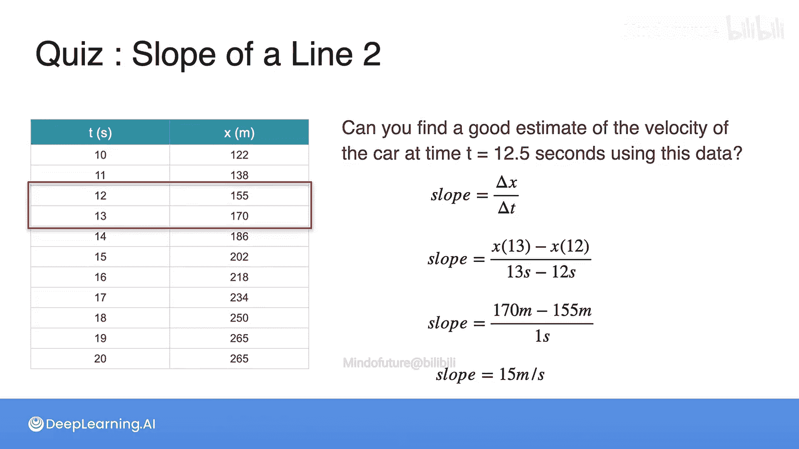

# 004：导数动机第一部分

在本节课中，我们将要学习导数的核心概念。导数描述了函数在某一瞬间的变化率，是微积分和机器学习中理解变化趋势的关键工具。我们将通过一个汽车行驶的例子，直观地理解什么是导数以及为什么我们需要它。

## 什么是导数？🚗

当我想到导数时，首先出现在脑海中的是速度。例如，假设你开车一小时行驶了100公里，那么你的平均速度是每小时100公里。然而，你的速度可能并非恒定不变：你可能起步很快，然后变慢，接着停车，之后又加速，甚至可能在某段时间倒车。因此，平均速度并不能告诉我们某一特定瞬间的速度是多少。这个特定瞬间的速度被称为**瞬时速度**，而这正是导数的定义：**导数是函数的瞬时变化率**。在这个例子中，函数是距离，它的导数就是速度。

## 一个具体的例子 📊

为了更清晰地理解导数的概念，让我们为这个例子添加一些具体数字。

想象你正驾车在一条直路上行驶。你原本有一个显示速度的速度表，但不幸的是它坏了。现在，你有一个应用程序可以告诉你行驶的距离，并且你手上恰好有一个计算器。

你驾驶了一分钟，并生成了一个数值表，记录了你每分钟5秒所行驶的距离。以下是第一个问题。

**问题一：汽车是以恒定速度行驶吗？**

提示：请查看表格中的距离数值。

**答案：** 汽车并非以恒定速度行驶。你可以看到，在10秒到15秒这个5秒间隔内，汽车行驶了80米；但在15秒到20秒这个同样为5秒的间隔内，汽车只行驶了63米。这说明从10秒到15秒，汽车的平均速度比从15秒到20秒要快。因此，我们可以得出结论：汽车在这一分钟内的速度并非恒定。

## 如何计算瞬时速度？❓

很好，你已经确定汽车不是匀速行驶。现在来看第二个问题。

**问题二：你能利用这些信息计算出在12.5秒时的瞬时速度吗？**

提示：速度等于行驶距离除以所用时间。所以，问题是：你能或不能利用表格中的数据确定12.5秒时的精确速度？

**答案：** 不能。你无法用表格中给出的数据找到12.5秒时的精确速度。你只能计算出从10秒到15秒这个时间间隔内的平均速度，但你不知道在这个间隔内的具体时刻（比如12.5秒）发生了什么——你可能比平均速度更快，也可能更慢。

然而，有一件事你可以做到：你可以计算出从10秒到15秒这个时间间隔内的平均速度。这就是下一个问题。

## 计算平均速度 📈

**问题三：汽车在10秒到15秒时间间隔内的平均速度是多少？**

让我们为表格中的点绘制一个图表，以便观察情况。我们特别放大观察点 (10, 122) 和 (15, 202)，因为这两点连线的斜率就是平均速度。

图表如下，这是我们所关注的区间。从10秒到15秒时间间隔内的平均速度，等于图表中连接这两点的直线的斜率。

速度的计算公式是 **距离 / 时间**，这与计算斜率的公式 **上升量 / 前进量** 同义。在这里，上升量是距离的变化量，前进量是时间的变化量，因为距离在纵轴上，时间在横轴上。

在15秒时行驶的距离是202米，在10秒时是122米。因此，时间间隔长度为5秒，距离间隔长度为80米。

使用斜率或速度公式，我们得到 **80 / 5 = 16 米/秒**。穿过这两点的直线斜率为16，这也意味着汽车在这两点之间的平均速度是16米/秒。

## 寻求更好的估计 🔍

虽然10秒到15秒的平均速度是T=12.5秒时速度的一个不错估计，但我们能否做得更好呢？答案是肯定的。如果我们有更多关于时间点接近t=12.5秒时的距离数据，我们就能得到更精确的估计。

假设我们进行了更精细的测量，每秒记录一次数据。这里你有了更多关于每秒行驶距离的数据，具体是从t=10秒到t=20秒的数据，如下表所示。

**问题四：你能利用这些数据，找到汽车在t=12.5秒时速度的更好估计吗？**

我们仍然无法找到12.5秒时的精确速度。但是，我们可以通过计算12秒到13秒这个时间间隔内的平均速度，来得到一个比之前更好的猜测值。

我们如何计算呢？如果斜率是距离变化量除以时间变化量，即该区间的速度，那么公式就是：
`(13秒时的距离 - 12秒时的距离) / (13秒 - 12秒)`

13秒时的距离是170米，12秒时的距离是155米，时间差是1秒。因此，我们得到的斜率是 **15米/秒**。这就是该区间的速度，并且它是t=12.5秒时瞬时速度的一个更好估计。

## 通向导数 🎯

请注意，我们仍然没有得到12.5秒时的精确速度估计。为了找到这个估计，你会怎么做？答案就是取越来越小的时间间隔。间隔越精细，估计就越准确。

这正是导数的思想：通过考察函数在某个点附近无限小的变化，来求得该点的瞬时变化率。

而这，就将我们引向了导数，这正是我们接下来要学习的内容。

## 总结 ✨

本节课中，我们一起学习了导数的动机和基本概念。我们通过汽车速度的例子了解到：
*   平均速度描述了一段时间内的整体情况。
*   瞬时速度描述了某一特定时刻的情况。
*   导数就是函数的**瞬时变化率**。
*   通过计算越来越小区间内的平均变化率，我们可以无限逼近某一点的瞬时变化率（即导数）。

理解这个从平均变化率到瞬时变化率（导数）的过渡，是掌握微积分核心思想的关键一步。