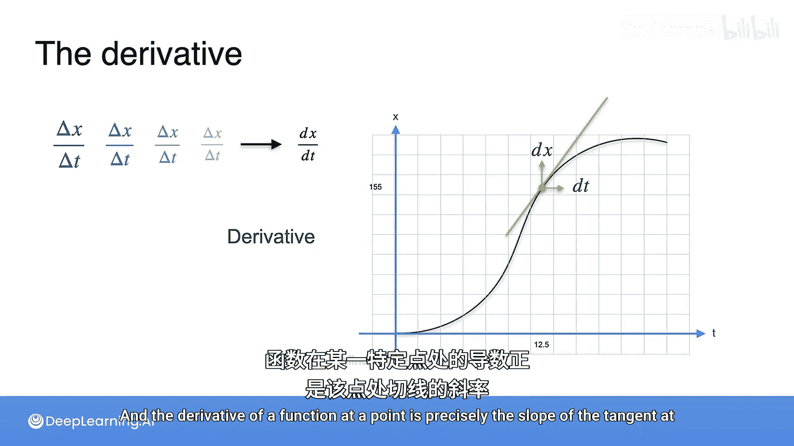

# 005：导数与切线

在本节课中，我们将要学习瞬时速度的概念，并理解它如何与导数以及函数图像上的切线斜率联系起来。

## 概述

上一节我们介绍了如何计算一个时间区间内的平均速度。本节中我们来看看如何定义和估算一个特定时间点的瞬时速度，并揭示其与导数这一核心概念的紧密关系。

## 瞬时速度的估算

计算一个精确时间点（例如 t = 12.5）的瞬时速度可能很困难，但我们可以通过估算来逼近它。

以下是估算瞬时速度的步骤：

1.  在目标点（t = 12.5）的右侧选取另一个点。
2.  计算这两个点之间的平均速度，即距离变化量 `Δx` 除以时间变化量 `Δt`，这代表了图中连接这两点的直线的斜率。
3.  这个平均速度并非 t = 12.5 时的瞬时速度。
4.  为了获得更接近瞬时速度的估算值，我们可以缩小时间区间。选取一个更靠近 t = 12.5 的点。
5.  计算这个新区间内的平均速度，即新的 `Δx` 除以新的 `Δt`，这对应一条新的、更陡峭的直线的斜率。
6.  继续将点选得离 12.5 越来越近，甚至近到难以区分。

## 从极限到导数与切线

当我们想象将右侧的点无限接近 t = 12.5 时，就得到了一个极限。这个极限被记作 `dx/dt`。

这个 `dx/dt` 正是曲线在 t = 12.5 这一点的切线的斜率。

因此，距离随时间变化的快慢程度，即瞬时变化率，就是该点切线的斜率。

更一般地说，瞬时变化率衡量的是两个变量之间的关系在任意一点变化的快慢程度。

换句话说，想象在极短的时间间隔 `dt` 内移动了极小的距离 `dx`，`dx/dt` 就是瞬时变化率，它也被称为**导数**。

**一个函数在某一点的导数，就是该点切线的精确斜率。**

## 总结

本节课中我们一起学习了瞬时速度的概念。我们了解到，通过取时间区间平均速度的极限，可以得到瞬时速度。这个极限值就是导数 `dx/dt`，它在几何上表示为函数曲线在该点切线的斜率。因此，导数本质上是函数在特定点的瞬时变化率。