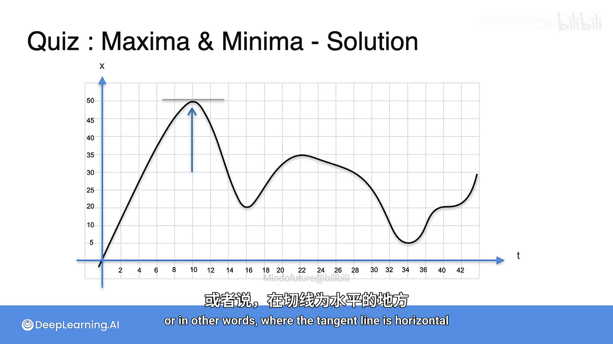

# 006：斜率、最大值与最小值

在本节课中，我们将学习导数的一个非常有趣的性质。我们将通过一个具体的例子，探索函数的斜率如何揭示其最大值和最小值的位置。

## 回顾与观察

上一节我们介绍了导数的概念，它代表了函数在某一点的瞬时变化率，即切线的斜率。现在，让我们回到之前讨论过的汽车距离与时间的表格数据，但这次我们只关注19秒到20秒之间的这一小段。

请注意，在19秒时，距离是265米；在20秒时，距离也是265米。两点间的距离相同，这暗示汽车可能在这个时间间隔内没有移动。我们假设它完全没有移动。

因此，19秒到20秒之间的这段图像看起来是一条水平线。而一条水平线的斜率是0。

以下是计算过程：斜率等于距离的变化量除以时间的变化量。距离的变化量是20秒时的距离减去19秒时的距离，即 `265 - 265 = 0`。时间的变化量是1秒。所以，斜率是 `0 / 1 = 0` 米/秒。

## 分析汽车的运动轨迹

现在，让我们在右侧绘制汽车完整的运动轨迹。首先，汽车向前行驶，然后停止，接着向后行驶，再次停止，又向前行驶，再向后行驶，最后再次向前。

基于这个轨迹，这里有一个问题：在哪些点上，汽车的速度为零？

如果你回答：在任何切线为水平线的点上，因为水平切线的斜率为0，那么你是正确的。这些点就是汽车停止的时刻。总共有五个这样的点。

接下来是另一个问题：汽车在哪个时刻距离起点最远？

答案是图中距离为50米的那个点，因为这是整个图表中能找到的最高距离值。

## 最大值、最小值与导数的关系

现在，请注意一个有趣的现象：距离最远的点，恰好也是汽车停止的点之一。这并非巧合，因为如果汽车仍在移动，它就有可能走得更远。

因此，汽车距离最远的点，必然是汽车不动的点。这意味着：**如果你想找到一个函数的最大值或最小值，它通常出现在导数为零的点上**。换句话说，出现在切线为水平线的点上。

## 总结

本节课中，我们一起学习了导数的一个重要应用。我们通过分析汽车运动的例子，发现函数在达到局部最大值或最小值时，其切线通常是水平的，即该点处的导数为零。这个性质是微积分中寻找函数极值点的核心方法之一。