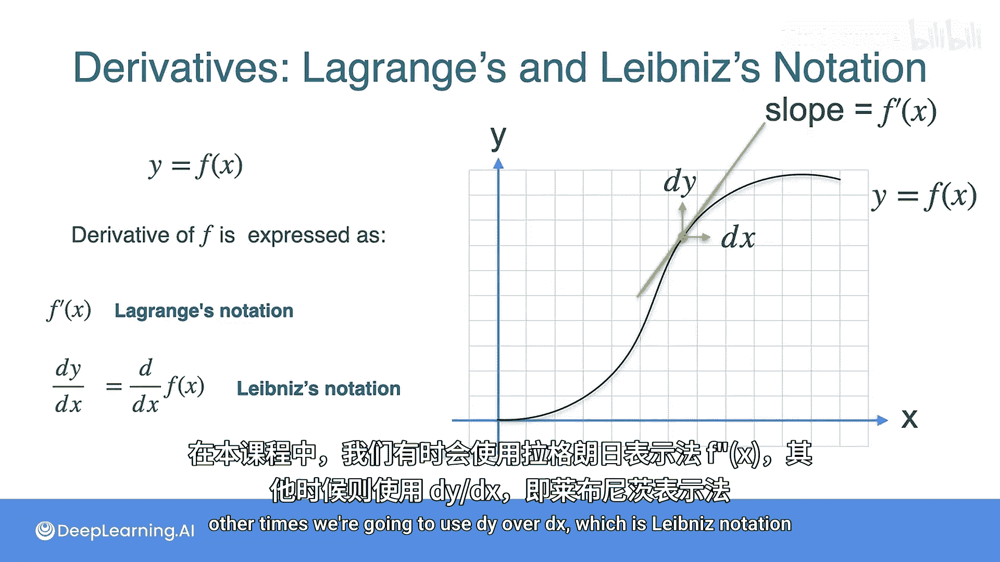

# 007：导数及其表示法 📚

在本节课中，我们将学习导数的两种主要数学表示法：莱布尼茨记法和拉格朗日记法。理解这些记法对于后续深入学习微积分至关重要。

## 导数的概念回顾

上一节我们介绍了导数的核心概念，即函数在某一点的瞬时变化率。本节中，我们来看看如何用数学符号精确地表示导数。

首先，回忆一下斜率是如何计算的。对于一条直线，斜率是垂直方向的变化量除以水平方向的变化量。在距离-时间图中，这表示为 **Δx / Δt**。

当我们想求曲线上某一点的切线斜率时，需要将时间间隔 **Δt** 取得非常小，直至趋近于零。此时，距离的变化量 **Δx** 也趋近于无穷小。这个极限状态下的斜率，我们称之为导数，记作 **dx / dt**。这里的 **dx** 和 **dt** 代表在 **x** 方向和 **t** 方向上的无穷小变化。

## 导数的两种表示法

在更一般的情况下，我们通常用 **x** 表示自变量（横轴），用 **y** 表示因变量（纵轴）。因此，导数通常写作 **dy / dx**。

假设我们有一个函数 **y = f(x)**。这个函数的导数有两种等价的表示方式：

以下是两种主要的导数记法：

1.  **拉格朗日记法**：记作 **f'(x)**。这个符号直接表示函数 **f** 在点 **x** 处的导数值。
2.  **莱布尼茨记法**：记作 **dy / dx**。它也可以写作 **d/dx [f(x)]**。在这里，**d/dx** 可以被看作一个“算子”，当它作用于函数 **f(x)** 时，就得到了该函数的导数。

## 记法的选择与应用

在本课程中，我们会根据具体情境的便利性，交替使用 **f'(x)** 和 **dy / dx** 这两种记法。它们表达的是完全相同的数学概念。

本节课中我们一起学习了导数的两种标准数学表示法：拉格朗日的 **f'(x)** 和莱布尼茨的 **dy / dx**。理解并熟练运用这两种记法，是掌握微积分语言的基础。在接下来的课程中，我们将使用这些工具来计算各种函数的导数。