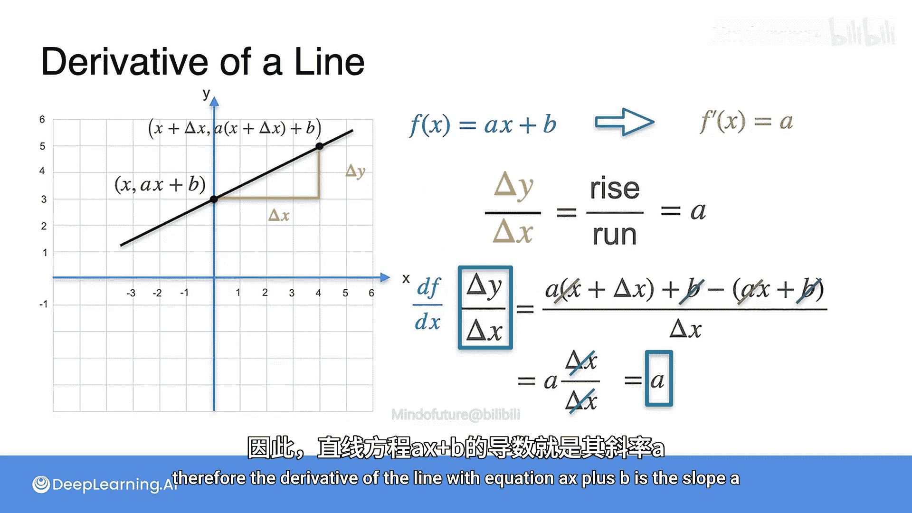

# 008：常见导数-线性函数

在本节课中，我们将学习如何计算一些常见函数的导数。我们的目标是能够计算大多数已知函数的导数。我们从最简单的函数开始，包括常数函数、线性函数、二次函数、多项式函数、指数与对数函数以及三角函数。这些函数的导数形式通常非常简洁明了。

## 常数函数的导数

首先，我们从最简单的线性情况开始，即常数函数，其图像是一条水平线。

这个函数的特点是，在任意点（例如 `x0` 和 `x1`）的函数值（高度）始终相同，都等于某个常数 `C`。`C` 可以是任何数字，如 -17、3.5 等，只要它保持不变。

现在，我们计算该函数在 `x0` 处的导数。该点的切线斜率与整条线的斜率相同。斜率是 Δy / Δx。由于 `y` 始终等于 `C`，所以 Δy 总是 `C - C = 0`。只要 `x0` 不等于 `x1`，分母 Δx 就不为零。因此，这个斜率始终为 0。

我们得出结论：**水平线（即常数函数）的导数始终为 0**。

## 线性函数的导数

接下来，我们考虑一般的非水平直线。其方程可以表示为：

**f(x) = ax + b**

其中，`a` 是斜率，`b` 是 y 轴截距。

这个函数的导数非常简单。我们取一个点（例如图中所示点），通过计算 Δy / Δx 来求其斜率。这个比值就是“上升量除以前进量”，结果就是斜率 `a`。

需要注意的是，当第二个点无限接近第一个点时，切线的斜率保持不变。原因与常数函数类似：对于一条直线，其上任意一点的切线斜率都与整条直线的斜率相同，即 `a`。

因此，直线方程 **f(x) = ax + b** 的导数 **f'(x) = a**。

以下是具体的数学推导过程：

取两个点：
*   点1坐标为 `(x, ax + b)`
*   点2坐标为 `(x + Δx, a(x + Δx) + b)`

计算斜率：
*   Δy = `[a(x + Δx) + b] - [ax + b] = aΔx`
*   Δx = `Δx`
*   斜率 = Δy / Δx = `(aΔx) / Δx = a`

因此，直线方程 **f(x) = ax + b** 的导数就是其斜率 **a**。

## 总结

本节课中，我们一起学习了两种基本函数的导数计算：
1.  **常数函数 f(x) = C** 的导数为 **f'(x) = 0**。
2.  **线性函数 f(x) = ax + b** 的导数为 **f'(x) = a**，即其斜率。

理解这些基础函数的导数为我们后续学习更复杂函数的微分奠定了基础。