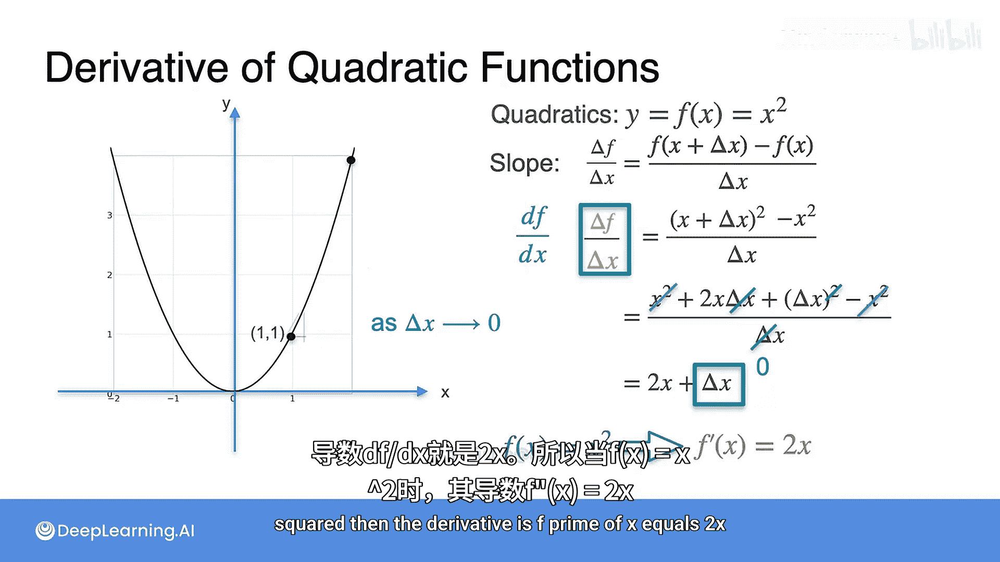

# 009：常见导数-二次函数


## 概述
在本节课中，我们将要学习如何计算二次函数的导数。我们将从最简单的二次函数 `y = x²` 入手，通过直观的示例和严谨的推导，理解其导数的计算过程与几何意义。

---

## 从线性函数到二次函数
上一节我们介绍了线性函数的导数。本节中我们来看看一个稍微复杂一点的函数：二次函数。

最简单的二次函数是抛物线，其方程为 `y = x²`。让我们来观察它的导数。

请注意，在y轴左侧，函数图像的切线斜率为负；在y轴右侧，切线斜率为正。

导数的公式是当 `Δx` 趋近于0时，`Δf / Δx` 的极限。其中，`Δf` 是y值或函数值 `f` 的变化量，即 `(x + Δx)² - x²`。

---

## 通过示例理解导数计算
在正式推导之前，我们先看一个具体的例子。当 `x = 1` 时，`y = x² = 1`。让我们计算几个不同 `Δx` 下的割线斜率，并观察它们如何趋近于切线斜率。

以下是计算过程：

*   **当 Δx = 1 时**
    *   `Δf = (1+1)² - 1² = 4 - 1 = 3`
    *   斜率 = `Δf / Δx = 3 / 1 = 3`

*   **当 Δx = 0.5 时**
    *   `Δf = (1+0.5)² - 1² = 2.25 - 1 = 1.25`
    *   斜率 = `1.25 / 0.5 = 2.5`

*   **当 Δx = 0.25 时**
    *   `Δf = (1+0.25)² - 1² = 1.5625 - 1 = 0.5625`
    *   斜率 = `0.5625 / 0.25 = 2.25`

*   **当 Δx = 0.125 时**
    *   斜率趋近于 `2.125`

*   **当 Δx = 0.0625 时**
    *   斜率趋近于 `2.0625`

*   **当 Δx = 0.001 时**
    *   斜率趋近于 `2.001`

随着 `Δx` 越来越小，斜率的值越来越接近 `2`。因此，在 `x = 1` 处的切线斜率就是 `2`。

注意到 `2` 等于 `2 * 1`，这引出了最终的导数公式。

---

## 二次函数导数的正式推导
现在，让我们正式推导 `f(x) = x²` 的导数。

根据定义，导数 `df/dx` 是以下表达式的极限：
```
df/dx = lim (Δx -> 0) [Δf / Δx]
```
其中：
```
Δf = f(x + Δx) - f(x) = (x + Δx)² - x²
```
将 `Δf` 代入极限表达式：
```
df/dx = lim (Δx -> 0) [((x + Δx)² - x²) / Δx]
```
展开 `(x + Δx)²`：
```
df/dx = lim (Δx -> 0) [(x² + 2xΔx + (Δx)² - x²) / Δx]
```
消去 `x²` 和 `-x²`：
```
df/dx = lim (Δx -> 0) [(2xΔx + (Δx)²) / Δx]
```
分子分母同时除以 `Δx`：
```
df/dx = lim (Δx -> 0) [2x + Δx]
```
当 `Δx` 趋近于0时，`Δx` 项消失，得到最终结果：
```
df/dx = 2x
```
因此，对于函数 `f(x) = x²`，其导数 `f'(x) = 2x`。

---



## 总结
本节课中我们一起学习了二次函数 `y = x²` 的导数计算。我们首先通过一个具体的数值示例（`x=1`）观察了割线斜率如何随着区间变小而趋近于切线斜率 `2`。随后，我们通过极限的正式推导，得出了其导数的通用公式 `f'(x) = 2x`。这个公式表明，二次函数在某一点的切线斜率与该点的 `x` 坐标成正比。