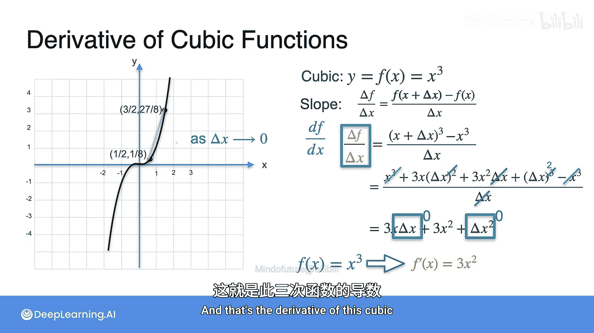

# 010：常见导数-高次多项式

在本节课中，我们将学习如何计算高次多项式函数的导数，特别是三次函数。我们将通过具体的例子和计算过程，理解导数的定义及其应用。

## 从二次函数到三次函数

上一节我们介绍了线性函数和二次函数的导数。本节中，我们来看看三次函数。最简单的三次函数是 **y = x³**，其图像如下所示。

图中也展示了一些切线及其斜率。计算斜率的公式与之前类似，依然是基于导数的定义：

**公式：** `f'(x) = lim (Δx→0) [ (f(x+Δx) - f(x)) / Δx ]`

对于函数 **f(x) = x³**，其导数公式为：

**公式：** `f'(x) = lim (Δx→0) [ ((x+Δx)³ - x³) / Δx ]`

当 Δx 趋近于 0 时，这个极限值就是切线的斜率，也就是导数。

## 通过实例计算斜率

让我们通过一个具体例子来理解这个过程。假设 **x = 0.5**，那么 **y = (0.5)³ = 0.125**。

以下是计算不同 Δx 值下割线斜率的过程，这些值将帮助我们逼近切线的真实斜率：

*   **当 Δx = 1 时：**
    *   `f(x+Δx) = (0.5+1)³ = (1.5)³ = 3.375`
    *   `Δf = f(x+Δx) - f(x) = 3.375 - 0.125 = 3.25`
    *   **斜率 = Δf / Δx = 3.25 / 1 = 3.25**

*   **当 Δx = 0.5 时：**
    *   `f(x+Δx) = (0.5+0.5)³ = (1)³ = 1`
    *   `Δf = 1 - 0.125 = 0.875`
    *   **斜率 = 0.875 / 0.5 = 1.75**

*   **当 Δx = 0.25 时：**
    *   `Δf ≈ 0.297`
    *   **斜率 ≈ 1.188**

*   **当 Δx = 0.125 时：**
    *   `Δf ≈ 0.119`
    *   **斜率 ≈ 0.95**

*   **当 Δx = 0.0625 时：**
    *   **斜率 ≈ 0.85**

*   **当 Δx = 0.001 时：**
    *   **斜率 ≈ 0.752**

观察这些结果，随着 Δx 越来越小，割线的斜率逐渐趋近于 **0.75**。这个值就是函数在 **x=0.5** 处的导数 **f'(0.5)**。

实际上，**f'(0.5) = 3 * (0.5)² = 3 * 0.25 = 0.75**。这是因为 **x³** 的导数是 **3x²**。

## 推导三次函数的导数公式

现在，让我们正式推导 **f(x) = x³** 的导数公式。

根据定义：
`f'(x) = lim (Δx→0) [ ((x+Δx)³ - x³) / Δx ]`

首先，展开 `(x+Δx)³`：
`(x+Δx)³ = x³ + 3x²Δx + 3x(Δx)² + (Δx)³`

代入公式：
`f'(x) = lim (Δx→0) [ (x³ + 3x²Δx + 3x(Δx)² + (Δx)³ - x³) / Δx ]`

分子中的 `x³` 和 `-x³` 相互抵消：
`f'(x) = lim (Δx→0) [ (3x²Δx + 3x(Δx)² + (Δx)³) / Δx ]`

每一项都除以 Δx：
`f'(x) = lim (Δx→0) [ 3x² + 3xΔx + (Δx)² ]`

现在，让 Δx 趋近于 0。任何包含 Δx 的项（`3xΔx` 和 `(Δx)²`）都会变为 0。唯一保留下来的项是 `3x²`。

因此，我们得到：
**公式：** `如果 f(x) = x³，那么 f'(x) = 3x²`

这就是三次函数 **x³** 的导数。

## 总结

本节课中，我们一起学习了如何计算三次多项式函数 **y = x³** 的导数。我们通过具体的数值计算，观察了当 Δx 减小时，割线斜率如何逼近切线的真实斜率（即导数）。最后，我们通过代数推导，得出了 **x³** 的导数公式为 **3x²**。这个过程清晰地展示了导数定义的应用和幂函数求导的规律。