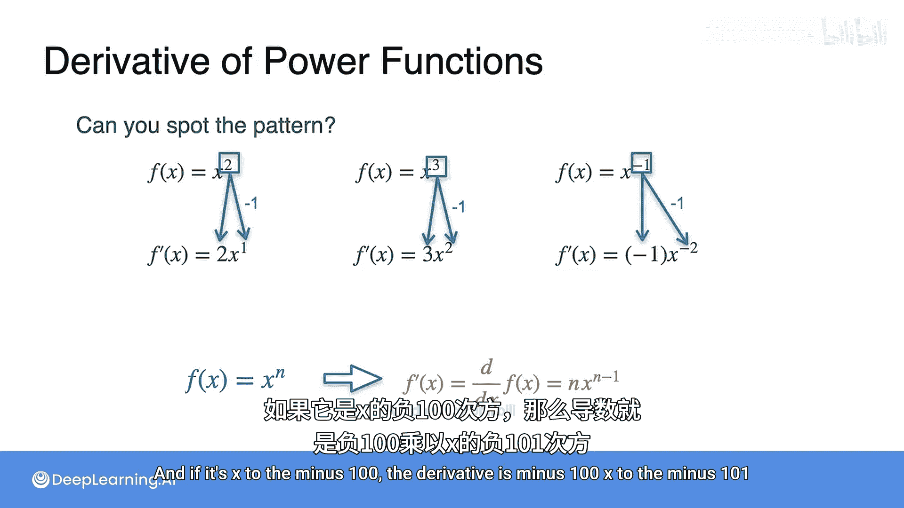

# 011：常见导数-其他幂函数

在本节课中，我们将要学习如何计算更复杂的幂函数的导数，特别是形如 `1/x` 的函数。我们将通过具体的计算和观察，推导出适用于所有幂函数的通用求导公式。

上一节我们介绍了多项式的导数，本节中我们来看看一个更复杂的函数：`1/x`。

这是一个双曲线函数，图像如上图所示。让我们观察一下它在某些点上的切线。

这个函数看起来更复杂，但实际计算过程相当简单。我们将计算 `(f(x+Δx) - f(x)) / Δx`。

让我们看 `x=1` 和 `y=1` 这个点。像之前一样，取一些区间进行计算。

如果水平方向的区间长度为1，即 `Δx = 1`，那么 `Δf` 是多少？

`Δf` 是垂直方向的变化量。对于 `x=1`，计算 `(1/(1+1)) - (1/1)`，结果是 `1/2 - 1 = -0.5`。因此，斜率是 `-0.5 / 1 = -0.5`。

现在减小区间长度，让 `Δx = 1/2`。如果 `Δx` 是 `1/2`，那么 `Δf` 是多少？

计算 `1/(1+0.5) - 1/1`，即 `2/3 - 1 = -1/3`。`Δx` 是 `0.5`，所以斜率是 `(-1/3) / 0.5 = -2/3 ≈ -0.67`。

让我们继续计算更多值。当 `Δx = 1/4` 时，斜率约为 `-0.8`；当 `Δx = 1/8` 时，斜率约为 `-0.89`；当 `Δx = 1/16` 时，斜率约为 `-0.94`；当 `Δx = 1/100,000` 时，斜率约为 `-0.999`。可以看到，随着 `Δx` 趋近于0，斜率趋近于 `-1`。因此，该点的导数是 `-1`。

这个 `-1` 实际上是 `-1 * 1²` 的值。因为当 `f(x) = 1/x` 时，其导数是 `-1 * x^(-2)`。让我们通过计算来确认这一点。

`Δf / Δx` 的表达式是 `(1/(x+Δx) - 1/x) / Δx`。

让我们将其写为 `(1/(x+Δx) - 1/x) / Δx`，并将分子通分：`(x - (x+Δx)) / (x(x+Δx)) / Δx`。

分子中的 `x` 和 `-x` 抵消，得到 `(-Δx) / (x(x+Δx)) / Δx`。

我们可以将分子分母同时乘以 `1/Δx`，得到 `-1 / (x(x+Δx))`。

现在，当 `Δx` 趋近于0时，分母中的 `x(x+Δx)` 趋近于 `x²`。因此，我们得到 `-1 / x²`。

所以，如果 `f(x) = x^(-1)`，那么 `f'(x) = -1 * x^(-2)`。

让我们总结一下目前学到的内容。我们已经计算了 `x²`、`x³` 和 `x^(-1)` 的导数。以下是结果：

以下是已计算的导数：
*   `x²` 的导数是 `2x¹`。
*   `x³` 的导数是 `3x²`。
*   `x^(-1)` 的导数是 `-1 * x^(-2)`。

你能发现其中的规律吗？这三个例子遵循一个非常优美的模式，并且适用于任何幂函数。

观察指数部分。在求导后，原指数会作为乘法因子出现在前面，然后新指数是原指数减1。

以下是模式的具体体现：
*   `x²` 变成 `2x¹`。
*   `x³` 变成 `3x²`。
*   `x^(-1)` 变成 `-1 * x^(-2)`。

那么，对于 `x^n` 会发生什么呢？对于 `x^n`，指数 `n` 会“下来”变成系数 `n`，而新的指数变为 `n-1`。因此，导数是 `n * x^(n-1)`。

所以，如果你有任何幂函数，例如 `x^100`，其导数是 `100 * x^99`。如果是 `x^(-100)`，其导数是 `-100 * x^(-101)`。

本节课中我们一起学习了如何计算 `1/x` 这类幂函数的导数，并通过观察规律，推导出了适用于所有幂函数 `x^n` 的通用求导公式：`f'(x) = n * x^(n-1)`。这个强大的公式是微积分中的基础工具之一。

