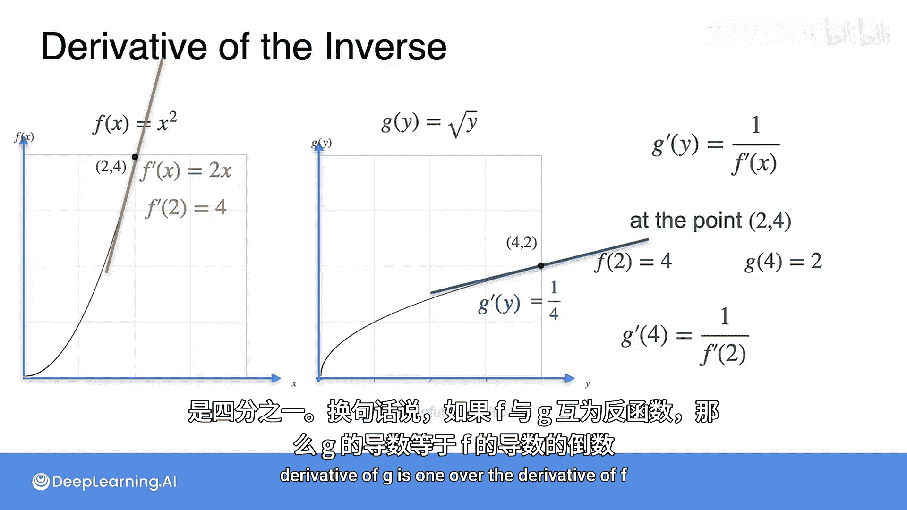

# 012：反函数及其导数

## 概述
在本节课中，我们将要学习一个重要的概念——反函数。理解反函数及其导数之间的关系，将帮助我们求出更多函数的导数。我们将从反函数的定义出发，通过图像和具体例子，直观地理解原函数与其反函数在导数上的联系。

---

## 什么是反函数？
上一节我们学习了几个基本函数的导数。本节中，我们来看看反函数的概念。如果一个函数执行了某种操作，那么它的反函数就是执行相反操作、撤销原函数作用的函数。

例如，如果函数 **F** 将数字 **3** 映射为数字 **5**，那么反函数就会将数字 **5** 映射回数字 **3**。

一个直观的比喻是：假设有一个人，函数 **F** 给他戴上了一顶帽子。那么，作为反函数的 **G** 需要做的就是摘掉这顶帽子，让人恢复原样。换句话说，反函数执行的是与 **F** 相反的操作。

在数学例子中，假设变量是 **x**，函数 **F** 给它“戴上帽子”，即计算其平方。那么函数 **G** 就需要“摘掉帽子”，即计算平方根。在正式定义 **F** 和 **G** 之前，我们先看一下相关符号。

---

## 反函数的符号与定义
如果 **g(x)** 和 **f(x)** 互为反函数，我们将其写作：
`g(x) = f^{-1}(x)`
请注意，这里的上标 `-1` 并非表示 `1/f(x)`，而仅仅是一个表示反函数的符号。

反函数的核心性质是：如果你对 **x** 先应用 **f**，再应用 **g**，就会得到最初的 **x**。本质上，**g** 撤销了 **f** 的操作。

以下是互为反函数的函数对示例：
*   **f(x) = x²**
*   **g(x) = √x** （这里我们仅考虑 **x ≥ 0** 且取正平方根的情况）

原因在于：`g(f(x)) = √(x²) = x` （当 **x ≥ 0** 时）。

---

## 反函数导数的直观理解
反函数的导数关系非常美妙。让我们观察函数 **f(x) = x²** 和其反函数 **g(y) = √y** 的图像。

请注意，左右两图的坐标轴单位和变量名可能不同。左图的横轴是 **x**，右图的横轴是 **y**。关键点在于：如果一个点 **(a, b)** 出现在左图（即 `f(a) = b`），那么点 **(b, a)** 就会出现在右图（即 `g(b) = a`）。

例如：
*   左图有点 **(0.5, 0.25)**，因为 `0.5² = 0.25`。
*   右图则有点 **(0.25, 0.5)**，因为 `√0.25 = 0.5`。

右图本质上是左图关于直线 **y = x** 的镜像反射。因此，这两条曲线在对应点处的切线斜率必然存在紧密联系。

---

## 从割线斜率到切线斜率
让我们通过计算割线斜率来探索这种联系。考虑点 **(1, 1)** 和 **(1.5, 2.25)** 在左图构成的割线，以及其对应点 **(1, 1)** 和 **(2.25, 1.5)** 在右图构成的割线。

*   左图割线斜率 = **Δf / Δx**
*   右图割线斜率 = **Δg / Δy**

由于图像是镜像关系，左图的水平变化量 **Δx** 等于右图的垂直变化量 **Δg**；左图的垂直变化量 **Δf** 等于右图的水平变化量 **Δy**。

因此，右图的斜率 **Δg / Δy** 就等于 **Δx / Δf**。

当 **Δx** 和 **Δy** 趋近于 0 时，割线变为切线：
*   `f'(x) = df/dx`
*   `g'(y) = dg/dy`

结合上面的关系，我们得到核心公式：
`g'(y) = 1 / f'(x)`
其中，`x` 和 `y` 满足 `y = f(x)` 或等价地 `x = g(y)`。

这个公式说明：**如果两个函数互为反函数，那么其中一个函数在某点的导数，等于另一个函数在对应点的导数的倒数。**

---

## 具体示例验证
让我们在一个坐标单位统一的图像中验证这个公式。观察 **f(x)=x²** 和 **g(y)=√y** 在对应点的切线。

**示例一：点 (1, 1)**
*   在左图（`f(x)`），`f'(x)=2x`，所以在 `x=1` 处，斜率 `f'(1)=2`。
*   在右图（`g(y)`），根据公式，`g'(1) = 1 / f'(1) = 1/2`。
*   结果：左图切线斜率为 **2**，右图切线斜率为 **1/2**，互为倒数。

**示例二：点 (2, 4) 与 (4, 2)**
*   左图点 (2, 4)：`f'(2) = 2*2 = 4`。
*   右图对应点 (4, 2)：`g'(4) = 1 / f'(2) = 1/4`。
*   结果再次验证了公式：**4** 和 **1/4** 互为倒数。

---

## 总结
本节课中，我们一起学习了反函数及其导数的核心知识。我们首先定义了反函数是“撤销”原函数操作的函数。然后，通过分析图像和割线，我们推导出了反函数导数的重要关系：如果 `g` 是 `f` 的反函数，那么 `g'(y) = 1 / f'(x)`，其中 `y = f(x)`。最后，我们通过 `f(x)=x²` 和 `g(x)=√x` 的例子验证了这一公式。掌握这个关系，能让我们在已知一个函数导数的情况下，轻松求出其反函数的导数。