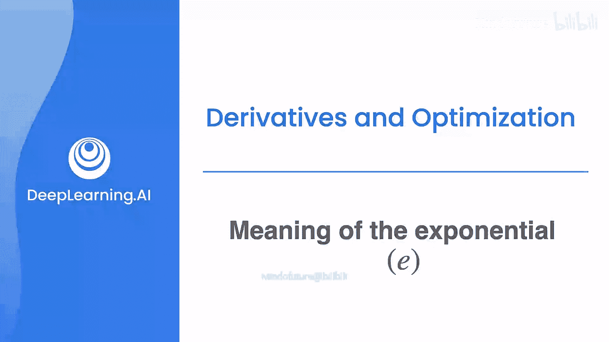
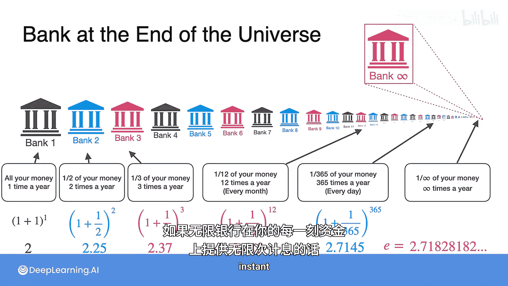

# 014：指数函数e的含义 📈

在本节课中，我们将学习数学中一个极其重要的函数——指数函数。为此，我们首先需要理解一个特殊的常数：欧拉数 e。

## 欧拉数 e 的定义

欧拉数 e 在数学的许多分支中都有出现，它可以通过多种方式定义。

一种定义方式是它的数值：**e ≈ 2.71828182...**。这个小数永远不会终止，因为 e 是一个无理数，这意味着它不能表示为两个整数的比值。

另一种定义方式是使用极限表达式：**e = lim_{n→∞} (1 + 1/n)^n**。

让我们看看这个表达式在不同 n 值下的结果：
*   当 n=1 时，结果为 (1 + 1/1)^1 = 2。
*   当 n=10 时，结果为 (1 + 1/10)^10 ≈ 2.594。
*   当 n=100 时，结果为 (1 + 1/100)^100 ≈ 2.705。
*   当 n=1000 时，结果为 (1 + 1/1000)^1000 ≈ 2.717。

可以观察到，随着 n 不断增大，这个值会越来越接近一个特定的数，即 **e ≈ 2.71828182...**。

## e 的一个重要性质

以 e 为底的指数函数 **f(x) = e^x** 有一个非常独特的性质：它是它自身的导数。也就是说，**f'(x) = e^x**。这个性质使得 e 在科学、统计学、概率论等众多领域频繁出现。

上一节我们介绍了 e 的数学定义，本节中我们通过一个生动的例子——银行利息问题，来直观理解 e 的含义。

## 通过银行利息问题理解 e

假设你在寻找一家最好的银行来存钱。

以下是三家银行的方案：
*   **银行1**：每年年底一次性支付 100% 的利息。
*   **银行2**：每六个月支付 50% 的利息。
*   **银行3**：每四个月支付 33.33% 的利息。

问题是：哪家银行最好？

答案是：**银行3** 是这三家中最好的。让我们通过计算来验证。

假设你初始存入 1 美元。

**银行1**：
一年后，你得到本金 1 美元 + 利息 1 美元 = **2 美元**。
我们可以将其表示为：**1 + 1 = (1 + 1/1)^1 = 2**。

**银行2**：
*   六个月后：1 + 0.5 = 1.5 美元。
*   一年后：1.5 + (1.5 * 0.5) = 2.25 美元。
这相当于每半年你的资金乘以 (1 + 1/2)，所以一年后总额为：**(1 + 1/2)^2 = 2.25** 美元。

**银行3**：
*   四个月后：1 + 1/3 ≈ 1.333 美元。
*   八个月后：1.333 + (1.333 * 1/3) ≈ 1.777 美元。
*   一年后：1.777 + (1.777 * 1/3) ≈ 2.370 美元。
这相当于每四个月你的资金乘以 (1 + 1/3)，所以一年后总额为：**(1 + 1/3)^3 ≈ 2.370** 美元。

可以看到，2.370 > 2.25 > 2。银行3更好的原因在于 **复利** 效应：你获得的利息会立刻开始产生新的利息，利滚利使得最终收益更高。

如果时间拉长到四年，差异会更加明显：
*   银行1：16 美元
*   银行2：约 25.63 美元
*   银行3：约 31.57 美元

## 推广到更频繁的复利

那么，是否存在比这三家更好的银行呢？当然，复利结算得越频繁，最终收益就越高。

让我们看看 **银行12**，它每月支付 1/12 的利息。
一年后，你的资金将变为：**(1 + 1/12)^12 ≈ 2.613** 美元。这比银行3的 2.370 美元要多。

我们可以将此推广到一般情况。**银行N** 将一年分成 n 个间隔，每个间隔支付 1/n 的利息。
*   第一个间隔后：1 + 1/n
*   第二个间隔后：(1 + 1/n)^2
*   ...
*   第 k 个间隔后：(1 + 1/n)^k
*   一年后（第 n 个间隔后）：**(1 + 1/n)^n**

n 可以非常大，例如：
*   **银行365**（每日计息）：(1 + 1/365)^365 ≈ 2.7145 美元。

## 逼近欧拉数 e

现在，想象一家终极银行——**银行∞**。它每时每刻都在以无限小的份额（1/∞）为你结算利息，结算次数无限多（∞次/年）。

那么，银行∞在一年后能给你多少钱呢？这不再是简单的算术，而是一个极限问题：
**lim_{n→∞} (1 + 1/n)^n**

回顾我们之前的结果序列：
*   银行1: (1 + 1/1)^1 = 2
*   银行2: (1 + 1/2)^2 = 2.25
*   银行3: (1 + 1/3)^3 ≈ 2.370
*   银行12: (1 + 1/12)^12 ≈ 2.613
*   银行365: (1 + 1/365)^365 ≈ 2.7145

随着 n 增大，这个值越来越接近一个特定的数字，即 **e ≈ 2.71828182...**。

因此，**e 可以理解为：在连续复利（每时每刻都在利滚利）的条件下，1 美元本金在一年后增长到的极限金额。**

本节课中我们一起学习了欧拉数 e 的定义、其指数函数的独特性质，并通过银行复利这个生动的例子，理解了 e 作为连续复利增长极限的核心含义。掌握 e 的概念是学习微积分、理解指数增长模型的重要基础。