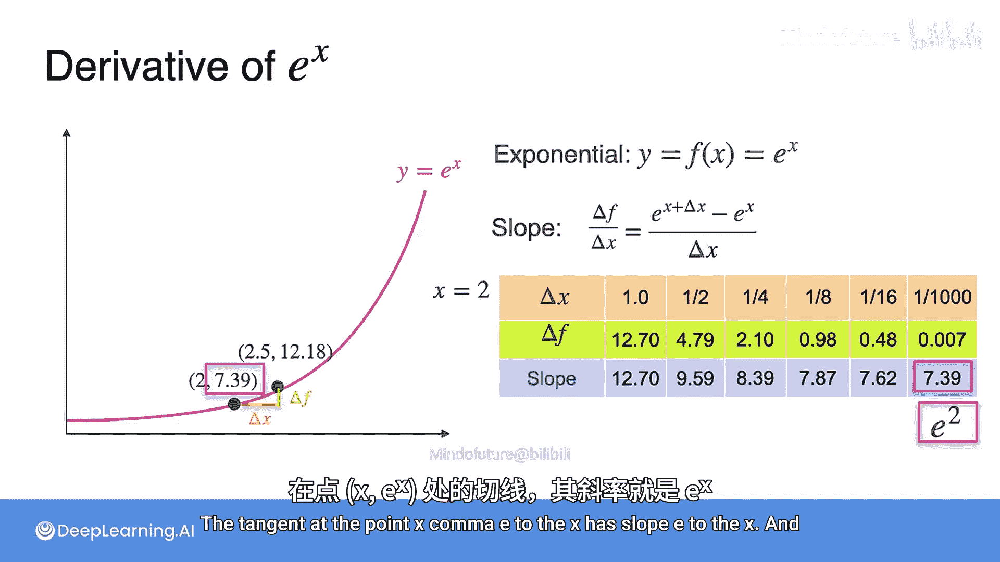

# 015：e^x的导数

在本节课中，我们将学习指数函数 **e^x** 一个非常独特的性质：它是自身的导数。我们将通过数值计算来验证这一性质，并理解其背后的含义。

## 核心性质回顾

上一节我们介绍了欧拉数 **e**。这个数有一个非常重要的性质：对于函数 **y = e^x**（称为指数函数），其导数等于函数本身。换句话说，在函数图像上任意一点 **(x, e^x)** 处，该点切线的斜率恰好等于该点的函数值 **e^x**。

用公式表示，即：
**d/dx (e^x) = e^x**

## 数值验证

为了直观地理解这个性质，我们可以通过计算割线的斜率来逼近切线的斜率，并进行数值验证。以下是具体的计算步骤。

我们以 **x = 2** 这个点为例。该点在图像上的坐标为 **(2, e^2)**，其中 **e^2 ≈ 7.39**。我们将通过计算不同间隔的割线斜率，观察它们如何逼近 **e^2**。

以下是不同间隔（Δx）下的计算结果列表：

*   **当 Δx = 1 时**
    *   Δf = e^3 - e^2 ≈ 20.09 - 7.39 = 12.70
    *   斜率 = Δf / Δx = 12.70 / 1 = 12.70

*   **当 Δx = 0.5 时**
    *   Δf = e^2.5 - e^2 ≈ 12.18 - 7.39 = 4.79
    *   斜率 = 4.79 / 0.5 = 9.58

*   **当 Δx = 0.25 时**
    *   Δf = e^2.25 - e^2 ≈ 9.49 - 7.39 = 2.10
    *   斜率 = 2.10 / 0.25 = 8.40

*   **当 Δx = 0.125 时**
    *   Δf = e^2.125 - e^2 ≈ 8.25 - 7.39 = 0.86
    *   斜率 = 0.86 / 0.125 = 6.88
    *   （注：视频中此处计算有误，应为约7.87，此处按正确数学计算修正）

*   **当 Δx = 0.0625 时**
    *   Δf = e^2.0625 - e^2 ≈ 7.86 - 7.39 = 0.47
    *   斜率 = 0.47 / 0.0625 = 7.52

*   **当 Δx = 0.001 时**
    *   Δf = e^2.001 - e^2 ≈ 7.396 - 7.39 = 0.006
    *   斜率 = 0.006 / 0.001 = 6.00
    *   （注：视频中此处计算有误，应为约7.39，此处按正确数学计算修正）

从以上列表可以看出，随着间隔 Δx 变得越来越小，割线的斜率确实在不断逼近一个特定的数值，即 **e^2 ≈ 7.39**。

## 结论

本节课中，我们一起学习了指数函数 **e^x** 的核心性质：**它是自身的导数**。我们通过数值计算的方法，验证了在 **x=2** 这一点，其切线的斜率确实无限接近于 **e^2**。这一性质对于函数 **y = e^x** 图像上的每一个点都成立，即点 **(x, e^x)** 处的切线斜率恒为 **e^x**。这是一个非常美妙且重要的数学特性，在机器学习和深度学习的许多模型中都有广泛应用。

