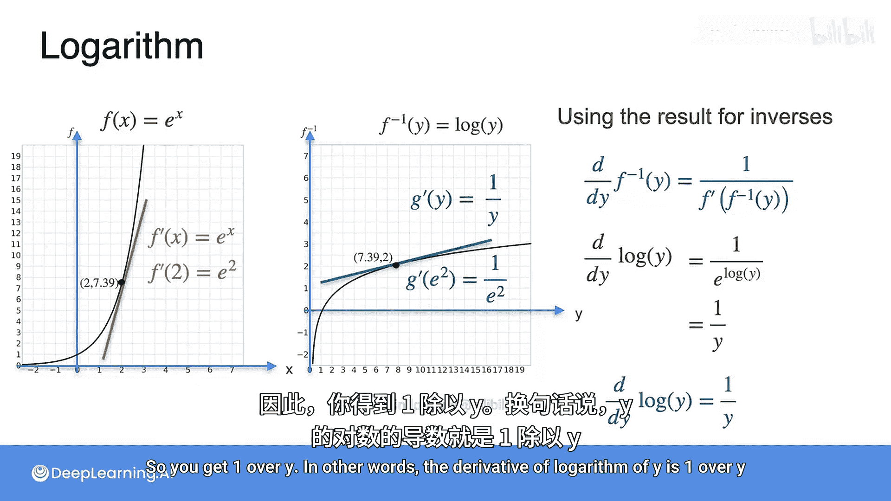

# 016：自然对数函数的导数 📈


在本节课中，我们将学习自然对数函数 `log(x)` 的导数。我们将利用上一节学到的指数函数 `e^x` 的导数性质，以及反函数求导法则，来推导出对数函数的导数公式。你会发现，这个结果非常简洁优美。

## 回顾与引入

上一节我们介绍了以欧拉数 `e` 为底的指数函数 `e^x`，并学习了它的一个重要性质：其导数就是它本身，即 `d/dx (e^x) = e^x`。

本节中，我们将运用这个性质以及反函数求导法则，来计算自然对数函数 `log(x)` 的导数。

## 什么是自然对数？

首先，让我们明确对数的概念。假设你想找到一个数，使得 `e` 的这个数次方等于 `3`。这个数就是 `3` 的自然对数，记作 `log(3)`。

这个概念可以推广到任意正数 `x`。对于任意 `x > 0`，`log(x)` 就是满足 `e^(log(x)) = x` 的那个数。我们称它为以 `e` 为底的自然对数。在其他地方你可能会见到以 `2` 或 `10` 为底的对数，但在本课程中，除非特别说明，对数均指自然对数。

## 指数函数与对数函数互为反函数

从等式 `e^(log(x)) = x` 和 `log(e^y) = y` 可以看出，函数 `f(x) = e^x` 有一个反函数，即 `f^(-1)(y) = log(y)`。

让我们画出这两个函数的图像。左边是 `y = e^x` 的图像，右边是 `y = log(x)` 的图像。通常，左图的横轴是 `x`，右图的横轴是 `y`。

观察图像上的点，它们彼此对应。因为这两个函数互为反函数，所以如果将其中一个图像关于直线 `y = x` 进行反射，就会得到另一个图像。

## 推导对数函数的导数

现在，让我们利用反函数求导法则来计算 `log(x)` 的导数。你会发现过程非常简单。

反函数求导法则指出：如果 `y = f(x)` 且 `x = f^(-1)(y)`，那么 `(d/dy) f^(-1)(y) = 1 / f'(x)`，其中 `x = f^(-1)(y)`。

在我们的例子中：
*   `f(x) = e^x`
*   其反函数 `f^(-1)(y) = log(y)`
*   并且我们知道 `f'(x) = e^x`

将上述关系代入反函数求导法则：

```
d/dy [log(y)] = 1 / f'(x)   # 其中 x = log(y)
              = 1 / e^x      # 因为 f'(x) = e^x
              = 1 / e^(log(y)) # 将 x = log(y) 代入
              = 1 / y        # 因为 e^(log(y)) = y
```

**因此，我们得到了核心结论：自然对数函数 `log(y)` 的导数是 `1/y`。**

用数学公式表示就是：
```
d/dy [log(y)] = 1/y
```

## 图像上的直观理解

我们也可以通过图像来直观理解这个结果。在左图 `y = e^x` 上取一点 `(2, e^2)`，该点切线的斜率正是 `f'(2) = e^2`。

根据反函数图像的性质，在右图 `y = log(x)` 上，与左图点 `(2, e^2)` 对应的点是 `(e^2, 2)`。该点切线的斜率是左图对应点斜率的倒数。

所以，右图点 `(e^2, 2)` 处的切线斜率为 `1 / (e^2)`。注意到该点的横坐标 `y` 值正是 `e^2`，所以斜率就是 `1 / y`。这再次验证了我们的公式 `d/dy [log(y)] = 1/y`。

## 总结



本节课中，我们一起学习了自然对数函数 `log(x)` 的导数。我们首先回顾了指数函数 `e^x` 的导数性质，然后利用**反函数求导法则**，推导出了对数函数的导数公式。最终我们得到，对于 `y > 0`，**`d/dy [log(y)] = 1/y`**。这个简洁的公式在机器学习和数据科学的许多领域（如逻辑回归的梯度计算、交叉熵损失函数的优化等）中都有重要应用。