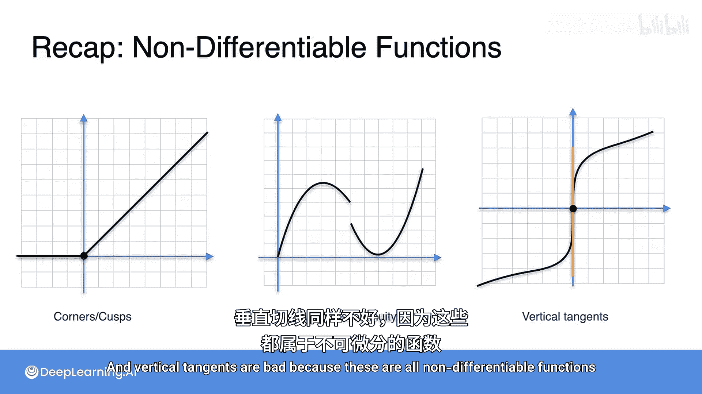

# 017：导数的存在性


在本节课中，我们将要学习一个重要的概念：**不可导函数**。之前我们已经了解了常见函数及其导数，但并非所有函数在其定义域内的每一点都存在导数。我们将通过视觉识别几种典型的不可导函数，并理解它们为何不可导。

## 导数存在性的回顾

上一节我们介绍了导数的几何意义是函数图像上某点切线的斜率。对于一个函数，如果在某点可以画出**唯一且定义明确**的切线，那么该函数在该点是**可导**的。

**公式**：函数 `f(x)` 在点 `x=a` 可导，意味着极限 `lim (h->0) [f(a+h) - f(a)] / h` 存在且唯一。

如果函数在某个区间内的**每一个点**都可导，我们称该函数在该区间内可导。然而，有些函数不满足这个性质，我们称之为**不可导函数**。

## 识别不可导函数

以下是几种典型的不可导函数，我们可以通过观察其图像特征来识别。

### 1. 角点或尖点

考虑绝对值函数 `f(x) = |x|`。这个函数在除了原点 `x=0` 之外的几乎所有点都是可导的。

**代码**表示：
```python
def absolute_value(x):
    if x >= 0:
        return x
    else:
        return -x
```

在原点处，函数图像形成一个“V”形的角。如果你尝试在这一点画切线，会发现可以画出无数条直线（例如，不同斜率的直线）都与曲线在该点接触，但没有一条是唯一且定义明确的切线。因此，我们说在 `x=0` 处，导数不存在。

**核心特征**：当函数图像出现一个“角”或“尖点”时，该点不可导。直观地说，如果你需要用铅笔在某个点停下来然后拐弯画图，那么这个点就是不可导的。

### 2. 跳跃间断点

现在考虑一个分段函数。例如，一个函数在 `x < -1` 时定义为 `y = 2`，在 `x >= -1` 时定义为 `y = x + 1`。

在 `x = -1` 处，函数值从 `2` 突然“跳”到 `0`（因为 `-1 + 1 = 0`），这被称为**跳跃间断点**。想象一下，你画这个函数时，铅笔必须在 `x = -1` 处抬起来，然后从另一个位置开始画。函数在该点不连续。

一个不连续的函数在该点必然不可导，因为你无法在间断点处定义一条有意义的切线。因此，任何具有**跳跃间断点**的函数在该点不可导。

### 3. 垂直切线

最后，我们看一个更微妙的情况：函数 `f(x) = x^(1/3)`（即 `x` 的立方根）。

这个函数在大部分点看起来都很平滑。然而，在原点 `x=0` 处，切线的方向变成了**垂直**的（平行于y轴）。

**公式**：`f(x) = x^(1/3)`。在 `x=0` 处，其导数 `f'(x) = (1/3)x^(-2/3)` 的分母为零，导致导数未定义。

一条垂直的直线没有明确定义的斜率，因为斜率公式 `(y2 - y1) / (x2 - x1)` 中的分母（水平变化量）为零。因此，具有**垂直切线**的点也是不可导的。

## 总结

本节课中我们一起学习了**不可导函数**的三种主要类型。为了判断一个函数在某点是否可导，我们可以观察其图像：

1.  **角点或尖点**：图像在该点出现明显的拐角。
2.  **跳跃间断点**：函数在该点不连续，图像发生“跳跃”。
3.  **垂直切线**：图像在该点的切线是垂直的。

记住，如果函数在一点不可导，那么在该点计算导数 `f'(x)` 的极限就不存在或不是唯一的。理解这些视觉特征将帮助你在未来更复杂的微积分和机器学习模型中，快速识别和分析函数的性质。



