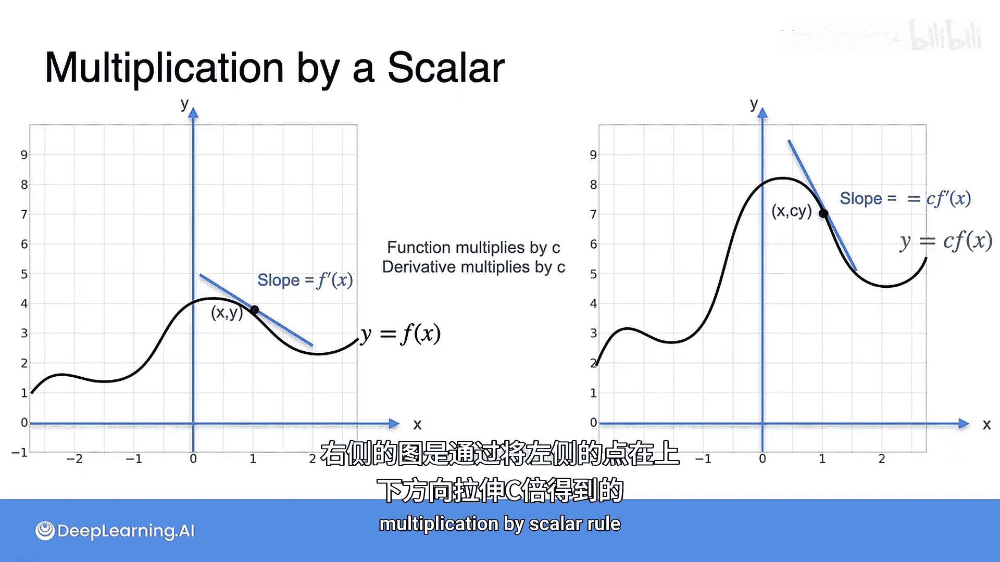

# 018：导数性质-与标量乘法

在本节课中，我们将要学习导数的一个重要性质：与标量（常数）的乘法规则。这个规则是构建更复杂函数导数的基础。

## 概述

到目前为止，我们已经学习了一些简单函数的导数。为了求出更复杂函数的导数，我们需要借助一些特定的规则，从这些简单函数的导数出发进行计算。接下来我们将要学习的规则包括：与标量乘法规则、求和规则、乘积规则以及函数复合的链式法则。本节我们首先聚焦于**与标量乘法规则**。

## 规则定义

假设有一个函数 **f**，它是另一个函数 **g** 的 4 倍，即 `f = 4g`。那么，函数 **f** 的导数就等于 4 乘以函数 **g** 的导数。这个规律适用于任何常数。因此，我们可以总结出以下规则：

> 如果存在一个常数 **c**（可以是任意常数），且函数 **f** 等于 **c** 乘以函数 **g**，即：
> **f(x) = c * g(x)**
> 那么，函数 **f** 的导数就等于 **c** 乘以函数 **g** 的导数，即：
> **f'(x) = c * g'(x)**

## 规则原理

为了更好地理解这个规则，让我们通过一个具体的例子来探究其背后的原理。

考虑函数 **y = x²**，其图像如下所示。现在，我们取这个函数的两倍，即 **y = 2x²**。这意味着函数在垂直方向上被拉伸为原来的两倍。

让我们观察图像上的一些点。在左侧的原函数 **y = x²** 上，有点 (1, 1) 和 (2, 4)。现在计算这两点之间连线的斜率：上升量（rise）为 4 - 1 = 3，前进量（run）为 2 - 1 = 1，因此斜率为 3 / 1 = 3。

现在，观察右侧函数 **y = 2x²** 上对应的点。点 (1, 1) 对应变为 (1, 2)，点 (2, 4) 对应变为 (2, 8)。计算这两点之间的斜率：上升量为 8 - 2 = 6，前进量仍为 2 - 1 = 1，因此斜率为 6 / 1 = 6。

通过对比可以发现，右侧函数的斜率（6）恰好是左侧函数斜率（3）的两倍。这是因为在垂直方向上，所有点的纵坐标都翻倍了，导致上升量也翻倍，而前进量保持不变，所以斜率也随之翻倍。

如果我们让右侧的点无限接近左侧的点，这个倍数关系依然成立。因此，在极限情况下，原函数在某点的切线斜率（即导数）如果为 **f'(x)**，那么新函数在同一点的切线斜率就是 **2 * f'(x)**。

这个原理可以推广到任意常数 **c**。如果将函数图像在垂直方向上拉伸 **c** 倍，那么其导数（即切线的斜率）也会相应地变为原来的 **c** 倍。

## 总结

本节课我们一起学习了导数的**与标量乘法规则**。核心要点是：当一个函数乘以一个常数 **c** 时，其导数也乘以相同的常数 **c**。这个规则用公式表示为：若 **f(x) = c * g(x)**，则 **f'(x) = c * g'(x)**。理解这个规则有助于我们处理更复杂的函数求导问题。在下一节中，我们将继续学习导数的求和规则。