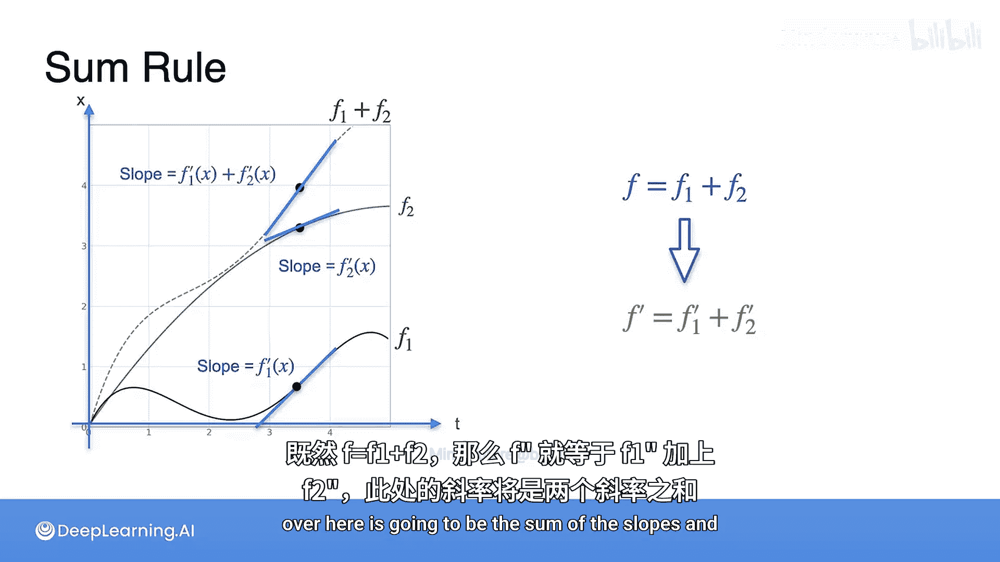

# 019：导数性质-求和法则

在本节课中，我们将学习导数的一个重要性质——求和法则。我们将通过一个生动的比喻来理解它，并最终用数学公式进行精确描述。

上一节我们介绍了标量乘法法则，本节中我们来看看求和法则。求和法则本质上是一个简单的符号规则。

想象你有一个函数 **F**，它被定义为两个函数 **G** 和 **H** 的和。那么 **F** 的导数是什么呢？答案很简单，它就是 **G** 的导数加上 **H** 的导数。

我喜欢用以下方式来想象求和法则。

想象有一艘船，船上有一个孩子。船本身在移动，孩子也在船内奔跑。假设船移动了10米的距离，孩子在船内移动了2米的距离。

我们用变量 **Xb** 表示船移动的距离，用 **Xc** 表示孩子在船内移动的距离。如果他们的移动方向相同，那么孩子相对于地球移动的总距离是多少？

这个距离是12米，因为它是10米加上2米。也就是船移动的距离加上孩子在船内移动的距离。

这是关于距离的情况。那么速度呢？让我们做一个小测验。

假设船的速度是 **0.6 米/秒**，孩子在船内的速度是 **0.05 米/秒**，并且他们都朝同一个方向运动。问题是：孩子相对于地球的速度是多少？

如果你的答案是 **0.65 米/秒**，那么你是正确的。因为如果方向相同，速度是可以相加的。

这基本上就是求和法则。它表明：如果距离可以相加，那么速度（即距离的导数）也可以相加。这意味着如果函数可以相加，那么它们的导数也可以相加。

让我们通过图表来看一下。

下图以水平轴表示时间，垂直轴表示距离。这条线表示孩子在船内的运动，这条线表示船的运动，而这条线是两者的和，表示孩子相对于地球的运动。

让我们观察一些斜率。在某个时间点，我们取一个微小的时间间隔 **ΔT**，并计算孩子、船以及总和在这个间隔内的平均速度。

对于这个计算，我们取水平步长为 **ΔT**，垂直步长为距离。这些距离分别是孩子的 **Xc**、船的 **Xb** 和总距离 **X_total**。

我们知道 **X_total = Xb + Xc**，因为这两个距离相加得到总距离。

如果我们把等式两边都除以相同的 **ΔT**，我们得到速度是相加的。所以总速度 **V_total** 等于船的速度 **Vb** 加上孩子的速度 **Vc**。

现在，你只需要让 **ΔT** 趋近于0，就能得到导数。

因此，如果你有三个函数：**F1**、**F2** 和 **F = F1 + F2**。**F1** 在点 **x** 的导数是 **F1'(x)**，**F2** 在同一点 **x** 的导数是 **F2'(x)**。那么和的导数是什么呢？

既然 **F = F1 + F2**，那么 **F' = F1' + F2'**。图中这条线的斜率将是两条线斜率之和，这就是求和法则。

---

本节课中我们一起学习了导数的求和法则。我们通过一个船与孩子的比喻，直观地理解了当两个函数相加时，其导数等于各自导数的和。核心公式可以总结为：如果 **F(x) = G(x) + H(x)**，那么 **F'(x) = G'(x) + H'(x)**。这个法则在后续的微积分和机器学习计算中会非常有用。