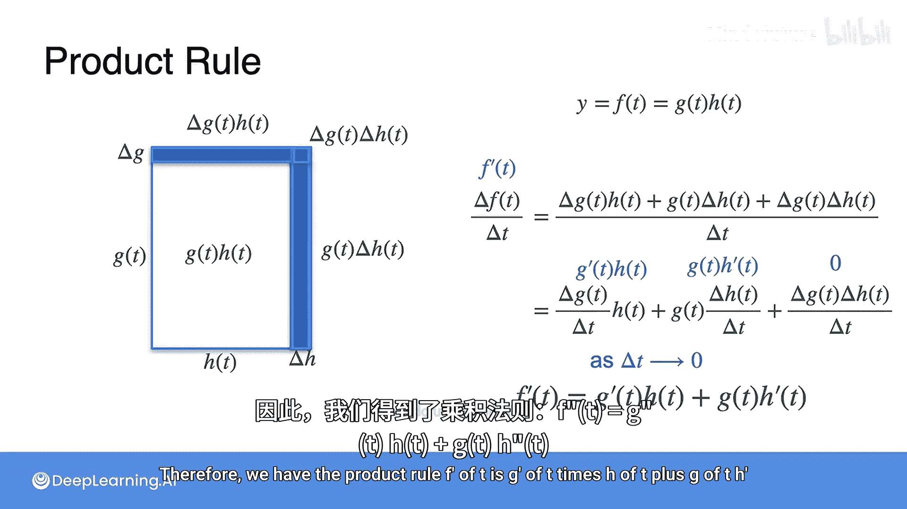

# 020：导数性质-乘法法则 🧮

在本节课中，我们将要学习导数的另一个重要性质——乘法法则。上一节我们介绍了求和法则，本节中我们来看看当函数是两个函数的乘积时，其导数该如何计算。

## 乘法法则的直观理解

想象有一个函数 **F**，它是另外两个函数 **G** 和 **H** 的乘积，即 **F = G * H**。问题是，如何用 **G** 和 **H** 的导数来表示 **F** 的导数？

我们可以把求导想象成用锤子“敲击”一个函数。为了得到 **F** 的导数（即敲击 **F**），我们需要分别敲击 **G** 和 **H**，但不能同时敲击。具体过程是：先敲击 **G** 而保持 **H** 不变，然后敲击 **H** 而保持 **G** 不变。用公式表示就是：

**F‘ = G’ * H + G * H‘**

这就是**乘法法则**。

## 一个生动的例子：建造房屋 🏠

为了更好地理解乘法法则，我们可以通过一个建造房屋的例子来思考。

假设你在建造一座房子，有两组工人：一组负责建造侧墙，另一组负责建造前墙。他们的建造速度不同。

*   设 **G(t)** 表示在时间 **t** 时侧墙已建成的长度。
*   设 **H(t)** 表示在时间 **t** 时前墙已建成的长度。

那么，房子在时间 **t** 时的面积 **F(t)** 就是两者的乘积：

**F(t) = G(t) * H(t)**

我们想知道面积随时间的变化率，即 **F‘(t)**。我们知道 **G’(t)** 和 **H‘(t)** 分别代表两面墙的建造速度。

让我们从俯视图来看这座房子。经过一小段时间 **Δt**，工人们建造了额外的墙体：

*   侧墙增加了 **ΔG(t)**
*   前墙增加了 **ΔH(t)**

这导致了房屋面积的增加 **ΔF(t)**。新增的面积（蓝色区域）由三部分组成：

以下是新增面积的计算：

1.  一个长条形区域：**G(t) * ΔH(t)**
2.  另一个长条形区域：**ΔG(t) * H(t)**
3.  一个很小的角落区域：**ΔG(t) * ΔH(t)**

因此，面积的总变化为：

**ΔF(t) = G(t) * ΔH(t) + ΔG(t) * H(t) + ΔG(t) * ΔH(t)**

## 从变化率到导数

面积的变化率是 **ΔF(t) / Δt**。将上面的等式代入并整理：

**ΔF(t) / Δt = G(t) * [ΔH(t)/Δt] + [ΔG(t)/Δt] * H(t) + [ΔG(t) * ΔH(t)] / Δt**

现在，为了求导数 **F‘(t)**，我们需要让 **Δt** 趋近于 0。

以下是当 **Δt → 0** 时各项的变化：

*   **ΔH(t)/Δt** 变成了 **H‘(t)**
*   **ΔG(t)/Δt** 变成了 **G’(t)**
*   最后一项 **ΔG(t) * ΔH(t) / Δt** 会趋近于 0，因为 **ΔG(t)** 和 **ΔH(t)** 本身都非常小，它们的乘积除以 **Δt** 在极限下可以忽略不计。

于是，我们得到了最终结果：

**F‘(t) = G(t) * H’(t) + G‘(t) * H(t)**

这与我们最初直观理解的乘法法则公式完全一致。

## 总结

本节课中我们一起学习了导数的**乘法法则**。核心结论是：对于两个函数 **G** 和 **H** 的乘积函数 **F = G * H**，其导数等于 **“第一个函数乘以第二个函数的导数”** 加上 **“第一个函数的导数乘以第二个函数”**，即公式 **F‘ = G * H’ + G‘ * H**。我们通过“敲击函数”的比喻和“建造房屋”的几何实例，从不同角度理解了这个法则的由来和意义。掌握乘法法则对于处理更复杂的函数求导至关重要。