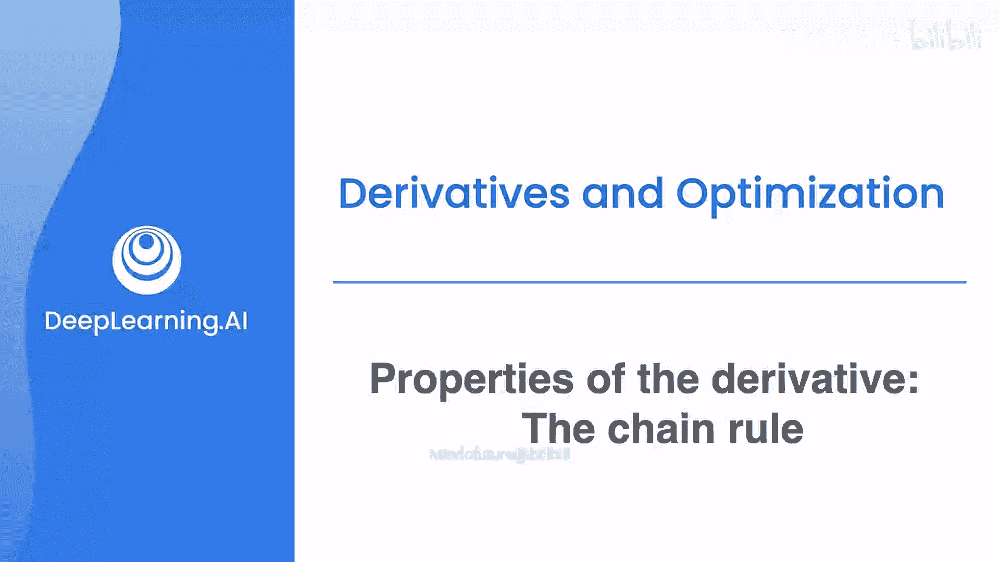
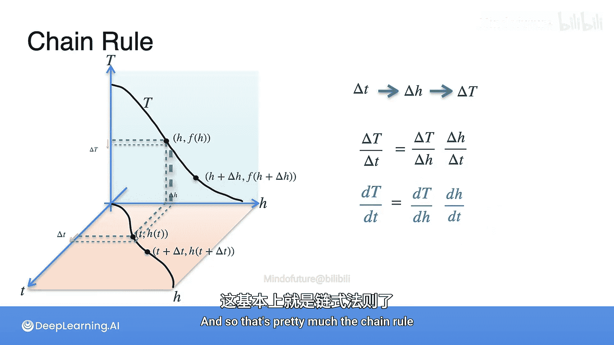

# 021：导数性质-链式法则 🧮

在本节课中，我们将要学习微积分中一个极其重要的规则——链式法则。链式法则用于求解复合函数的导数，是神经网络反向传播等机器学习核心算法的数学基础。掌握了求和、乘积和标量乘法规则后，你已经为学习链式法则做好了准备。

## 链式法则的核心概念 🔗

上一节我们介绍了基本的求导法则，本节中我们来看看如何处理由多个函数嵌套而成的复合函数。

链式法则可能看起来是这些规则中最复杂的，但从特定角度理解，它可以变得相当简单。想象你有一个函数 **h(t)**，你想将其输出作为另一个函数 **g** 的输入，即计算 **g(h(t))**。这就构成了一个函数的复合。

现在，你想对这个复合函数关于 **t** 求导。假设你已经知道 **dh/dt**（即 **h** 关于 **t** 的导数），以及 **dg/dh**（即 **g** 关于其输入 **h** 的导数）。那么，复合函数的导数就是这两个导数的乘积：

**d/dt [g(h(t))] = (dg/dh) * (dh/dt)**

它之所以被称为“链式”法则，是因为你可以继续嵌套函数。例如，再对 **g** 的输出应用一个函数 **f**，形成 **f(g(h(t)))**。其导数将是更多项的乘积：

**d/dt [f(g(h(t)))] = (df/dg) * (dg/dh) * (dh/dt)**

你可以继续添加更多函数，只需在乘积中增加相应的项，这就是链式法则的本质。

## 不同记法下的链式法则 📝

在莱布尼茨记法（**dy/dx**）中，链式法则非常直观。但在拉格朗日记法（使用撇号 **f'(x)**）中，需要特别注意输入值。

对于两个函数 **g(h(t))**，其导数在拉格朗日记法中表示为：

**d/dt [g(h(t))] = g'(h(t)) * h'(t)**

关键在于，**g'** 的输入必须是 **h(t)**，而不是 **t** 本身。对于三个函数 **f(g(h(t)))**，则扩展为：

**d/dt [f(g(h(t)))] = f'(g(h(t))) * g'(h(t)) * h'(t)**

## 一个直观的类比：开车上山 🚗

为了更直观地理解，让我们看一个类比。想象你正开车上山。山脚很热，山顶很冷。

*   温度 **T** 随着海拔高度 **H** 变化，其变化率是 **dT/dH**。
*   同时，海拔高度 **H** 又随着行驶时间 **t** 变化，其变化率是 **dH/dt**。
*   因此，温度 **T** 也间接地随着时间 **t** 变化，其变化率是 **dT/dt**。

链式法则告诉我们，第三个变化率可以通过前两个的乘积得到：

**dT/dt = (dT/dH) * (dH/dt)**

这完美地描述了“随着时间推移，你向上行驶，而向上行驶导致温度下降”这一连锁过程。

## 从几何视角理解 📈

让我们通过一个三维图来更深入地理解。我们建立三个坐标轴：时间 **t**、高度 **H**、温度 **T**。

*   在底部的 **t-H** 平面中，函数 **h(t)** 描绘了高度随时间变化的轨迹。
*   在后方的 **H-T** 平面中，函数 **T(H)** 描绘了温度随高度变化的轨迹。

现在，考虑一个微小的时间变化 **Δt**：
1.  它导致一个微小的高度变化 **ΔH**（由 **h(t)** 决定）。
2.  这个微小的 **ΔH** 又导致一个微小的温度变化 **ΔT**（由 **T(H)** 决定）。

因此，存在一个数字关系：**ΔT/Δt ≈ (ΔH/Δt) * (ΔT/ΔH)**。由于这些都是数字，我们可以约掉 **ΔH**。

当 **Δt** 无限趋近于 0 时，**ΔH** 和 **ΔT** 也趋近于 0，这个近似关系就变成了精确的导数关系：

**lim(Δt→0) ΔT/Δt = dT/dt**
**lim(Δt→0) ΔH/Δt = dH/dt**
**lim(Δt→0) ΔT/ΔH = dT/dH**

于是我们得到了链式法则：**dT/dt = (dT/dH) * (dH/dt)**。这个几何视角展示了微小变化是如何通过函数链进行传递的。

## 关键要点总结 ✨

本节课中我们一起学习了链式法则：

1.  **核心公式**：对于复合函数 **f(g(x))**，其导数为 **f'(g(x)) * g'(x)**。对于更长的链，则是所有内部函数在相应点处导数的乘积。
2.  **核心思想**：链式法则描述了变化率在函数链中的传递与相乘关系。
3.  **莱布尼茨记法**：直观，表现为导数分数的“连锁”相乘与约分。
4.  **拉格朗日记法**：必须注意每个函数的导数是在哪个输入值处计算的（例如 **g'(h(t))** 而非 **g'(t)**）。
5.  **直观理解**：通过“开车上山”的类比，将抽象数学与物理变化过程联系起来。

链式法则是连接简单函数导数与复杂模型（如神经网络）求导的桥梁，务必熟练掌握其概念与应用。